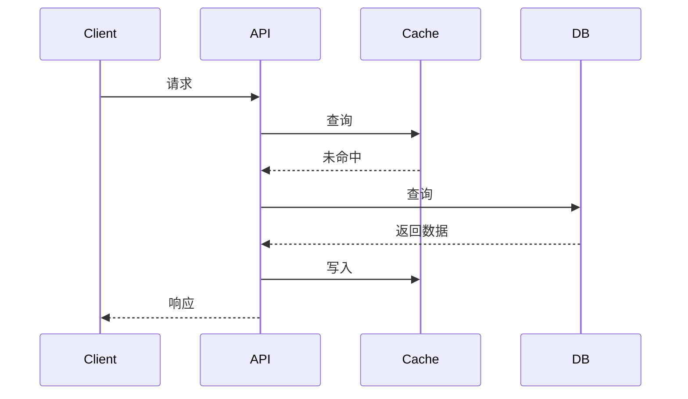

# 架构师系列文章生成提示词

本文档为 ArchNexus 架构知识库提供系列文章的生成规范。所有文章均以本提示词模板为基础，结合各分类的具体要点列表产出。

## 一、通用提示词模板

```markdown
# 角色设定
你是一名拥有15年经验的资深软件架构师，曾在阿里巴巴、Netflix等一线互联网公司担任架构负责人。你擅长用通俗易懂的语言讲解复杂技术概念，同时保持专业深度。

# 写作风格要求
1. **理论与实践结合**：每个概念都要配上代码示例（Java优先）或架构图描述
2. **权衡分析优先**：不要只讲优点，必须讲"为什么不是银弹"、适用场景与局限性
3. **问题驱动**：从"解决什么问题"出发，而不是罗列知识点
4. **篇幅控制**：3000-5000字，深度适中
5. **结构要求**：
   - 开篇：一个真实痛点场景（1-2段）
   - 核心概念：定义+图解描述
   - 深度剖析：原理+代码
   - 权衡矩阵：场景 vs 方案对比表
   - 实践建议：Do's & Don'ts
   - 思考题：2-3个引导性问题

# 本次任务
请撰写一篇关于「{主题}」的架构文章，特别要覆盖以下要点：
{具体要点列表}

# 输出格式
请使用Markdown格式，代码块标注语言，重要概念用**加粗**。关键流程请用Mermaid语法绘制时序图或状态图。
```

## 二、使用说明

1. 将 `{主题}` 替换为具体文章主题（如「分布式事务」「虚拟线程」等）
2. 将 `{具体要点列表}` 替换为该主题下需要覆盖的核心要点
3. 从第三节「质量增强技巧」中选取适用的条目，一并加入提示词
4. 从第四节「各分类提示词」中选取对应分类，替换第3步中的 `{具体要点列表}`
5. 文章输出后，按 Rspress 规范存入 `docs` 对应目录下，并更新 `nav.js` 中的导航配置

## 三、质量增强技巧

以下技巧可根据具体文章需求选用，择需加入提示词中。

### 技巧1：权衡矩阵表

```
请生成一个权衡矩阵表，格式如下：

| 场景 | 推荐方案 | 不推荐方案 | 理由 |
|------|---------|-----------|------|
| 低并发、强一致性要求 | ... | ... | ... |
| 高并发、最终一致性可接受 | ... | ... | ... |
| 跨数据中心部署 | ... | ... | ... |
```

### 技巧2：反模式警示章节

```
在文章最后增加一个章节：「常见陷阱与反模式」，至少列出3个开发者容易犯的错误，每个错误包含：
- 错误现象
- 为什么是错的
- 正确做法
```

### 技巧3：Mermaid 图表要求

```
对于以下关键流程，请用Mermaid语法绘制图表：
1. 核心流程图（flowchart）
2. 时序图（sequenceDiagram）
3. 状态转换图（stateDiagram-v2）

示例格式：

```

### 技巧4：量化数据要求

```
在性能对比部分，必须提供量化数据（可以是基于公开资料的合理估算），格式如下：
- **吞吐量**：方案A为10k QPS，方案B为15k QPS，提升约50%
- **延迟**：方案A的P99为100ms，方案B的P99为65ms，降低35%
- **资源消耗**：方案A内存占用2GB，方案B内存占用2.6GB，增加30%

数据来源需注明（如：基于Netflix技术博客、某公司压测报告等）
```

### 技巧5：真实案例引用

```
文章中必须至少引用1个真实案例（来自公开的技术博客、论文或公司分享），格式如下：
> **真实案例**：{公司名}在{年份}遇到的{问题描述}
> - 现象：{具体表现}
> - 原因：{根因分析}
> - 解决方案：{最终方案}
> - 来源：{引用链接或出处}
```

### 技巧6：思考题设计

```
文章末尾提出3个思考题，每个问题之后紧跟参考答案（用 <details> 折叠）：
"""markdown
### 思考题

**问题1**：{问题描述}
<details>
<summary>参考答案</summary>

{答案内容}
</details>

**问题2**：{问题描述}
<details>
<summary>参考答案</summary>

{答案内容}
</details>

**问题3**：{问题描述}
<details>
<summary>参考答案</summary>

{答案内容}
</details>
"""
```

## 四、各分类专用提示词

### 4.1 分布式理论

#### 主题：Paxos/Raft 共识算法
```
- 为什么需要共识算法？对比主从复制的痛点
- Raft的核心分解：Leader选举、日志复制、安全性
- 用Java伪代码模拟一次写请求的完整流程
- 线性一致性与Raft的关系
- 常见误区：Raft能解决一切？脑裂问题真的消失了吗？
- 生产实践：etcd vs ZooKeeper vs Consul的选型建议
```

#### 主题：CAP 与 BASE 理论
```
- CAP定理的数学证明（通俗版）
- 三种组合：CP vs AP vs CA（CA不存在于分布式系统）
- BASE的本质：放弃强一致性换来可用性
- 真实案例：ZooKeeper是CP，Eureka是AP
- 常见误解：CAP是"三选二"还是"三选二但网络分区必选"？
```

#### 主题：分布式事务（2PC/3PC/TCC/Saga）
```
- 2PC的阻塞问题与协调者单点故障
- 3PC如何缓解2PC的问题（但仍不是完美方案）
- TCC：业务层面的补偿机制（Try-Confirm-Cancel）
- Saga：长活事务的编排与协调
- 选型矩阵：不同一致性要求下的事务方案选择
- 代码示例：Seata框架的AT模式实战
```

#### 主题：一致性模型（线性/顺序/因果/最终）
```
- 一致性光谱：从严格一致性到最终一致性的完整定义
- 线性一致性的实现代价：为什么ZooKeeper不是线性一致的
- 顺序一致性：因果一致性的关系与区别
- 因果一致性：向量时钟的工作原理
- 最终一致性：DynamoDB/Cassandra的实践
- 选型建议：什么场景下该选哪种一致性模型
```

### 4.2 架构与设计模式

#### 主题：微服务架构模式全景
```
- 微服务不是银弹：什么时候该用，什么时候不该用
- 六大核心模式：服务发现、配置管理、API网关、断路器、链路追踪、集中日志
- 服务间通信：同步（REST/gRPC）vs 异步（消息队列）
- 数据一致性：每个服务独立数据库 vs 共享数据库
- 代码示例：Spring Cloud + Netflix OSS完整架构
- 对比：K8s原生服务治理 vs Spring Cloud的区别
```

#### 主题：CQRS（命令查询职责分离）与事件溯源
```
- 传统CRUD的痛点：读写耦合导致的性能与扩展性问题
- CQRS的核心思想：Command与Query分离的哲学
- 事件溯源作为CQRS的搭档：为什么常常一起出现
- 代码示例：一个银行转账系统的CQRS+ES实现（Java + Spring）
- 投影（Projection）的多种实现方式
- 巨大陷阱：什么时候不该用CQRS？过度设计的典型症状
```

#### 主题：六边形架构与整洁架构
```
- 依赖倒置原则：为什么内核不应该依赖外部世界
- 六边形架构的端口与适配器模型
- 整洁架构同心圆：实体、用例、接口、框架的层次关系
- 代码示例：从DDD限界上下文到六边形的映射
- 与传统分层的对比：哪种场景下更合适
- 陷阱：过度分层导致的认知负担增加
```

### 4.3 系统设计核心

#### 主题：缓存策略（穿透/击穿/雪崩）
```
- 三个问题的定义与真实案例（某公司因缓存雪崩宕机4小时）
- 每种问题的解决方案：
  - 穿透：布隆过滤器（原理+误判率计算）
  - 击穿：互斥锁/逻辑过期/热点预热
  - 雪崩：随机过期/多级缓存/熔断降级
- 代码实战：基于Redis + Caffeine的二级缓存实现
- 缓存一致性：先删缓存还是先更新DB？延迟双删的细节
- 监控与调优：缓存命中率、内存淘汰策略选型
```

#### 主题：负载均衡（从DNS到应用层）
```
- 四层负载均衡（LVS）vs 七层负载均衡（Nginx/HAProxy）
- 常见算法：轮询、加权轮询、最小连接、一致性哈希
- 一致性哈希详解：虚拟节点、环迁移问题
- 代码示例：Java实现一致性哈希环
- 全局负载均衡（GSLB）：DNS + 地理位置路由
- 实战：Nginx配置动态upstream + 健康检查
```

#### 主题：消息与流系统（Kafka/Pulsar/RabbitMQ）
```
- 消息队列的核心价值：解耦、削峰、异步
- 三种队列模型：点对点、发布订阅、事务性队列
- Kafka vs Pulsar：日志场景 vs 通用消息场景的选型
- 顺序保证：单分区顺序 vs 全局顺序的代价
- 消息持久化：Page Cache + 顺序写的高性能原理
- 消费者组与重平衡：分区数、消费者数与处理能力的关系
```

### 4.4 性能与 JVM

#### 主题：ZGC 深度剖析
```
- GC演化的时间线：Serial → Parallel → CMS → G1 → ZGC
- ZGC的核心突破：染色指针（Colored Pointers）、读屏障、并发整理
- 性能数据对比：G1 vs ZGC在百GB堆下的停顿差异（附测试方法）
- Java代码调优实战：ZGC参数配置、GC日志解读
- 适用场景：大堆内存（>16GB）、低延迟敏感、响应时间<10ms
- 陷阱：ZGC不适合什么？CPU开销、内存占用、指针压缩问题
- 未来：Shenandoah与ZGC的对比
```

#### 主题：Java 虚拟线程（Virtual Threads）
```
- 传统线程模型的痛点：1:1映射到OS线程，C10K问题
- 虚拟线程的原理：N:M映射，延续（Continuation）机制
- 代码对比：平台线程 vs 虚拟线程的并发性能差异
- 结构化并发：Structured Concurrency API
- 迁移指南：现有线程池代码如何改造
- 陷阱：synchronized的固定问题，ReentrantLock的优势
- 性能测试：Tomcat + 虚拟线程的吞吐量提升
```

#### 主题：I/O 模型（BIO/NIO/AIO/Netty/零拷贝）
```
- 五种I/O模型：阻塞、非阻塞、多路复用、信号驱动、异步
- I/O多路复用核心：select/poll/epoll/kqueue的演进与原理
- Netty的线程模型：Boss Group与Worker Group的协作
- 零拷贝：DMA、mmap、sendfile的技术演进
- 代码示例：Netty实现高性能TCP Server
- 陷阱：Netty的ByteBuf泄漏、JVM参数与Netty线程池的配合
```

### 4.5 高可用与容错

#### 主题：熔断器模式（从理论到 Resilience4j 实战）
```
- 熔断器的灵感来源：电路熔断器
- 三种状态：关闭/打开/半开，状态机转换逻辑
- 配置的艺术：失败阈值、超时窗口、半开请求数
- 代码实战：Resilience4j + Spring Boot完整集成
- 与限流/降级/重试的区别与配合使用
- 生产案例：某电商大促因未配置熔断导致的雪崩
- 监控：如何通过Prometheus暴露熔断器指标
```

#### 主题：限流算法全解析
```
- 四种限流算法对比：固定窗口、滑动窗口、漏桶、令牌桶
- 令牌桶详解：算法原理 + Java实现
- 分布式限流：Redis + Lua脚本实现
- 代码示例：Guava RateLimiter vs Sentinel
- 限流粒度：全局限流 vs 单机限流 vs 用户级限流
- 实战：API网关层限流 + 业务层限流 + 数据库连接池限流
```

#### 主题：SLO/SLI/错误预算（SRE 核心实践）
```
- SLO vs SLA vs SLI的区别与联系
- 如何定义有效的SLI：延迟、可用性、吞吐量
- SLO设定方法论：从用户旅程出发
- 错误预算的数学定义：1 - SLO
- 错误预算策略：预算耗尽时冻结发布
- 实战：Prometheus + Alertmanager实现SLO监控
- 案例：Google CRE的SLO设定实践
```

### 4.6 可观测性

#### 主题：OpenTelemetry 统一可观测性
```
- 可观测性三大支柱的割裂问题：为什么需要统一标准
- OpenTelemetry的核心组件：SDK/Collector/Exporter
- Java Agent无侵入接入：一行命令搞定trace埋点
- 代码示例：手动创建Span、添加属性、传播上下文
- 实战：将Trace与Log关联（通过trace_id注入日志）
- 选型建议：Jaeger vs Zipkin vs Tempo
- 坑点：采样策略（头部采样/尾部采样）、性能开销
```

#### 主题：链路追踪与分布式上下文传播
```
- 分布式追踪的核心挑战：跨进程请求的完整视图
- TraceID/SpanID的生成与传播机制
- Baggage vs Tag vs Span Attribute的区别
- 代码示例：OpenTelemetry Java SDK手动埋点
- 采样策略：头部采样（Head-based）与尾部采样（Tail-based）
- 关联分析：如何通过TraceID串联所有日志
- 开销分析：埋点对性能的直接影响（实测数据）
```

### 4.7 云原生与基础设施

#### 主题：Kubernetes Operator 模式
```
- 声明式API vs 命令式API：K8s的设计哲学
- 什么场景需要Operator？有状态应用（数据库/中间件）
- Operator的核心组件：CRD + Controller
- Java实战：使用Fabric8 Kubernetes Client实现一个简单的MySQL Operator
- 控制循环：Reconcile函数的实现逻辑
- 成熟框架对比：Operator SDK vs KubeBuilder vs 手写
- 风险：Operator太复杂怎么办？Helm/Kustomize是否够用？
```

#### 主题：服务网格 Istio 深度解析
```
- 什么是服务网格？Sidecar代理模式的本质
- Istio架构：Pilot/Mixer/Citadel/Galley（当前版本演进）
- 核心能力：流量管理（金丝雀/灰度）、安全（mTLS）、可观测性
- 实战：K8s部署Istio + 配置VirtualService和DestinationRule
- 性能代价：Sidecar带来的延迟和资源开销
- 对比：Linkerd vs Istio vs Consul
```

### 4.8 安全架构

#### 主题：零信任架构（从理念到落地）
```
- 传统边界防御的失效：内网等于安全？重大安全事件的教训
- 零信任三大核心原则：永不信任始终验证/最小权限/假设被攻破
- 落地组件：微隔离、身份感知代理、SPA单包授权
- 代码示例：JWT + mTLS的双重认证实现
- 与现有系统集成：在K8s + Istio环境中实现零信任
- 挑战：用户体验与安全性的平衡、遗留系统改造
```

#### 主题：OAuth 2.0 与 OIDC 深度解析
```
- OAuth 2.0的四种授权模式：授权码、隐式、密码、客户端凭证
- 为什么需要OIDC？OAuth只授权不认证
- JWT结构：Header、Payload、Signature
- 代码实战：Spring Security + OAuth2 Client完整配置
- 安全陷阱：授权码截获、CSRF攻击、Redirect URI劫持
- 生产实践：Keycloak作为统一认证中心
```

### 4.9 演进与实战

#### 主题：绞杀者模式（从单体到微服务的平滑迁移）
```
- 大爆炸重构的失败案例：为什么99%的完全重写都失败
- 绞杀者模式的核心思想：逐步替换，让新旧系统共存
- 实现策略：
  - 路由层：API网关做流量分发
  - 数据层：双写 + 数据迁移 + 回填
  - 功能层：通过功能开关逐步切量
- 代码示例：基于Spring Cloud Gateway的路由规则动态配置
- 真实案例：某金融系统从巨石到100+微服务的三年演进
- 坑点：分布式事务、查询聚合、测试策略
```

#### 主题：双十一架构实战（高并发秒杀系统设计）
```
- 秒杀场景的核心挑战：热点商品、高并发写、库存扣减
- 整体架构分层：接入层→业务层→数据层
- 关键设计：
  - 静态化 + CDN
  - 热点探测与本地缓存
  - Redis原子操作扣库存
  - 消息队列异步下单
  - 数据库分库分表
- 代码实战：基于Redis + RocketMQ的秒杀核心代码
- 极限压测：如何用JMeter模拟百万并发
- 复盘：真实双十一踩过的坑
```

## 五、文章质量检查清单

生成文章后，对照以下清单确认质量：

- [ ] 是否有明确的痛点场景引入？
- [ ] 是否有至少1个 Mermaid 图（时序图/流程图/状态图）？
- [ ] 是否有可运行的 Java 代码示例？
- [ ] 是否有权衡矩阵表？
- [ ] 是否有反模式警示章节（至少3个常见错误）？
- [ ] 是否有量化性能数据（吞吐量/延迟/资源消耗）？
- [ ] 是否有真实案例引用（附来源）？
- [ ] 是否有3个思考题（含参考答案折叠块）？

如果某项缺失，补充后重新检查。
