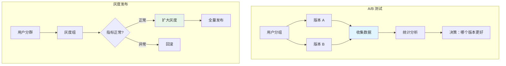
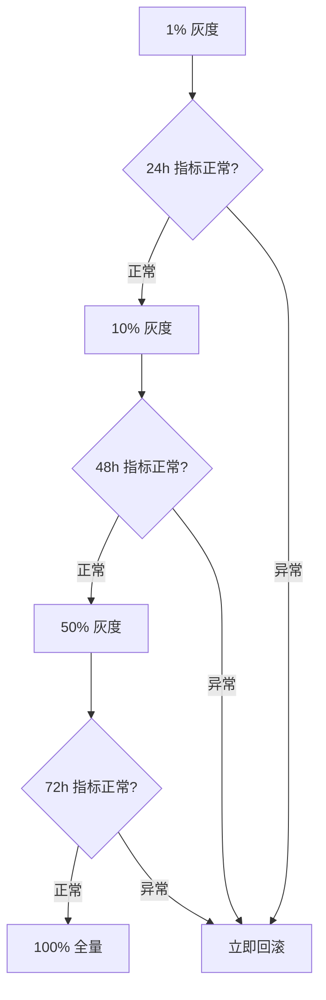
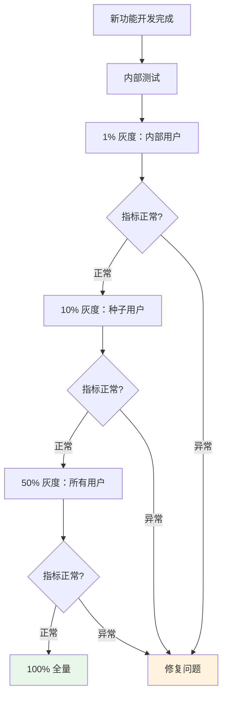

# A/B 测试与灰度发布

2012 年，Facebook 工程师发现了一个反直觉的事实：把「点赞」按钮从灰色改成蓝色，点击率提升了 18%。这个数字让整个公司震惊——一个如此微小的 UI 变化，竟然能带来如此大的影响。

这就是 A/B 测试的力量。它让你用**数据驱动决策**，而不是靠「我觉得」「产品经理认为」「老板认为」。

灰度发布是 A/B 测试的技术基础：通过精确控制哪些用户看到新版本，你可以验证假设、收集数据、降低风险。

## A/B 测试与灰度发布的关系



**关键区别**：

- **灰度发布**：以「安全验证」为目的，关注系统稳定性
- **A/B 测试**：以「数据驱动」为目的，关注业务指标提升

## 用户分群策略

### 基于 Cookie/Session 的分群

```yaml title="cookie-based.yaml"
# 基于 Cookie 的路由
apiVersion: networking.k8s.io/v1
kind: Ingress
metadata:
  name: myapp
  annotations:
    nginx.ingress.kubernetes.io/canary: "true"
    nginx.ingress.kubernetes.io/canary-cookie: "user_group"
    nginx.ingress.kubernetes.io/canary-cookie-value: "B"
```

### 基于 Header 的分群

```yaml title="header-based.yaml"
# 基于 Header 的路由
apiVersion: networking.k8s.io/v1
kind: Ingress
metadata:
  name: myapp
  annotations:
    nginx.ingress.kubernetes.io/canary: "true"
    nginx.ingress.kubernetes.io/canary-by-header: "X-User-Type"
    nginx.ingress.kubernetes.io/canary-by-header-value: "beta"
```

### 基于权重的分群

```yaml title="weight-based.yaml"
# 随机分流
apiVersion: networking.istio.io/v1beta1
kind: VirtualService
metadata:
  name: myapp
spec:
  http:
    - route:
        - destination:
            host: myapp-v1
          weight: 90
        - destination:
            host: myapp-v2
          weight: 10
```

### 基于地域的分群

```yaml title="geo-based.yaml"
# 按地域分流
apiVersion: networking.istio.io/v1beta1
kind: VirtualService
metadata:
  name: myapp
spec:
  http:
    - match:
        - sourceLabels:
            region: CN
      route:
        - destination:
            host: myapp-v2-cn
    - route:
        - destination:
            host: myapp-v1
```

### 基于用户属性的分群

```yaml title="user-based.yaml"
# 按用户 ID 哈希分流
apiVersion: networking.istio.io/v1beta1
kind: VirtualService
metadata:
  name: myapp
spec:
  http:
    - route:
        - destination:
            host: myapp-v2
          weight: |
            10% 用户
        - destination:
            host: myapp-v1
```

## Istio 高级路由

### 基于请求内容的路由

```yaml title="content-based.yaml"
apiVersion: networking.istio.io/v1beta1
kind: VirtualService
metadata:
  name: recommendation-service
spec:
  http:
    - match:
        - headers:
            user-type:
              exact: premium
      route:
        - destination:
            host: recommendation-v2
    - route:
        - destination:
            host: recommendation-v1
```

### 流量镜像（Shadow Traffic）

```yaml title="mirror.yaml"
apiVersion: networking.istio.io/v1beta1
kind: VirtualService
metadata:
  name: myapp
spec:
  http:
    - route:
        - destination:
            host: myapp-v1
          weight: 100
        - destination:
            host: myapp-v2
          weight: 0
          headers:
            response:
              add:
                X-Canary: "true"
    - mirror:
        host: myapp-v2
      mirror_percent: 100
```

:::info
**流量镜像的特殊性**：镜像流量会被复制到新版本，但响应会被丢弃。用于在没有风险的情况下测试新版本的真实行为。
:::

### 超时与重试配置

```yaml title="resilience.yaml"
apiVersion: networking.istio.io/v1beta1
kind: VirtualService
metadata:
  name: myapp
spec:
  http:
    - route:
        - destination:
            host: myapp-v2
          weight: 10
          retries:
            attempts: 3
            perTryTimeout: 2s
            retryOn: gateway-error,connect-failure,reset
          timeout: 10s
```

## 数据收集与分析

### 埋点策略

```javascript title="analytics.js"
function trackEvent(eventName, properties) {
    // A/B 测试分组
    const group = getABGroup();
    const variant = group.variant;  // 'A' 或 'B'

    // 发送事件
    analytics.track(eventName, {
        ...properties,
        ab_test: {
            name: 'recommendation_algorithm',
            variant: variant,
            user_id: getUserId()
        }
    });
}

// 使用示例
trackEvent('page_view', {
    page: '/home',
    recommendation_shown: true
});
```

### 关键指标

| 指标类型 | 指标名 | 说明 |
| --- | --- | --- |
| **业务指标** | 转化率、点击率 | 核心业务价值 |
| **体验指标** | 页面加载时间、响应时间 | 用户体验 |
| **错误指标** | JS 错误率、API 错误率 | 系统稳定性 |

### 统计分析

```python title="ab_analysis.py"
import numpy as np
from scipy import stats

def analyze_ab_test(group_a_data, group_b_data, confidence=0.95):
    """
    分析 A/B 测试结果
    """
    # 计算均值和标准差
    mean_a = np.mean(group_a_data)
    mean_b = np.mean(group_b_data)
    std_a = np.std(group_a_data)
    std_b = np.std(group_b_data)

    # t 检验
    t_stat, p_value = stats.ttest_ind(group_a_data, group_b_data)

    # 计算置信区间
    diff = mean_b - mean_a
    se = np.sqrt(std_a**2/len(group_a_data) + std_b**2/len(group_b_data))
    ci = stats.t.interval(confidence, df=len(group_a_data)+len(group_b_data)-2,
                          loc=diff, scale=se)

    return {
        'variant_a_mean': mean_a,
        'variant_b_mean': mean_b,
        'lift': (mean_b - mean_a) / mean_a * 100,  # 提升百分比
        'p_value': p_value,
        'significant': p_value < (1 - confidence),
        'confidence_interval': ci
    }
```

## 灰度发布实战

### 渐进式灰度



### 灰度配置示例

```yaml title="gray-release.yaml"
apiVersion: argoproj.io/v1alpha1
kind: Rollout
metadata:
  name: myapp
spec:
  strategy:
    canary:
      steps:
        # 阶段 1: 1%
        - setWeight: 1
        - pause: {duration: 1h}
        # 阶段 2: 5%
        - setWeight: 5
        - pause: {duration: 4h}
        # 阶段 3: 20%
        - setWeight: 20
        - pause: {duration: 12h}
        # 阶段 4: 50%
        - setWeight: 50
        - pause: {duration: 24h}
        # 阶段 5: 100%
        - setWeight: 100
```

### 自动分析

```yaml title="gray-analysis.yaml"
spec:
  strategy:
    canary:
      analysis:
        templates:
          - templateName: gray-metrics
        startingStep: 2  # 从 5% 开始分析
        args:
          - name: service-name
            value: myapp-canary
---
apiVersion: argoproj.io/v1alpha1
kind: AnalysisTemplate
metadata:
  name: gray-metrics
spec:
  metrics:
    - name: error-rate
      interval: 5m
      successCondition: result <= 0.01
      failureLimit: 2
      provider:
        prometheus:
          query: |
            rate(http_requests_total{
              service="{{args.service-name}}",
              status=~"5.."
            }[5m])
            /
            rate(http_requests_total{
              service="{{args.service-name}}"
            }[5m])

    - name: latency
      interval: 5m
      successCondition: result <= 0.5
      provider:
        prometheus:
          query: |
            histogram_quantile(0.99,
              rate(http_request_duration_seconds_bucket{
                service="{{args.service-name}}"
              }[5m])
            )
```

## 金丝雀 vs A/B 测试 vs 灰度

| 维度 | 金丝雀 | A/B 测试 | 灰度发布 |
| --- | --- | --- | --- |
| **目的** | 降低发布风险 | 优化业务指标 | 验证并扩大发布 |
| **流量分配** | 可控比例 | 精确分组 | 渐进比例 |
| **决策依据** | 系统指标 | 数据分析 | 综合判断 |
| **持续时间** | 分钟到小时 | 天到周 | 小时到天 |
| **回滚速度** | 快 | 不需要 | 可控 |

## 最佳实践

### 灰度发布流程



### 注意事项

:::warning
**A/B 测试的坑**：

1. **样本量不足**：小样本可能导致结论不可靠
2. **新奇效应**：用户因新功能好奇而点击，不代表真实偏好
3. **时间因素**：周末/工作日的用户行为可能不同
4. **多重测试**：同时测试多个变量会导致统计偏差
5. **数据泄漏**：测试组和对照组相互影响
:::

## 工具选型

| 工具 | 类型 | 适用场景 |
| --- | --- | --- |
| **LaunchDarkly** | Feature Flag | 灰度发布、特性开关 |
| **Split.io** | Feature Flag | 精细化用户分群 |
| **Optimizely** | A/B 测试 | 营销、UI 优化 |
| **Mixpanel** | 分析平台 | 产品分析 |
| **Istio/Envoy** | 服务网格 | 技术层面流量控制 |

## 延伸思考

A/B 测试和灰度发布本质上是**用科学方法做产品决策**。它们让你把「我以为」变成「我验证」，把风险从「拍脑袋」变成「可量化」。

但工具只是手段，真正的挑战是：

1. **定义正确的指标**：不是所有可测量的都是重要的
2. **确保实验有效性**：避免数据偏差和外部干扰
3. **建立决策文化**：即使数据不理想，也要敢于承认假设错误

**当你能用数据说话时，你就不再是「猜测」，而是「决策」**。