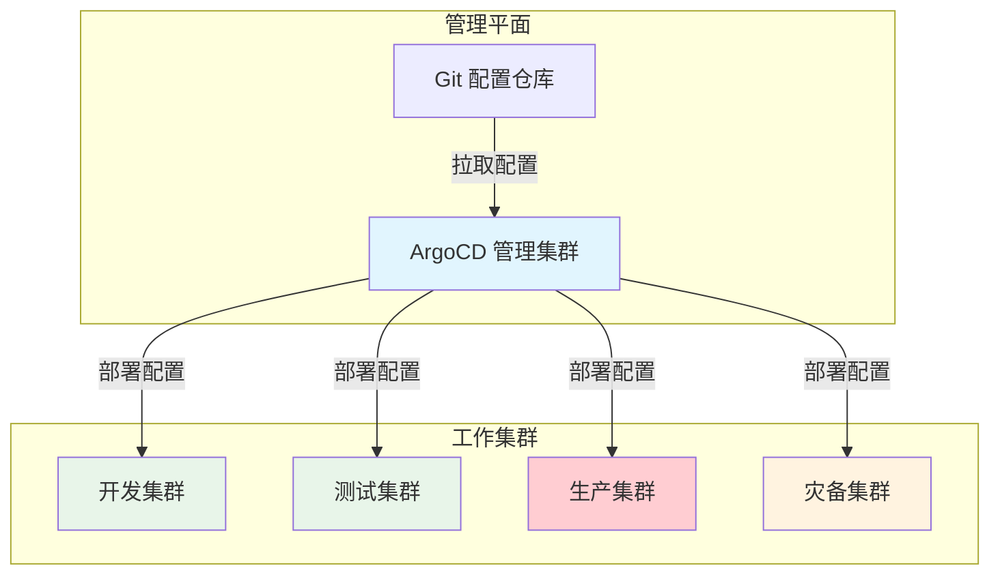

# ArgoCD 多集群管理

当你的系统从单集群扩展到多集群时，管理复杂度会指数级增长。开发环境、测试环境、预发布环境、生产环境，再加上多地域的灾备集群——如何确保每个集群的配置一致性？如何统一监控所有集群的应用状态？如何在大规模场景下保持 ArgoCD 的性能？

多集群管理是 ArgoCD 最核心的能力之一，也是区分「玩具级」和「生产级」部署的关键。

## 多集群架构设计

### 集中式 vs 分布式管理

**集中式管理**：在一个 ArgoCD 实例中管理所有集群。

```
┌─────────────────────────────────────────────────┐
│              ArgoCD 控制平面                     │
│  ┌─────────────┐  ┌─────────────┐              │
│  │ API Server  │  │ Controller  │              │
│  └─────────────┘  └─────────────┘              │
└─────────────────────────────────────────────────┘
         │                    │
         ▼                    ▼
┌─────────────┐      ┌─────────────┐
│ Dev Cluster │      │ Prod Cluster│
└─────────────┘      └─────────────┘
```

**分布式管理**：每个集群运行自己的 ArgoCD 实例。

```
┌─────────────────┐      ┌─────────────────┐
│  ArgoCD (Dev)   │      │  ArgoCD (Prod)   │
└─────────────────┘      └─────────────────┘
         │                        │
         ▼                        ▼
┌─────────────────┐      ┌─────────────────┐
│  Dev Cluster    │      │  Prod Cluster   │
└─────────────────┘      └─────────────────┘
```

:::info
**架构选择建议**：

- **少于 10 个应用、少于 5 个集群**：集中式管理足够
- **10+ 个应用、5+ 个集群**：考虑按环境或按团队拆分
- **大规模多租户**：需要分布式管理 + 联邦机制
:::

### 推荐的多集群架构



## 集群注册与管理

### 注册外部集群

```bash
# 查看当前 kubeconfig 中的集群
kubectl config get-clusters

# 注册集群（ArgoCD 会自动创建 ServiceAccount 和 RBAC）
argocd cluster add <context-name> --name <cluster-alias>

# 示例
argocd cluster add prod-context --name production

# 指定命名空间（仅管理特定命名空间）
argocd cluster add prod-context --name production --namespace argocd-managed
```

### 集群凭据管理

```yaml title="cluster-secret.yaml"
apiVersion: v1
kind: Secret
metadata:
  name: prod-cluster-credentials
  namespace: argocd
  labels:
    argoproj.io/secret-type: cluster
type: Opaque
stringData:
  # 集群名称
  name: production
  # API Server 地址
  server: https://prod.example.com
  # kubeconfig 中的集群配置
  config: |
    {
      "bearerToken": "<service-account-token>",
      "tlsClientConfig": {
        "insecure": false,
        "caData": "<base64-encoded-ca-cert>"
      }
    }
```

### 集群健康检查

```bash
# 查看所有集群状态
argocd cluster list

# 查看特定集群详情
argocd cluster get production

# 检查集群连接
argocd cluster health production
```

## 多集群配置管理

### 按环境组织配置

```
k8s-config/
├── base/                      # 基础配置
│   ├── namespace.yaml
│   ├── network-policy.yaml
│   └── resource-limits.yaml
├── apps/                      # 应用配置
│   ├── myapp/
│   │   ├── base/
│   │   │   ├── deployment.yaml
│   │   │   └── service.yaml
│   │   ├── overlays/
│   │   │   ├── dev/
│   │   │   │   └── kustomization.yaml
│   │   │   ├── staging/
│   │   │   │   └── kustomization.yaml
│   │   │   └── prod/
│   │   │       └── kustomization.yaml
```

### Kustomize 环境覆盖

目录结构参考：

```
k8s-config/
├── base/                      # 基础配置
│   ├── namespace.yaml
│   ├── network-policy.yaml
│   └── resource-limits.yaml
├── apps/                      # 应用配置
│   ├── myapp/
│   │   ├── base/
│   │   │   ├── deployment.yaml
│   │   │   └── service.yaml
│   │   ├── overlays/
│   │   │   ├── dev/
│   │   │   ├── staging/
│   │   │   └── prod/
```

生产环境 Kustomization 配置示例：

```yaml title="kustomization.yaml"
apiVersion: kustomize.config.k8s.io/v1beta1
kind: Kustomization

namespace: myapp-prod

bases:
  - ../../base

patches:
  - patch-replicas.yaml
  - patch-resources.yaml

images:
  - name: myapp
    newTag: v2.3.1
```

副本数补丁：

```yaml title="patch-replicas.yaml"
apiVersion: apps/v1
kind: Deployment
metadata:
  name: myapp
spec:
  replicas: 5
```

资源限制补丁：

```yaml title="patch-resources.yaml"
apiVersion: apps/v1
kind: Deployment
metadata:
  name: myapp
spec:
  template:
    spec:
      containers:
        - name: myapp
          resources:
            limits:
              cpu: "2"
              memory: 2Gi
            requests:
              cpu: "500m"
              memory: 512Mi
```

### 多集群应用配置

```yaml title="application-prod.yaml"
apiVersion: argoproj.io/v1alpha1
kind: Application
metadata:
  name: myapp-prod
  namespace: argocd
spec:
  project: myapp
  source:
    repoURL: https://github.com/myorg/k8s-config
    path: apps/myapp/overlays/prod
    targetRevision: main
  destination:
    server: https://prod.example.com
    namespace: myapp-prod
  syncPolicy:
    automated:
      prune: true
      selfHeal: true
```

## 应用集（ApplicationSet）

ApplicationSet 是管理大量应用的最佳方式，特别适合多集群、多环境场景。

### 基本用法

```yaml title="applicationset.yaml"
apiVersion: argoproj.io/v1alpha1
kind: ApplicationSet
metadata:
  name: myapp
  namespace: argocd
spec:
  generators:
    # 矩阵生成器：组合多个来源
    - matrix:
        generators:
          # 从 Git 目录结构生成应用列表
          - git:
              repoURL: https://github.com/myorg/k8s-config
              revision: main
              directories:
                - path: apps/myapp/overlays/*
          # 集群列表
          - clusters:
              selector:
                matchLabels:
                  environment: production
  template:
    metadata:
      name: '{{ path.basename }}-{{ name }}'
    spec:
      project: myapp
      source:
        repoURL: https://github.com/myorg/k8s-config
        path: '{{ path }}'
        targetRevision: main
      destination:
        server: '{{ server }}'
        namespace: '{{ path.basename }}-{{ name }}'
```

### 集群选择器

```yaml title="applicationset-with-selector.yaml"
apiVersion: argoproj.io/v1alpha1
kind: ApplicationSet
metadata:
  name: myapp-production
  namespace: argocd
spec:
  generators:
    - clusters:
        # 选择带有特定标签的集群
        selector:
          matchLabels:
            environment: production
            team: backend
        values:
          environmentSuffix: production
  template:
    spec:
      # ...
```

### 仓库 + 集群组合

```yaml title="applicationset-matrix.yaml"
spec:
  generators:
    - matrix:
        generators:
          # 应用配置（从 Git 目录）
          - git:
              repoURL: https://github.com/myorg/k8s-config
              revision: main
              directories:
                path: apps/*/overlays/prod

          # 目标集群
          - list:
              elements:
                - server: https://prod-us.example.com
                  name: prod-us
                  region: us-east
                - server: https://prod-eu.example.com
                  name: prod-eu
                  region: eu-west
```

## 多集群同步策略

### 环境差异化策略

| 环境 | 自动同步 | 审批要求 | 回滚策略 |
| --- | --- | --- | --- |
| 开发 | 是 | 否 | 自动 |
| 测试 | 是 | 否 | 自动 |
| 预发布 | 是 | 部分 | 手动 |
| 生产 | 否 | 是 | 手动 |

```yaml title="application-prod.yaml"
spec:
  syncPolicy:
    automated: null  # 禁用自动同步

  # 生产环境需要手动触发
  ignoreDifferences:
    - group: apps
      kind: Deployment
      jsonPointers:
        - /spec/replicas
```

### 同步窗口

```yaml title="project-with-sync-windows.yaml"
spec:
  syncWindows:
    # 工作时间允许自动同步
    - kind: allow
      schedule: "0 9-18 * * MON-FRI"
      duration: 9h
      applications:
        - '*-production'
      manualSync: false

    # 非工作时间允许手动同步
    - kind: allow
      schedule: "0 18-9 * * MON-FRI"
      duration: 15h
      applications:
        - '*-production'
      manualSync: true

    # 禁止同步窗口（发布窗口）
    - kind: deny
      schedule: "0 0 * * 0"  # 周日凌晨
      duration: 4h
      applications:
        - '*-production'
      timeZone: Asia/Shanghai
```

## 多集群监控

### 统一监控

```bash
# 查看所有集群所有应用的状态
argocd app list --output wide

# 按集群筛选
argocd app list -o json | jq '.[] | select(.spec.destination.server == "https://prod.example.com")'

# 查看集群健康状态
argocd cluster list --format json | jq '.[] | {name, server, status}'
```

### Prometheus 指标

```yaml title="argocd-monitoring.yaml"
apiVersion: v1
kind: ServiceMonitor
metadata:
  name: argocd-monitor
  namespace: monitoring
spec:
  selector:
    matchLabels:
      app.kubernetes.io/name: argocd-server
  endpoints:
    - port: metrics
      interval: 30s
```

关键指标：

| 指标 | 说明 |
| --- | --- |
| `argocd_app_info` | 应用基本信息（标签包含集群名） |
| `argocd_app_sync_status` | 同步状态分布 |
| `argocd_app_health_status` | 健康状态分布 |
| `argocd_cluster_api_version` | 集群 API 版本信息 |

### Grafana Dashboard

```json title="argocd-clusters.json"
{
  "dashboard": {
    "panels": [
      {
        "title": "各集群应用状态",
        "targets": [
          {
            "expr": "sum by (cluster) (argocd_app_info)",
            "legendFormat": "{{cluster}}"
          }
        ]
      },
      {
        "title": "同步失败应用",
        "targets": [
          {
            "expr": "argocd_app_sync_status{status=\"OutOfSync\"}"
          }
        ]
      }
    ]
  }
}
```

## 大规模部署优化

### 分片策略

当应用数量超过 500 时，需要考虑分片。

```yaml title="argocd-application-controller-statefulset.yaml"
spec:
  replicas: 3  # 多个副本，分片处理应用
  template:
    spec:
      containers:
        - name: application-controller
          env:
            # 应用分片配置
            - name: ARGOCD_CONTROLLER_REPLICAS
              value: "3"
```

### Redis 缓存优化

```yaml title="redis-config.yaml"
apiVersion: v1
kind: ConfigMap
metadata:
  name: argocd-cmd-params-cm
data:
  # 缓存配置
  redis.cache.server: "localhost:6379"
  # 缓存过期时间
  redis.cache.expiration: 24h
```

### Repository Server 扩展

```yaml title="argocd-repo-server.yaml"
apiVersion: v1
kind: Deployment
metadata:
  name: argocd-repo-server
spec:
  replicas: 3  # 多个副本并行处理 Git 操作
```

## 灾难恢复

### 备份与恢复

```bash
# 备份 ArgoCD 状态
argocd admin export -o argocd-backup.yaml

# 恢复 ArgoCD 状态
argocd admin import -f argocd-backup.yaml

# 自动备份（定时任务）
kubectl create cronjob argocd-backup \
  --schedule="0 2 * * *" \
  -- argocd admin export
```

### 集群故障转移

```yaml title="application-dr.yaml"
spec:
  # 主集群
  destination:
    server: https://prod-primary.example.com
  # 备集群（需要时切换）
  # destination:
  #   server: https://prod-dr.example.com
```

## 常见问题处理

| 问题 | 原因 | 解决方案 |
| --- | --- | --- |
| 集群连接超时 | 网络问题或凭据过期 | 更新集群凭据，检查网络 |
| 同步延迟 | 应用数量多，Controller 压力大 | 增加 Controller 副本数 |
| 资源冲突 | 多个 Application 管理同一资源 | 使用 AppProject 限制范围 |
| 配置不一致 | 不同环境的 Git 分支不同步 | 使用相同的基准配置 |

## 延伸思考

多集群管理的本质是**规模化的 GitOps**。当集群数量从 1 增加到 10 时，你需要解决的不仅是技术问题，还有流程问题和治理问题：

1. **谁有权限部署到生产集群？** 需要完善的 RBAC
2. **如何确保配置一致性？** 需要统一的配置管理
3. **如何快速定位问题？** 需要统一的监控和告警
4. **如何在大规模场景下保持性能？** 需要分片和缓存

这些问题的答案不是唯一的，需要根据组织的规模、文化和需求来制定。ArgoCD 提供了强大的工具，但最终的实现效果取决于你的规划和执行。