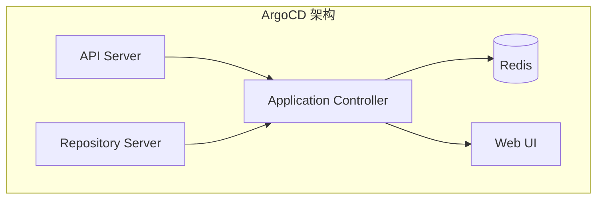
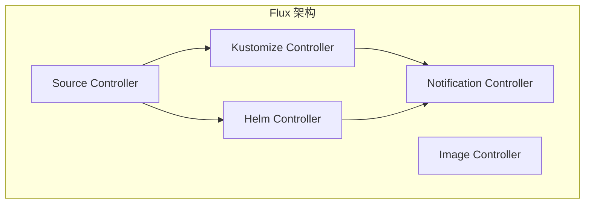
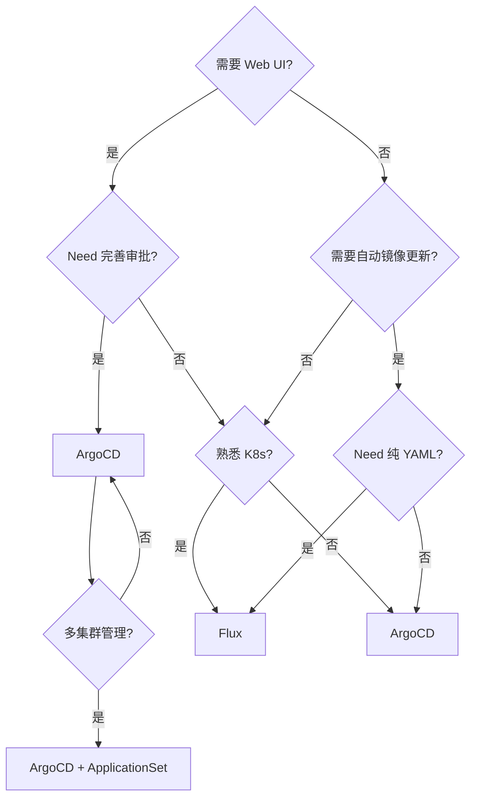

# ArgoCD vs Flux 对比

当团队决定采用 GitOps 时，最常见的问题就是：ArgoCD 还是 Flux？

这个问题没有标准答案。两个工具都有各自的优势和适用场景，正确的选择取决于你的团队规模、技术栈、运维能力和管理风格。

本文从多个维度深度对比 ArgoCD 和 Flux，帮助你做出更适合的选择。

## 架构对比

### ArgoCD：统一控制平面

ArgoCD 采用统一的控制平面，所有功能集中在一个 Application Controller 中：



**特点**：

- 所有组件协同工作，状态集中管理
- 内置 Web UI，提供可视化界面
- 通过 Application CRD 定义应用

### Flux：模块化 Operator

Flux 采用模块化设计，每个功能是一个独立的 Operator：



**特点**：

- 组件独立，可按需安装
- 所有配置都是原生 Kubernetes 资源
- 无内置 UI（可通过第三方工具如 Weave GitOps）

## 功能对比

### 核心功能对比表

| 功能 | ArgoCD | Flux |
| --- | --- | --- |
| **Git 仓库支持** | ✅ 完整 | ✅ 完整 |
| **Helm Chart 支持** | ✅ 完整 | ✅ 完整 |
| **Kustomize 支持** | ✅ 完整 | ✅ 完整 |
| **多集群管理** | ✅ ApplicationSet | ✅ Federation |
| **自动镜像更新** | ❌ 需额外配置 | ✅ 原生支持 Image Controller |
| **Web UI** | ✅ 完善 | ❌ 依赖第三方 |
| **CLI** | ✅ ArgoCD CLI | ✅ Flux CLI |
| **RBAC** | ✅ 内置 | ⚠️ 需配置 Kubernetes RBAC |
| **审批流程** | ✅ 内置 | ❌ 需外部工具 |
| **Sync 策略** | ✅ 灵活 | ✅ 灵活 |
| **健康检查** | ✅ 可自定义 Lua | ✅ 可自定义 Lua |
| **回滚** | ✅ 支持 | ✅ 支持 |

### 自动镜像更新

这是两者最显著的差异之一。

**ArgoCD**：需要安装额外的 Argo CD Image Updater 或手动触发同步。

```yaml title="argocd-image-updater.yaml"
apiVersion: argoproj.io/v1alpha1
kind: Application
metadata:
  name: myapp
  annotations:
    argocd-image-updater.argoproj.io/image-list: myapp=myregistry/myapp
    argocd-image-updater.argoproj.io/myapp.update-strategy: semver
```

**Flux**：Image Controller 是原生功能，无需额外安装。

```yaml title="imagepolicy-flux.yaml"
apiVersion: image.toolkit.fluxcd.io/v1beta2
kind: ImagePolicy
metadata:
  name: myapp
spec:
  imageRepository:
    name: myregistry/myapp
  policy:
    semver:
      range: ">=1.0.0"
```

```yaml title="imageupdateautomation-flux.yaml"
apiVersion: image.toolkit.fluxcd.io/v1beta2
kind: ImageUpdateAutomation
metadata:
  name: myapp-update
spec:
  sourceRef:
    kind: GitRepository
    name: k8s-config
  update:
    strategy: Setters
```

### Web UI

**ArgoCD**：内置功能完善的 Web UI。

```
┌─────────────────────────────────────────────────┐
│  ArgoCD Dashboard                               │
├─────────────────────────────────────────────────┤
│  Application    Status    Health    Sync        │
│  ─────────────────────────────────────────────  │
│  myapp-prod    ●         Healthy   Synced      │
│  myapp-staging ●         Healthy   OutOfSync   │
│  api-service   ●         Healthy   Synced      │
├─────────────────────────────────────────────────┤
│  [Sync]  [Diff]  [History]  [Settings]          │
└─────────────────────────────────────────────────┘
```

**Flux**：无内置 UI，需要安装 Weave GitOps 或其他第三方工具。

```bash
# 安装 Weave GitOps
kubectl apply -f https://github.com/weaveworks/weave-gitops/releases/latest/download/gitops.yaml

# 访问 Web UI
kubectl port-forward -n flux-system svc/weave-gitops 9001:9001
```

## 多集群管理对比

### ArgoCD ApplicationSet

ArgoCD 使用 ApplicationSet 批量管理应用：

```yaml title="applicationset.yaml"
apiVersion: argoproj.io/v1alpha1
kind: ApplicationSet
metadata:
  name: myapp
spec:
  generators:
    - matrix:
        generators:
          - git:
              repoURL: https://github.com/myorg/config
              directories:
                - path: apps/myapp/*
          - clusters:
              selector:
                matchLabels:
                  environment: production
  template:
    metadata:
      name: '{{ path.basename }}-{{ name }}'
    spec:
      source:
        path: '{{ path }}'
      destination:
        server: '{{ server }}'
```

### Flux Federation

Flux 使用 GitOps Toolkit 的 Federation 功能：

```yaml title="gitopscluster.yaml"
apiVersion: infrastructure.toolkit.fluxcd.io/v1alpha1
kind: GitopsCluster
metadata:
  name: production
  namespace: flux-system
spec:
  fluxReceiver:
    namespace: flux-system
```

## 安全模型对比

### ArgoCD RBAC

ArgoCD 内置基于角色的访问控制：

```yaml title="argocd-rbac.yaml"
data:
  policy.csv: |
    # 定义角色
    p, role:developer, applications, get, myapp/*, allow
    p, role:developer, applications, sync, myapp/dev-*, allow
    p, role:developer, applications, update, myapp/dev-*, allow

    # 用户组映射
    g, engineering-team, role:developer

  defaultPolicy: "role:readonly"
```

### Flux RBAC

Flux 依赖 Kubernetes 原生的 RBAC：

```yaml title="flux-rbac.yaml"
apiVersion: rbac.authorization.k8s.io/v1
kind: Role
metadata:
  name: flux-deployer
  namespace: myapp
rules:
  - apiGroups: ["*"]
    resources: ["*"]
    verbs: ["get", "list", "watch", "create", "update", "patch"]
```

## 使用场景对比

### 何时选择 ArgoCD

| 场景 | 原因 |
| --- | --- |
| **需要可视化界面** | ArgoCD 的 Web UI 是核心功能 |
| **需要完善的审批流程** | ArgoCD 内置同步审批 |
| **团队不熟悉 Kubernetes** | UI 降低学习门槛 |
| **需要快速定位问题** | 状态可视化更容易排查 |
| **多团队协作** | Project 和 RBAC 支持更好 |

### 何时选择 Flux

| 场景 | 原因 |
| --- | --- |
| **追求纯 GitOps** | 所有配置都是原生 Kubernetes 资源 |
| **需要自动镜像更新** | Image Controller 是原生功能 |
| **已有监控体系** | 不需要额外的 UI |
| **Kubernetes 深度用户** | 不依赖外部工具 |
| **模块化需求** | 按需安装组件 |

## 迁移成本

### 从 ArgoCD 迁移到 Flux

1. **Application 定义转换**

ArgoCD：

```yaml
apiVersion: argoproj.io/v1alpha1
kind: Application
metadata:
  name: myapp
spec:
  source:
    repoURL: https://github.com/myorg/config
    path: myapp
  destination:
    namespace: myapp
```

Flux：

```yaml
apiVersion: source.toolkit.fluxcd.io/v1
kind: GitRepository
metadata:
  name: config
---
apiVersion: kustomize.toolkit.fluxcd.io/v1
kind: Kustomization
metadata:
  name: myapp
spec:
  sourceRef:
    kind: GitRepository
    name: config
  path: ./myapp
  targetNamespace: myapp
```

### 从 Flux 迁移到 ArgoCD

转换逻辑类似，将 Flux 的多个资源合并为 ArgoCD 的单个 Application 资源。

## 性能对比

| 维度 | ArgoCD | Flux |
| --- | --- | --- |
| **启动时间** | ~30s | ~20s（Source Controller） |
| **内存占用** | ~500MB（含 Redis） | ~200MB（单个 Controller） |
| **支持应用数** | ~500（单实例） | ~1000（多 Controller） |
| **Git 仓库数** | ~200 | ~500 |

:::info
**性能不是选择的主要因素**。大多数场景下，两个工具的性能都足够。选择应该基于功能需求和团队熟悉度。
:::

## 社区与生态

| 维度 | ArgoCD | Flux |
| --- | --- | --- |
| **CNCF 状态** | 毕业项目 | 毕业项目 |
| **GitHub Stars** | 13k+ | 8k+ |
| **贡献者** | 500+ | 300+ |
| **企业用户** | Intuit, Autodesk, BMW | Weaveworks, Giant Swarm |
| **插件生态** | 丰富 | 较少 |

## 选型决策树



## 总结

| 维度 | ArgoCD 胜出 | Flux 胜出 |
| --- | --- | --- |
| **易用性** | ✅ Web UI 降低门槛 | |
| **灵活性** | | ✅ 纯 YAML，Kubernetes 原生 |
| **镜像更新** | | ✅ 原生支持 |
| **多集群** | ✅ ApplicationSet 更强大 | |
| **审批流程** | ✅ 内置 | |
| **模块化** | | ✅ 按需安装 |
| **学习曲线** | | ✅ 概念简单 |

**最终建议**：

- **如果你是新手团队**，或需要快速上手，选择 **ArgoCD**
- **如果你是 Kubernetes 深度用户**，追求纯 GitOps，选择 **Flux**
- **如果两者都能满足需求**，选择团队更熟悉的

记住：工具只是手段，GitOps 才是目的。无论选择哪个工具，关键是真正实现「把 Git 作为唯一事实来源」的理念。