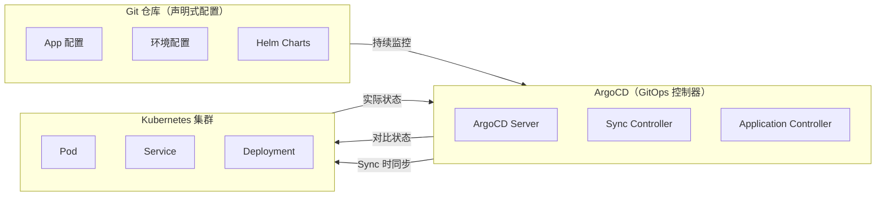
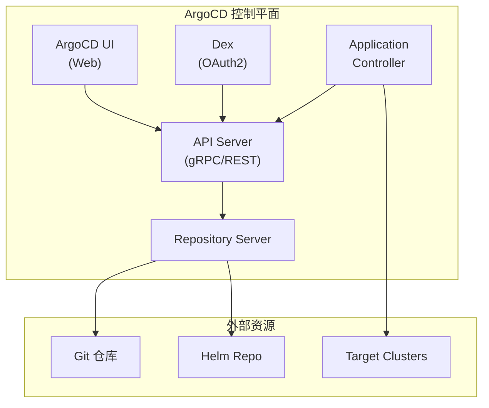

凌晨三点，某团队的发布负责人被手机震醒：生产环境的 Deployment 更新失败了。不是因为代码有问题，而是因为 Kubernetes 集群临时不可用，导致 CI/CD 流水线超时。整个发布窗口被延误了两个小时。

**这是一个典型的「命令式发布」困境：发布过程依赖外部系统的可用性。**

GitOps 给出了一种不同的思路：**不再由 CI/CD 流水线「推送」配置到集群，而是让集群「拉取」配置到集群。** ArgoCD 就是这种理念的践行者。

## GitOps 理念回顾

在深入 ArgoCD 之前，先回顾 GitOps 的核心理念：



**GitOps 的核心原则**：

1. **声明式优于命令式**：所有配置以代码形式声明
2. **Git 是唯一真相源**：环境状态由 Git 决定
3. **自动化同步**：集群状态自动向 Git 声明的状态收敛

## ArgoCD 架构

### 核心组件

| 组件 | 作用 | 关键技术 |
| --- | --- | --- |
| **API Server** | 提供 API 和 UI | gRPC/REST |
| **Application Controller** | 核心协调器 | Kubernetes Controller |
| **Repository Server** | 访问 Git 仓库 | Git/Direct |
| **Dex** | GitHub/GitLab 认证 | OAuth2/OIDC |



### Application 资源

Application 是 ArgoCD 的核心概念，定义了一个应用如何部署：

```yaml title="基础 Application.yaml"
apiVersion: argoproj.io/v1alpha1
kind: Application
metadata:
  name: frontend-app
  namespace: argocd
spec:
  # 源：Git 仓库
  source:
    repoURL: https://github.com/example/app.git
    targetRevision: main
    path: deploy/overlays/production
    # Helm 参数
    helm:
      valueFiles:
        - values-prod.yaml
      parameters:
        - name: image.tag
          value: v2.0.0

  # 目标：Kubernetes 集群
  destination:
    server: https://kubernetes.default.svc
    namespace: production

  # 同步策略
  syncPolicy:
    automated:
      prune: true          # 自动删除不在 Git 中的资源
      selfHeal: true       # 自动恢复被手动修改的资源
```

### 多集群支持

```yaml title="多集群 Application.yaml"
apiVersion: argoproj.io/v1alpha1
kind: Application
metadata:
  name: backend-app
  namespace: argocd
spec:
  source:
    repoURL: https://github.com/example/backend.git
    path: k8s
    helm:
      values: |
        replicaCount: 3
        image:
          repository: registry.example.com/backend
          tag: latest

  # 部署到多个集群
  destination:
    server: https://eks.us-west-2.amazonaws.com
    namespace: backend
```

## ApplicationSet：批量管理

ApplicationSet 解决了管理大量 Application 的问题：

```yaml title="ApplicationSet 示例.yaml"
apiVersion: argoproj.io/v1alpha1
kind: ApplicationSet
metadata:
  name: backend-clusters
  namespace: argocd
spec:
  generators:
    # 从集群列表生成
    - clusters:
        selector:
          matchLabels:
            environment: production

  # 每次生成的应用模板
  template:
    metadata:
      name: 'backend-{{name}}'
    spec:
      source:
        repoURL: https://github.com/example/backend.git
        path: deploy/{{name}}
        targetRevision: main
      destination:
        server: '{{server}}'
        namespace: backend
      syncPolicy:
        automated:
          prune: true
          selfHeal: true
```

### 生成器类型

| 生成器 | 用途 |
| --- | --- |
| **List** | 静态列表 |
| **Clusters** | 从 ArgoCD 管理的集群 |
| **Git** | 从 Git 目录/文件 |
| **Matrix** | 组合多个生成器 |
| **Merge** | 合并多个生成器 |

```yaml title="Matrix 生成器示例.yaml"
apiVersion: argoproj.io/v1alpha1
kind: ApplicationSet
metadata:
  name: microservices
  namespace: argocd
spec:
  generators:
    - matrix:
        generators:
          # 服务列表
          - git:
              repoURL: https://github.com/example/config.git
              directories:
                - path: services/*
          # 集群列表
          - clusters:
              selector:
                matchLabels:
                  env: prod

  template:
    metadata:
      name: '{{path.basename}}-{{name}}'
    spec:
      source:
        repoURL: https://github.com/example/config.git
        path: '{{path}}/k8s'
      destination:
        server: '{{server}}'
        namespace: '{{path.basename}}'
```

## Sync 策略与健康检查

### Sync 阶段

```yaml title="Sync 策略配置.yaml"
apiVersion: argoproj.io/v1alpha1
kind: Application
metadata:
  name: critical-app
spec:
  syncPolicy:
    # 自动同步
    automated:
      prune: true
      selfHeal: true
      allowEmpty: false

    # 同步选项
    syncOptions:
      - CreateNamespace=true
      - PrunePropagationPolicy=foreground
      - PruneLast=true

    # 重试配置
    retry:
      limit: 5
      backoff:
        duration: 5s
        factor: 2
        maxDuration: 3m
```

### 健康检查

```yaml title="自定义健康检查.yaml"
apiVersion: argoproj.io/v1alpha1
kind: Application
metadata:
  name: redis-app
spec:
  # 自定义健康检查脚本
  ignoreDifferences:
    - group: apps
      kind: Deployment
      jsonPointers:
        - /spec/replicas

  # 或者通过 ConfigMap 定义健康检查
  # ...
```

```yaml title="健康检查 ConfigMap.yaml"
apiVersion: v1
kind: ConfigMap
metadata:
  name: argocd-cm
  namespace: argocd
data:
  resource.customizations: |
    apps/Deployment:
      health.lua: |
        local hs = {}
        hs.status = "Progressing"
        hs.message = ""
        if obj.status ~= nil then
          if obj.status.observedGeneration ~= nil
             and obj.metadata.generation == obj.status.observedGeneration then
            if obj.status.condition ~= nil then
              for i, condition in ipairs(obj.status.condition) do
                if condition.type == "Available" and condition.status == "True" then
                  hs.status = "Healthy"
                  hs.message = condition.message
                  return hs
                end
              end
            end
          end
        end
        return hs
```

## Argo Rollouts：高级部署

### Rollout 资源

```yaml title="Argo Rollout 配置.yaml"
apiVersion: argoproj.io/v1alpha1
kind: Rollout
metadata:
  name: backend-rollout
spec:
  replicas: 3
  strategy:
    canary:
      steps:
        - setWeight: 5
        - pause: {}           # 等待手动或自动继续
        - setWeight: 20
        - pause: {duration: 10}
        - setWeight: 50
        - pause: {duration: 10}
        - setWeight: 100

      # 金丝雀服务
      canaryService: backend-canary
      stableService: backend-stable

      # 流量管理
      trafficRouting:
        istio:
          virtualService:
            name: backend-vs
          routes:
            - primary

      # 分析
      analysis:
        templates:
          - templateName: success-rate
        startingStep: 1
        args:
          - name: service-name
            value: backend-canary

  selector:
    matchLabels:
      app: backend
  template:
    metadata:
      labels:
        app: backend
    spec:
      containers:
        - name: backend
          image: backend:v2
```

### 分析模板

```yaml title="分析模板.yaml"
apiVersion: argoproj.io/v1alpha1
kind: AnalysisTemplate
metadata:
  name: success-rate
spec:
  args:
    - name: service-name

  metrics:
    - name: success-rate
      interval: 1m
      successCondition: result[0] >= 0.95
      failureLimit: 3
      provider:
        prometheus:
          address: http://prometheus:9090
          query: |
            sum(rate(istio_requests_total{
              destination="{{args.service-name}}",
              response_code!="500"
            }[5m]))
            /
            sum(rate(istio_requests_total{
              destination="{{args.service-name}}"
            }[5m]))
```

## RBAC 与安全

### RBAC 配置

```yaml title="RBAC 配置.yaml"
apiVersion: v1
kind: ConfigMap
metadata:
  name: argocd-rbac-cm
  namespace: argocd
data:
  policy.csv: |
    # 角色定义
    p, role:developer, applications, *, */*, allow
    p, role:developer, clusters, get, *, allow
    p, role:developer, repositories, get, *, allow

    # 团队管理员
    p, role:team-admin, applications, *, */production, allow
    g, team-admins, role:team-admin

    # 拒绝规则
    p, role:developer, applications, delete, */*, deny
```

## 权衡矩阵

| 维度 | ArgoCD | 传统 CI/CD (Jenkins/GitLab CI) |
| --- | --- | --- |
| **部署方式** | 拉取（Pull） | 推送（Push） |
| **配置位置** | Git | CI/CD 系统 |
| **故障恢复** | 自动 | 需手动 |
| **权限模型** | 声明式 RBAC | 命令式权限 |
| **多集群支持** | 原生 | 需要额外配置 |
| **与 K8s 集成** | 原生 | 需要 agent |

## 常见问题与反模式

### 问题一：Sync 循环

**错误**：Application 不断处于 Syncing 状态。

**正确做法**：检查是否有资源配置冲突，或者 `selfHeal` 与手动修改冲突。

### 问题二：Repository 认证失效

**错误**：Git 仓库访问失败。

**正确做法**：确保 Secret 中的凭证是最新的，使用 Git Deploy Key 而非用户账号。

### 问题三：多集群权限混乱

**错误**：不同集群使用相同的 ServiceAccount。

**正确做法**：为每个集群创建独立的 Secret 和 Application。

## 延伸思考

ArgoCD 的本质是**将部署的确定性交给 Git**。当 Git 中的配置是正确的，集群状态就会是正确的。这种范式特别适合：

- **多集群管理**：一个 ArgoCD 可以管理多个集群的部署
- **不可变基础设施**：所有变更都必须通过 Git
- **合规要求**：审计日志就是 Git 提交记录

但 ArgoCD 不是万能的。**对于需要复杂逻辑的构建流程（如多阶段编译、二进制打包），仍然需要 CI 系统配合。** ArgoCD 和 CI 系统各司其职：CI 负责构建，ArgoCD 负责部署。
