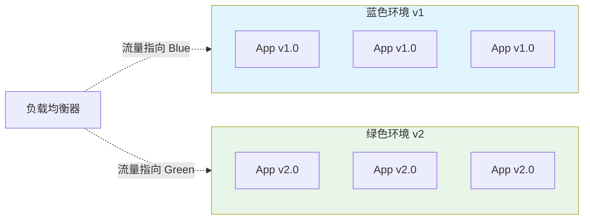
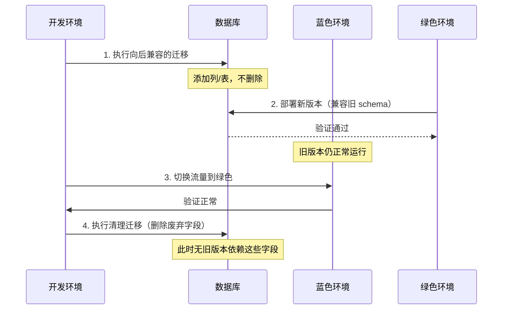
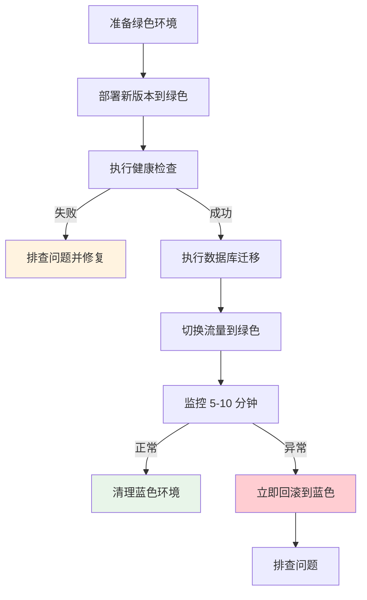

# 蓝绿部署（Blue-Green）策略

2010 年，Netflix 面临一个难题：如何在不中断服务的情况下，发布一个可能有问题的新版本？

他们想到了一个办法：准备两套环境，一套运行当前的生产版本（蓝），另一套运行新版本（绿）。先在绿环境验证，验证通过后，通过修改负载均衡器的配置，把流量一次性从蓝切换到绿。如果绿有问题，立即切回蓝。

这就是蓝绿部署的起源。今天，蓝绿部署已经成为高可用系统发布的标配。

## 蓝绿部署的核心思想

### 核心原理

蓝绿部署通过**同时运行两套完整环境**，实现流量的快速切换：



### 与其他策略对比

| 策略 | 停机时间 | 回滚时间 | 资源成本 | 适用场景 |
| --- | --- | --- | --- | --- |
| **蓝绿部署** | 0 | 秒级 | 2 倍 | 需要快速切换 |
| **金丝雀发布** | 0 | 秒级（部分） | 1.x 倍 | 渐进验证 |
| **滚动更新** | 0（部分） | 分钟级 | 1.x 倍 | 资源受限 |
| **手动部署** | 分钟级 | 分钟级 | 1 倍 | 低频发布 |

## Kubernetes 实现

### Deployment 配置

```yaml title="blue-green-deployment.yaml"
apiVersion: apps/v1
kind: Deployment
metadata:
  name: myapp-blue
  labels:
    app: myapp
    version: blue
spec:
  replicas: 3
  selector:
    matchLabels:
      app: myapp
      slot: blue
  template:
    metadata:
      labels:
        app: myapp
        version: v1.0.0
        slot: blue
    spec:
      containers:
        - name: myapp
          image: myorg/myapp:v1.0.0
          ports:
            - containerPort: 8080
---
apiVersion: apps/v1
kind: Deployment
metadata:
  name: myapp-green
  labels:
    app: myapp
    version: green
spec:
  replicas: 3
  selector:
    matchLabels:
      app: myapp
      slot: green
  template:
    metadata:
      labels:
        app: myapp
        version: v2.0.0
        slot: green
    spec:
      containers:
        - name: myapp
          image: myorg/myapp:v2.0.0
          ports:
            - containerPort: 8080
```

### Service 切换

```yaml title="blue-green-service.yaml"
apiVersion: v1
kind: Service
metadata:
  name: myapp
  labels:
    app: myapp
spec:
  type: LoadBalancer
  selector:
    app: myapp
    slot: blue  # [!code highlight] 切换时修改这个标签
  ports:
    - name: http
      port: 80
      targetPort: 8080
```

### 切换脚本

```bash title="switch-to-green.sh"
#!/bin/bash
# 切换流量到绿色环境

set -e

# 1. 验证绿色环境健康
kubectl rollout status deployment/myapp-green

# 2. 执行数据库迁移（如有）
kubectl exec -it myapp-green-xxx -- /app/migrate.sh

# 3. 切换流量
kubectl patch service myapp -p '{"spec":{"selector":{"slot":"green"}}}'

# 4. 验证切换成功
kubectl get pods -l slot=green
kubectl logs -l slot=green --tail=100 | grep -i error

# 5. 清理蓝色环境（旧版本）
# kubectl delete deployment myapp-blue  # 确认无误后执行
```

### 回滚脚本

```bash title="rollback-to-blue.sh"
#!/bin/bash
# 回滚到蓝色环境

set -e

# 1. 立即切换回蓝色
kubectl patch service myapp -p '{"spec":{"selector":{"slot":"blue"}}}'

# 2. 验证蓝色环境正常
kubectl rollout status deployment/myapp-blue

# 3. 可选：保留绿色环境用于排查
# echo "Keep green environment for debugging"
```

## 自动化蓝绿部署

### Argo Rollout 实现

```yaml title="argocd-blue-green.yaml"
apiVersion: argoproj.io/v1alpha1
kind: Rollout
metadata:
  name: myapp
spec:
  replicas: 10
  strategy:
    blueGreen:
      # 活跃副本数
      activeService: myapp-active
      # 预览副本数（用于验证）
      previewService: myapp-preview
      # 预热时间
      autoPromotionEnabled: false
      # 切换后暂停（手动确认）
      scaleDownDelaySeconds: 30
      # 预览环境保留时间
      previewMetadata:
        labels:
          environment: preview
      activeMetadata:
        labels:
          environment: production
```

### 自动预热与切换

```yaml title="argocd-auto-promote.yaml"
apiVersion: argoproj.io/v1alpha1
kind: Rollout
metadata:
  name: myapp
spec:
  strategy:
    blueGreen:
      # 启用自动切换
      autoPromotionEnabled: true
      # 切换前等待时间
      autoPromotionSeconds: 30
      # 指标验证后切换
      analysis:
        templates:
          - templateName: success-rate
        startingStep: 1
      # 切换后缩容旧版本
      scaleDownDelaySeconds: 60
```

## 数据库迁移策略

蓝绿部署最大的挑战是**数据库变更**。如果新版本的数据库 schema 与旧版本不兼容，切换会导致旧版本无法运行。

### 前后兼容策略

**原则：新版本的数据库 schema 必须与旧版本兼容**

```sql title="migrations/001_create_table.sql"
-- 安全的添加列：默认值必须兼容旧代码
ALTER TABLE users ADD COLUMN phone VARCHAR(20) DEFAULT '';

-- 不安全的变更：需要分步骤执行
-- ALTER TABLE users DROP COLUMN legacy_field;  -- 先注释掉，部署后再删除
```

### 迁移流程



### 迁移示例

```sql title="migrations/phase1.sql"
-- Phase 1: 向后兼容的变更（部署前执行）
ALTER TABLE orders ADD COLUMN new_status VARCHAR(20) DEFAULT 'pending';

-- Phase 2: 清理变更（确认切换成功后执行）
ALTER TABLE orders DROP COLUMN old_status;
```

## 流量验证

### 健康检查

```bash title="health-check.sh"
#!/bin/bash
# 健康检查脚本

check_service() {
    local slot=$1
    local max_retries=30
    local retry=0

    while [ $retry -lt $max_retries ]; do
        # 检查 Pod 健康状态
        ready=$(kubectl get pods -l slot=$slot -o jsonpath='{.items[*].status.conditions[?(@.type=="Ready")].status}' | tr ' ' '\n' | grep -c True)

        if [ "$ready" -ge 3 ]; then
            echo "✓ $slot 环境就绪"
            return 0
        fi

        echo "等待 $slot 环境... ($retry/$max_retries)"
        sleep 2
        retry=$((retry + 1))
    done

    echo "✗ $slot 环境超时"
    return 1
}

# 检查绿色环境
check_service green
```

### 自动化验证

```yaml title="verification-job.yaml"
apiVersion: batch/v1
kind: Job
metadata:
  name: verify-deployment
spec:
  template:
    spec:
      containers:
        - name: verify
          image: curlimages/curl:latest
          command:
            - /bin/sh
            - -c
            - |
              # 检查新版本健康
              for i in {1..10}; do
                response=$(curl -s -o /dev/null -w "%{http_code}" http://myapp-preview/health)
                if [ "$response" -eq 200 ]; then
                  echo "健康检查通过"
                  exit 0
                fi
                sleep 2
              done
              echo "健康检查失败"
              exit 1
      restartPolicy: Never
```

## 监控与告警

### 关键指标

| 指标 | 正常范围 | 告警阈值 |
| --- | --- | --- |
| 请求成功率 | `>= 99.9%` | `< 99%` |
| P99 延迟 | `< 200ms` | `> 500ms` |
| 错误率 | `< 0.1%` | `> 1%` |
| 活跃连接数 | 稳定 | 异常波动 |

### Prometheus 告警

```yaml title="blue-green-alert.yaml"
groups:
  - name: blue-green-deployment
    rules:
      - alert: BlueGreenSwitchFailed
        expr: blue_green_switch_total{failed="true"} > 0
        for: 1m
        labels:
          severity: critical
        annotations:
          summary: "蓝绿切换失败"
          description: "切换 {{ $labels.environment }} 失败，请立即检查"

      - alert: BlueGreenVersionMismatch
        expr: count(count by (version) (deployment_version)) > 2
        for: 5m
        labels:
          severity: warning
        annotations:
          summary: "版本不一致"
          description: "存在多个版本同时运行"
```

## 最佳实践

### 部署流程



### 注意事项

:::warning
**蓝绿部署的陷阱**：

1. **数据库兼容性**：永远不要部署不兼容 schema 变更
2. **资源成本**：双倍资源意味着双倍成本
3. **状态同步**：跨环境的缓存、会话状态需要处理
4. **DNS 缓存**：TTL 设置要合理，否则切换后部分用户仍然访问旧环境
5. **测试不充分**：切换前必须充分验证
:::

## 与其他策略对比

### 金丝雀 vs 蓝绿

| 维度 | 金丝雀 | 蓝绿 |
| --- | --- | --- |
| **切换方式** | 渐进式流量转移 | 全量切换 |
| **回滚粒度** | 部分回滚 | 全量回滚 |
| **验证方式** | 小流量验证 | 完整环境验证 |
| **适用场景** | 高风险变更 | 需要快速切换 |
| **资源成本** | 较低 | 较高 |

### 选择建议

| 场景 | 推荐策略 |
| --- | --- |
| 高风险架构变更 | 蓝绿（快速回滚） |
| 常规功能发布 | 金丝雀（渐进验证） |
| 微服务批量发布 | 滚动更新（资源最优） |
| 需要 A/B 测试 | 金丝雀（流量细分） |

## 常见问题处理

| 问题 | 原因 | 解决方案 |
| --- | --- | --- |
| 切换后大量 500 | 数据库不兼容 | 回滚，修复后再发布 |
| 流量切换延迟 | DNS 缓存 | 降低 TTL，预热缓存 |
| 会话丢失 | 服务器 session | 使用分布式 session |
| 版本不一致 | 迁移未完成 | 确保迁移幂等可重试 |

## 延伸思考

蓝绿部署的本质是**用资源换时间**。当你准备两套环境，可以随时切换时，发布就不再是「小心翼翼的操作」，而是「可逆的操作」。

但蓝绿部署不是银弹：

1. **资源成本**：双倍环境意味着双倍成本
2. **复杂性**：需要处理数据库兼容性、状态同步等问题
3. **适用性**：并非所有场景都需要秒级切换

**真正的问题是**：你的业务能容忍多长时间的发布窗口？

如果业务要求零停机，蓝绿是最佳选择。如果业务可以容忍几分钟的发布窗口，滚动更新可能更经济。

最终，选择哪种策略，取决于**业���需求**和**成本权衡**，而不是技术偏好。