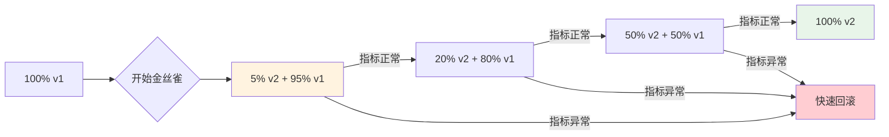
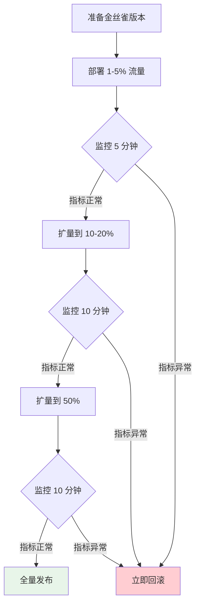

# 金丝雀发布（Canary）策略

1851 年，英国矿业工程师用金丝雀来检测煤矿中的有毒气体。金丝雀对危险气体比人类更敏感，一旦金丝雀倒下，矿工就知道必须撤离。

软件工程中的「金丝雀发布」借鉴了同样的思路：**在新版本正式发布给所有用户之前，先让一小部分用户「替」你测试**。如果这批「金丝雀」出了问题，可以快速回滚，对大多数用户没有影响。

这是一种**风险可控的渐进式发布策略**。当你无法确定新版本是否稳定时，让少数用户先「试毒」。

## 金丝雀发布的核心思想

### 与传统发布的对比

| 发布方式 | 风险 | 回滚成本 | 用户影响 |
| --- | --- | --- | --- |
| 直接全量发布 | 高 | 全部回滚 | 所有用户 |
| 金丝雀发布 | 低 | 部分回滚 | 少量用户 |
| 蓝绿部署 | 中 | 快（但资源翻倍） | 无（需切换） |

### 金丝雀发布流程



## 实现方式

### Kubernetes 原生实现

```yaml title="canary-deployment.yaml"
apiVersion: argoproj.io/v1alpha1
kind: Rollout
metadata:
  name: myapp
spec:
  replicas: 10
  strategy:
    canary:
      # 初始金丝雀权重
      canaryMetadata:
        labels:
          role: canary
      # 稳定版本元数据
      stableMetadata:
        labels:
          role: stable
      # 流量分析
      trafficRouting:
        nginx:
          stableIngress: myapp-stable
          additionalIngressAnnotations:
            canary-by-header: X-Canary
      # 流量权重
      trafficSplit:
        - canary: 5
          stable: 95
      # 步骤式递增
      steps:
        - setWeight: 5
        - pause: {duration: 10m}
        - setWeight: 20
        - pause: {duration: 10m}
        - setWeight: 50
        - pause: {duration: 10m}
        - setWeight: 80
        - pause: {duration: 10m}
      # 分析配置
      analysis:
        templates:
          - templateName: success-rate
        startingStep: 1
        args:
          - name: service-name
            value: myapp-canary
```

### Argo Rollout 分析模板

```yaml title="analysis-template.yaml"
apiVersion: argoproj.io/v1alpha1
kind: AnalysisTemplate
metadata:
  name: success-rate
spec:
  args:
    - name: service-name
  metrics:
    - name: success-rate
      interval: 1m
      successCondition: result[0] >= 0.95
      failureLimit: 3
      provider:
        prometheus:
          address: http://prometheus:9090
          query: |
            sum(rate(http_requests_total{
              job="{{args.service-name}}",
              status!~"5.."
            }[5m]))
            /
            sum(rate(http_requests_total{
              job="{{args.service-name}}"
            }[5m]))

    - name: latency
      interval: 1m
      successCondition: result[0] <= 500
      failureLimit: 3
      provider:
        prometheus:
          address: http://prometheus:9090
          query: |
            histogram_quantile(0.99,
              sum(rate(http_request_duration_ms_bucket{
                job="{{args.service-name}}"
              }[5m])) by (le)
            )
```

### Nginx Ingress 金丝雀

```yaml title="nginx-canary.yaml"
apiVersion: networking.k8s.io/v1
kind: Ingress
metadata:
  name: myapp-canary
  annotations:
    # 金丝雀权重
    nginx.ingress.kubernetes.io/canary: "true"
    nginx.ingress.kubernetes.io/canary-weight: "10"
    # 或使用 Header 路由
    # nginx.ingress.kubernetes.io/canary-by-header: "X-Canary"
    # nginx.ingress.kubernetes.io/canary-by-header-value: "always"
spec:
  rules:
    - host: myapp.example.com
      http:
        paths:
          - path: /
            pathType: Prefix
            backend:
              service:
                name: myapp-canary
                port:
                  number: 80
```

### Istio 虚拟服务

```yaml title="istio-canary.yaml"
apiVersion: networking.istio.io/v1beta1
kind: VirtualService
metadata:
  name: myapp
spec:
  hosts:
    - myapp
  http:
    - route:
        - destination:
            host: myapp-stable
            subset: v1
          weight: 90
        - destination:
            host: myapp-canary
            subset: v2
          weight: 10
---
apiVersion: networking.istio.io/v1beta1
kind: DestinationRule
metadata:
  name: myapp
spec:
  host: myapp
  subsets:
    - name: v1
      labels:
        version: v1
    - name: v2
      labels:
        version: v2
```

## 流量管理策略

### 基于权重的流量分配

```yaml title="weight-based.yaml"
# 10% 流量到新版本
spec:
  canary:
    trafficRouting:
      smi:
        trafficSplitName: myapp-split
    steps:
      - setWeight: 10
      - pause: {duration: 5m}
      - setWeight: 30
      - pause: {duration: 10m}
      - setWeight: 50
      - pause: {duration: 10m}
```

### 基于 Header 的路由

```yaml title="header-based.yaml"
# 根据请求 Header 路由到不同版本
spec:
  canary:
    trafficRouting:
      nginx:
        annotations:
          # 带 X-Canary: always Header 的请求路由到金丝雀
          nginx.ingress.kubernetes.io/canary-by-header: X-Canary
          nginx.ingress.kubernetes.io/canary-by-header-value: "always"
```

### 基于 Cookie 的路由

```yaml title="cookie-based.yaml"
# 根据 Cookie 路由（用户粘性）
spec:
  canary:
    trafficRouting:
      nginx:
        annotations:
          # 用户第一次访问后，Cookie 决定后续路由
          nginx.ingress.kubernetes.io/canary-by-cookie: canary-user
```

## 指标监控

### 关键指标

| 指标类型 | 指标名 | 告警阈值 |
| --- | --- | --- |
| **成功率** | HTTP 5xx 比例 | `< 99%` |
| **延迟** | P99 响应时间 | `> 500ms` |
| **错误率** | 业务错误率 | `> 1%` |
| **可观测性** | 日志错误数 | `> 10/min` |

### Prometheus 查询

```text title="canary-metrics.promql"
# 金丝雀服务成功率
sum(rate(http_requests_total{
  namespace="myapp",
  service="myapp-canary",
  status!~"5.."
}[5m]))
/
sum(rate(http_requests_total{
  namespace="myapp",
  service="myapp-canary"
}[5m]))

# 金丝雀服务延迟 P99
histogram_quantile(0.99,
  sum(rate(http_request_duration_seconds_bucket{
    namespace="myapp",
    service="myapp-canary"
  }[5m])) by (le)
)

# 稳定版 vs 金丝雀对比
(
  sum(rate(http_requests_total{service="myapp-canary"}[5m])) /
  sum(rate(http_requests_total{service="myapp-stable"}[5m]))
) > 0.8
```

## 自动化金丝雀分析

### Argo Rollout 自动分析

```yaml title="auto-analysis.yaml"
apiVersion: argoproj.io/v1alpha1
kind: Rollout
metadata:
  name: myapp
spec:
  strategy:
    canary:
      analysis:
        templates:
          - templateName: success-rate
        startingStep: 1
        args:
          - name: service-name
            value: myapp-canary
      # 失败时自动回滚
      analysisRunFrequency: 1m
      maxFailures: 2
```

### 自定义分析钩子

```yaml title="custom-analysis.yaml"
apiVersion: argoproj.io/v1alpha1
kind: AnalysisTemplate
metadata:
  name: business-metrics
spec:
  metrics:
    - name: business-metric
      interval: 30s
      count: 10
      successCondition: result >= 0.95
      failureLimit: 2
      provider:
        job:
          spec:
            backoffLimit: 3
            ttlSecondsAfterFinished: 300
            template:
              spec:
                restartPolicy: Never
                containers:
                  - name: analyzer
                    image: myorg/analyzer:latest
                    env:
                      - name: METRICS_ENDPOINT
                        value: http://metrics-api/metrics
                    command:
                      - /bin/sh
                      - -c
                      - |
                        curl $METRICS_ENDPOINT | jq '.conversion_rate'
```

## 金丝雀发布最佳实践

### 发布流程



### 注意事项

:::warning
**金丝雀发布不是万能的**：

1. **用户分配要有代表性**：确保金丝雀用户群体能够反映整体用户特征
2. **指标要全面**：不仅关注技术指标，还要关注业务指标
3. **回滚要快**：发现问题后，要在秒级完成回滚
4. **避免流量抖动**：用户粘性可以减少流量波动的影响
:::

## 常见问题

| 问题 | 原因 | 解决方案 |
| --- | --- | --- |
| 金丝雀流量波动大 | 负载均衡配置问题 | 使用 sticky session |
| 分析误判 | 阈值设置不合理 | 调优分析阈值 |
| 回滚不彻底 | 多组件版本不一致 | 使用版本标记 |
| 指标采集延迟 | 监控系统问题 | 使用实时指标 |

## 权衡矩阵

| 场景 | 推荐 | 原因 |
| --- | --- | --- |
| 高风险变更 | 金丝雀 | 降低影响范围 |
| 低风险变更 | 滚动更新 | 简单快速 |
| 需要快速回滚 | 金丝雀 | 流量切换即可 |
| 资源受限环境 | 滚动更新 | 无需双倍资源 |
| A/B 测试需求 | 金丝雀 + Header | 精确流量控制 |

## 延伸思考

金丝雀发布的核心价值不是「让发布变得安全」，而是**让风险可控**。即使新版本有问题，受影响的用户也只是一小部分。

但金丝雀发布也有其局限性：

1. **它不能消除风险**，只能限制风险的影响范围
2. **它需要完善的监控**，否则你无法判断金丝雀是否健康
3. **它增加了系统复杂性**，需要流量管理、健康检查等配套

**真正的安全发布**，需要的不仅是工具，还需要：

- 完善的测试覆盖
- 实时的监控告警
- 快速的回滚机制
- 清晰的发布流程

当这些都就位后，金丝雀发布才能发挥最大价值。