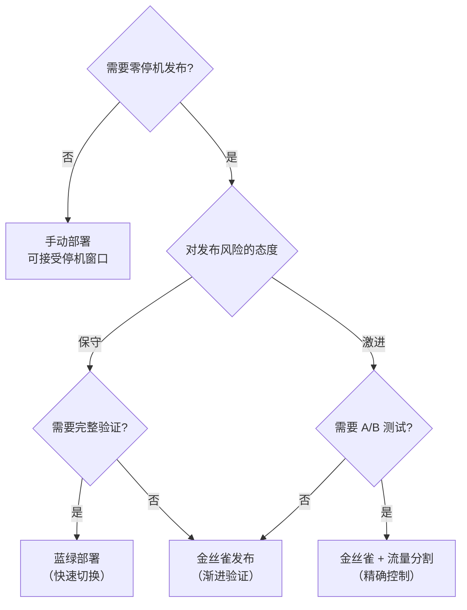
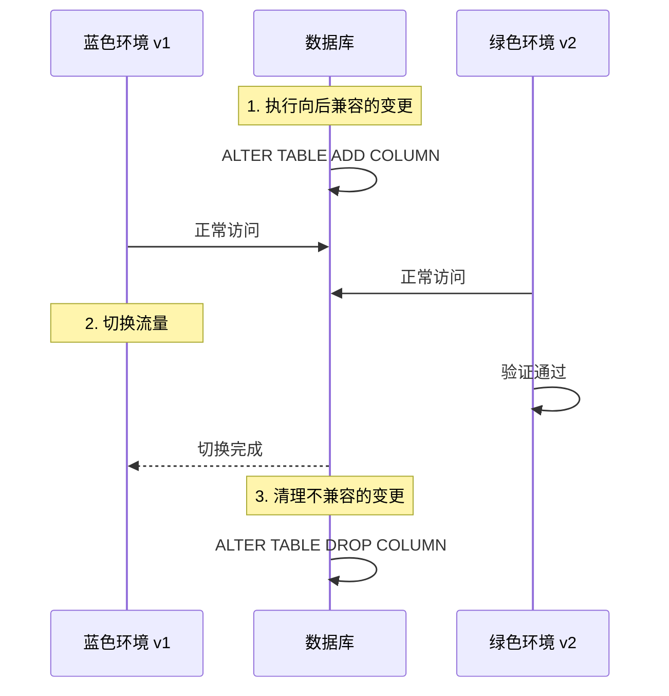

# 发布策略选型矩阵

没有银弹，只有权衡。

每种发布策略都有其适用场景和局限性。选择哪种策略，取决于你的**业务需求、技术架构、团队能力**。

本文通过系统的分析和决策矩阵，帮助你在不同场景下做出正确的选择。

## 策略对比总览

| 维度 | 滚动更新 | 金丝雀 | 蓝绿 |
| --- | --- | --- | --- |
| **回滚时间** | 分钟级 | 秒级 | 秒级 |
| **资源成本** | `1x` | `1.1x ~ 1.5x` | `2x` |
| **用户影响** | 部分（新旧共存） | 可控（精确比例） | 无（切换时） |
| **风险控制** | 低 | 高 | 高 |
| **配置复杂度** | 低 | 中 | 中 |
| **适用发布频率** | 高 | 中 | 低 |
| **支持 A/B 测试** | 否 | 是 | 是 |

## 决策树



## 场景化选型

### 场景一：微服务常规发布

**背景**：你有 50 个微服务，每天部署 10-20 次。

**推荐策略**：滚动更新

**原因**：

- 资源成本最低
- 与 Kubernetes 原生集成
- 适合高频发布
- 团队已熟悉

**配置示例**：

```yaml title="rolling-update.yaml"
spec:
  replicas: 5
  strategy:
    type: RollingUpdate
    rollingUpdate:
      maxSurge: 1
      maxUnavailable: 0
```

### 场景二：高风险架构变更

**背景**：需要重构核心服务，可能影响上游调用方。

**推荐策略**：蓝绿部署

**原因**：

- 回滚速度最快
- 可以进行完整验证
- 不影响当前服务
- 切换时用户无感知

**配置示例**：

```yaml title="blue-green.yaml"
spec:
  strategy:
    blueGreen:
      activeService: myapp-active
      previewService: myapp-preview
      autoPromotionEnabled: false
```

### 场景三：新产品功能验证

**背景**：新功能不确定用户接受度，需要数据驱动决策。

**推荐策略**：金丝雀 + A/B 测试

**原因**：

- 可以精确控制流量比例
- 支持用户分群
- 数据收集方便
- 风险可控

**配置示例**：

```yaml title="canary-ab.yaml"
spec:
  strategy:
    canary:
      trafficRouting:
        nginx:
          additionalIngressAnnotations:
            canary-weight: "10"
      steps:
        - setWeight: 5
        - pause: {duration: 24h}
        - analysis:
            templates: [success-rate]
        - setWeight: 20
```

### 场景四：数据库 schema 变更

**背景**：需要变更数据库结构，必须保证兼容性。

**推荐策略**：蓝绿 + 数据库迁移策略

**原因**：

- 可以先在绿色环境测试迁移
- 切换失败可以立即回滚
- 不影响蓝色环境的旧版本

**流程**：



### 场景五：移动端渐进式发布

**背景**：App 新版本需要应用商店审核，不能强制用户升级。

**推荐策略**：Feature Toggle

**原因**：

- 后端可以控制功能开关
- 用户无需更新 App
- 灰度发布灵活
- 随时可回滚

**配置示例**：

```yaml title="feature-toggle.yaml"
apiVersion: v1
kind: ConfigMap
metadata:
  name: feature-flags
data:
  features.yaml: |
    new_checkout_flow:
      enabled: true
      rollout_percentage: 20
    ai_recommendation:
      enabled: true
      rollout_percentage: 100
```

### 场景六：全球化部署

**背景**：服务部署在多个地域，需要按地域渐进发布。

**推荐策略**：金丝雀 + 地域权重

**原因**：

- 可以先在小地域验证
- 问题影响范围可控
- 便于监控各地域指标
- 符合「先近后远」原则

**配置示例**：

```yaml title="geo-canary.yaml"
spec:
  strategy:
    canary:
      canaryMetadata:
        labels:
          region: cn
      steps:
        - weight: 5
        - pause: {duration: 48h}
        - analysis:
            templates: [cn-metrics]
```

## 风险评估矩阵

| 风险类型 | 滚动更新 | 金丝雀 | 蓝绿 |
| --- | --- | --- | --- |
| **功能回归** | 低 | 低 | 低 |
| **性能下降** | 中 | 低 | 低 |
| **流量丢失** | 低 | 低 | 低 |
| **版本不一致** | 高 | 低 | 无 |
| **回滚时间** | 中 | 低 | 低 |
| **资源耗尽** | 低 | 中 | 高 |

## 团队能力评估

| 能力 | 滚动更新 | 金丝雀 | 蓝绿 |
| --- | --- | --- | --- |
| **监控告警** | 基础 | 完善 | 完善 |
| **自动化程度** | 高 | 高 | 中 |
| **故障排查能力** | 中 | 高 | 高 |
| **发布流程熟悉度** | 高 | 中 | 低 |
| **工具链成熟度** | 高 | 中 | 中 |

:::info
**选型建议**：如果团队监控告警能力不足，不要贸然选择金丝雀或蓝绿。没有完善的监控，发布后出问题也不知道。
:::

## 成本效益分析

### 资源成本

| 策略 | 额外资源 | 月度成本估算 |
| --- | --- | --- |
| 滚动更新 | `0` | `0` |
| 金丝雀 | `1x10% ~ 50%` | `10% ~ 50% 额外资源` |
| 蓝绿 | `1x` | `100% 额外资源` |

### 风险成本

| 策略 | 单次发布风险 | 年度风险累积 |
| --- | --- | --- |
| 滚动更新 | 中 | 高（高频发布） |
| 金丝雀 | 低 | 低 |
| 蓝绿 | 低 | 低 |

### ROI 计算

```
ROI = (避免的故障成本 + 提升的发布频率 × 单次发布价值) / (额外资源成本 + 维护成本)
```

**结论**：

- 发布频率高的场景，金丝雀 ROI 更高
- 资源受限的场景，滚动更新 ROI 更高
- 高风险场景，蓝绿 ROI 更高

## 渐进式迁移路径

### 从滚动更新到金丝雀


**步骤**：

1. 确保有完善的健康检查（readinessProbe）
2. 添加 Prometheus 监控和告警
3. 配置 Argo Rollout 或类似工具
4. 从小比例开始（金丝雀 1%）
5. 逐步增加比例

### 从金丝雀到蓝绿

**适用场景**：某些服务特别关键，需要更快速的切换能力。

**实现方式**：

- 保持金丝雀配置
- 添加蓝绿切换的 Service
- 在金丝雀验证通过后，使用蓝绿切换

## 工具推荐

| 场景 | 推荐工具 |
| --- | --- |
| Kubernetes 滚动更新 | 原生 Deployment |
| 高级金丝雀 | Argo Rollout |
| 蓝绿部署 | Argo CD + Service Switch |
| Feature Toggle | LaunchDarkly, Split.io |
| A/B 测试 | Optimizely, Mixpanel |
| 服务网格 | Istio, Linkerd |

## 总结

### 快速选择指南

| 如果... | 选择... |
| --- | --- |
| 资源受限，发布频繁 | 滚动更新 |
| 高风险变更，需要快速回滚 | 蓝绿部署 |
| 需要验证用户接受度 | 金丝雀 |
| 需要数据驱动决策 | 金丝雀 + A/B 测试 |
| 需要多地域渐进发布 | 金丝雀 + 地域权重 |
| 数据库有 schema 变更 | 蓝绿 + 迁移策略 |

### 最佳实践

1. **从简单开始**：先用滚动更新，逐步引入高级策略
2. **完善监控**：没有监控，任何策略都是盲目的
3. **自动化一切**：手动操作是错误的来源
4. **文档化流程**：让团队知道何时用什么策略
5. **持续优化**：根据实际数据调整策略配置

**记住**：策略只是工具，真正的目标是**安全、快速、可靠地发布软件**。