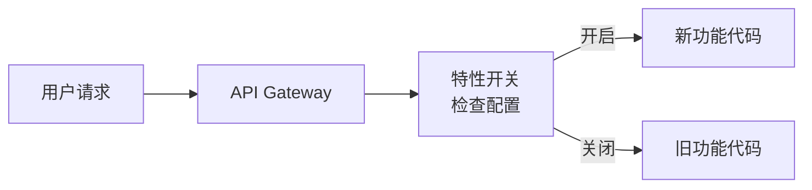
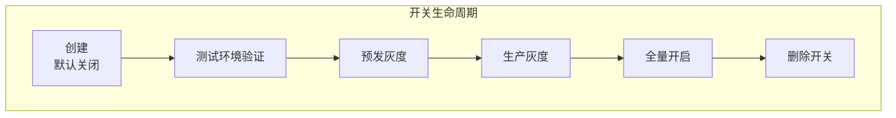

# 特性开关

2010 年，Facebook 的工程师在一篇博客中首次公开了他们称之为「Gatekeeper」的内部系统。这个系统允许他们在运行时动态控制每个功能的开关，而不需要重新部署代码。

十年后，特性开关（Feature Toggle）已经成为现代软件工程的核心实践。Netflix、Flickr、Disqus 等公司都在大规模使用它。

理解特性开关，不仅是学习一个技术实现，更是理解**持续交付**和**解耦部署与发布**这两个核心理念。

## 核心概念

特性开关（Feature Toggle）是一种在运行时控制功能行为的机制。通过开关状态，系统可以在不重新部署的情况下启用或禁用特定功能。



### 特性开关 vs 其他策略

|| 机制 | 说明 | 适用场景 |
|| --- | --- | --- |
| **特性开关** | 运行时控制 | 功能灰度、安全开关 |
| **条件编译** | 编译期控制 | 平台适配、废弃代码清理 |
| **路由分发** | 流量控制 | A/B 测试、金丝雀 |
| **配置中心** | 应用配置 | 功能参数调整 |

## 开关类型

### Release Toggles

控制功能是否对外发布：

```java title="Release Toggle 示例"]
public class CheckoutService {

    private final FeatureToggle toggle;

    public void checkout(Cart cart) {
        if (toggle.isEnabled("new-checkout-flow")) {
            // 新结账流程
            return newCheckout(cart);
        } else {
            // 旧结账流程
            return legacyCheckout(cart);
        }
    }
}
```

### Experiment Toggles

用于 A/B 测试：

```java title="Experiment Toggle 示例"]
public class RecommendationService {

    private final ExperimentEngine engine;

    public List<Product> recommend(User user, int limit) {
        // 获取用户所属的实验组
        Variant variant = engine.getVariant(user.getId(), "rec-algo-v2");

        if (variant.equals(Variant.TREATMENT)) {
            // 推荐算法 v2
            return mlRecommend(user, limit);
        } else {
            // 推荐算法 v1
            return ruleBasedRecommend(user, limit);
        }
    }
}
```

### Ops Toggles

运维控制开关：

```java title="Ops Toggle 示例"]
public class PaymentService {

    private final FeatureToggle toggle;

    public PaymentResult pay(Order order) {
        // 运维开关：是否启用新支付通道
        if (!toggle.isEnabled("payment-v2-channel")) {
            // 使用旧支付通道
            return payWithLegacy(order);
        }

        // 新支付通道
        return payWithV2(order);
    }
}
```

### Permission Toggles

权限控制开关：

```java title="Permission Toggle 示例"]
public class AdminController {

    private final FeatureToggle toggle;

    @GetMapping("/admin/dashboard")
    public Response dashboard() {
        // 权限开关：是否对所有用户开放管理后台
        if (!toggle.isEnabled("admin-access-all")) {
            // 仅管理员可见
            requireRole(Role.ADMIN);
        }

        return buildDashboard();
    }
}
```

## 技术实现

### 本地配置

```yaml title="本地配置文件"]
feature:
  toggles:
    new-checkout-flow: false
    ml-recommendation: true
    payment-v2-channel: false
    admin-access-all: false
```

```java title="本地开关实现"]
@Configuration
public class LocalToggleConfig {

    @Bean
    public FeatureToggle localToggle() {
        Map<String, Boolean> toggles = new HashMap<>();
        toggles.put("new-checkout-flow", false);
        toggles.put("ml-recommendation", true);
        return new InMemoryFeatureToggle(toggles);
    }
}
```

### 远程配置

```java title="远程开关实现"]
@Component
public class RemoteToggleConfig {

    private final ConfigServerClient configServer;

    public boolean isEnabled(String toggleName) {
        // 从配置中心获取开关状态
        String value = configServer.get("feature.toggles." + toggleName);
        return Boolean.parseBoolean(value);
    }
}
```

### 使用库

#### Unleash

```yaml title="Unleash 配置"]
# docker-compose.yml
version: '3'
services:
  unleash:
    image: unleashorg/unleash:latest
    ports:
      - "4242:4242"
    environment:
      DATABASE_URL: postgres://unleash:unleash@db:5432/unleash
    depends_on:
      - db
```

```java title="Unleash Java SDK"]
import no.finn.unleash.DefaultUnleash;
import no.finn.unleash.Unleash;

public class MyApp {

    private static final Unleash unleash = new DefaultUnleash(
        new UnleashConfig.Builder()
            .appName("my-app")
            .instanceId("production-1")
            .unleashAPI("http://unleash:4242/api/")
            .apiKey("API_TOKEN")
            .build()
    );

    public void doSomething() {
        if (unleash.isEnabled("new-feature")) {
            // 新功能
        } else {
            // 旧功能
        }
    }
}
```

#### LaunchDarkly

```java title="LaunchDarkly SDK"]
import com.launchdarkly.sdk.*;
import com.launchdarkly.sdk.server.*;

public class MyApp {

    private static final LDClient client = new LDClient("SDK_KEY");

    public void doSomething() {
        LDUser user = new LDUser.Builder("user-id")
            .email("user@example.com")
            .build();

        boolean showFeature = client.boolVariation(
            "new-feature", user, false);

        if (showFeature) {
            // 新功能
        }
    }
}
```

## 开关管理

### 开关设计原则

| 原则 | 说明 |
| --- | --- |
| **短期开关** | 发布后尽快移除，避免技术债务 |
| **命名规范** | 清晰表达开关目的 |
| **默认值安全** | 默认值应为关闭状态 |
| **开关分组** | 按业务域分组管理 |

### 命名规范

```bash title="开关命名规范"
# 格式：<feature>_<action>

# Release Toggles
new_checkout_flow_enabled
recommendation_v2_enabled
payment_card_binding_enabled

# Experiment Toggles
experiment_rec_algo_v2
experiment_pricing_model

# Ops Toggles
ops_feature_logging
ops_circuit_breaker
```

### 生命周期管理



## 灰度策略

### 按用户 ID 灰度

```java title="用户 ID 灰度"]
public class PercentageToggle {

    public boolean isEnabled(String toggleName, String userId) {
        // 基于用户 ID 哈希计算灰度比例
        int hash = Math.abs(userId.hashCode()) % 100;
        int threshold = getThreshold(toggleName);  // 从配置获取
        return hash < threshold;
    }
}
```

### 按用户属性灰度

```java title="属性灰度"]
public class AttributeToggle {

    public boolean isEnabled(String toggleName, User user) {
        ToggleConfig config = getConfig(toggleName);

        // 管理员强制开启
        if (user.isAdmin() && config.isAdminOverrideEnabled()) {
            return true;
        }

        // 按用户类型灰度
        if (config.getUserTypes().contains(user.getType())) {
            return true;
        }

        // 按地区灰度
        if (config.getRegions().contains(user.getRegion())) {
            return true;
        }

        return false;
    }
}
```

### 按白名单灰度

```java title="白名单灰度"]
public class WhitelistToggle {

    private final Set<String> whitelist;

    public boolean isEnabled(String toggleName, User user) {
        ToggleConfig config = getConfig(toggleName);

        // 检查白名单
        if (config.getWhitelist().contains(user.getId())) {
            return true;
        }

        // 按百分比灰度
        return isPercentageEnabled(toggleName, user);
    }
}
```

## 最佳实践

### 代码结构

```java title="开关使用模式"]
public class FeatureToggleService {

    private final FeatureToggle toggle;

    // 推荐：使用服务方法封装
    public void checkout(Cart cart) {
        // 清晰的开关语义
        if (toggle.isNewCheckoutEnabled()) {
            return newCheckout(cart);
        }
        return legacyCheckout(cart);
    }

    // 不推荐：直接在业务逻辑中硬编码开关名
    public void checkout(Cart cart) {
        if (toggle.isEnabled("new_checkout_flow")) {  // 硬编码
            return newCheckout(cart);
        }
        return legacyCheckout(cart);
    }
}
```

### 开关默认值

```java title="安全的默认值"]
public class SafeToggle {

    // 推荐：默认关闭（fail-safe）
    public boolean isEnabled(String toggleName) {
        // 未知开关默认关闭，确保安全
        Boolean value = cache.get(toggleName);
        return value != null ? value : false;
    }

    // 不推荐：默认开启
    public boolean isEnabledUnsafe(String toggleName) {
        Boolean value = cache.get(toggleName);
        return value != null ? value : true;  // 默认开启，可能有风险
    }
}
```

### 开关监控

```java title="开关监控"]
public class ToggleMetrics {

    private final MeterRegistry registry;

    public boolean isEnabled(String toggleName) {
        boolean enabled = delegate.isEnabled(toggleName);

        // 记录开关状态
        registry.counter("feature_toggle.evaluation",
            "toggle", toggleName,
            "result", enabled ? "enabled" : "disabled"
        ).increment();

        return enabled;
    }
}
```

### 开关告警

```yaml title="告警规则"]
groups:
  - name: feature-toggle-alerts
    rules:
      - alert: ToggleConfigMismatch
        expr: |
          feature_toggle_config_hash != on(feature_toggle_config_hash)
        for: 5m
        labels:
          severity: warning
        annotations:
          summary: "开关配置不一致"

      - alert: UnknownToggleAccessed
        expr: |
          increase(feature_toggle_unknown_total[5m]) > 10
        labels:
          severity: warning
```

## 反模式警示

### 反模式一：永久开关

开关创建后永远不删除，变成技术债务。

**正确做法**：

```java title="开关删除计划"]
// 在创建开关时添加 TODO 注释
// TODO[2024-06-01]: 新功能验证完成后删除此开关
// 删除步骤：
// 1. 确保开关开启后功能稳定运行 2 周
// 2. 合并新功能代码，移除开关逻辑
// 3. 部署后确认无误
// 4. 删除开关配置
if (toggle.isEnabled("new_checkout_flow")) {
    return newCheckout(cart);
}
return legacyCheckout(cart);
```

### 反模式二：嵌套开关

多个开关嵌套，难以理解和维护。

**错误示例**：

```java title="嵌套开关"]
if (toggle.isEnabled("feature_a")) {
    if (toggle.isEnabled("feature_b")) {
        if (toggle.isEnabled("feature_c")) {
            // 到底执行哪个逻辑？
        }
    }
}
```

**正确做法**：使用策略模式或配置对象。

```java title="策略模式"]
public CheckoutStrategy getStrategy() {
    if (toggle.isEnabled("new_checkout_flow")) {
        return new NewCheckoutStrategy();
    }
    return new LegacyCheckoutStrategy();
}
```

### 反模式三：复杂条件

开关条件过于复杂，难以预测行为。

**错误示例**：

```java title="复杂条件"]
if (toggle.isEnabled("feature")
    && (user.isPremium() || user.getRegion().equals("CN"))
    && !user.isTestAccount()
    && (cart.getTotal() > 100 || cart.getItemCount() > 5)) {
    // 谁能说清楚这个条件？
}
```

**正确做法**：使用开关分组或决策表。

```java title="决策表"]
public class ToggleDecision {

    public boolean shouldEnable(User user, Cart cart) {
        // 1. 外部开关
        if (!globalToggle.isEnabled("feature")) {
            return false;
        }

        // 2. 用户分层
        if (!user.isPremium() && !user.isBetaUser()) {
            return false;
        }

        // 3. 地区白名单
        if (regionConfig.isLimitedRegion(user.getRegion())) {
            return false;
        }

        return true;
    }
}
```

## 权衡矩阵

|| 场景 | 推荐方案 | 说明 |
|| --- | --- | --- |
| **持续交付** | Release Toggle | 解耦部署与发布 |
| **A/B 测试** | Experiment Toggle | 流量分组对比 |
| **紧急关闭** | Ops Toggle | 快速止血 |
| **权限控制** | Permission Toggle | 功能级权限 |
| **多租户** | 按租户灰度 | 隔离风险 |

## 延伸思考

特性开关的本质是**把「发布」变成一个可控制的过程**。在没有特性开关的时代，「发布」是一个原子操作——要么全上，要么不上。

有了特性开关，「发布」变成了一个渐进过程：

1. 部署代码（功能关闭）
2. 灰度开启（5% 用户）
3. 扩大范围（50% 用户）
4. 全量开启
5. 清理旧代码，删除开关

这个过程让「发布」从风险集中变成了风险分散。

但特性开关也是双刃剑：

- **开关越多，管理成本越高**
- **开关逻辑越复杂，系统可预测性越低**
- **永久开关是技术债务的温床**

建议每个团队都制定开关管理规范：开关命名规范、生命周期管理、定期清理机制。没有规范的团队，开关最终会变成噩梦。

当你决定使用特性开关时，请先问自己：这个开关会在多久之后被删除？如果答案不是「一个月内」，那你可能正在积累技术债务。
