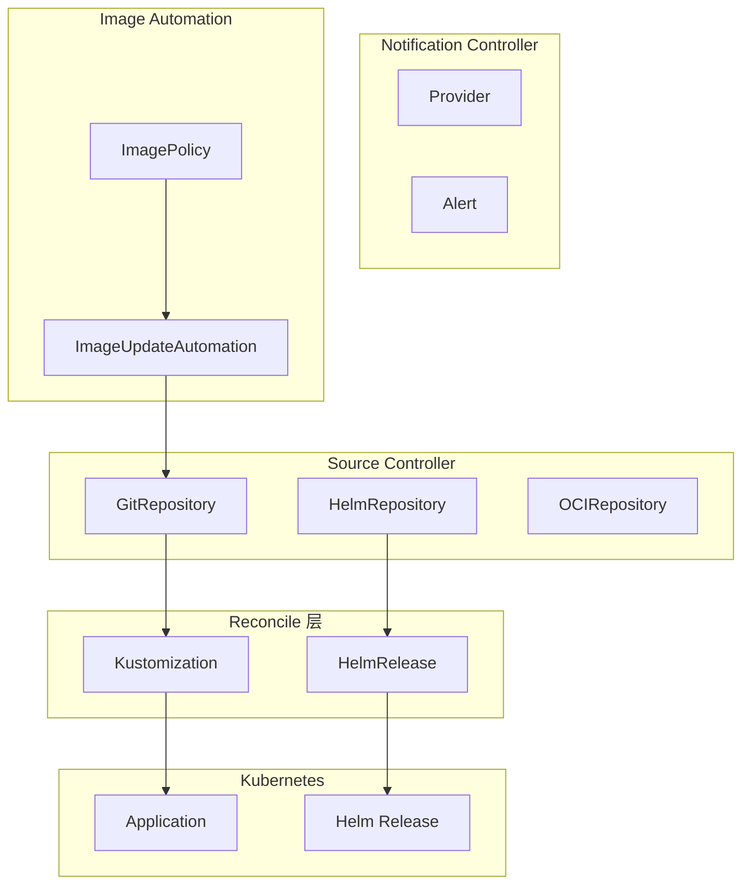

当 Kubernetes 成为容器编排的事实标准时，GitOps 理念也随之兴起。ArgoCD 之外，**Flux** 是另一个不容忽视的选择。

Flux 由 Weaveworks 于 2016 年创建，最初是一个简单的 Git 同步工具。经过多年演进，Flux v2 已经成为一个功能完整的 GitOps 平台，被广泛用于生产环境。**如果你需要在 Kubernetes 中实现声明式基础设施，Flux 是一个值得认真考虑的选择。**

## Flux v2 架构

### 核心组件

Flux v2 由多个控制器组成，每个控制器负责特定功能：

| 组件 | 职责 | API 资源 |
| --- | --- | --- |
| **Source Controller** | 管理外部状态源 | GitRepository, HelmRepository, Bucket |
| **Kustomize Controller** | Kustomize 部署 | Kustomization |
| **Helm Controller** | Helm 发布管理 | HelmRelease |
| **Notification Controller** | 事件通知 | Provider, Alert, Event |
| **Image Automation** | 镜像自动化 | ImagePolicy, ImageUpdateAutomation |



## GitOps Toolkit

Flux v2 基于 **GitOps Toolkit** 构建，允许你按需安装和扩展功能：

```bash title="Flux 组件列表"
# 核心组件（默认安装）
flux bootstrap git \
  --components=source-controller,kustomize-controller,helm-controller,notification-controller

# 完整组件
flux bootstrap git \
  --components=extra

# 按需安装
flux install \
  --source-controller \
  --kustomize-controller \
  --helm-controller \
  --notification-controller \
  --image-reflex-controller
```

## Source 资源

### GitRepository

```yaml title="GitRepository 配置.yaml"
apiVersion: source.toolkit.fluxcd.io/v1beta2
kind: GitRepository
metadata:
  name: app-repo
  namespace: flux-system
spec:
  interval: 1m              # 拉取间隔
  url: https://github.com/example/app.git
  ref:
    branch: main
    # 或使用 tag
    # tag: v1.0.0
    # 或 commit
    # commit: sha123abc

  secretRef:
    name: git-credentials   # Git 认证凭证

  # 忽略特定路径的变更
  ignore: |
    # 忽略文档变更
    - path: "docs/**"
      match: "**/*"

  # 验证
  verify:
    - provider: git
      ref:
        branch: main
      secretRef:
        name: gpg-keys
```

### HelmRepository

```yaml title="HelmRepository 配置.yaml"
apiVersion: source.toolkit.fluxcd.io/v1beta2
kind: HelmRepository
metadata:
  name: bitnami
  namespace: flux-system
spec:
  interval: 5m
  url: https://charts.bitnami.com/bitnami

  # 认证
  secretRef:
    name: helm-repo-credentials

  # 认证方式：basic, bearer, tls
  passCredentials: true
```

## Kustomize 部署

### Kustomization 资源

```yaml title="Kustomization 配置.yaml"
apiVersion: kustomize.toolkit.fluxcd.io/v1beta2
kind: Kustomization
metadata:
  name: production
  namespace: flux-system
spec:
  interval: 10m            # 同步间隔
  path: ./deploy/production
  prune: true               # 删除不在 Git 中的资源
  wait: true                # 等待资源就绪
  timeout: 5m               # 超时时间

  sourceRef:
    kind: GitRepository
    name: app-repo

  # 目标集群
  targetNamespace: production

  # 依赖声明
  dependsOn:
    - name: base-config

  # 钩子
  postBuild:
    substitute:
      imageTag: latest
    substituteFrom:
      - kind: ConfigMap
        name: var-substitution
```

### Kustomize Overlay

```yaml title="Kustomization with Overlay.yaml"
apiVersion: kustomize.toolkit.fluxcd.io/v1beta2
kind: Kustomization
metadata:
  name: frontend-production
  namespace: flux-system
spec:
  interval: 5m
  path: ./frontend/overlays/production
  sourceRef:
    kind: GitRepository
    name: multi-tenant-repo
  prune: true
  wait: true
```

```yaml title="kustomization.yaml"
apiVersion: kustomize.config.k8s.io/v1beta1
kind: Kustomization

resources:
  - ../../base

images:
  - name: frontend
    newName: registry.example.com/frontend
    newTag: v2.0.0

patches:
  - patch: |-
      - op: replace
        path: /spec/replicas
        value: 5
    target:
      kind: Deployment
      name: frontend
```

## Helm Release

### HelmRelease 资源

```yaml title="HelmRelease 配置.yaml"
apiVersion: helm.toolkit.fluxcd.io/v2beta1
kind: HelmRelease
metadata:
  name: prometheus
  namespace: monitoring
spec:
  interval: 5m
  chart:
    spec:
      chart: prometheus
      version: "15.x"
      sourceRef:
        kind: HelmRepository
        name: bitnami

  # 覆盖值
  values:
    server:
      replicas: 2
      persistence:
        enabled: true
        size: 10Gi

  # 升级策略
  upgrade:
    remediation:
      remediateLastFailure: true
    rollback:
      enable: true

  # 依赖
  dependsOn:
    - name: common-config

  # 钩子
  postRenderers:
    - kustomize:
        patches:
          - patch: |-
              apiVersion: v1
              kind: ConfigMap
              metadata:
                name: prometheus-extra
              data:
                config: "extra"
```

## 多租户隔离

### RBAC 配置

```yaml title="多租户 RBAC.yaml"
apiVersion: rbac.authorization.k8s.io/v1
kind: Role
metadata:
  name: tenant-developer
  namespace: team-a
rules:
  - apiGroups: ["source.toolkit.fluxcd.io"]
    resources: ["gitrepositories", "helmrepositories"]
    verbs: ["get", "list", "watch"]
  - apiGroups: ["kustomize.toolkit.fluxcd.io"]
    resources: ["kustomizations"]
    verbs: ["get", "list", "watch", "create", "update", "patch", "delete"]
  - apiGroups: ["helm.toolkit.fluxcd.io"]
    resources: ["helmreleases"]
    verbs: ["get", "list", "watch", "create", "update", "patch", "delete"]
---
apiVersion: rbac.authorization.k8s.io/v1
kind: RoleBinding
metadata:
  name: tenant-developer-binding
  namespace: team-a
subjects:
  - kind: User
    name: developer@example.com
roleRef:
  kind: Role
  name: tenant-developer
  apiGroup: rbac.authorization.k8s.io
```

### 租户隔离的 Kustomization

```yaml title="租户隔离 Kustomization.yaml"
apiVersion: kustomize.toolkit.fluxcd.io/v1beta2
kind: Kustomization
metadata:
  name: team-a-app
  namespace: flux-system
  labels:
    tenant: team-a
spec:
  # 限制在特定命名空间
  targetNamespace: team-a
  path: ./tenants/team-a/apps/webapp
  sourceRef:
    kind: GitRepository
    name: tenants-repo
```

## 镜像自动化

### ImagePolicy

```yaml title="ImagePolicy 配置.yaml"
apiVersion: image.toolkit.fluxcd.io/v1beta2
kind: ImagePolicy
metadata:
  name: backend-policy
  namespace: production
spec:
  imageRef: registry.example.com/backend
  policy:
    # 语义版本排序
    semver:
      range: "1.0.0-2.0.0"
    # 或最新版本
    # alphabetically:
    #   order: asc
```

### ImageUpdateAutomation

```yaml title="ImageUpdateAutomation 配置.yaml"
apiVersion: image.toolkit.fluxcd.io/v1beta2
kind: ImageUpdateAutomation
metadata:
  name: update-repo
  namespace: flux-system
spec:
  interval: 5m
  sourceRef:
    kind: GitRepository
    name: app-repo
  git:
    checkout:
      ref:
        branch: main
    push:
      branch: main
    commit:
      author:
        email: flux@example.com
        name: flux
      messageTemplate: |
        Automated image update

        Updates:
        {{ range $update := .Updated }}
        - {{ $update.Resource }}:{{ $update.Name }}
          {{ $update.Value }}
        {{ end }}
  update:
    path: ./deploy
    strategy: Setters
```

## 事件通知

### Provider 配置

```yaml title="通知 Provider.yaml"
apiVersion: notification.toolkit.fluxcd.io/v1beta2
kind: Provider
metadata:
  name: slack
  namespace: flux-system
spec:
  type: slack
  channel: flux-notifications
  secretRef:
    name: slack-webhook
```

### Alert 配置

```yaml title="Alert 配置.yaml"
apiVersion: notification.toolkit.fluxcd.io/v1beta2
kind: Alert
metadata:
  name: production-alert
  namespace: flux-system
spec:
  providerRef:
    name: slack
  eventSources:
    - kind: Kustomization
      name: production-*
    - kind: HelmRelease
      name: production-*
  suspend: false
```

## 与 ArgoCD 对比

| 维度 | Flux v2 | ArgoCD |
| --- | --- | --- |
| **安装方式** | kubectl/flux CLI | Operator/CLI |
| **配置模型** | 声明式（YAML） | 声明式（YAML） |
| **多集群支持** | Fleet + Cluster API | 原生 ApplicationSet |
| **Helm 集成** | Helm Controller | Helm support |
| **社区规模** | 活跃 | 活跃 |
| **CNCF 状态** | 毕业项目 | 孵化项目 |

## 常见问题与反模式

### 问题一：Source 认证失败

**错误**：Git 仓库无法拉取。

**正确做法**：创建 Secret 存储凭证，使用 `secretRef` 引用。

### 问题二：循环依赖

**错误**：Kustomization A 依赖 Kustomization B，B 又依赖 A。

**正确做法**：确保依赖关系是 DAG（非循环图）。

### 问题三：权限过大

**错误**：使用 cluster-admin 角色。

**正确做法**：使用最小权限原则，为每个租户配置专门的 RBAC。

## 延伸思考

Flux 和 ArgoCD 都是优秀的 GitOps 工具，选择哪一个取决于你的具体需求：

- **如果你需要细粒度的多租户支持**，Flux 的 RBAC 模型可能更适合
- **如果你需要一个完整的 Web UI**，ArgoCD 可能更直观
- **如果你已经在使用 Weave Cloud**，Flux 是自然选择

无论选择哪个工具，GitOps 的核心原则都是相同的：**让 Git 成为唯一的真相源，让自动化成为默认行为。**
