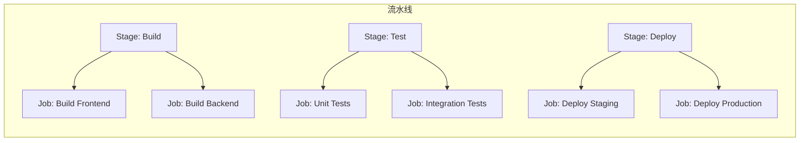

# GitLab CI/CD 深度解析

GitLab CI/CD 是 GitLab 内置的持续集成与持续部署系统，与 GitLab 深度集成，无需额外的 CI 服务器。

对于已经在使用 GitLab 的团队来说，GitLab CI/CD 是最自然的选择：你不需要维护另一套系统，不需要管理另一套凭证，所有的代码、Issue、流水线都在同一个平台。

但 GitLab CI/CD 的能力远不止「跑测试」这么简单。它提供了完整的 CI/CD 功能，包括流水线编排、矩阵构建、环境管理、部署策略、安全扫描等。

## GitLab CI/CD 核心概念

### 流水线（Pipeline）

流水线是 CI/CD 的顶层结构，包含多个 Stage，每个 Stage 包含多个 Job。



### .gitlab-ci.yml 结构

```yaml title=".gitlab-ci.yml"
# 定义流水线 stages
stages:
  - build
  - test
  - deploy

# 全局变量
variables:
  IMAGE_NAME: myregistry/myapp
  DOCKER_DRIVER: overlay2

# Stage 定义
build-app:
  stage: build
  image: maven:3.9-eclipse-temurin-17
  script:
    - mvn clean package -DskipTests
  artifacts:
    paths:
      - target/*.jar
    expire_in: 1 hour

test-unit:
  stage: test
  image: maven:3.9-eclipse-temurin-17
  script:
    - mvn test
  needs:
    - build-app

deploy-staging:
  stage: deploy
  image: bitnami/kubectl:latest
  script:
    - kubectl set image deployment/myapp myapp=$IMAGE_NAME:$CI_COMMIT_SHORT_SHA
  environment:
    name: staging
  only:
    - develop

deploy-production:
  stage: deploy
  image: bitnami/kubectl:latest
  script:
    - kubectl set image deployment/myapp myapp=$IMAGE_NAME:$CI_COMMIT_SHORT_SHA
  environment:
    name: production
  when: manual
  only:
    - main
```

## 流水线配置详解

### 基础配置

```yaml title="basic-pipeline.yml"
image: maven:3.9-eclipse-temurin-17

stages:
  - build
  - test
  - deploy

# 缓存配置
cache:
  key: ${CI_COMMIT_REF_SLUG}
  paths:
    - .m2/repository
    - node_modules

build:
  stage: build
  script:
    - mvn clean package

test:
  stage: test
  script:
    - mvn test
  coverage: '/TOTAL.*\s+(\d+%)$/'

deploy:
  stage: deploy
  script:
    - echo "Deploying..."
```

### 多平台矩阵构建

```yaml title="matrix-pipeline.yml"
matrix-build:
  stage: build
  parallel:
    matrix:
      - JDK_VERSION: [11, 17, 21]
        OS: [ubuntu, alpine]
  image: eclipse-temurin:${JDK_VERSION}-${OS}
  script:
    - mvn clean package
  rules:
    - if: $CI_MERGE_REQUEST_ID
    - if: $CI_COMMIT_BRANCH == 'main'
```

### 依赖流水线

```yaml title="needs-pipeline.yml"
stages:
  - build
  - test
  - deploy

build-java:
  stage: build
  script:
    - mvn clean package
  artifacts:
    paths:
      - target/app.jar
    expire_in: 1 day

test-unit:
  stage: test
  needs:
    - job: build-java
      artifacts: true
  script:
    - mvn test

test-integration:
  stage: test
  needs:
    - job: test-unit
  script:
    - mvn verify -DskipUnitTests

deploy:
  stage: deploy
  needs:
    - job: test-integration
  script:
    - echo "Deploying..."
```

## Runner 架构

### Runner 类型

| 类型 | 说明 | 适用场景 |
| --- | --- | --- |
| **Shared Runner** | 所有项目共享的 Runner | 公共构建任务 |
| **Group Runner** | 组内项目共享的 Runner | 团队内部构建 |
| **Specific Runner** | 绑定到特定项目的 Runner | 特殊需求构建 |
| **Instance Runner** | 实例级别的 Runner | 通用构建任务 |

### Runner 注册

```bash
# 注册 Runner
gitlab-runner register \
  --url https://gitlab.example.com \
  --registration-token $REGISTRATION_TOKEN \
  --description "production-runner" \
  --tag-list "docker,kubernetes" \
  --executor docker \
  --docker-image "docker:latest"

# Kubernetes Runner
gitlab-runner register \
  --url https://gitlab.example.com \
  --registration-token $REGISTRATION_TOKEN \
  --description "k8s-runner" \
  --tag-list "kubernetes" \
  --executor kubernetes \
  --kubernetes-image "ubuntu:22.04"
```

### Kubernetes Executor 配置

```yaml title="config.toml"
[[runners]]
  name = "k8s-runner"
  url = "https://gitlab.example.com"
  token = "<runner-token>"
  executor = "kubernetes"
  [runners.kubernetes]
    image = "ubuntu:22.04"
    privileged = false
    cpu_limit = "2"
    memory_limit = "4Gi"
    cpu_request = "1"
    memory_request = "2Gi"
    service_cpu_limit = "1"
    service_memory_limit = "1Gi"
    helper_cpu_limit = "500m"
    helper_memory_limit = "256Mi"
    namespace = "gitlab-ci"
    privileged = false
    [runners.kubernetes.pull_secrets]
      - name: docker-registry
```

## 高级特性

### Workflow 规则

```yaml title="workflow-pipeline.yml"
workflow:
  rules:
    - if: $CI_COMMIT_TAG
    - if: $CI_COMMIT_BRANCH == 'main'
    - if: $CI_MERGE_REQUEST_ID

stages:
  - build
  - deploy

build:
  stage: build
  script:
    - echo "Building..."

deploy:
  stage: deploy
  script:
    - echo "Deploying..."
```

### 环境与部署

```yaml title="deployment-pipeline.yml"
deploy-staging:
  stage: deploy
  environment:
    name: staging
    url: https://staging.myapp.example.com
    on_stop: stop-staging
  script:
    - kubectl apply -f k8s/staging
  only:
    - develop

deploy-production:
  stage: deploy
  environment:
    name: production
    url: https://myapp.example.com
    action: start
    deployment_strategy: continuous
  script:
    - kubectl apply -f k8s/production
  when: manual
  only:
    - main

stop-staging:
  stage: deploy
  environment:
    name: staging
    action: stop
  script:
    - kubectl delete -f k8s/staging
  when: manual
  only:
    - develop
```

### 安全扫描

```yaml title="security-pipeline.yml"
stages:
  - test
  - security

# 依赖扫描
dependency-scanning:
  stage: test
  image: docker:24-dind
  allow_failure: true
  script:
    - docker run --rm -v $(pwd):/project aquasec/trivy fs /project

# SAST（静态应用安全测试）
sast:
  stage: security
  script:
    - apk add --no-cache curl
    - curl --output /dev/null -sSf "https://gitlab.com/api/v4/security/sast"
  allow_failure: true

# DAST（动态应用安全测试）
dast:
  stage: security
  image: owasp/zap2docker-stable
  script:
    - zap-baseline.py -t https://staging.myapp.example.com
  allow_failure: true

# 容器扫描
container-scanning:
  stage: security
  image: docker:24-dind
  services:
    - docker:24-dind
  script:
    - docker run --rm -v $(pwd):/project aquasec/trivy image myapp:latest
```

## 部署策略

### 使用 CI/CD 部署到 Kubernetes

```yaml title="k8s-deployment.yml"
deploy-production:
  stage: deploy
  image: bitnami/kubectl:latest
  services:
    - docker:24-dind
  before_script:
    - kubectl config use-context production
  script:
    # 构建镜像
    - docker build -t $IMAGE_NAME:$CI_COMMIT_SHORT_SHA .
    - docker login -u $CI_REGISTRY_USER -p $CI_REGISTRY_PASSWORD $CI_REGISTRY
    - docker push $IMAGE_NAME:$CI_COMMIT_SHORT_SHA

    # 更新部署
    - kubectl set image deployment/myapp myapp=$IMAGE_NAME:$CI_COMMIT_SHORT_SHA
    - kubectl rollout status deployment/myapp

    # 回滚检查
    - kubectl rollout undo deployment/myapp --dry-run=server
  environment:
    name: production
    url: https://myapp.example.com
  only:
    - main
  when: manual

# 自动回滚
rollback:
  stage: deploy
  image: bitnami/kubectl:latest
  script:
    - kubectl rollout undo deployment/myapp
  environment:
    name: production
    action: rollback
  when: manual
```

### GitOps 风格部署

```yaml title="gitops-pipeline.yml"
# CI 完成后更新 GitOps 仓库
update-gitops:
  stage: deploy
  image: alpine/git:latest
  before_script:
    - git clone $GITOPS_REPO_URL
    - cd k8s-config
  script:
    # 更新镜像版本
    - |
      yq eval -i ".images.[0].newTag = \"$CI_COMMIT_SHORT_SHA\"" apps/myapp/production/kustomization.yaml
    # 提交并推送
    - git config user.email "ci@gitlab.com"
    - git config user.name "GitLab CI"
    - git add .
    - git commit -m "Update myapp to ${CI_COMMIT_SHORT_SHA}"
    - git push origin main
  only:
    - main
```

## 缓存策略

```yaml title="cache-pipeline.yml"
cache:
  key: ${CI_COMMIT_REF_SLUG}
  paths:
    - .m2/repository
    - node_modules/.cache
    - build/

maven-build:
  stage: build
  image: maven:3.9-eclipse-temurin-17
  cache:
    paths:
      - .m2/repository
    policy: pull-push
  script:
    - mvn clean package

npm-build:
  stage: build
  image: node:18
  cache:
    paths:
      - node_modules
    policy: pull-push
  script:
    - npm ci
    - npm run build
```

## 最佳实践

### 流水线分层

```yaml title="layered-pipeline.yml"
stages:
  - prepare
  - build
  - test
  - security
  - deploy

prepare:
  stage: prepare
  script:
    - echo "Preparing..."

# 构建阶段
build-backend:
  stage: build
  needs:
    - prepare
  script:
    - mvn package

build-frontend:
  stage: build
  needs:
    - prepare
  script:
    - npm run build

# 测试阶段（并行）
test-unit:
  stage: test
  needs:
    - build-backend
  script:
    - mvn test

test-integration:
  stage: test
  needs:
    - build-backend
  script:
    - mvn verify -DskipUnitTests

test-e2e:
  stage: test
  needs:
    - build-frontend
    - build-backend
  script:
    - npm run test:e2e
```

### 条件执行

```yaml title="conditional-pipeline.yml"
# 跳过某些 job
lint:
  stage: test
  script:
    - npm run lint
  rules:
    - if: $CI_MERGE_REQUEST_ID
    - if: $CI_COMMIT_BRANCH == 'main'

# 增量构建
build:
  stage: build
  script:
    - |
      if [ "$CI_COMMIT_BEFORE_SHA" != "0000000000000000000000000000000000000000" ]; then
        echo "Changed files: $(git diff --name-only $CI_COMMIT_BEFORE_SHA)"
      fi
    - mvn package
```

## 故障排查

### 常见问题

| 问题 | 原因 | 解决方案 |
| --- | --- | --- |
| Job 一直 pending | Runner 不可用 | 检查 Runner 状态 |
| 缓存失效 | 缓存 key 变更 | 检查缓存配置 |
| 部署失败 | 凭证过期 | 更新 CI/CD 变量 |
| 镜像拉取失败 | 网络问题 | 配置镜像加速器 |

### 调试技巧

```yaml title="debug-pipeline.yml"
debug:
  stage: test
  script:
    - echo "CI_COMMIT_SHA: $CI_COMMIT_SHA"
    - echo "CI_COMMIT_SHORT_SHA: $CI_COMMIT_SHORT_SHA"
    - echo "CI_COMMIT_REF_NAME: $CI_COMMIT_REF_NAME"
    - echo "CI_PIPELINE_URL: $CI_PIPELINE_URL"
    - env | grep CI_
  when: manual
```

## 与 ArgoCD 集成

```yaml title="argocd-integration.yml"
update-argocd:
  stage: deploy
  image: bitnami/argocd:latest
  script: |
    # 登录 ArgoCD
    argocd login argocd.example.com --username $ARGOCD_USER --password $ARGOCD_PASSWORD

    # 更新应用镜像
    argocd app set myapp --kustomize-image myregistry/myapp=$IMAGE_NAME:$CI_COMMIT_SHORT_SHA

    # 同步应用
    argocd app sync myapp --force
  only:
    - main
```

## 延伸思考

GitLab CI/CD 的强大之处在于它与 GitLab 的深度集成。当你的代码、Issue、MR 和流水线都在同一个平台时，信息流动更加顺畅，协作更加高效。

但这也意味着**锁定效应**：一旦你深度依赖 GitLab CI/CD，迁移成本会很高。在选择工具时，需要权衡「集成便利性」和「供应商锁定」。

对于中小团队来说，GitLab CI/CD 是很好的选择——它不需要额外的维护成本，与代码仓库紧密集成。对于大型组织，可能需要考虑更加中立的方案（如 Tekton），以避免供应商锁定。

无论选择哪个工具，核心原则不变：**让流水线可靠、可维护、可追溯**。