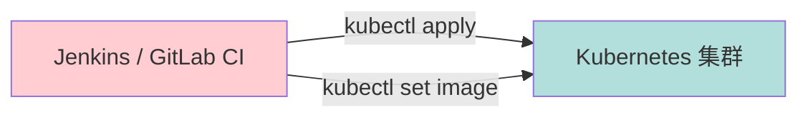
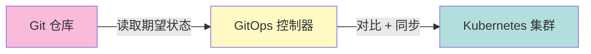
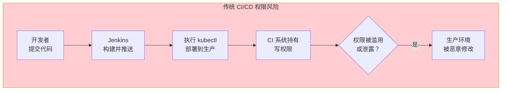
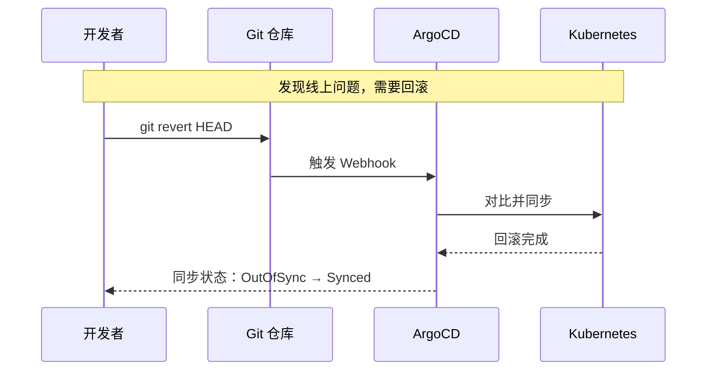
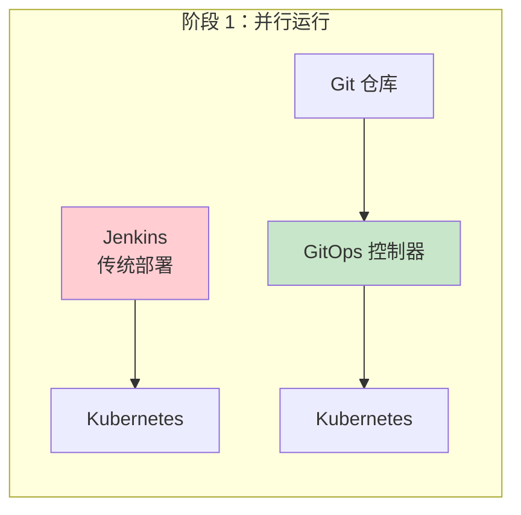
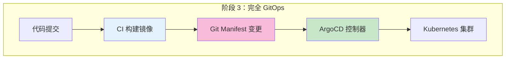

2019 年，Netflix 宣布他们的部署系统 Spinnaker 正式开源，一时间成为业界焦点。与此同时，GitOps 的概念正在 Kubernetes 社区蓬勃生长。两条路线的支持者各执一词：传统 CI/CD 团队说「我们已经有成熟的工具链」，GitOps 团队说「我们让部署变得可追溯、可回滚」。

五年过去了，两条路线都在演进，也在各自擅长的领域找到了定位。这篇文章不做简单的「谁更好」的判断，而是从多个维度深入对比，帮助你在具体场景下做出正确的选择。

## 部署方式对比

### 传统 CI/CD：推送模式

传统 CI/CD 是典型的**推送模式（Push-based）**：



Pipeline 是主动的推送方，它决定了「什么时候部署、部署什么版本」：

```groovy title="Jenkinsfile (传统 CI/CD)"
pipeline {
    agent any
    stages {
        stage('Build') {
            steps {
                sh 'docker build -t app:${BRANCH_NAME} .'
            }
        }
        stage('Test') {
            steps {
                sh 'docker run app:${BRANCH_NAME} test'
            }
        }
        stage('Deploy') {
            when { branch 'main' }
            steps {
                sh '''
                    docker push registry/app:${GIT_COMMIT}
                    kubectl set image deployment/app \
                        app=registry/app:${GIT_COMMIT}
                '''
            }
        }
    }
}
```

**特点**：

- CI 系统拥有集群的写入权限
- 部署逻辑完全在 Pipeline 里
- 环境配置可能分散在 Pipeline 参数、环境变量里

### GitOps：拉取模式

GitOps 是**拉取模式（Pull-based）**：



GitOps 控制器是被动的拉取方，它持续监控 Git 仓库，发现变更时自动同步到集群：

```yaml title="Application CRD (ArgoCD)"
apiVersion: argoproj.io/v1alpha1
kind: Application
metadata:
  name: payment-service
  namespace: argocd
spec:
  project: default
  source:
    repoURL: https://github.com/example/payment-service
    targetRevision: main
    path: k8s/overlays/prod
  destination:
    server: https://kubernetes.default.svc
    namespace: payment-prod
  syncPolicy:
    automated:
      selfHeal: true
      prune: true
```

**特点**：

- 控制器只需要集群的有限权限
- 部署逻辑在 Git 仓库里（声明式配置）
- 期望状态与实际状态的对比是持续的

### 两种模式的本质差异

| 维度 | 推送模式（传统 CI/CD） | 拉取模式（GitOps） |
| --- | --- | --- |
| **主动方** | CI 系统推送 | 控制器拉取 |
| **事实来源** | CI Pipeline 配置 | Git 仓库 |
| **同步时机** | Pipeline 执行时 | 持续监控 |
| **权限要求** | CI 系统需要集群写入权限 | 控制器权限最小化 |

:::info
两种模式的本质差异在于「谁有权限修改集群状态」。推送模式下，任何能触发 Pipeline 的人都可以影响生产；拉取模式下，只有通过 Git PR 合并的变更才能生效。
:::

## 权限模型对比

### 传统 CI/CD 的权限挑战

传统 CI/CD 面临一个经典问题：**CI 系统需要生产环境的写入权限，但这个权限一旦泄露，后果不堪设想**。



解决方案通常是 RBAC + 审批流程，但这些控制往往是「事后补救」而非「本质安全」。

### GitOps 的权限优势

GitOps 的权限模型天然更安全：

1. **代码审查作为审批**：所有配置变更必须通过 PR，需要至少一个人 Review
2. **控制器权限最小化**：控制器只需要管理特定应用的权限，不需要集群 admin
3. **变更可追溯**：每次变更都有 Git commit 对应，任何问题都能追溯到人

```yaml title="ArgoCD RBAC 配置"
apiVersion: v1
kind: ConfigMap
metadata:
  name: argocd-rbac-cm
  namespace: argocd
data:
  policy.csv: |
    # 应用开发者只能同步自己的应用
    p, role:developer, applications, sync, payment-service/*, allow
    p, role:developer, applications, get, *, allow

    # 运维可以同步所有应用
    p, role:ops, applications, sync, *, allow
    p, role:ops, applications, *, *, allow

    # 只读角色
    g, role:readonly, allow
    p, role:readonly, applications, get, *, allow
```

### 权限对比总结

| 维度 | 传统 CI/CD | GitOps |
| --- | --- | --- |
| **部署权限来源** | CI 系统账号 | Git 账号 + PR Review |
| **最小权限实现** | 需要额外配置 RBAC | 控制器天然受限 |
| **审批流程** | 手动审批（可跳过） | 代码审查（强制） |
| **权限泄露风险** | CI 系统被攻击 → 生产被控 | Git 仓库被攻击 → PR 可被发现 |

## 回滚方式对比

### 传统 CI/CD 的回滚

传统 CI/CD 的回滚需要：

1. 找到上一个版本的镜像 tag 或 commit
2. 手动修改 Pipeline 参数或执行回滚命令
3. 触发 Pipeline 重新部署

```bash
# 传统回滚：手动执行命令
kubectl rollout undo deployment/app

# 或者手动指定版本
kubectl set image deployment/app app=registry/app:v1.2.2

# 还得更新 Pipeline 配置，否则下次部署又会覆盖
```

**问题**：

- 回滚操作没有和代码变更关联
- 需要知道「当前版本是什么」才能回滚
- 回滚后再部署，可能又回到新版本

### GitOps 的回滚

GitOps 的回滚只需要 `git revert`：

```bash
# 回滚到上一个版本
git revert HEAD

# 或者回滚多个版本
git revert a1b2c3d..e5f6g7h

# 推送后，ArgoCD 自动检测并同步
git push origin main
```



**优势**：

- 回滚也是一种代码变更，有完整的 Git 历史
- Rollback 和向前升级用同样的方式
- 回滚操作有 Review，有记录

### 回滚对比总结

| 维度 | 传统 CI/CD | GitOps |
| --- | --- | --- |
| **回滚命令** | `kubectl rollout undo` | `git revert` |
| **回滚记录** | CI 系统日志 | Git 历史 |
| **回滚可追溯** | 需要关联 CI Run ID | Git commit 即可定位 |
| **回滚后再发布** | 可能回到新版本 | 同一条路径 |

## 审计追溯对比

### 传统 CI/CD 的审计困境

传统 CI/CD 的审计依赖 CI 系统的日志：

```
Jenkins Build #1234
Started by user zhangsan
[Pipeline] Started
[Build] docker build -t app:v1.2.3
[Deploy] kubectl set image deployment/app app:v1.2.3
Completed: SUCCESS
```

**问题**：

- CI 日志有保留期限，过期后无法查询
- 日志和代码变更没有强关联
- 如果 CI 系统迁移，所有历史可能丢失

### GitOps 的审计优势

GitOps 的审计基于 Git 的不可变特性：

```
commit a1b2c3d4e5f6
Author: zhangsan <zhangsan@example.com>
Date:   Thu Apr 9 10:30:00 2026

    chore: upgrade payment-service to v2.1.0

    - Update image tag from v2.0.9 to v2.1.0
    - Scale replicas from 3 to 5

    Reviewed-by: lisi <lisi@example.com>

diff --git a/k8s/prod/deployment.yaml
--- a/k8s/prod/deployment.yaml
+++ b/k8s/prod/deployment.yaml
@@ -15,7 +15,7 @@
     spec:
       containers:
         - name: app
-          image: registry/app:v2.0.9
+          image: registry/app:v2.1.0
@@ -22,3 +22,3 @@
     spec:
       replicas: 3
+      replicas: 5
```

**优势**：

- Git 历史永久保存（除非主动压缩）
- 变更内容、变更原因、变更人都有记录
- Review 记录也是审计的一部分

:::info
合规场景下，GitOps 的审计能力是核心竞争力。金融、医疗、政府等行业的审计要求，往往需要「谁在什么时间做了什么变更，为什么」，这些信息 Git 历史天然提供。
:::

## 适用场景对比

### 选择传统 CI/CD 的场景

| 场景 | 推荐方案 | 原因 |
| --- | --- | --- |
| **非 Kubernetes 环境** | Jenkins/GitLab CI | GitOps 需要 Kubernetes 运行时 |
| **复杂的前置/后置脚本** | Jenkins Pipeline | GitOps 的控制器能力有限 |
| **与发布审批流程深度集成** | Jenkins + 审批插件 | GitOps 的审批能力较弱 |
| **需要同时管理虚拟机和容器** | Jenkins | Kubernetes 原生工具不擅长 |
| **团队已有成熟 Jenkins 体系** | 渐进迁移 | 迁移成本大于收益时不要强迁 |

### 选择 GitOps 的场景

| 场景 | 推荐方案 | 原因 |
| --- | --- | --- |
| **纯 Kubernetes 环境** | ArgoCD / Flux | 原生集成，声明式管理 |
| **多集群管理** | ArgoCD ApplicationSet | 一个配置，多集群同步 |
| **合规审计要求** | ArgoCD / Flux | 完整的 Git 历史 + Review |
| **希望开发者自助部署** | ArgoCD UI | 开发者可以自己操作 |
| **云原生转型** | GitOps 优先 | 与云原生理念一致 |

### 场景对比矩阵

| 维度 | 传统 CI/CD | GitOps |
| --- | --- | --- |
| **Kubernetes 环境** | 需要 kubectl 配置 | 原生支持 |
| **部署频率** | 适合中高频发布 | 适合高频小步发布 |
| **多环境一致性** | 需要额外同步机制 | 天然一致（同一配置源） |
| **权限控制粒度** | RBAC 控制 | RBAC + Git PR |
| **回滚速度** | 分钟级 | 秒级（自动同步） |
| **学习曲线** | 较低（工具成熟） | 较高（理念新） |

## 迁移路径

从传统 CI/CD 迁移到 GitOps，不需要「大爆炸重构」。推荐渐进式迁移：

### 阶段一：并行运行

保持现有 CI Pipeline 不变，引入 GitOps 管理「期望状态」：



在这个阶段：

- 生产环境由 GitOps 管理
- CI Pipeline 可以部署到测试环境
- 观察 GitOps 的稳定性和团队接受度

### 阶段二：渐进迁移

把 CI Pipeline 的「部署」职责逐步转移到 GitOps：

```bash
# 原来的 Jenkins Pipeline
stage('Deploy') {
    sh '''
        kubectl set image deployment/app app=${IMAGE_TAG}
    '''
}

# 迁移后的 Jenkins Pipeline
stage('Update Manifest') {
    sh '''
        # 只更新 Git 仓库���不直接部署
        git commit -m "chore: update image to ${IMAGE_TAG}"
        git push
    '''
}
# ArgoCD 检测到变更后自动同步
```

### 阶段三：完全 GitOps

移除 CI Pipeline 中的部署逻辑，GitOps 控制器负责所有部署：



## 常见陷阱

### 陷阱一：GitOps 不等于「不用 CI」

有些团队迁移到 GitOps 后，忘记了 CI 的价值——构建、测试、安全扫描，这些依然需要 CI Pipeline。

**正确做法**：GitOps 管理部署，CI 负责构建和验证。

### 陷阱二：把 Git 仓库当成了「部署脚本」

如果你的 Git 仓库里只有 `kubectl apply` 命令，那不是 GitOps，只是「用 Git 触发部署」。

**正确做法**：使用声明式的 Kubernetes Manifests 或 Helm Chart。

### 陷阱三：GitOps 控制器权限过大

为了「省事」，给 GitOps 控制器 cluster-admin 权限。

**正确做法**：遵循最小权限原则，只给控制器必要的权限。

```yaml title="控制器 RBAC 示例"
apiVersion: rbac.authorization.k8s.io/v1
kind: ClusterRole
metadata:
  name: argocd-application-controller
rules:
  # 只允许管理特定命名空间
  - apiGroups: ["apps"]
    resources: ["deployments"]
    verbs: ["get", "list", "watch", "update", "patch"]
    resourceNames: ["payment-*", "order-*"]
  - apiGroups: [""]
    resources: ["services", "configmaps"]
    verbs: ["get", "list", "watch"]
```

## 延伸思考

GitOps 和传统 CI/CD 不是非此即彼的选择，而是可以共存的。

**最佳实践往往是混合架构**：

- CI Pipeline 负责：构建、测试、安全扫描、推送镜像
- GitOps 负责：部署、配置管理、回滚

这个架构下，CI 回归「构建和验证」的本质工作，GitOps 接管「部署和运维」的核心职责。两者各司其职，团队可以根据自己的场景选择合适的工具。

迁移不是目的，解决问题是目的。如果你的团队当前用 Jenkins 管理 Kubernetes 部署已经很顺畅，不必为了「赶时髦」而强行迁移。但如果你的团队正在经历部署混乱、审计困难、权限模糊的困扰，GitOps 可能是值得考虑的方向。
