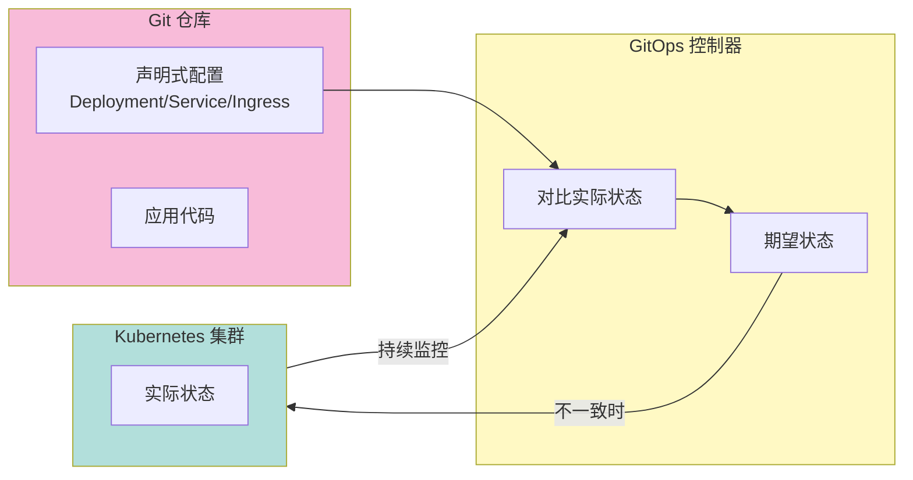
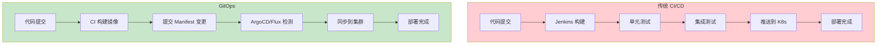
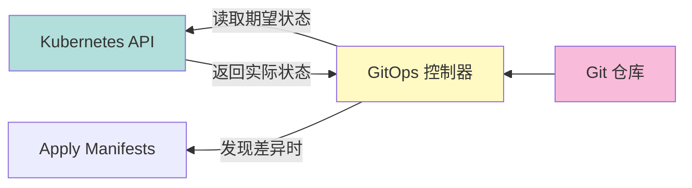
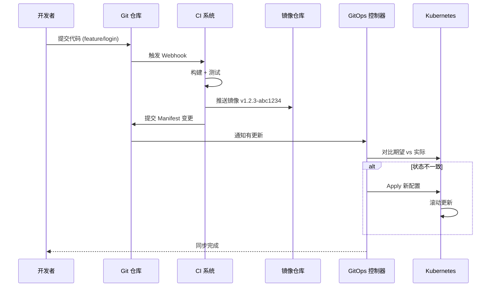
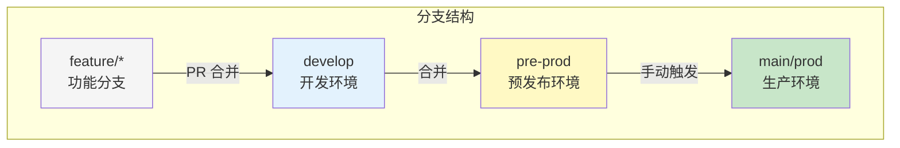

2017 年，Weaveworks 在一篇博客文章中首次提出 GitOps 这个词。那时候，云原生概念刚刚兴起，Kubernetes 开始被广泛采用，而「如何管理 Kubernetes 上的应用部署」还是个悬而未决的问题。

Weaveworks 的答案是：**让 Git 成为系统配置的单一事实来源，用 Git 的工作流来管理应用的部署和运维**。

七年过去了，GitOps 从一个创业公司的营销术语，演变成了云原生部署的事实标准。ArgoCD 和 Flux 先后加入 CNCF，AWS EKS Anywhere、Azure Arc、Google Anthos 都把 GitOps 作为核心能力。这个演进背后的驱动力是什么？

## GitOps 的本质

GitOps 不是「用 Git 部署代码」，这个误解太普遍了。

**GitOps 的核心是两层含义**：

1. **声明式基础设施**：你描述「想要什么状态」，而不是「如何达到那个状态」
2. **Git 作为事实来源**：Git 仓库里的配置就是期望状态，系统不断尝试让实际状态与期望状态一致



### 声明式 vs 命令式

理解 GitOps 的关键是理解「声明式」和「命令式」的区别：

**命令式**：「执行 A，然后执行 B，最后执行 C」

```yaml title="命令式部署（危险）"
# kubectl 命令行是典型的命令式操作
kubectl set image deployment/app app=image:v1.2.3
kubectl scale deployment app --replicas=5
kubectl rollout status deployment/app
```

**声明式**：「最终状态应该是 A、B、C」

```yaml title="声明式部署（GitOps）"
# deployment.yaml 描述期望状态
apiVersion: apps/v1
kind: Deployment
metadata:
  name: app
spec:
  replicas: 5
  template:
    spec:
      containers:
        - name: app
          image: app:v1.2.3
```

命令式的问题是：**不知道系统当前状态是什么，只知道「我做了什么操作」**。

声明式的优势是：**状态是显式的、可追溯的、可重现的**。无论谁在什么时间应用了这份配置，结果都是一样的。

:::info
Kubernetes 本身就是一个声明式系统的典范。你告诉 K8s「我想有 5 个 Pod 副本」，K8s 负责「确保有 5 个 Pod 在运行」。如果一个 Pod 挂了，K8s 会自动重建。GitOps 把这种声明式哲学延伸到了配置管理领域。
:::

## GitOps vs 传统 CI/CD

很多团队在迁移到 GitOps 之前，会有这样的疑问：「我们已经有了 Jenkins Pipeline，还要 GitOps 做什么？」

### 架构对比



**传统 CI/CD 的特点**：

- 部署逻辑在 CI Pipeline 里
- Pipeline 掌握「部署到哪个环境、什么版本」
- CI 系统是部署的发起方

**GitOps 的特点**：

- 部署逻辑在 Git 仓库里
- Git 仓库是「期望状态」的记录者
- GitOps 控制器是部署的执行者

### 核心区别

| 维度 | 传统 CI/CD | GitOps |
| --- | --- | --- |
| **事实来源** | CI 系统（如 Jenkins） | Git 仓库 |
| **部署触发** | CI Pipeline 主动推送 | 控制器主动拉取 |
| **权限模型** | CI 系统有集群写入权限 | Git 仓库变更触发更新 |
| **回滚方式** | `kubectl rollout undo` | `git revert` + 自动同步 |
| **审计追溯** | CI 系统日志 | Git 历史 + 变更 diff |
| **多集群管理** | 各自维护 Pipeline | 共享 Config Repo |

:::tip
GitOps 不是要替换 Jenkins，而是让 Jenkins 回归「构建和测试」的本职工作，把「部署」职责交给 GitOps 控制器。
:::

## GitOps 的核心组件

GitOps 的架构由三个核心组件构成：

### 组件一：Git 仓库

Git 仓库是整个系统的「大脑」，存储两种关键配置：

**1. 应用配置仓库（App Repo）**

包含 Kubernetes Manifests 或 Helm Chart，定义应用的期望状态。

```yaml title="app-repo/k8s/deployment.yaml"
apiVersion: apps/v1
kind: Deployment
metadata:
  name: payment-service
  labels:
    app: payment-service
spec:
  replicas: 3
  selector:
    matchLabels:
      app: payment-service
  template:
    metadata:
      labels:
        app: payment-service
    spec:
      containers:
        - name: app
          image: registry.example.com/payment-service:v2.1.0
          ports:
            - containerPort: 8080
          resources:
            requests:
              memory: "256Mi"
              cpu: "100m"
            limits:
              memory: "512Mi"
              cpu: "500m"
```

**2. 环境配置仓库（Environment Repo）**

包含不同环境的差异化配置，如 values-prod.yaml、values-staging.yaml。

```yaml title="app-repo/environments/prod/values.yaml"
namespace: payment-prod
replicaCount: 5
image:
  tag: v2.1.0
resources:
  requests:
    memory: "512Mi"
    cpu: "200m"
autoscaling:
  enabled: true
  minReplicas: 5
  maxReplicas: 20
```

### 组件二：自动化控制器

控制器是 GitOps 的「手」，负责：

- 持续监控 Git 仓库的变化
- 比较期望状态与实际状态
- 当发现差异时，执行同步操作



主流的 GitOps 控制器有两个：

- **ArgoCD**：由 Intuity、CodeFresh、IBM、Red Hat 等联合开发，界面友好，功能全面
- **Flux**：由 Weaveworks 开发，CNCF 毕业项目，与 Kubernetes 原生集成更深

### 组件三：容器镜像仓库

镜像仓库存储构建出的容器镜像，是「不可变部署」的基础：

- 每次构建产生唯一的镜像标签（SHA 或语义化版本）
- 镜像仓库记录每个标签对应的 Git commit
- GitOps 控制器通过镜像标签锁定部署版本

## GitOps 工作流

### 标准工作流：代码到生产的旅程



### 分支策略

GitOps 推荐使用以下分支策略：



**关键原则**：

- **main 分支**：生产环境的唯一真相来源，变更需要严格的 Review
- **预发布分支**：上线前的验证环境，与生产配置一致
- **开发分支**：频繁变更的开发环境，快速迭代

:::warning
不要在 CI Pipeline 里直接修改生产配置。GitOps 的核心原则是：所有配置变更都必须通过 Git PR 来做。这样才能保证有 Review、有记录、可追溯。
:::

## GitOps 的优势

### 优势一：完整的审计日志

每次部署都有对应的 Git commit，谁在什么时间部署了什么版本，一目了然。

```
commit a1b2c3d4e5f6
Author: zhangsan <zhangsan@example.com>
Date:   Thu Apr 9 10:30:00 2026

    chore: upgrade payment-service to v2.1.0

    - Update image tag from v2.0.9 to v2.1.0
    - Scale replicas from 3 to 5 for expected traffic

    Reviewed-by: lisi <lisi@example.com>
```

### 优势二：轻松的回滚

回滚只需要执行 `git revert`：

```bash
# 回滚到上一个版本
git revert HEAD

# 或者回滚到指定版本
git revert a1b2c3d

# 推送后，GitOps 控制器会自动同步
git push origin main
```

ArgoCD 会自动检测到 Git 变更，同步到集群。

### 优势三：多集群一致性

用同一套配置管理多个集群，只需要在不同环境加载不同的 values 文件：

```bash
# 部署到 production 集群
argocd app set payment-service -p values=values-prod.yaml

# 部署到 staging 集群
argocd app set payment-service -p values=values-staging.yaml
```

### 优势四：权限最小化

GitOps 控制器只需要集群的只读权限 + 特定命名空间的写入权限，开发者不需要直接操作集群：

```yaml title="service-account.yaml"
apiVersion: v1
kind: ServiceAccount
metadata:
  name: argocd-repo-server
  namespace: argocd
---
apiVersion: rbac.authorization.k8s.io/v1
kind: Role
metadata:
  name: argocd-repo-server
rules:
  # 只需要管理特定应用的权限
  - apiGroups: ["apps"]
    resources: ["deployments"]
    verbs: ["get", "list", "watch", "update", "patch"]
  - apiGroups: [""]
    resources: ["configmaps", "secrets"]
    verbs: ["get", "list", "watch"]
```

## GitOps 的挑战

### 挑战一：大规模集群的性能

当 Git 仓库数量达到数百个时，GitOps 控制器的资源消耗和同步延迟会成为问题。

**解决方案**：

- 使用 ApplicationSet 批量创建应用
- 优化轮询间隔，平衡实时性和资源消耗
- 使用 Webhook 代替轮询

### 挑战二：Secrets 管理

把密码写在 Git 里是不安全的，但 GitOps 需要「期望状态」在 Git 里。

**解决方案**：

- **Sealed Secrets**：将 Secrets 加密后存储在 Git
- **External Secrets Operator**：从 Vault/AWS Secrets Manager 动态拉取
- **SOPS**：使用 KMS 加密敏感字段

```yaml title="external-secret.yaml"
apiVersion: external-secrets.io/v1beta1
kind: ExternalSecret
metadata:
  name: db-credentials
spec:
  refreshInterval: 1h
  secretStoreRef:
    name: vault-backend
    kind: ClusterSecretStore
  target:
    name: db-credentials
  data:
    - secretKey: password
      remoteRef:
        key: prod/database/password
```

### 挑战三：增量更新的复杂性

GitOps 的声明式特性意味着每次更新都是「全量声明」。但有时候，你只想更新某个字段，而不希望覆盖其他字段。

**解决方案**：

- 使用 Kustomize 或 Helm 的 patch 机制
- 理解 K8s 的 merge 策略
- 避免手动修改集群状态，所有变更通过 Git

## 适用场景

**GitOps 非常适合**：

- Kubernetes 环境中的应用部署
- 需要多集群管理的场景
- 对审计追溯有严格要求的合规场景
- 需要频繁发布、小步快跑的开发团队

**GitOps 暂不适合**：

- 非 Kubernetes 环境（需要额外适配）
- 配置变更频繁但不想走 Git 流程的场景
- 对实时性要求极高的场景（Git 的异步特性可能不适合）

## 延伸思考

GitOps 本质上是一种「配置即代码」的哲学延伸。它的成功取决于一个前提：**团队愿意把 Git 作为事实来源，遵守 Git 的工作流程**。

如果团队成员习惯性地跳过 PR Review、直接 push 到 main 分支、或者在生产环境手动修改配置后不同步回 Git——GitOps 的优势就荡然无存。

GitOps 是一面镜子：它放大的不只是部署的效率，还有团队协作文化的优劣。

理解这一点，你就理解了为什么 GitOps 不只是工具，更是一种工程文化。
