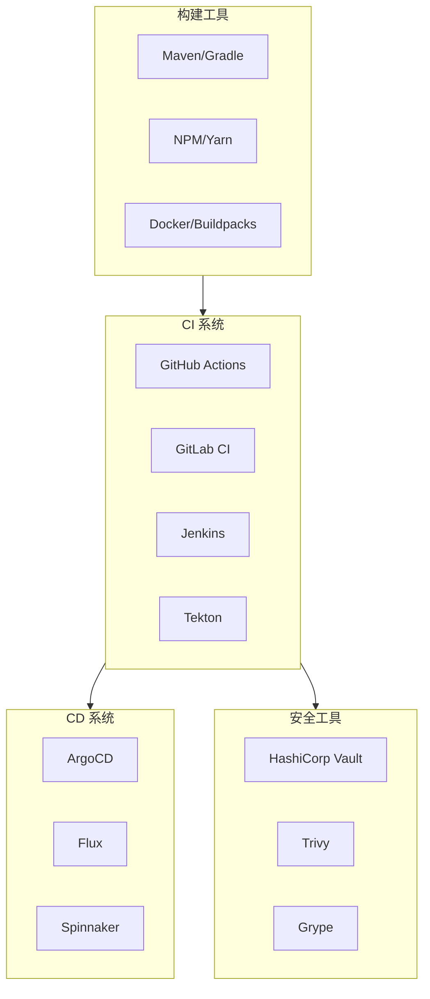

## 模块概述

CI/CD（持续集成/持续交付）是现代软件交付的核心基础设施。本模块将深入探讨 CI/CD 流水线的发布策略、安全保障与效能优化，帮助你构建高效、可靠的软件交付体系。

### 核心议题

本模块涵盖三大核心议题：

**发布策略**：从传统的滚动更新到现代的蓝绿部署、金丝雀发布，再到 A/B 测试和特性开关，每种策略都有其适用场景和 trade-off。选择正确的发布策略，可以显著降低发布风险、提升交付效率。

**安全实践**：CI/CD 流水线拥有生产环境的访问权限，是攻击者的高价值目标。Secret 管理、镜像扫描、依赖审计……这些安全实践缺一不可。

**效能优化**：通过 DORA 指标度量交付能力，识别瓶颈，持续改进。好的度量体系让你用数据说话，而不是靠感觉决策。

## 内容导航

### 发布策略

| 文档 | 说明 |
| --- | --- |
| [蓝绿部署策略](./blue-green) | 通过双环境热备实现零停机部署与秒级回滚 |
| [滚动更新策略](./rolling-update) | Kubernetes 原生支持的渐进式部署方案 |
| [A/B 测试与灰度发布](./ab-testing) | 数据驱动的功能验证与精细化流量控制 |
| [发布策略选型矩阵](./deployment-strategies) | 从风险、成本、效率多维度对比发布策略 |
| [特性开关](./feature-toggle) | 解耦代码部署与功能发布的工程实践 |

### 安全与合规

| 文档 | 说明 |
| --- | --- |
| [CI/CD 安全](./security) | Secret 管理、镜像扫描、依赖审计与安全最佳实践 |

### 效能与治理

| 文档 | 说明 |
| --- | --- |
| [CI/CD 度量与优化](./metrics) | 通过 DORA 指标驱动持续改进 |
| [流水线即代码](./pipeline-as-code) | 用代码定义流水线，实现版本化管理与复用 |

## 核心技术栈

本模块涉及的主流工具和框架：

## 学习路径建议

### 入门路径

1. **理解基础**：从 [蓝绿部署策略](./blue-green) 和 [滚动更新策略](./rolling-update) 入手，理解两种主流部署方式
2. **安全意识**：阅读 [CI/CD 安全](./security)，了解常见安全风险
3. **实践入门**：参考 [流水线即代码](./pipeline-as-code)，建立配置即代码的实践

### 进阶路径

1. **精细化发布**：学习 [A/B 测试与灰度发布](./ab-testing)，掌握数据驱动的发布决策
2. **发布治理**：通过 [发布策略选型矩阵](./deployment-strategies) 建立系统性的选型能力
3. **特性管理**：深入 [特性开关](./feature-toggle)，理解代码部署与功能发布的解耦

### 专家路径

1. **效能优化**：通过 [CI/CD 度量与优化](./metrics) 建立度量体系，驱动持续改进
2. **安全加固**：深化安全实践，建立供应链安全保障体系
3. **平台工程**：构建自服务的 CI/CD 平台，提升团队交付效率

## 关键概念速查

| 概念 | 英文 | 说明 |
| --- | --- | --- |
| 蓝绿部署 | Blue-Green Deployment | 双环境热备，流量整体切换 |
| 滚动更新 | Rolling Update | 逐步替换实例，Kubernetes 原生支持 |
| 金丝雀发布 | Canary Release | 灰度放量，逐步增加新版本流量 |
| A/B 测试 | A/B Testing | 受控实验，验证业务假设 |
| 特性开关 | Feature Toggle | 控制功能的开启与关闭 |
| 流水线即代码 | Pipeline as Code | 用代码定义 CI/CD 配置 |
| DORA 指标 | DORA Metrics | DevOps 交付能力度量标准 |
| 镜像扫描 | Image Scanning | 检测容器镜像中的安全漏洞 |

## 延伸阅读

- [CI/CD 概述与演进](/cloud-native/cicd/overview) - CI/CD 发展历史与核心理念
- [GitOps 理念深度解析](/cloud-native/cicd/gitops) - GitOps 最佳实践
- [ArgoCD 架构深度解析](/cloud-native/cicd/argocd) - GitOps 核心工具
- [金丝雀发布策略](/cloud-native/cicd/canary) - 渐进式发布进阶内容

## 思考题

在开始深入学习之前，请思考以下问题：

**问题 1**：你的团队目前使用哪种发布策略？这种策略的优缺点是什么？

**问题 2**：CI/CD 流水线中，Secret（如数据库密码、API 密钥）是如何管理的？是否有安全风险？

**问题 3**：你的团队是否有 CI/CD 效能度量？如果有，关注的指标是什么？如果没有，为什么没有建立度量体系？
