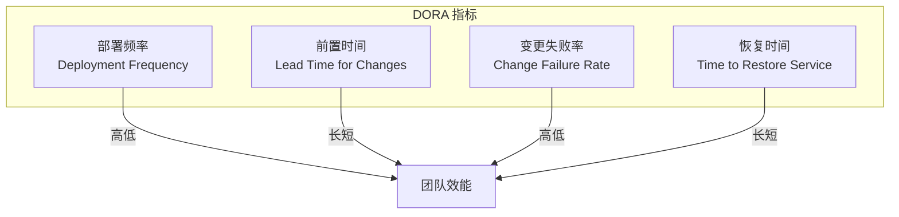
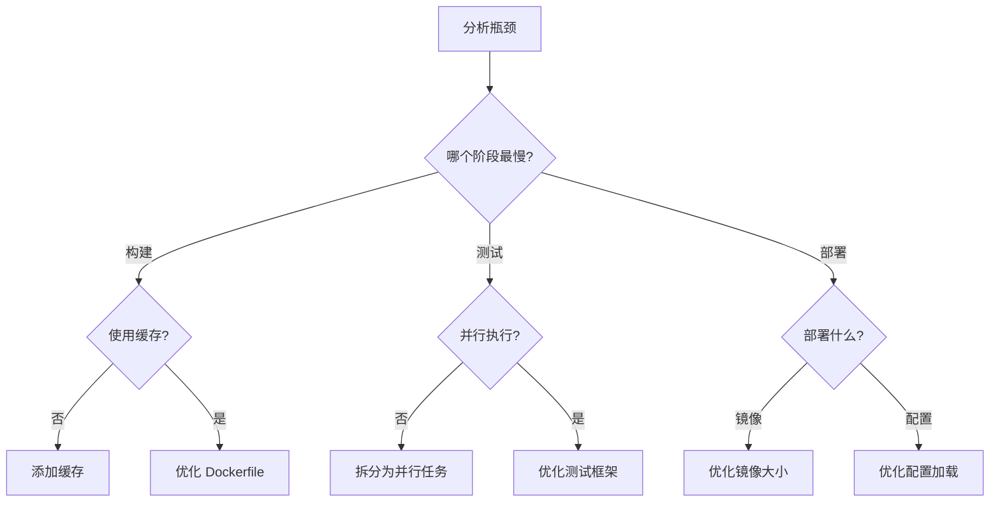

# CI/CD 度量与优化

2018 年，Google 的 DORA（DevOps Research and Assessment）团队发布了他们的年度报告。报告中的一个数据让很多 CTO 感到震惊：

**精英效能团队的部署频率是低效能团队的 208 倍，故障恢复时间是 106 倍。**

这意味着，不是所有团队都在用同样的方式「用」CI/CD。真正的差距，在于对流水线的度量、优化、和持续改进。

## DORA 指标

DORA 团队定义了四个核心指标，用于衡量软件交付效能：



### 四个核心指标

| 指标 | 定义 | 精英水平 | 高水平 | 中等水平 | 低水平 |
| --- | --- | --- | --- | --- | --- |
| **部署频率** | 生产环境部署频率 | 按需（每天多次） | 每天一次到每周一次 | 每周一次到每月一次 | 每月一次以下 |
| **前置时间** | 代码提交到生产的时长 | `<` 1 小时 | 1 天 - 1 周 | 1 - 6 个月 | `>` 6 个月 |
| **变更失败率** | 变更导致生产故障的比例 | `0-15%` | `16-30%` | `16-30%` | `16-30%` |
| **恢复时间** | 生产故障恢复时长 | `<` 1 小时 | `<` 1 天 | 1 天 - 1 周 | `>` 6 个月 |

### 指标定义

```python title="DORA 指标计算"]
class DORAMetrics:

    def deployment_frequency(self, deployments: List[Deployment]) -> dict:
        """计算部署频率"""
        now = datetime.now()
        last_week = deployments.filter(
            deployed_at__gte=now - timedelta(days=7)
        )

        return {
            "daily_avg": len(last_week) / 7,
            "per_week": len(last_week),
            "status": self.categorize(len(last_week) / 7, [
                (1, "精英"),
                (0.14, "高水平"),
                (0.03, "中等水平"),
                (0, "低水平")
            ])
        }

    def lead_time(self, commits: List[Commit]) -> dict:
        """计算前置时间"""
        lead_times = []
        for commit in commits:
            deploy = self.find_deployment(commit)
            if deploy:
                lead_time = (deploy.deployed_at - commit.committed_at).total_seconds() / 3600
                lead_times.append(lead_time)

        return {
            "median_hours": statistics.median(lead_times) if lead_times else 0,
            "p95_hours": statistics.quantiles(lead_times, n=20)[18] if len(lead_times) > 20 else 0,
            "status": self.categorize(statistics.median(lead_times), [
                (1, "精英"),
                (24, "高水平"),
                (720, "中等水平"),
                (4320, "低水平")
            ])
        }

    def change_failure_rate(self, deployments: List[Deployment]) -> dict:
        """计算变更失败率"""
        total = len(deployments)
        failed = len([d for d in deployments if d.has_failure])

        return {
            "rate": (failed / total * 100) if total > 0 else 0,
            "failed_count": failed,
            "total_count": total,
            "status": self.categorize(failed / total * 100 if total > 0 else 0, [
                (15, "精英"),
                (30, "高水平"),
                (30, "中等水平"),
                (100, "低水平")
            ])
        }
```

## 流水线度量

### 构建指标

```yaml title="Prometheus 指标"]
# 构建时长
pipeline_build_duration_seconds{job="build", status="success"}
pipeline_build_duration_seconds{job="build", status="failure"}

# 构建失败率
rate(pipeline_build_total{status="failure"}[5m])
/
rate(pipeline_build_total{status="success"}[5m])

# 队列等待时间
pipeline_queue_wait_seconds{job="docker-build"}
```

### 测试指标

```yaml title="测试覆盖率"]
# 测试通过率
test_pass_rate{job="unit-test", branch="main"}
test_pass_rate{job="integration-test", branch="main"}

# 测试时长
test_duration_seconds{job="unit-test", status="success"}

# 覆盖率变化
code_coverage_delta{branch="feature/xyz"}
```

### 部署指标

```yaml title="部署指标"]
# 部署成功率
deployment_success_rate{environment="production"}

# 部署时长
deployment_duration_seconds{environment="production"}

# 回滚频率
deployment_rollback_total{environment="production"}

# 平均回滚时间
rollback_duration_seconds{environment="production"}
```

## 可视化面板

### Grafana 面板配置

```json title="DORA 仪表盘 JSON"
{
  "title": "DORA Metrics Dashboard",
  "panels": [
    {
      "title": "部署频率",
      "targets": [
        {
          "expr": "sum(rate(deployment_total{environment=\"production\"}[1d]))",
          "legendFormat": "每日部署次数"
        }
      ]
    },
    {
      "title": "前置时间分布",
      "type": "heatmap",
      "targets": [
        {
          "expr": "sum(increase(lead_time_hours_bucket[1d])) by (le)",
          "legendFormat": "{{le}} 小时"
        }
      ]
    },
    {
      "title": "变更失败率趋势",
      "targets": [
        {
          "expr": "sum(rate(deployment_failed_total[1h])) / sum(rate(deployment_total[1h])) * 100",
          "legendFormat": "失败率 %"
        }
      ]
    }
  ]
}
```

## 优化策略

### 构建缓存

```yaml title="构建缓存优化"]
# GitHub Actions 缓存
- name: Cache Maven packages
  uses: actions/cache@v4
  with:
    path: ~/.m2/repository
    key: ${{ runner.os }}-maven-${{ hashFiles('**/pom.xml') }}

# GitLab CI 缓存
maven-build:
  cache:
    key: ${CI_COMMIT_REF_SLUG}
    paths:
      - .m2/repository
    policy: pull-push
```

### 并行执行

```yaml title="并行测试"]
jobs:
  test:
    parallel:
      matrix:
        TEST_SUITE: [unit, integration, e2e]

  # 或者使用 DAG 模式
  test:unit:
    needs: [build]
  test:integration:
    needs: [build]
  test:e2e:
    needs: [test:unit]
```

### 增量构建

```dockerfile title="增量构建优化"]
# 错误示例：每次都全量构建
COPY . .
RUN mvn package

# 正确示例：利用 Docker 缓存
# 先复制依赖文件，构建依赖
COPY pom.xml .
RUN mvn dependency:go-offline

# 再复制源代码
COPY src ./src
RUN mvn package -DskipTests
```

## 瓶颈分析

### 识别瓶颈

```bash title="流水线耗时分析"]
# 统计各阶段平均耗时
awk '/^.+:.+\[/ {
  stage=$1
  gsub(/[\[\]]/, "", stage)
}
$0 ~ /duration/ {
  gsub(/[a-z]/, "", $0)
  print stage ": " $2 "s"
}' pipeline.log

# 输出示例：
# build: 120s
# test: 300s
# docker-build: 180s
# deploy: 45s
```

### 决策树



## 持续改进

### 回顾会议

```markdown title="Retrospective 模板"]
## CI/CD 回顾 - 2024-01

### 指标回顾
- 部署频率：5 次/周 → 8 次/周（+60%）
- 前置时间：2 天 → 6 小时（-87.5%）
- 失败率：12% → 8%（-33%）

### 改进措施
| 问题 | 根因 | 改进措施 | 负责人 | 完成日期 |
| --- | --- | --- | --- | --- |
| 构建太慢 | 依赖未缓存 | 添加 Maven 缓存 | @张三 | 2024-01-15 |
| 回滚复杂 | 缺少快速回滚 | 部署 Argo Rollouts | @李四 | 2024-01-20 |

### 下一步
1. 引入自动化性能测试
2. 优化 E2E 测试（目标：从 30 分钟降到 10 分钟）
```

### 自动化改进

```yaml title="自动优化建议"]
# ArgoCD 分析建议
apiVersion: argoproj.io/v1alpha1
kind: AnalysisTemplate
metadata:
  name: performance-suggestions
spec:
  metrics:
    - name: build-duration
      successCondition: result <= 300
      failureLimit: 3
    - name: test-duration
      successCondition: result <= 600
      failureLimit: 3
```

## 告警配置

```yaml title="DORA 指标告警"]
groups:
  - name: cicd-alerts
    rules:
      - alert: DeploymentFrequencyLow
        expr: |
          sum(rate(deployment_total{environment="production"}[7d])) < 0.1
        for: 1h
        labels:
          severity: warning
        annotations:
          summary: "部署频率过低"
          description: "过去 7 天部署频率为 {{ $value }} 次/天，低于目标值 1 次/天"

      - alert: LeadTimeHigh
        expr: |
          histogram_quantile(0.5, sum(rate(lead_time_seconds_bucket[1d])) by (le)) > 86400
        for: 30m
        labels:
          severity: critical
        annotations:
          summary: "前置时间过长"
          description: "中位前置时间超过 24 小时，需要优化"

      - alert: ChangeFailureRateHigh
        expr: |
          sum(rate(deployment_failed_total{environment="production"}[1h]))
          /
          sum(rate(deployment_total{environment="production"}[1h])) > 0.15
        for: 15m
        labels:
          severity: critical
        annotations:
          summary: "变更失败率过高"
          description: "当前失败率为 {{ $value | humanizePercentage }}，超过 15% 阈值"
```

## 常见问题

### 问题一：只关注速度

过度优化构建速度，但忽视了质量。

**正确做法**：在质量和速度之间找到平衡。目标不是「最快」，而是「够快且稳定」。

### 问题二：指标过度

监控太多指标，但没有人看。

**正确做法**：只关注 DORA 四指标 + 业务关心的 2-3 个指标。

### 问题三：没有基线

没有基准数据，无法判断改进效果。

**正确做法**：先建立基线，再逐步改进。

## 延伸思考

DORA 指标的意义不是「排名」，而是「诊断」。

当你的团队部署频率低时，问题可能是：
- 代码审查流程太长
- 测试时间太长
- 缺乏自动化部署
- 缺乏对失败的快速响应能力

当你的团队变更失败率高时，问题可能是：
- 测试覆盖不足
- 缺乏灰度发布机制
- 回滚流程不完善
- 监控告警不完善

DORA 指标是一面镜子，映射出的是团队在流程、技术、文化层面的问题。

另一个值得关注的趋势是**预测性指标**。传统的 DORA 指标是「事后指标」，描述的是已经发生的事情。一些团队正在探索「预测性指标」，比如：

- 代码复杂度变化趋势
- 测试覆盖率变化趋势
- 依赖版本更新频率

这些指标可以提前预警潜在的风险，而不是等到问题发生后才告警。

最后，指标只是工具。**持续改进的文化才是根本**。一个团队如果只是机械地记录指标，而不真正去分析和改进，那指标就毫无意义。
