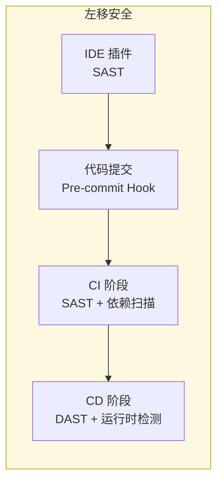

发布一次应用需要多少步骤？很多人脱口而出：「git push，不就完了吗？」

但真正问过自己这个问题的工程师会知道：不是的。一次完整的发布，远不止「推代码」那么简单。你需要构建镜像、打包制品、检查依赖、更新配置、滚动部署、验证健康、监控指标、回滚预案……如果每个环节都是手动操作，一个下午的时间可能就这样「发布」掉了。

这就是 CI/CD 要解决的问题：**把人工流程变成自动化流水线，让发布从「一下午」变成「几分钟」**。

## CI/CD 的定义与价值

**CI（持续集成，Continuous Integration）**：开发者频繁地将代码合并到主分支，每次合并都通过自动化构建和测试来验证，尽早发现集成错误。

**CD（持续交付/持续部署，Continuous Delivery/Deployment）**：在 CI 的基础上，自动化地将通过测试的代码部署到各种环境，最终实现一键发布到生产环境。

:::info
持续交付（Delivery）和持续部署（Deployment）的区别在于：前者需要人工确认后发布生产，后者完全自动化。两者都是 CD，但门槛和风险不同。
:::

CI/CD 的核心价值可以用三个词概括：

- **快**：缩短反馈周期，代码提交后几分钟内就知道构建是否通过
- **稳**：自动化减少了人为错误，每次发布都是可重复的过程
- **频**：降低发布门槛后，团队可以更频繁地小批量发布，降低单次发布风险

## 演进历程：从泥潭到云原生

### 手工时代（2000 年之前）

那个年代，部署应用是这样的：

1. 开发人员在本地打包 `jar` 或 `war` 文件
2. 通过 FTP 或 SCP 拷贝到服务器
3. 手动登录服务器，停止进程
4. 替换新的包，启动服务
5. 打开浏览器，点击各个页面验证

如果出问题了呢？再重复一遍，或者从备份目录里把旧包拷贝回来。

这个时代最大的问题不是慢，而是**不可重复、不可追溯**。谁在什么时间部署了什么版本，往往靠「传说」而非记录。

### 脚本时代（2000-2010 年）

Ant、Maven 解决了构建问题，Shell 脚本把部署流程搬进了脚本里。团队开始用脚本实现：

- 一键构建
- 一键部署到测试环境
- 一键回滚

但脚本的问题是：**环境不一致**。开发本地跑得通的脚本，到测试环境可能缺依赖；测试环境验证通过的生产环境，可能有奇怪的配置差异。「在我机器上能跑」这句话，在那个年代是真理。

### 工具时代（2010-2018 年）

Jenkins、Travis CI、CircleCI 这一代 CI 工具登场，改变了游戏规则：

- **构建环境标准化**：Docker 让「构建一次，到处运行」成为可能
- **流水线可视化**：拖拽节点配置流水线，不用写 Shell
- **插件生态**：Git、Docker、Kubernetes 集成，开箱即用

这个时代的 CI/CD 工具，解决了「如何自动化」的问题，但还没有解决「谁来触发、谁来审批、谁来监控」的问题。

### 平台时代（2018 年至今）

GitOps 理念的兴起标志着 CI/CD 进入平台时代。核心变化是**部署逻辑从 CI 工具转移到了运行时平台**：

- ArgoCD、Flux 这类 GitOps 工具接管了 Kubernetes 部署
- 声明式配置成为主流：你描述「想要什么状态」，平台负责「达到那个状态」
- Git 仓库成为单一事实来源，每次变更都有完整的审计日志

:::tip
GitOps 不是「用 Git 部署代码」，而是「以 Git 为事实来源，通过自动化控制器不断调和实际状态与期望状态」。这个区别很重要。
:::

## CI/CD 的核心组件

无论用哪套工具，CI/CD 流水线都由几个核心组件构成：

```mermaid
flowchart LR
    subgraph Build["构建阶段"]
        Code[代码拉取] --> Compile[编译]
        Compile --> Package[打包制品]
    end

    subgraph Test["测试阶段"]
        Package --> Unit[单元测试]
        Unit --> Integration[集成测试]
        Integration --> Security[安全扫描]
    end

    subgraph Deploy["部署阶段"]
        Security --> Artifact[制品库]
        Artifact --> Stage[预发布环境]
        Stage --> Prod[生产环境]
    end

    subgraph Monitor["运营阶段"]
        Prod --> Health[健康检查]
        Health --> Metrics[指标收集]
        Metrics --> Alert[告警]
    end

    style Build fill:#e3f2fd
    style Test fill:#fff3e0
    style Deploy fill:#e8f5e9
    style Monitor fill:#fce4ec
```

### 构建（Build）

构建阶段负责把源代码变成可部署的制品：

- **依赖管理**：Maven/Gradle/npm/pip，拉取并缓存依赖
- **编译打包**：源代码编译成二进制/Docker 镜像/JAR 包
- **制品命名**：通常包含 Git commit SHA、版本号、时间戳，保证唯一性

构建的核心质量指标是**构建速度**和**缓存命中率**。构建太慢，开发者等待时间就长；缓存命中率低，每次都要重新拉依赖。

### 测试（Test）

测试阶段是 CI 的核心价值所在。自动化测试金字塔从底到顶：

|| 层级 | 占比建议 | 执行时间 | 典型工具 |
| --- | --- | --- | --- | --- |
| **单元测试** | 70% | 秒级 | JUnit、pytest |
| **集成测试** | 20% | 分钟级 | Testcontainers |
| **端到端测试** | 10% | 十分钟级 | Playwright、Cypress |

:::warning
测试覆盖率不是越高越好。100% 覆盖率的测试套件，如果测试本身写得烂，反而会成为维护负担。关键是测试能发现真正有价值的 bug，而不是堆砌无意义的断言。
:::

### 部署（Deploy）

部署阶段把制品推送到目标环境：

- **环境管理**：dev、staging、production，不同环境用不同配置
- **部署策略**：滚动更新、蓝绿部署、金丝雀发布
- **健康检查**：部署后自动检查服务可用性，不健康则回滚

### 监控（Monitor）

发布不是终点，是起点。监控阶段确保上线后的服务稳定：

- **存活监控**：服务是否在跑，端口是否响应
- **健康监控**：业务指标是否正常，错误率是否飙升
- **告警**：异常情况及时通知，防止小问题演变成大故障

## 流水线设计原则

设计 CI/CD 流水线时，有几个核心原则需要遵循：

### 原则一：快速反馈

开发者提交代码后，等待反馈的时间直接影响开发效率。如果流水线跑 30 分钟，开发者要么放弃等待去做其他事情，要么积攒一堆代码一起提交。前者延迟了反馈，后者增加了合并冲突。

**优化方向**：

- 把耗时任务（如集成测试、E2E 测试）放到后置阶段
- 利用增量构建，只构建变更的部分
- 失败的 stage 要第一时间失败，不要等到后面才发现

### 原则二：幂等性

同一个流水线可以跑一百次，每次结果都应该一致。如果「第一次能跑，第二次就失败」，这个流水线就没有价值。

**幂等性的保障**：

- 使用不可变镜像，制品一旦构建就不修改
- 环境配置用代码描述，不依赖手动操作
- 清理前一次运行留下的状态

### 原则三：环境一致性

开发环境能跑、测试环境能跑、生产环境也能跑——这是理想状态。现实是三个环境往往有微妙的差异：网络策略不同、配置参数不同、依赖版本不同。

Docker 和 Kubernetes 解决了大部分问题，但**数据层的一致性**仍然是老大难。一个依赖随机数的测试，在测试环境通过，生产环境失败——这类问题往往要到线上才会暴露。

### 原则四：安全左移

安全扫描不应该放在流水线最后，而应该在代码编写阶段就开始。SAST（静态应用安全测试）工具可以集成到 IDE 插件里，DAST（动态应用安全测试）可以集成到 CI 阶段。

## CI/CD 工具选型

没有最好的工具，只有最适合的场景：

|| 工具 | 适用场景 | 特点 |
| --- | --- | --- | --- |
| **Jenkins** | 灵活定制 | 插件丰富，社区活跃，需要自己维护 |
| **GitLab CI** | 代码仓库集成 | 与 GitLab 无缝集成，YAML 配置简单 |
| **GitHub Actions** | GitHub 生态 |  Marketplace 丰富，冷启快 |
| **ArgoCD** | Kubernetes GitOps | 声明式，运行时生效，专注部署 |
| **Flux** | Kubernetes GitOps | CNCF 毕业项目，与 K8s 原生集成 |
| **Tekton** | 云原生流水线 | Kubernetes 原生，可定制性强 |

:::tip
如果你已经有 Jenkins，不要为了「时髦」而强行迁移。先在 Jenkins 上实现 GitOps 流程，等团队熟悉了理念，再考虑迁移到 ArgoCD 或 Flux。工具是手段，不是目的。
:::

## 延伸思考

CI/CD 流水线解决了「如何发布」的问题，但还有一个更深层的问题：**什么时候该发布？**

传统做法是「功能开发完了再发布」，但这意味着一个功能可能要等两周才能上生产。在快速迭代的互联网公司，这个等待周期是无法接受的。于是「特性开关（Feature Toggle）」和「小步快跑」的理念应运而生。

但小步快跑也带来新问题：**频繁发布如何保证质量？** 如果每次发布都要人工审批，CI/CD 的「快」就失去了意义。如果完全自动化，如何保证每一次自动化发布都是安全的？

这些问题没有标准答案，但它们是现代 CI/CD 工程师必须思考的问题。
