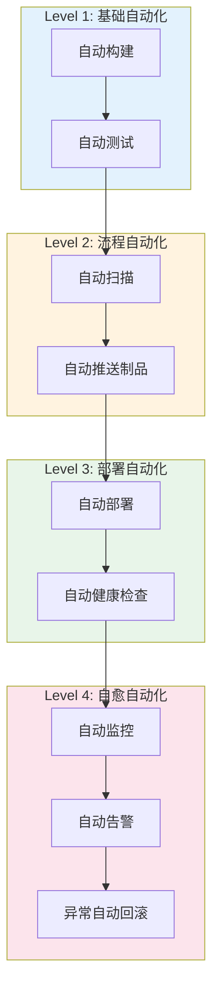
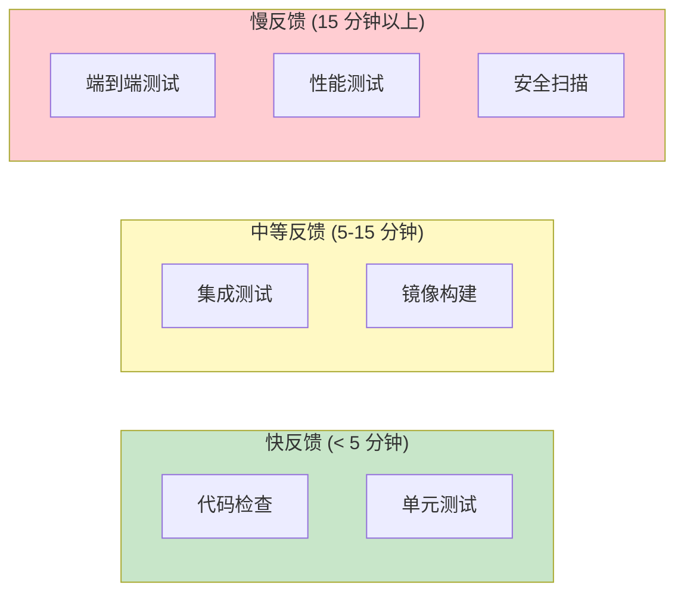
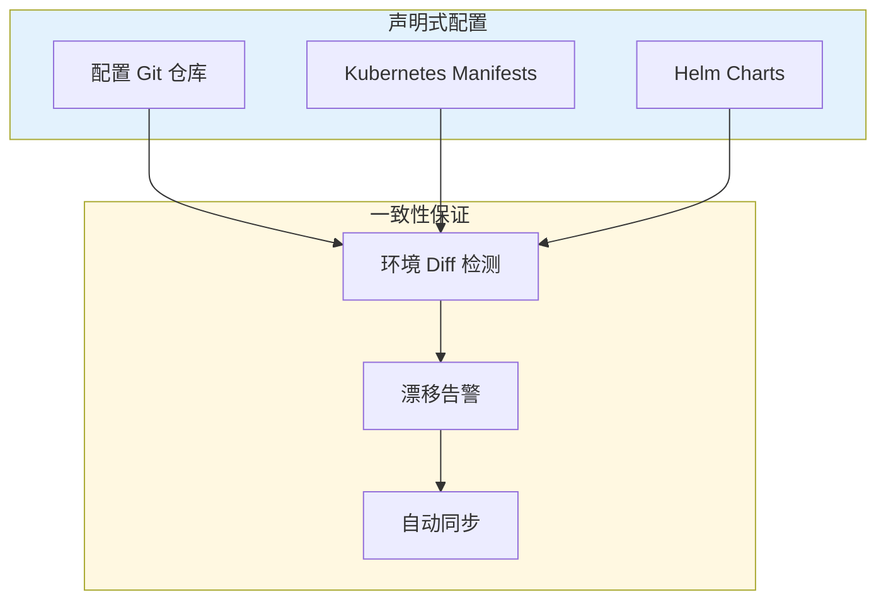
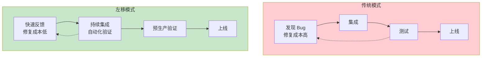
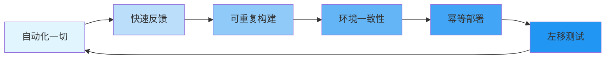

1994 年，Kent Beck 在开发 Chrysler Comprehensive Compensation System 时，创造了「持续集成」这个词。那时候没有 Git，没有 GitHub，没有 Docker。代码提交靠的是 CVS，每次集成都要手动合并代码，冲突处理是家常便饭。

但 Beck 的核心洞察即使在 30 年后依然有效：**越早发现问题，修复成本越低；越频繁集成，冲突越小。**

这个洞察演变成了 CI/CD 的六大核心原则，支撑着现代软件交付体系。

## 原则一：自动化一切

> 如果一个步骤需要人工干预，它就是潜在的风险点。

这句话可能听起来有点极端，但它揭示了 CI/CD 的核心哲学：**自动化的不只是构建和部署，而是整个软件交付过程**。

### 自动化的层次



大多数团队的 CI 已经做得很好了，但 CD 往往还停留在 Level 2。「部署到生产环境需要点一个按钮」看起来安全，实际上：

- 这个按钮可能被点错（选错环境、选错版本）
- 这个按钮可能被遗忘（周五发布的代码，周一才发现有问题）
- 这个按钮可能被滥用（在紧急情况下跳过了检查）

:::info
真正的部署自动化不是「一键部署」，而是让部署过程可重复、可审计、可回滚。当人工干预变成例外而不是常态时，效率和安全才能同时提升。
:::

### 自动化的边界

自动化不是万能的。以下场景，适度的人工介入反而是必要的：

- **数据库 Schema 变更**：自动迁移脚本可能丢失数据，需要 DBA 人工审核
- **首次进入新环境**：环境的特殊性可能需要人工确认配置
- **紧急事件处理**：灾难恢复时，可能需要绕过常规流程快速响应

关键是：**把人工介入变成例外，而不是常规**。

## 原则二：快速反馈

开发者的等待时间是 CI/CD 最重要的指标之一。

如果每次代码提交要等 30 分钟才能看到结果，开发者会怎么做？**他们会攒代码，等攒够了一波再提交。** 后果是什么？合并冲突爆炸，一次集成测试失败要排查一堆代码。

### 反馈速度的阶梯



**阶梯策略的核心**：

1. **最快阶段**：代码检查、单元测试——每次提交必跑，失败立即反馈
2. **中等阶段**：集成测试、构建镜像——分支合并时跑，保证质量
3. **最慢阶段**：E2E 测试、性能测试——定时任务或 Release 时跑

### 缩短反馈的实战技巧

```yaml title=".gitlab-ci.yml"
stages:
  - lint      # 最快：静态检查
  - test      # 快：单元测试
  - build     # 中等：构建镜像
  - e2e       # 慢：端到端测试

# 利用缓存加速
maven-build:
  stage: build
  cache:
    key: ${CI_COMMIT_REF_SLUG}
    paths:
      - .m2/repository/
  script:
    - mvn package -DskipTests

# 增量测试：只测试变更的模块
test-unit:
  stage: test
  script:
    - mvn test -pl ${CHANGED_MODULE} -am
```

:::tip
GitHub Actions 的 `paths` 和 `paths-ignore` 配置可以让你只对变更的文件跑特定 job。比如只有 `*.java` 文件变更时才跑 Java 测试，避免 Go 代码变更触发了 Java 测试白跑一场。
:::

## 原则三：可重复构建

「在我机器上能跑」是软件工程最著名的话之一，也是 CI/CD 要消灭的敌人。

### 不可重复构建的症状

- 构建依赖本地安装的某个工具版本
- 构建依赖 `/home/user/.m2` 里的缓存
- 镜像里的 JDK 版本和开发机不一样
- 同样的代码，同样的 commit ID，两次构建产出的 SHA256 不一样

### 不可重复的原因

**构建环境的差异**是最常见的罪魁祸首：

- 操作系统不同（macOS 开发，Linux 生产）
- 依赖版本不同（Maven 会解析到不同的小版本）
- 文件系统差异（大小写敏感、路径分隔符）

### 解决方案：不可变构建

```dockerfile title="Dockerfile"
# 阶段 1：依赖安装（结果缓存）
FROM maven:3.9-eclipse-temurin-17 AS deps
WORKDIR /app
# 先复制 pom.xml，利用 Docker 缓存
COPY pom.xml .
RUN mvn dependency:go-offline -B

# 阶段 2：构建（利用 deps 阶段的缓存）
FROM deps AS builder
COPY src ./src
COPY test ./test
RUN mvn package -DskipTests

# 阶段 3：运行时
FROM eclipse-temurin:17-jre-alpine
WORKDIR /app
COPY --from=builder /app/target/app.jar ./app.jar
ENTRYPOINT ["java", "-jar", "app.jar"]
```

这个 Dockerfile 保证：

1. **环境一致**：Maven 镜像里的 JDK 版本是固定的
2. **依赖固定**：pom.xml 里声明的版本，不会因为解析时机不同而变化
3. **构建可重现**：任何人、任何机器、任何时间构建，产出的镜像内容一致

:::warning
镜像标签（Tag）不是不可变的。「latest」标签会随着时间变化，「v1.2.3」标签指向的 commit 才是真正的不可变版本。生产环境必须用不可变标签或 SHA 来引用镜像。
:::

## 原则四：环境一致性

开发、测试、预发布、生产——四个环境，四种体验。这是很多团队的噩梦。

### 环境不一致的代价

> **真实案例**：某电商团队在测试环境验证通过，上线后用户无法登录。排查后发现：测试环境的 Redis 没有设置密码，生产环境的 Redis 要求密码认证，但密码配置在另一个配置中心里，CI 流程没有同步过来。

这个案例的根因是什么？**测试环境和生产环境的配置不同步**。不是代码 bug，是环境差异。

### 实现环境一致性的策略



**第一层：配置即代码**

所有环境的配置都在 Git 仓库里管理，通过 Helm Values 或 Kustomize 实现环境差异化。

```yaml title="values-prod.yaml"
database:
  host: prod-db.internal
  password: ${DB_PASSWORD}   # 从 Vault/Secrets Manager 注入
  replicaCount: 3

resources:
  memory: 2Gi
  cpu: 1000m

autoscaling:
  enabled: true
  minReplicas: 3
  maxReplicas: 10
```

**第二层：环境差异透明化**

通过工具检测环境与代码定义的差异（Configuration Drift），及时发现漂移。

**第三层：不可变基础设施**

用基础设施即代码（Terraform/Pulumi）管理底层资源，任何人工修改都应该被覆盖。

:::info
环境一致性不只是「配置一致」，还包括**网络策略、监控告警、日志收集**等运维关注点。一个服务在测试环境正常，在生产环境变慢，可能不是代码问题，而是网络策略限制了它的连接数。
:::

## 原则五：幂等部署

幂等的意思是：**执行一次和执行一百次，效果是一样的**。

### 幂等性的价值

非幂等的部署是危险的。想象一个部署脚本是这样的：

```bash
# 危险：非幂等部署
kubectl apply -f deployment.yaml
kubectl scale deployment app --replicas=10
```

第一次运行，副本数设为 10。但第二次运行时，如果有人工干预把副本数改成了 5，脚本不会发现这个问题，直接「应用」了一下完事。

幂等的部署应该这样写：

```bash
# 幂等部署：确保达到目标状态
kubectl apply --server-side -f deployment.yaml
kubectl rollout status deployment/app
```

### 幂等部署的实现方式

声明式部署天然是幂等的：

- **Kubernetes Deployment**：声明 `replicas: 10`，无论当前状态是什么，应用都会收敛到 10 个副本
- **Helm**：声明式的 Chart，第三次安装和第一次安装的结果一样
- **ArgoCD**：Git 里定义的期望状态，集群状态会自动同步过去

:::tip
幂等性不只关乎部署，还关乎回滚。幂等的回滚意味着：无论当前是什么版本，回滚到 V1.2.3 的结果应该是一致的。Git 的 `git revert` 是幂等的，`git reset` 不是。
:::

## 原则六：左移测试

传统瀑布开发模式下，测试是「开发完成后，交给测试团队」的工作。这个模式的问题是：**bug 发现得越晚，修复成本越高**。

### 测试金字塔的左移



### 左移的具体实践

**1. IDE 集成**

把 SonarLint 集成到 IDE，代码编写时就发现问题：

- 未使用的变量
- 空指针风险
- 硬编码的密码

**2. Pre-commit Hook**

```yaml title=".husky/pre-commit"
#!/bin/sh
. "$(dirname "$0")/_/husky.sh"

npx lint-staged      # 格式检查
npx tsc --noEmit     # TypeScript 类型检查
npx jest --bail      # 快速单元测试
```

**3. PR 门禁**

```yaml title="GitHub Actions"
name: PR Gate
on:
  pull_request:

jobs:
  quality-gate:
    runs-on: ubuntu-latest
    steps:
      - uses: actions/checkout@v4
      - name: SonarCloud Scan
        uses: SonarSource/sonarcloud-github-action@master
        env:
          SONAR_TOKEN: ${{ secrets.SONAR_TOKEN }}
      - name: Quality Gate
        run: |
          # 质量门禁：Bug 必须为 0，新代码覆盖率 > 80%
          sonar-scanner \
            -Dsonar.qualitygate.wait=true \
            -Dsonar.qualitygate.timeout=300
```

:::info
左移不是让开发人员做测试人员的工作。左移是让「发现 bug」这件事变得更早、更快、更便宜。单元测试应该由开发人员编写，这是开发工作的一部分，不是测试工作的转移。
:::

## 六大原则的综合运用

六个原则不是孤立的，它们相互支撑：



- **自动化**让反馈可以快速获取
- **快速反馈**让开发者愿意频繁提交代码
- **频繁提交**让每次集成的差异更小
- **环境一致性**让测试的结果可以信赖
- **幂等部署**让发布过程可以重复执行
- **左移测试**让 bug 在最便宜的时候被发现

## 延伸思考

六大原则是 CI/CD 的「道」，各种工具（Jenkins、ArgoCD、GitHub Actions）是「术」。理解了「为什么」，才能在「怎么做」上做出正确的选择。

但还有一个原则没有被列出来，因为它太像常识而容易被忽略：**持续改进**。CI/CD 流水线不是一次性的工程，而是持续演进的系统。昨天的最优配置，今天可能成为瓶颈。

如何衡量 CI/CD 的健康度？每个团队都应该关注这些指标：

- **部署频率**：从代码提交到生产上线需要多久？
- **变更前置时间**：从代码提交到代码上线需要多少次人工干预？
- **变更失败率**：有多少百分比的部署导致了生产问题？
- **恢复时间**：问题发生后，多久能恢复？

如果这些指标不透明，说明 CI/CD 建设还有很大的提升空间。
