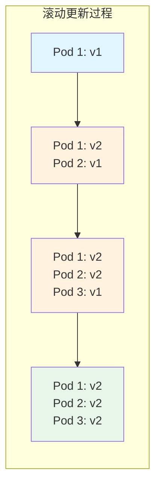
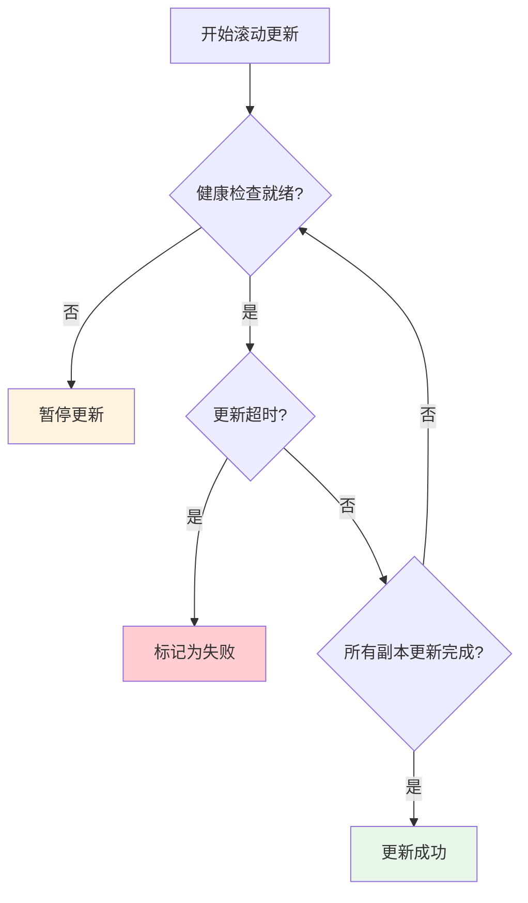

# 滚动更新（Rolling Update）策略

滚动更新是 Kubernetes 的默认部署策略。它的工作方式很简单：**逐步替换旧版本的 Pod，用新版本的 Pod 取而代之**。

这种方式不需要双倍资源，可以渐进式地完成更新。如果在更新过程中发现问题，Kubernetes 会自动暂停更新，防止故障蔓延。

滚动更新是最「保守」的部署策略，适合大多数场景。但它也有自己的局限性：更新过程中会同时存在两个版本，部分用户可能体验到不一致性。

## 滚动更新的原理

### 工作流程



### Kubernetes 原生实现

```yaml title="rolling-update.yaml"
apiVersion: apps/v1
kind: Deployment
metadata:
  name: myapp
spec:
  replicas: 10
  strategy:
    type: RollingUpdate
    rollingUpdate:
      maxSurge: 25%        # 最多超出多少副本
      maxUnavailable: 0    # 最少保留多少副本
  selector:
    matchLabels:
      app: myapp
  template:
    metadata:
      labels:
        app: myapp
        version: v2.0.0
    spec:
      containers:
        - name: myapp
          image: myorg/myapp:v2.0.0
          readinessProbe:
            httpGet:
              path: /health
              port: 8080
            initialDelaySeconds: 5
            periodSeconds: 5
```

### 参数详解

| 参数 | 说明 | 推荐值 |
| --- | --- | --- |
| `maxSurge` | 更新过程中最多超出期望副本数 | `25%` 或 `1-2` |
| `maxUnavailable` | 更新过程中最多不可用的副本数 | `0` 或 `25%` |

**组合策略**：

- `maxSurge: 0, maxUnavailable: 1`：最保守，逐个替换
- `maxSurge: 25%, maxUnavailable: 0`：最激进，保持最大可用性
- `maxSurge: 1, maxUnavailable: 0`：平衡策略

## 高级配置

### 分层滚动更新

```yaml title="layered-rolling-update.yaml"
apiVersion: apps/v1
kind: Deployment
metadata:
  name: myapp
spec:
  replicas: 10
  strategy:
    type: RollingUpdate
    rollingUpdate:
      maxSurge: 1
      maxUnavailable: 0
      # 滚动间隔
      minReadySeconds: 30  # Pod 就绪后等待时间
  minReadySeconds: 30
```

### 健康检查

```yaml title="readiness-probe.yaml"
spec:
  strategy:
    type: RollingUpdate
  template:
    spec:
      containers:
        - name: myapp
          image: myorg/myapp:v2.0.0
          readinessProbe:
            httpGet:
              path: /ready
              port: 8080
            initialDelaySeconds: 10
            periodSeconds: 5
            successThreshold: 1
            failureThreshold: 3
          livenessProbe:
            httpGet:
              path: /health
              port: 8080
            initialDelaySeconds: 30
            periodSeconds: 10
            failureThreshold: 3
```

### 滚动更新的控制

```bash
# 查看滚动状态
kubectl rollout status deployment/myapp

# 查看滚动历史
kubectl rollout history deployment/myapp

# 回滚到上一版本
kubectl rollout undo deployment/myapp

# 回滚到指定版本
kubectl rollout undo deployment/myapp --to-revision=3

# 暂停滚动更新
kubectl rollout pause deployment/myapp

# 恢复滚动更新
kubectl rollout resume deployment/myapp
```

## Argo Rollout 增强

### 增强的滚动策略

```yaml title="argocd-rolling.yaml"
apiVersion: argoproj.io/v1alpha1
kind: Rollout
metadata:
  name: myapp
spec:
  replicas: 10
  strategy:
    canary:
      # 步骤式滚动更新
      steps:
        - setWeight: 10
        - pause: {duration: 5m}
        - setWeight: 30
        - pause: {duration: 5m}
        - setWeight: 50
        - pause: {duration: 5m}
        - setWeight: 100
      # 分析配置
      analysis:
        templates:
          - templateName: success-rate
```

### 蓝绿与滚动更新混合

```yaml title="hybrid-strategy.yaml"
spec:
  strategy:
    # 先蓝绿验证，再滚动更新
    blueGreen:
      activeService: myapp-active
      previewService: myapp-preview
      autoPromotionEnabled: false
---
# 验证通过后，手动切换为滚动更新
spec:
  strategy:
    canary:
      canaryService: myapp-canary
      stableService: myapp-stable
```

## 滚动更新的问题与解决

### 服务发现中断

**问题**：滚动更新期间，Endpoint 变化导致部分请求失败。

**解决**：使用 `readyReplicas` 而非 `replicas` 作为 Service Selector。

```yaml title="stable-service.yaml"
apiVersion: v1
kind: Service
metadata:
  name: myapp
spec:
  selector:
    app: myapp
    # 使用 readyReplicas？不，Kubernetes 不支持
    # 应该配置正确的 readinessProbe
```

### 版本不一致

**问题**：滚动更新期间，新旧版本同时存在。

**解决**：使用 PodDisruptionBudget 确保最小可用副本。

```yaml title="pdb.yaml"
apiVersion: policy/v1
kind: PodDisruptionBudget
metadata:
  name: myapp-pdb
spec:
  minAvailable: 8  # 最少保留 80% 可用
  selector:
    matchLabels:
      app: myapp
```

### 资源配置

**问题**：资源不足导致 Pod 无法调度。

**解决**：确保集群有足够资源。

```bash
# 查看调度能力
kubectl describe node | grep -A 5 "Allocated resources"
```

## 监控与告警

### 滚动更新指标

| 指标 | 说明 | 告警 |
| --- | --- | --- |
| `kube_deployment_spec_strategy_rollingupdate_max_surge` | 最大 surge 配置 | - |
| `kube_deployment_spec_strategy_rollingupdate_max_unavailable` | 最大不可用配置 | - |
| `kube_deployment_status_replicas_updated` | 已更新的副本数 | - |
| `kube_deployment_status_replicas_available` | 可用的副本数 | `< 期望值` |

### Prometheus 查询

```text
# 当前更新的进度
kube_deployment_status_replicas_updated{deployment="myapp"}
/
kube_deployment_spec_replicas{deployment="myapp"}

# 不可用副本数
kube_deployment_status_replicas_unavailable{deployment="myapp"}
```

## 最佳实践

### 推荐配置

```yaml title="best-practice.yaml"
apiVersion: apps/v1
kind: Deployment
metadata:
  name: myapp
spec:
  replicas: 5
  strategy:
    type: RollingUpdate
    rollingUpdate:
      maxSurge: 1        # 最多超出 1 个副本
      maxUnavailable: 0   # 不允许不可用
  minReadySeconds: 30    # 新 Pod 启动后等待 30 秒才认为就绪
  progressDeadlineSeconds: 600  # 10 分钟内未完成则标记失败
  selector:
    matchLabels:
      app: myapp
  template:
    spec:
      containers:
        - name: myapp
          image: myorg/myapp:v2.0.0
          readinessProbe:
            httpGet:
              path: /health
              port: 8080
            initialDelaySeconds: 10
            periodSeconds: 5
            successThreshold: 1
            failureThreshold: 3
```

### 滚动更新流程



### 注意事项

:::warning
**滚动更新的陷阱**：

1. **过度激进的配置**：`maxSurge: 100%` + `maxUnavailable: 100%` 等于同时启动全部新 Pod
2. **缺少健康检查**：没有 readinessProbe 会导致流量到未就绪的 Pod
3. **资源评估不足**：需要确保集群有足够的额外资源
4. **忽略超时设置**：长时间卡住会影响其他发布
:::

## 与其他策略对比

| 维度 | 滚动更新 | 金丝雀 | 蓝绿 |
| --- | --- | --- | --- |
| **资源成本** | 低 | 中 | 高 |
| **回滚速度** | 分钟级 | 秒级 | 秒级 |
| **回滚粒度** | 全量 | 部分 | 全量 |
| **可控性** | 低 | 高 | 高 |
| **适用场景** | 常规发布 | 高风险变更 | 快速切换 |

## 常见问题

| 问题 | 原因 | 解决方案 |
| --- | --- | --- |
| 滚动卡住 | 健康检查失败 | 检查 readinessProbe 配置 |
| 大量超时 | maxUnavailable 太高 | 调低或设为 0 |
| 版本不一致 | 滚动时间过长 | 减小副本数或增加 maxSurge |
| 无法回滚 | 镜像拉取失败 | 检查镜像配置 |

## 何时选择滚动更新

### 适用场景

- 常规的功能发布
- 无状态应用（微服务）
- 资源受限环境
- 需要逐步验证的场景

### 不适用场景

- 有状态应用（可能需要蓝绿）
- 需要完整环境验证（蓝绿更好）
- 高风险变更（金丝雀更好）
- 需要精确流量控制（金丝雀更好）

## 延伸思考

滚动更新是 Kubernetes 的「默认选项」，这意味着它是**最通用、最安全的策略**。对于大多数场景，你不需要考虑其他策略。

但「通用」也意味着「不专门」。当你有特定需求时，其他策略可能更合适：

- 如果你需要**精确控制流量分配**，选择金丝雀
- 如果你需要**秒级回滚**，选择蓝绿
- 如果你有**严格的资源限制**，滚动更新仍然是首选

**建议**：把滚动更新作为默认策略，只有在特殊需求时才考虑其他策略。这会大大简化你的发布系统。