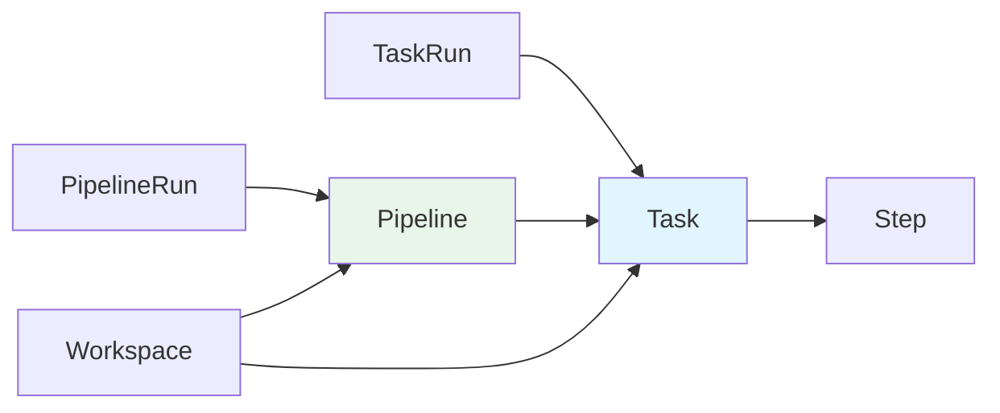

# Tekton 云原生 CI/CD

2019 年，Google 将 Knative 的 CI/CD 部分（最初称为 Build-Pipeline）捐赠给 Continuous Delivery Foundation（CDF），这就是 Tekton 的前身。

Tekton 的核心理念是**把 CI/CD 流水线变成一等公民的 Kubernetes 资源**。流水线不再是「运行在某个 CI 服务器中的脚本」，而是**直接运行在 Kubernetes 中的 Task 和 Pipeline 资源**。

这种设计带来的优势是巨大的：Kubernetes 的调度、隔离、扩缩容能力，直接为 CI/CD 流水线所用。你不再需要「维护 CI 服务器」，而是用「声明式的方式描述流水线」，让 Kubernetes 来执行它。

## Tekton 核心概念

### 五大核心资源



| 资源 | 说明 |
| --- | --- |
| **Step** | 基本的执行单元，类似 Dockerfile 中的 RUN |
| **Task** | 一组有序的 Step，共享同一个 Workspace |
| **TaskRun** | Task 的一次执行实例 |
| **Pipeline** | 一组有序的 Task，定义执行流程 |
| **PipelineRun** | Pipeline 的一次执行实例 |

### Task：基本执行单元

```yaml title="task.yaml"
apiVersion: tekton.dev/v1beta1
kind: Task
metadata:
  name: maven-build
spec:
  # 工作空间（类似 Volume）
  workspaces:
    - name: source
      mountPath: /workspace

  # 步骤
  steps:
    - name: checkout
      image: alpine/git:latest
      script: |
        #!/bin/sh
        git clone $(params.repo-url) $(workspaces.source.path)

    - name: build
      image: maven:3.9-eclipse-temurin-17
      workingDir: $(workspaces.source.path)
      script: |
        #!/bin/sh
        mvn clean package -DskipTests

    - name: test
      image: maven:3.9-eclipse-temurin-17
      workingDir: $(workspaces.source.path)
      script: |
        #!/bin/sh
        mvn test

    - name: docker-build
      image: docker:latest
      script: |
        #!/bin/sh
        docker build -t $(params.image-name):$(params.image-tag) .
```

## Task 与 TaskRun

### 参数化 Task

```yaml title="task-with-params.yaml"
apiVersion: tekton.dev/v1beta1
kind: Task
metadata:
  name: maven-build
spec:
  params:
    - name: repo-url
      type: string
    - name: image-name
      type: string
    - name: image-tag
      type: string
      default: latest

  steps:
    - name: build
      image: maven:3.9-eclipse-temurin-17
      script: |
        #!/bin/sh
        mvn clean package
```

### TaskRun：执行 Task

```yaml title="taskrun.yaml"
apiVersion: tekton.dev/v1beta1
kind: TaskRun
metadata:
  name: maven-build-run-1
spec:
  taskRef:
    name: maven-build
  params:
    - name: repo-url
      value: https://github.com/myorg/myapp
    - name: image-name
      value: myorg/myapp
    - name: image-tag
      value: "v1.0.0"
```

### 缓存与 Workspace

```yaml title="task-with-workspace.yaml"
apiVersion: tekton.dev/v1beta1
kind: Task
metadata:
  name: maven-build
spec:
  workspaces:
    - name: source
      description: Git 源码
    - name: maven-cache
      description: Maven 缓存
  steps:
    - name: mvn-cache-init
      image: busybox
      script: |
        #!/bin/sh
        # 初始化缓存目录
        mkdir -p $(workspaces.maven-cache.path)/.m2
    - name: maven-build
      image: maven:3.9-eclipse-temurin-17
      workingDir: $(workspaces.source.path)
      env:
        - name: M2_HOME
          value: $(workspaces.maven-cache.path)
      script: |
        #!/bin/sh
        # 挂载缓存
        ln -s $(workspaces.maven-cache.path)/.m2 ~/.m2
        mvn clean package
```

## Pipeline 与 PipelineRun

### 定义 Pipeline

```yaml title="pipeline.yaml"
apiVersion: tekton.dev/v1beta1
kind: Pipeline
metadata:
  name: myapp-ci
spec:
  # Pipeline 级别的参数
  params:
    - name: repo-url
      type: string
    - name: image-name
      type: string

  # Workspace 定义
  workspaces:
    - name: shared-workspace
    - name: maven-cache

  # Task 列表（有序执行）
  tasks:
    - name: fetch-source
      taskRef:
        name: git-clone
      params:
        - name: url
          value: $(params.repo-url)
      workspaces:
        - name: output
          workspace: shared-workspace

    - name: build
      taskRef:
        name: maven-build
      runAfter:
        - fetch-source
      params:
        - name: image-name
          value: $(params.image-name)
      workspaces:
        - name: source
          workspace: shared-workspace
        - name: maven-cache
          workspace: maven-cache

    - name: test
      taskRef:
        name: maven-test
      runAfter:
        - build
      workspaces:
        - name: source
          workspace: shared-workspace

    - name: build-image
      taskRef:
        name: docker-build
      runAfter:
        - test
      params:
        - name: image-name
          value: $(params.image-name)
      workspaces:
        - name: source
          workspace: shared-workspace
```

### 执行 Pipeline

```yaml title="pipelinerun.yaml"
apiVersion: tekton.dev/v1beta1
kind: PipelineRun
metadata:
  name: myapp-ci-run-1
spec:
  pipelineRef:
    name: myapp-ci
  params:
    - name: repo-url
      value: https://github.com/myorg/myapp
    - name: image-name
      value: myorg/myapp
  workspaces:
    - name: shared-workspace
      persistentVolumeClaim:
        claimName: shared-pvc
    - name: maven-cache
      volumeClaimTemplate:
        spec:
          accessModes:
            - ReadWriteOnce
          resources:
            requests:
              storage: 1Gi
```

## 条件执行与并行

### Task 执行顺序

```yaml title="pipeline-order.yaml"
spec:
  tasks:
    # 第一批：并行执行
    - name: build-frontend
      taskRef: { name: npm-build }
      runAfter: []  # 立即执行

    - name: build-backend
      taskRef: { name: maven-build }
      runAfter: []  # 立即执行

    # 第二批：等待第一批完成
    - name: test
      taskRef: { name: integration-test }
      runAfter:
        - build-frontend
        - build-backend

    # 第三批：等待测试完成
    - name: deploy
      taskRef: { name: kubectl-deploy }
      runAfter:
        - test
```

### when 条件

```yaml title="pipeline-with-when.yaml"
spec:
  tasks:
    - name: deploy-staging
      taskRef: { name: kubectl-deploy }
      when:
        - name: branch-is-develop
          input: $(params.branch)
          operator: in
          values: [develop]
      params:
        - name: environment
          value: staging

    - name: deploy-production
      taskRef: { name: kubectl-deploy }
      when:
        - name: branch-is-main
          input: $(params.branch)
          operator: in
          values: [main]
      params:
        - name: environment
          value: production
```

## Tekton Hub 与 Catalog

Tekton Hub 是 Tekton 官方维护的 Task 市场：

```bash
# 安装 Catalog 中的 Task
kubectl apply -f https://raw.githubusercontent.com/tektoncd/catalog/main/task/git-clone/0.9/git-clone.yaml

# 查看可用 Task
tkn hub list

# 搜索 Task
tkn hub search maven

# 安装 Task
tkn hub install task maven
```

### 常用 Catalog Task

```yaml title="using-catalog-tasks.yaml"
apiVersion: tekton.dev/v1beta1
kind: Pipeline
metadata:
  name: ci-pipeline
spec:
  tasks:
    # 使用 git-clone Task
    - name: clone
      taskRef:
        name: git-clone
        version: 0.9
      params:
        - name: url
          value: $(params.repo-url)
        - name: revision
          value: $(params.branch)

    # 使用 buildah Task 构建镜像
    - name: build
      taskRef:
        name: buildah
        version: 0.5
      runAfter:
        - clone
      params:
        - name: IMAGE
          value: $(params.image-name)
      workspaces:
        - name: source
          workspace: shared-workspace

    # 使用 kubectl Task 部署
    - name: deploy
      taskRef:
        name: kubernetes-actions
        version: 0.2
      runAfter:
        - build
```

## 与 ArgoCD 集成

### GitOps 工作流

```yaml title="pipeline-with-argocd.yaml"
apiVersion: tekton.dev/v1beta1
kind: Pipeline
metadata:
  name: gitops-pipeline
spec:
  params:
    - name: image-tag
    - name: gitops-repo-url

  tasks:
    - name: build-image
      taskRef: { name: kaniko }
      params:
        - name: IMAGE
          value: myorg/myapp:$(params.image-tag)

    - name: update-gitops
      taskRef: { name: update-gitops }
      runAfter:
        - build-image
      params:
        - name: gitops-repo-url
          value: $(params.gitops-repo-url)
        - name: image-tag
          value: $(params.image-tag)
```

### Trigger 自动触发

```yaml title="tekton-trigger.yaml"
apiVersion: triggers.tekton.dev/v1beta1
kind: TriggerTemplate
metadata:
  name: ci-trigger-template
spec:
  params:
    - name: git-repo-url
    - name: git-branch
    - name: git-commit-sha

  resourcetemplates:
    - apiVersion: tekton.dev/v1beta1
      kind: PipelineRun
      metadata:
        generateName: ci-pipeline-run-
      spec:
        pipelineRef:
          name: ci-pipeline
        params:
          - name: repo-url
            value: $(tt.params.git-repo-url)
          - name: branch
            value: $(tt.params.git-branch)
```

```yaml title="eventlistener.yaml"
apiVersion: triggers.tekton.dev/v1beta1
kind: EventListener
metadata:
  name: github-listener
spec:
  serviceAccountName: tekton-triggers-admin
  triggers:
    - name: github-push-trigger
      interceptors:
        - ref:
            name: github
          params:
            - name: secretRef
              value:
                secretName: github-secret
                secretKey: secretToken
      bindings:
        - ref: github-binding
      template:
        ref: ci-trigger-template
```

## 安装与配置

### 安装 Tekton

```bash
# 安装 Tekton Pipeline
kubectl apply -f https://storage.googleapis.com/tekton-releases/pipeline/latest/release.yaml

# 安装 Tekton Dashboard
kubectl apply -f https://storage.googleapis.com/tekton-releases/dashboard/latest/tekton-dashboard-release.yaml

# 安装 Tekton Triggers
kubectl apply -f https://storage.googleapis.com/tekton-releases/triggers/latest/release.yaml

# 安装 Tekton CLI
brew install tektoncd-cli
```

### RBAC 配置

```yaml title="tekton-rbac.yaml"
apiVersion: v1
kind: ServiceAccount
metadata:
  name: tekton-pipeline-runner
  namespace: default
---
apiVersion: rbac.authorization.k8s.io/v1
kind: Role
metadata:
  name: tekton-pipeline-runner
rules:
  - apiGroups: [""]
    resources: ["pods", "pods/log"]
    verbs: ["get", "list"]
  - apiGroups: ["tekton.dev"]
    resources: ["taskruns", "pipelineruns"]
    verbs: ["create", "get", "list", "watch"]
---
apiVersion: rbac.authorization.k8s.io/v1
kind: RoleBinding
metadata:
  name: tekton-pipeline-runner-binding
roleRef:
  kind: Role
  name: tekton-pipeline-runner
  apiGroup: rbac.authorization.k8s.io
subjects:
  - kind: ServiceAccount
    name: tekton-pipeline-runner
    namespace: default
```

## 最佳实践

### Task 复用

```yaml title="best-practice-reusable-task.yaml"
# 定义可复用的 Task
apiVersion: tekton.dev/v1beta1
kind: Task
metadata:
  name: run-tests
spec:
  params:
    - name: test-command
      type: string
  steps:
    - name: run-test
      image: maven:3.9-eclipse-temurin-17
      script: |
        #!/bin/sh
        $(params.test-command)
```

### Pipeline 模板化

```yaml title="best-practice-template.yaml"
apiVersion: tekton.dev/v1beta1
kind: Pipeline
metadata:
  name: app-ci-template
spec:
  params:
    - name: app-name
    - name: repo-url
    - name: test-command

  tasks:
    - name: clone
      taskRef: { name: git-clone }
      params:
        - name: url
          value: $(params.repo-url)

    - name: test
      taskRef: { name: run-tests }
      params:
        - name: test-command
          value: $(params.test-command)
      runAfter:
        - clone
```

## 权衡矩阵

| 维度 | Tekton 优势 | Tekton 劣势 |
| --- | --- | --- |
| **云原生** | Kubernetes 原生，无需外部服务器 | 学习曲线较陡 |
| **可扩展性** | 天然支持分布式构建 | 需要 Kubernetes 集群 |
| **复用性** | Task/Pipeline 可复用 | YAML 较多 |
| **生态** | 完善的 Catalog | 相对较新 |
| **供应商锁定** | Kubernetes 标准 | 需要 Kubernetes 环境 |

## 与其他工具对比

| 工具 | 定位 | 适用场景 |
| --- | --- | --- |
| **Tekton** | Kubernetes 原生流水线 | Kubernetes 环境，需要高度定制 |
| **Argo Workflows** | Kubernetes 原生工作流 | 更复杂的工作流（不仅仅是 CI/CD） |
| **Jenkins** | 传统 CI 服务器 | 已有 Jenkins 基础设施 |
| **GitHub Actions** | SaaS CI/CD | GitHub 托管的代码 |

## 延伸思考

Tekton 代表了 CI/CD 的未来方向：**让 Kubernetes 成为 CI/CD 的执行引擎**。这种设计的优势在于：

1. **统一资源管理**：CI/CD 流水线和其他 Kubernetes 资源一样管理
2. **弹性扩缩容**：根据负载自动扩缩 CI/CD 能力
3. **隔离性**：每个 Task 运行在独立的 Pod 中
4. **可观测性**：利用 Kubernetes 的日志和监控

但 Tekton 也有代价：**初始配置较复杂**。你需要在 Kubernetes 上部署和维护 Tekton 本身，配置 RBAC 和持久化存储。

对于已经有 Kubernetes 基础设施的团队，Tekton 是最佳选择。对于还没有 Kubernetes 的团队，可能需要先评估迁移成本。

**建议**：如果你已经运行 ArgoCD 或 Flux，Tekton 可以作为 CI 层的补充，负责构建和打包，而 ArgoCD/Flux 负责部署。