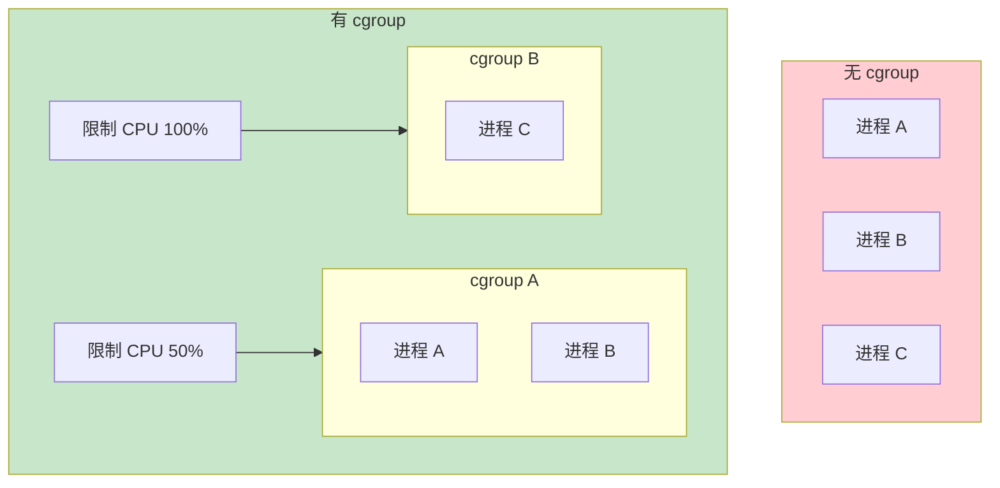
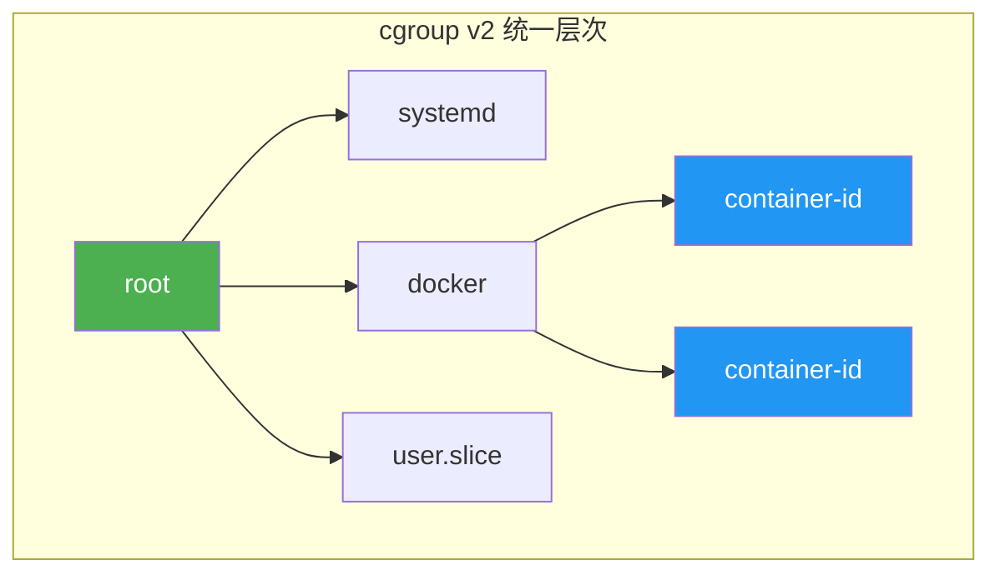

# cgroup 原理与配置

你给容器设置了 1GB 内存限制，但 Java 应用的 JVM 竟然分配了 2GB 堆内存——容器被 OOM Kill 了。

这不是配置错误，而是因为你没有理解 **cgroup（Control Groups）** 的工作原理。

cgroup 是 Linux 内核提供的资源控制机制，是容器实现资源限制的底层基础。理解 cgroup，才能真正掌握容器资源管理。

## cgroup 的设计目标

在没有 cgroup 的时代，所有进程共享宿主机的资源。一个进程的问题可能拖垮整台机器。cgroup 的设计目标是**对进程组进行资源限制和优先级控制**。



关键点：
- **资源限制**：限制进程组能使用的 CPU、内存、IO 等资源
- **优先级**：不同进程组可以有不同的资源优先级
- **记账**：统计每个进程组的资源使用情况
- **隔离**：不同进程组之间相互隔离

## cgroup v1 vs cgroup v2

cgroup 有两个版本：v1 和 v2。cgroup v2 从 Linux 4.5 开始支持，目前大多数发行版已默认使用。

| 特性 | cgroup v1 | cgroup v2 |
| --- | --- | --- |
| **控制器层次** | 每个控制器独立层次 | 统一层次结构 |
| **线程模式** | 仅进程模式 | 支持线程模式 |
| **委托** | 复杂 | 简化 |
| **内存压力检测** | 需要 oomd | 内置压力检测 |

### 查看当前版本

```bash
# 查看 cgroup 版本
mount | grep cgroup

# cgroup v2 通常挂载在 /sys/fs/cgroup
# cgroup v1 可能挂载在 /cgroup/cpu 等多个位置
```

### cgroup v2 的统一层次



cgroup v2 要求所有控制器在同一个层次结构中，这解决了 v1 中控制器之间无法协作的问题。

## cgroup 控制器

### 主要控制器

| 控制器 | 功能 | 内核参数 |
| --- | --- | --- |
| **cpu** | CPU 时间调度 | `/sys/fs/cgroup/cpu` |
| **cpuacct** | CPU 资源记账 | `/sys/fs/cgroup/cpuacct` |
| **memory** | 内存限制 | `/sys/fs/cgroup/memory` |
| **io** | 磁盘 I/O 限制 | `/sys/fs/cgroup/io` |
| **pids** | 进程数限制 | `/sys/fs/cgroup/pids` |
| **devices** | 设备访问控制 | `/sys/fs/cgroup/devices` |
| **freezer** | 冻结/恢复进程 | `/sys/fs/cgroup/freezer` |

### 控制器启用

```bash
# 查看已启用的控制器
cat /sys/fs/cgroup/cgroup.controllers

# 输出示例：cpu cpuacct io memory pids rdma misc
```

## 内存控制详解

### 内存限制参数

```bash
# 查看容器的 cgroup 配置（假设容器 PID 是 1234）
cat /proc/1234/cgroup

# 内存限制配置
ls /sys/fs/cgroup/memory/docker/<container-id>/
```

关键文件：

| 文件 | 说明 |
| --- | --- |
| `memory.limit_in_bytes` | 内存限制 |
| `memory.soft_limit_in_bytes` | 软限制（宽松限制） |
| `memory.usage_in_bytes` | 当前使用量 |
| `memory.failcnt` | OOM 次数 |
| `memory.oom_control` | OOM 控制 |

### 内存限制配置

```bash title="设置内存限制（通过 cgroupfs）"
# 创建 cgroup
mkdir -p /sys/fs/cgroup/memory/myapp

# 设置内存限制为 1GB
echo 1073741824 > /sys/fs/cgroup/memory/myapp/memory.limit_in_bytes

# 设置软限制为 512MB
echo 536870912 > /sys/fs/cgroup/memory/myapp/memory.soft_limit_in_bytes

# 将进程加入 cgroup
echo <pid> > /sys/fs/cgroup/memory/myapp/tasks
```

### 内存压力检测

cgroup v2 提供了内存压力检测机制：

```bash
# 查看内存压力级别
cat /sys/fs/cgroup/memory/memory.pressure

# 设置内存压力事件通知
echo 536870912 > /sys/fs/cgroup/memory/myapp/memory.pressure.min

# 监控内存压力
# 写入 "some" 到 memory.pressure 文件来获取通知
```

## CPU 控制详解

### CPU 限制参数

```bash
# 查看 CPU 相关配置
ls /sys/fs/cgroup/cpu/docker/<container-id>/
```

关键文件：

| 文件 | 说明 |
| --- | --- |
| `cpu.cfs_period_us` | CFS 调度周期（默认 100000 微秒） |
| `cpu.cfs_quota_us` | CFS 调度周期内可用的 CPU 时间 |
| `cpu.shares` | CPU 权重（相对值） |
| `cpuacct.usage` | 累计 CPU 使用时间（纳秒） |

### CFS 调度器限制

CFS（Completely Fair Scheduler）是 Linux 默认的 CPU 调度器。

```bash
# 限制为使用 0.5 个 CPU（每 100ms 周期中使用 50ms）
echo 50000 > /sys/fs/cgroup/cpu/myapp/cpu.cfs_quota_us
echo 100000 > /sys/fs/cgroup/cpu/myapp/cpu.cfs_period_us

# 验证配置
cat /sys/fs/cgroup/cpu/myapp/cpu.cfs_quota_us
cat /sys/fs/cgroup/cpu/myapp/cpu.cfs_period_us
```

### CPU 权重（shares）

```bash
# 设置 CPU 权重（默认值 1024）
# 权重越高，获得的 CPU 时间越多
echo 2048 > /sys/fs/cgroup/cpu/myapp/cpu.shares

# 例如：
# cgroup A: cpu.shares = 1024（获得 50% CPU）
# cgroup B: cpu.shares = 2048（获得 100% CPU）
```

### cgroup v2 的 CPU 控制器

cgroup v2 统一使用 `cpu.weight` 和 `cpu.max`：

```bash
# 设置 CPU 带宽限制
# 格式：max 或 "period_us quota_us"
echo "max" > /sys/fs/cgroup/cpu/myapp/cpu.max
echo "50000 100000" > /sys/fs/cgroup/cpu/myapp/cpu.max

# 设置 CPU 权重（默认值 100）
echo "200" > /sys/fs/cgroup/cpu/myapp/cpu.weight
```

## I/O 控制详解

### 限制磁盘 I/O

```bash
# 查看可用设备
cat /sys/fs/cgroup/io/docker/<container-id>/io.bfq.weight

# 设置 I/O 权重
echo 500 > /sys/fs/cgroup/io/myapp/io.bfq.weight
```

### I/O 带宽限制

```bash
# 限制读带宽为 100MB/s
echo "read_iops_max=100" > /sys/fs/cgroup/io/myapp/io.max

# 限制写带宽为 50MB/s
echo "write_bps_max=52428800" > /sys/fs/cgroup/io/myapp/io.max
```

## PID 限制

限制进程树中的最大进程数：

```bash
# 最大进程数
echo 100 > /sys/fs/cgroup/pids/myapp/pids.max

# 查看当前进程数
cat /sys/fs/cgroup/pids/myapp/pids.current

# 查看峰值
cat /sys/fs/cgroup/pids/myapp/pids.max
```

## Docker 中的 cgroup 配置

### 通过 docker 命令限制资源

```bash
# 内存限制
docker run -m 1g myapp

# CPU 限制（限制为 0.5 个 CPU）
docker run --cpus=0.5 myapp

# CPU 核心绑定
docker run --cpuset-cpus="0,1" myapp

# I/O 限制
docker run \
  --device-read-bps=/dev/sda:10mb \
  --device-write-bps=/dev/sda:5mb \
  myapp
```

### docker stats 查看资源使用

```bash
# 查看所有容器资源使用
docker stats

# 输出示例：
# CONTAINER ID  NAME  CPU %  MEM USAGE / LIMIT     MEM %  NET I/O           BLOCK I/O
# abc123        app   0.52%  256MiB / 1GiB        25.60% 1.2MB / 500KB     10MB / 5MB
```

## Kubernetes 中的资源限制

### Pod 资源请求与限制

```yaml title="Kubernetes 资源配置"
apiVersion: v1
kind: Pod
metadata:
  name: myapp
spec:
  containers:
  - name: myapp
    image: myapp
    resources:
      requests:
        memory: "256Mi"     # 调度时使用
        cpu: "100m"
      limits:
        memory: "512Mi"     # OOM 触发阈值
        cpu: "500m"
```

### LimitRange 配置

```yaml title="设置命名空间默认限制"
apiVersion: v1
kind: LimitRange
metadata:
  name: default-limits
spec:
  limits:
  - max:
      memory: 1Gi
      cpu: "500m"
    min:
      memory: 128Mi
      cpu: "50m"
    default:
      memory: 256Mi
      cpu: "100m"
    defaultRequest:
      memory: 128Mi
      cpu: "50m"
    type: Container
```

### ResourceQuota 配置

```yaml title="设置命名空间总资源配额"
apiVersion: v1
kind: ResourceQuota
metadata:
  name: quota
spec:
  hard:
    requests.cpu: "4"
    requests.memory: 8Gi
    limits.cpu: "8"
    limits.memory: 16Gi
    pods: "20"
```

## cgroup 问题排查

### 查看 cgroup 信息

```bash
# 查看进程所属的 cgroup
cat /proc/<pid>/cgroup

# 示例输出：
# 0::/system.slice/docker-<container-id>.scope
# 这里的 0:: 表示使用 cgroup v2
```

### 内存限制导致 OOM

```bash
# 查看容器 OOM 次数
docker exec myapp cat /sys/fs/cgroup/memory/memory.oom_control

# 查看 OOM 事件
dmesg | grep -i oom

# 查看 Kubernetes Pod OOM 事件
kubectl describe pod myapp | grep -A10 Events
```

### CPU 节流

```bash
# 查看 CPU 节流统计
cat /sys/fs/cgroup/cpu/cpu.stat

# 输出示例：
# nr_periods 1000
# nr_throttled 500    # 被节流的周期数
# throttled_time 10000000000  # 被节流的总时间（纳秒）
```

## 常见问题与排查

### 问题一：内存限制不生效

**原因**：容器内进程可能通过 `/sys/fs/cgroup` 访问真实的 cgroup 配置，但配置可能被覆盖。

**排查**：

```bash
# 检查容器实际的内存限制
docker inspect myapp | grep -A20 Memory

# 检查进程实际使用的 cgroup
cat /proc/<pid>/cgroup

# 查看内存限制文件
docker exec myapp cat /sys/fs/cgroup/memory/memory.limit_in_bytes
```

### 问题二：CPU 限制不准

**原因**：CPU 限制在容器级别生效，宿主机上其他进程可能影响容器实际的 CPU 可用性。

**解决方案**：使用 `cpuset` 将容器绑定到特定 CPU 核心，减少干扰。

### 问题三：容器内看不到真实资源

**原因**：容器内 `/proc` 文件系统显示的是宿主机的资源信息，而不是容器的限制。

**解决方案**：通过 cgroupfs 查看实际的限制配置。

## 权衡矩阵

| 限制维度 | 配置方式 | 适用场景 | 注意事项 |
| --- | --- | --- | --- |
| **内存限制** | `-m` 或 `memory.limit` | 所有应用 | JVM 需要配置感知容器限制 |
| **CPU 限制** | `--cpus` 或 `cpu.max` | CPU 敏感应用 | 限制可能导致性能下降 |
| **I/O 限制** | `--device-read-bps` | 存储密集型应用 | 配置复杂，需要基准测试 |
| **PID 限制** | `pids.max` | 防止 fork 炸弹 | 太小会导致进程无法启动 |

## 常见反模式

### 反模式一：不设置资源限制

```bash
# 错误：无限制容器
docker run myapp

# 一个失控的容器可能耗尽整台机器的资源
```

**正确做法**：总是设置资源限制。

### 反模式二：内存限制设得太小

```bash
# 错误：内存限制小于应用正常需求
docker run -m 256m myapp  # 应用需要 1GB 内存

# 结果：OOM Kill
```

**正确做法**：基于应用的真实内存需求设置限制，并考虑元空间、线程栈等额外开销。

### 反模式三：CPU 限制过严

```bash
# 错误：CPU 限制过严
docker run --cpus=0.1 myapp  # 限制为 10% CPU

# 应用响应缓慢，无法满足 SLA
```

**正确做法**：基于应用的 CPU 需求和 SLA 要求设置合理的限制。

### 反模式四：不监控资源使用

```bash
# 错误：不监控
docker run myapp

# 正确：使用监控工具
docker stats
prometheus + cAdvisor
```

## 延伸思考

cgroup 是容器技术的基石之一。正是因为 cgroup 提供了精确的资源限制能力，容器才能在共享宿主机资源的同时保证隔离性。

理解 cgroup 的关键，是明白它是一个**层次化的资源控制系统**。每个进程属于某个 cgroup，每个 cgroup 可以设置资源限制，限制会向下传递给子 cgroup 和进程。

在实际工作中，cgroup 的配置通常由容器运行时（Docker）或容器编排系统（Kubernetes）自动完成。但当你遇到资源限制相关的问题时，理解 cgroup 的工作原理，才能找到真正的原因。

当你的容器被 OOM Kill 时，先看看 `/sys/fs/cgroup/memory/` 下的配置；当 CPU 限制导致性能下降时，先看看 `/sys/fs/cgroup/cpu/` 下的节流统计。这些数字会告诉你真正发生了什么。