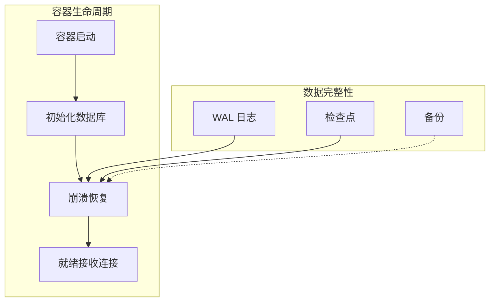

你的 PostgreSQL 数据库容器化后跑了三个月，一切正常。直到某天宿主机重启，容器自动重启——然后数据库起不来了。

日志显示：`FATAL: data directory "/var/lib/postgresql/data" has wrong ownership`。

这不是 Docker 的问题，而是你没有正确理解数据库与持久化存储的关系。数据库容器化有它独特的挑战：数据持久化、配置管理、初始化逻辑、性能优化。这篇文章帮你避开这些坑。

## 数据库容器化的核心挑战

容器化的数据库与普通应用不同：

| 维度 | 普通应用 | 数据库 |
| --- | --- | --- |
| **状态** | 无状态 | 有状态 |
| **I/O** | 正常负载 | 高频读写 |
| **数据** | 可丢失 | 不可丢失 |
| **启动** | 秒级 | 可能需要初始化 |
| **故障恢复** | 重启即可 | 需要数据完整性检查 |



## PostgreSQL 容器化

### 基础配置

```yaml title="docker-compose.yml"
version: '3.9'

services:
  db:
    image: postgres:16-alpine
    environment:
      POSTGRES_DB: myapp
      POSTGRES_USER: user
      POSTGRES_PASSWORD: ${DB_PASSWORD}
      PGDATA: /var/lib/postgresql/data/pgdata
    volumes:
      - postgres_data:/var/lib/postgresql/data
    ports:
      - "5432:5432"
    healthcheck:
      test: ["CMD-SHELL", "pg_isready -U user -d myapp"]
      interval: 10s
      timeout: 5s
      retries: 5
      start_period: 30s
    deploy:
      resources:
        limits:
          memory: 2G
          cpus: '1.0'
        reservations:
          memory: 512M
          cpus: '0.25'

volumes:
  postgres_data:
    driver: local
```

### 自定义配置

```bash title="postgresql.conf"
# postgresql.conf
max_connections = 100
shared_buffers = 256MB
effective_cache_size = 768MB
maintenance_work_mem = 64MB
checkpoint_completion_target = 0.9
wal_buffers = 16MB
default_statistics_target = 100
random_page_cost = 1.1
effective_io_concurrency = 200
work_mem = 2621kB
min_wal_size = 1GB
max_wal_size = 4GB
max_worker_processes = 4
max_parallel_workers_per_gather = 2
max_parallel_workers = 4
max_parallel_maintenance_workers = 2
```

```yaml title="带自定义配置的 Docker Compose"
version: '3.9'

services:
  db:
    image: postgres:16-alpine
    environment:
      POSTGRES_DB: myapp
      POSTGRES_USER: user
      POSTGRES_PASSWORD: ${DB_PASSWORD}
    volumes:
      - postgres_data:/var/lib/postgresql/data
      - ./config/postgresql.conf:/etc/postgresql/postgresql.conf
    command:
      - postgres
      - -c
      - config_file=/etc/postgresql/postgresql.conf
    ports:
      - "5432:5432"
```

### 初始化脚本

```bash title="初始化脚本目录结构"
./init-scripts/
├── 01-init.sql          # 初始数据库结构
├── 02-seed.sql          # 种子数据
└── 03-extensions.sql     # 安装扩展
```

```sql title="01-init.sql"
-- 创建扩展
CREATE EXTENSION IF NOT EXISTS "uuid-ossp";
CREATE EXTENSION IF NOT EXISTS "pg_trgm";

-- 创建表
CREATE TABLE IF NOT EXISTS users (
    id UUID PRIMARY KEY DEFAULT uuid_generate_v4(),
    email VARCHAR(255) UNIQUE NOT NULL,
    password_hash VARCHAR(255) NOT NULL,
    created_at TIMESTAMP WITH TIME ZONE DEFAULT NOW(),
    updated_at TIMESTAMP WITH TIME ZONE DEFAULT NOW()
);

-- 创建索引
CREATE INDEX idx_users_email ON users(email);
CREATE INDEX idx_users_created_at ON users(created_at);
```

```yaml title="使用初始化脚本"
services:
  db:
    image: postgres:16-alpine
    environment:
      POSTGRES_DB: myapp
      POSTGRES_USER: user
      POSTGRES_PASSWORD: ${DB_PASSWORD}
    volumes:
      - postgres_data:/var/lib/postgresql/data
      - ./init-scripts:/docker-entrypoint-initdb.d
    ports:
      - "5432:5432"
```

:::tip
**初始化脚本的执行时机**

初始化脚本只在数据库**第一次初始化时**执行。如果 Volume 已包含数据，初始化脚本不会再次执行。这与 Docker 的 volume 生命周期有关——volume 是持久化的，不会自动重置。
:::

### 备份与恢复

```bash title="备份脚本"
#!/bin/bash
# backup.sh

set -e

BACKUP_DIR="/backups"
DATE=$(date +%Y%m%d_%H%M%S)
BACKUP_FILE="postgres_${DATE}.sql.gz"

# 创建备份目录
mkdir -p ${BACKUP_DIR}

# 执行备份
docker exec -it postgres_container pg_dump -U user -d myapp | gzip > ${BACKUP_DIR}/${BACKUP_FILE}

# 保留最近 7 天的备份
find ${BACKUP_DIR} -name "postgres_*.sql.gz" -mtime +7 -delete

echo "Backup completed: ${BACKUP_FILE}"
```

```bash title="恢复脚本"
#!/bin/bash
# restore.sh

set -e

BACKUP_FILE=$1

if [ -z "$BACKUP_FILE" ]; then
    echo "Usage: $0 <backup_file>"
    exit 1
fi

if [ ! -f "$BACKUP_FILE" ]; then
    echo "Backup file not found: $BACKUP_FILE"
    exit 1
fi

# 恢复前确保数据库为空
docker exec -i postgres_container psql -U user -d myapp -c "DROP SCHEMA public CASCADE; CREATE SCHEMA public;"

# 执行恢复
gunzip -c ${BACKUP_FILE} | docker exec -i postgres_container psql -U user -d myapp

echo "Restore completed from: ${BACKUP_FILE}"
```

## MySQL 容器化

### 基础配置

```yaml title="MySQL Docker Compose"
version: '3.9'

services:
  mysql:
    image: mysql:8
    environment:
      MYSQL_ROOT_PASSWORD: ${MYSQL_ROOT_PASSWORD}
      MYSQL_DATABASE: myapp
      MYSQL_USER: user
      MYSQL_PASSWORD: ${MYSQL_PASSWORD}
    volumes:
      - mysql_data:/var/lib/mysql
      - ./config/my.cnf:/etc/mysql/conf.d/custom.cnf
      - ./init-scripts:/docker-entrypoint-initdb.d
    ports:
      - "3306:3306"
    healthcheck:
      test: ["CMD", "mysqladmin", "ping", "-h", "localhost", "-u", "root", "-p${MYSQL_ROOT_PASSWORD}"]
      interval: 10s
      timeout: 5s
      retries: 5
      start_period: 60s
    command:
      - --character-set-server=utf8mb4
      - --collation-server=utf8mb4_unicode_ci
      - --default-authentication-plugin=mysql_native_password

volumes:
  mysql_data:
```

```ini title="my.cnf 配置"
[mysqld]
# 性能配置
innodb_buffer_pool_size = 1G
innodb_log_file_size = 256M
innodb_flush_log_at_trx_commit = 1
innodb_flush_method = O_DIRECT

# 连接配置
max_connections = 200
wait_timeout = 600

# 日志配置
slow_query_log = 1
slow_query_log_file = /var/log/mysql/slow.log
long_query_time = 2

# 字符集
character-set-server = utf8mb4
collation-server = utf8mb4_unicode_ci
```

### MySQL 8 的特殊配置

```bash title="MySQL 8 密码认证"
# MySQL 8 默认使用 caching_sha2_password
# 某些旧客户端可能不兼容

# 查看认证方式
docker exec -it mysql mysql -u root -p -e "SELECT user, host, plugin FROM mysql.user;"

# 如果需要兼容旧客户端，可以改回 native_password
docker exec -it mysql mysql -u root -p -e \
    "ALTER USER 'user'@'%' IDENTIFIED WITH mysql_native_password BY 'password';"
```

## MongoDB 容器化

### 基础配置

```yaml title="MongoDB Docker Compose"
version: '3.9'

services:
  mongodb:
    image: mongo:7
    environment:
      MONGO_INITDB_ROOT_USERNAME: root
      MONGO_INITDB_ROOT_PASSWORD: ${MONGO_ROOT_PASSWORD}
      MONGO_INITDB_DATABASE: myapp
    volumes:
      - mongo_data:/data/db
      - ./config/mongod.conf:/etc/mongo/mongod.conf
      - ./init-scripts:/docker-entrypoint-initdb.d
    ports:
      - "27017:27017"
    healthcheck:
      test: ["CMD", "mongosh", "--eval", "db.adminCommand('ping')"]
      interval: 10s
      timeout: 5s
      retries: 5
      start_period: 30s

volumes:
  mongo_data:
```

```yaml title="mongod.conf"
storage:
  dbPath: /data/db
  journal:
    enabled: true
  engine: wiredTiger

systemLog:
  destination: file
  logAppend: true
  path: /var/log/mongodb/mongod.log

net:
  port: 27017
  bindIp: 0.0.0.0

operationProfiling:
  mode: slowOp
  slowOpThresholdMs: 100
```

### Replica Set 配置

```yaml title="MongoDB Replica Set"
version: '3.9'

services:
  mongo1:
    image: mongo:7
    container_name: mongo1
    environment:
      MONGO_INITDB_ROOT_USERNAME: root
      MONGO_INITDB_ROOT_PASSWORD: password
    volumes:
      - mongo1_data:/data/db
    ports:
      - "27017:27017"
    command: mongod --replSet rs0 --keyFile /etc/mongo/keyfile

  mongo2:
    image: mongo:7
    container_name: mongo2
    environment:
      MONGO_INITDB_ROOT_USERNAME: root
      MONGO_INITDB_ROOT_PASSWORD: password
    volumes:
      - mongo2_data:/data/db
    ports:
      - "27018:27017"
    command: mongod --replSet rs0 --keyFile /etc/mongo/keyfile

  mongo3:
    image: mongo:7
    container_name: mongo3
    environment:
      MONGO_INITDB_ROOT_USERNAME: root
      MONGO_INITDB_ROOT_PASSWORD: password
    volumes:
      - mongo3_data:/data/db
    ports:
      - "27019:27017"
    command: mongod --replSet rs0 --keyFile /etc/mongo/keyfile

volumes:
  mongo1_data:
  mongo2_data:
  mongo3_data:
```

```bash title="初始化 Replica Set"
# 等待所有容器启动后，执行初始化
docker exec -it mongo1 mongosh --eval '
    rs.initiate({
        _id: "rs0",
        members: [
            { _id: 0, host: "mongo1:27017" },
            { _id: 1, host: "mongo2:27017" },
            { _id: 2, host: "mongo3:27017" }
        ]
    });
'
```

## Kubernetes 数据库部署

### StatefulSet 配置

```yaml title="postgresql-statefulset.yaml"
apiVersion: apps/v1
kind: StatefulSet
metadata:
  name: postgres
spec:
  serviceName: postgres-headless
  replicas: 1
  selector:
    matchLabels:
      app: postgres
  template:
    metadata:
      labels:
        app: postgres
    spec:
      containers:
        - name: postgres
          image: postgres:16-alpine
          ports:
            - containerPort: 5432
              name: postgres
          env:
            - name: POSTGRES_DB
              value: myapp
            - name: POSTGRES_USER
              value: user
            - name: POSTGRES_PASSWORD
              valueFrom:
                secretKeyRef:
                  name: postgres-secret
                  key: password
          resources:
            requests:
              memory: "512Mi"
              cpu: "250m"
            limits:
              memory: "2Gi"
              cpu: "1"
          volumeMounts:
            - name: data
              mountPath: /var/lib/postgresql/data
          livenessProbe:
            exec:
              command: ["pg_isready", "-U", "user", "-d", "myapp"]
            initialDelaySeconds: 30
            periodSeconds: 10
          readinessProbe:
            exec:
              command: ["pg_isready", "-U", "user", "-d", "myapp"]
            initialDelaySeconds: 5
            periodSeconds: 5
  volumeClaimTemplates:
    - metadata:
        name: data
      spec:
        accessModes: ["ReadWriteOnce"]
        storageClassName: "ssd"
        resources:
          requests:
            storage: 20Gi
```

### PVC 备份

```yaml title="postgres-backup-job.yaml"
apiVersion: batch/v1
kind: Job
metadata:
  name: postgres-backup
spec:
  ttlSecondsAfterFinished: 3600
  template:
    spec:
      containers:
        - name: backup
          image: postgres:16-alpine
          command:
            - /bin/sh
            - -c
            - |
              pg_dump -h postgres -U user -d myapp > /backups/backup_$(date +%Y%m%d_%H%M%S).sql
          env:
            - name: PGPASSWORD
              valueFrom:
                secretKeyRef:
                  name: postgres-secret
                  key: password
          volumeMounts:
            - name: backup-storage
              mountPath: /backups
      volumes:
        - name: backup-storage
          persistentVolumeClaim:
            claimName: backup-pvc
      restartPolicy: OnFailure
```

## 常见问题与反模式

### 问题 1：数据卷权限问题

**现象**：`FATAL: data directory "/var/lib/postgresql/data" has wrong ownership`。

**根因**：PostgreSQL 要求数据目录属于 `postgres` 用户。

**解决方案**：

```yaml
services:
  db:
    user: "999"  # postgres 用户的 UID
    # 或者在启动前确保目录权限正确
```

### 问题 2：宿主机重启后数据损坏

**现象**：重启后数据库无法启动，需要修复。

**根因**：数据库在写入时宿主机强制重启。

**解决方案**：

```bash
# 配置 fsync = on（默认）
# 配置 synchronous_commit = on（默认）
# 重要配置
fsync = on
synchronous_commit = on
wal_level = replica
```

### 问题 3：性能远低于预期

**现象**：容器化后数据库性能明显下降。

**根因**：I/O 性能问题，容器 I/O 隔离不完善。

**解决方案**：

```yaml
# 使用本地 volume（而非绑定挂载）
volumes:
  - db_data:/var/lib/postgresql/data

# 如果必须用绑定挂载，确保使用 XFS 或 ext4
# 避免 NFS（在 NFS 上性能会显著下降）
```

### 问题 4：内存配置不生效

**现象**：`shared_buffers` 配置的值在容器中被覆盖。

**根因**：PostgreSQL Docker 镜像可能检测容器内存限制并自动调整参数。

**解决方案**：

```dockerfile
# 明确指定不使用自动配置
FROM postgres:16-alpine
ENV POSTGRES_HOST_AUTH_METHOD=trust
# 不设置 shared_buffers，让配置文件生效
```

## 权衡矩阵

| 场景 | 推荐方案 | 不推荐 | 说明 |
| --- | --- | --- | --- |
| 开发环境 | Docker Compose + 本地 Volume | 绑定挂载 | 快速启动 |
| 测试环境 | Docker Compose | 直接安装 | 环境一致 |
| 生产环境 | Kubernetes + 云存储 | 本地存储 | 高可用、可扩展 |
| 小规模生产 | Docker + bind mount NFS | 本地存储 | 备份恢复方便 |
| 需要高可用 | Patroni + Raft | 单机容器 | 自动故障切换 |

## 延伸思考

数据库容器化的真正问题不是「能不能跑」，而是「能不能在生产环境跑」。

有几个关键问题值得思考：

1. **备份与恢复**：你的备份策略是什么？恢复时间目标（RTO）和恢复点目标（RPO）是多少？容器化后，这些流程需要重新设计。

2. **监控与告警**：PostgreSQL 有 `pg_stat_*` 视图，MySQL 有 performance schema。这些在容器环境中如何采集？

3. **升级策略**：数据库升级（如 PostgreSQL 14 → 16）如何处理？需要 dump/restore 还是原地升级？

更深一层的问题是：**你的数据真的需要容器化吗？**

对于大多数团队，使用云数据库服务（RDS、Cloud SQL、Azure Database）可能是更好的选择。容器化数据库适合的场景是：
- 有专业的 DBA 团队
- 需要自定义扩展或插件
- 成本敏感，需要精细控制
- 在私有环境运行

如果你的团队没有 DBA 经验，把数据库交给云服务可能是更明智的选择。