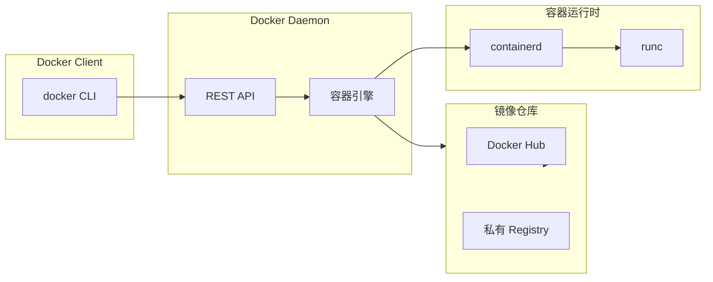
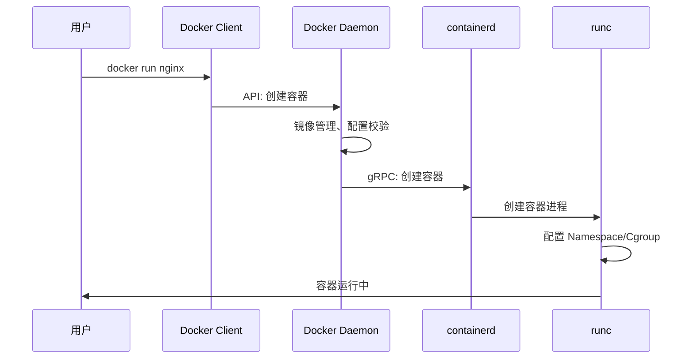
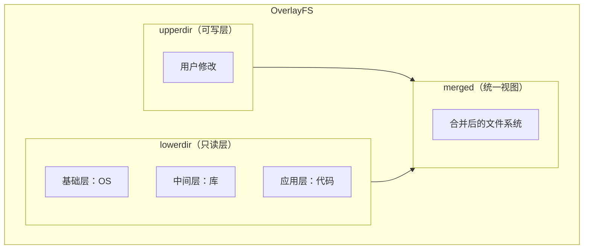

# Docker 架构深度解析

当你执行 `docker run hello-world` 时，Docker 到底做了什么？从命令行敲下回车，到容器成功运行，这中间经历了怎样的旅程？

理解 Docker 架构，不仅是面试中常被问到的问题，更是解决实际问题的前提。当你遇到容器网络不通、存储卷挂载失败、镜像拉取报错时，如果不了解 Docker 的内部机制，排查问题就像盲人摸象。

## Docker 架构概览

Docker 采用经典的**客户端-服务器（Client-Server）** 架构。



三个核心组件分工明确：

- **Docker Client**：命令行工具，与用户交互
- **Docker Daemon**：后台服务，负责镜像管理、容器运行等核心功能
- **Registry**：镜像仓库，存储和分发镜像

## Docker Client：用户的入口

`docker` 命令行工具是用户与 Docker 交互的唯一方式。当你执行 `docker pull nginx` 时，Docker Client 做了什么？

```bash
# docker 命令本质上是一个 HTTP 客户端
docker pull nginx:latest

# 可以通过 DOCKER_HOST 环境变量指定 Daemon 地址
export DOCKER_HOST=tcp://192.168.1.100:2375
docker ps
```

Docker Client 通过以下方式与 Daemon 通信：

1. **Unix Socket**（默认）：`/var/run/docker.sock`，本地通信效率最高
2. **TCP Socket**：远程通信，生产环境中需要 TLS 加密
3. **Named Pipe**：Windows 特有

## Docker Daemon：核心引擎

Docker Daemon 是整个架构的核心，它管理着镜像、容器、网络、存储卷等资源。

### Daemon 的演进：单体到模块化

早期 Docker 采用单体架构，Daemons 进程负责所有功能。但随着容器生态发展，这种设计遇到了瓶颈：

- **代码耦合**：容器运行时、网络、存储代码紧密耦合，迭代困难
- **维护困难**：任何修改都需要重新编译整个 Daemon
- **扩展性差**：无法灵活替换组件

Docker 1.11（2016 年）进行了重大架构重构，引入了 containerd，这次重构为后来的 OCI 标准奠定了基础。

### Daemon 的核心职责

Docker Daemon 并非直接操作容器，它通过调用 containerd 来完成工作：



### Daemon 的管理命令

```bash
# 查看 Daemon 状态
systemctl status docker

# 查看 Daemon 配置
docker info

# Daemon 日志位置（systemd）
journalctl -u docker -f

# Daemon 日志位置（手动安装）
cat /var/log/docker.log
```

## containerd：从 Daemon 中剥离的容器运行时

containerd 是从 Docker Daemon 中剥离出来的容器运行时，专门负责容器的生命周期管理。

### containerd 的设计目标

containerd 的设计哲学是**简单、专注、可嵌入**：

1. **简单**：只关注容器的管理，不涉及镜像构建、网络等上层功能
2. **专注**：做好一件事——管理容器的完整生命周期
3. **可嵌入**：可以被 Kubernetes、Docker 等多个上层系统直接调用

### containerd 的核心 API

containerd 提供了基于 gRPC 的 API 接口：

```protobuf
// containerd 的核心服务定义（简化）
service ContainerService {
    // 容器生命周期管理
    rpc CreateContainer(CreateContainerRequest) returns (CreateContainerResponse);
    rpc StartContainer(StartContainerRequest) returns (StartContainerResponse);
    rpc StopContainer(StopContainerRequest) returns (StopContainerResponse);
    rpc DeleteContainer(DeleteContainerRequest) returns (DeleteContainerResponse);

    // 镜像管理
    rpc PullImage(PullImageRequest) returns (PullImageResponse);
    rpc PushImage(PushImageRequest) returns (PushImageResponse);
}
```

### containerd-shim：解耦 Daemon 和容器进程

containerd 通过 **shim（垫片）** 进程来实现 Daemon 与容器进程的解耦。

```mermaid
flowchart TB
    subgraph Containerd["containerd 进程"]
        SHIM["containerd-shim"]
    end

    subgraph Container["容器进程"]
        PROCESS["应用进程"]
    end

    SHIM --> PROCESS

    note "shim 保持 stdin/stdout 打开，即使 Daemon 重启"
```

**为什么需要 shim？**

传统架构中，如果 Daemon 重启，正在运行的容器也会受到影响。引入 shim 后：

- containerd 退出不影响容器运行
- shim 保持容器标准输入/输出的管道打开
- shim 负责报告容器的退出状态

## runc：符合 OCI 标准的容器运行时

runc 是容器运行时的最后一级，它直接与 Linux 内核交互，创建真正的容器进程。

### runc 的职责

runc 是 OCI（Open Container Initiative）规范的参考实现，它的职责非常明确：

1. **创建容器文件系统**（rootfs）
2. **配置 namespaces**（进程、网络、挂载等隔离）
3. **配置 cgroups**（资源限制）
4. **运行容器进程**

### runc 的使用方式

```bash
# runc 通常不直接使用，而是由 containerd 调用
# 但可以直接操作 OCI bundle 来运行容器

# 创建一个 OCI bundle
runc spec

# 修改 spec 配置后，运行容器
runc run mycontainer

# 列出运行中的容器
runc list

# 暂停/恢复容器
runc pause mycontainer
runc resume mycontainer
```

## Docker 镜像的分层架构

理解了 Docker 架构后，我们来看一个关键问题：Docker 镜像是如何存储和分发的？

### 存储驱动

Docker 通过**存储驱动（Storage Driver）** 来管理镜像层的读写操作。常见的存储驱动包括：

| 驱动 | 原理 | 适用场景 |
| --- | --- | --- |
| **overlay2** | 现代 Linux 首选，性能好 | 多数生产环境 |
| **aufs** | 最早的 Docker 存储驱动 | Ubuntu 旧版本 |
| **devicemapper** | 基于块设备 | RHEL/CentOS |
| **btrfs/zfs** | 文件系统级支持 | 特殊需求 |
| **vfs** | 无分层，纯拷贝 | 测试环境 |

### overlay2 的工作原理



## Docker 网络：四种网络模式

Docker 提供了四种网络模式，满足不同的网络需求：

### Bridge 模式（默认）

容器连接到 Docker 虚拟网桥，拥有独立的网络命名空间。

```bash
# 查看 Docker 网络
docker network ls

# 创建自定义 bridge 网络
docker network create --driver bridge my-network

# 运行容器并指定网络
docker run --network my-network nginx
```

### Host 模式

容器直接使用宿主机的网络命名空间，没有网络隔离。

```bash
docker run --network host nginx
# 容器直接监听宿主机的 80 端口
```

### Container 模式

容器共享另一个容器的网络命名空间。

```bash
docker run -d --name web nginx
docker run --network container:web busybox curl localhost
```

### None 模式

容器拥有独立的网络命名空间，但不配置任何网络接口。

```bash
docker run --network none alpine ip addr
# 输出只会显示 loopback 接口
```

## Docker 存储卷：持久化数据

容器中的数据是临时的，容器删除后数据丢失。Docker Volume 提供了持久化存储的方案。

```bash
# 创建命名卷
docker volume create my-data

# 运行容器并挂载卷
docker run -v my-data:/app/data nginx

# 查看卷信息
docker volume inspect my-data
```

## 常见问题与排查

### 容器无法启动

```bash
# 查看容器详细日志
docker logs --details container_id

# 查看容器在 Daemon 端的日志
journalctl -u docker | grep container_id

# 检查资源限制
docker inspect container_id | grep -A 10 "HostConfig"
```

### 镜像拉取失败

```bash
# 检查 Registry 连通性
curl -v https://registry-1.docker.io/v2/

# 使用镜像加速器
# /etc/docker/daemon.json
{
  "registry-mirrors": ["https://mirror.ccs.tencentyun.com"]
}
```

### 存储空间不足

```bash
# 清理未使用的镜像、容器、网络
docker system prune -a

# 查看磁盘使用
docker system df

# 清理特定资源
docker volume prune
docker image prune -a
```

## 权衡矩阵

| 场景 | 推荐方案 | 原因 |
| --- | --- | --- |
| 本地开发 | Docker Desktop / Docker Engine | 便捷的开发体验 |
| 单机部署 | Docker Compose | 多容器编排简单高效 |
| 生产环境 | Kubernetes + containerd | 企业级编排能力 |
| CI/CD | Kaniko / BuildKit | 无 Daemon 构建 |
| 资源受限环境 | Podman（rootless） | 更安全的容器运行方式 |

## 延伸思考

Docker 架构的演进揭示了一个趋势：**从大而全到职责分离**。Docker Daemon 的功能被拆分到 containerd、runc、shim 等多个组件，每个组件专注于自己的职责。

这种设计让容器生态更加开放和灵活。你可以用 containerd + Kubernetes 直接管理容器，而不需要完整的 Docker Daemon。理解这些组件的职责和交互，是深入容器技术的必经之路。
