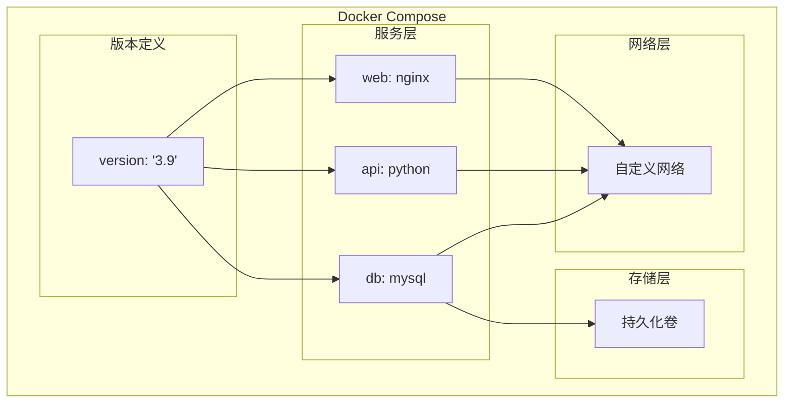

本地开发时，你的应用依赖 MySQL、Redis、Nginx 三个服务。按照传统方式，你得安装 MySQL、配置 Redis、设置 Nginx——环境不一致、冲突、版本问题，一堆麻烦事等着你。

Docker Compose 解决的是这个问题：**用 YAML 定义整个应用栈，一个命令启动所有服务**。

但 Docker Compose 不只是开发工具。在小规模部署、CI/CD 测试、演示环境等场景，它都是实用的选择。

## Docker Compose 核心概念

### 三层配置结构



### 基本配置文件

```yaml title="docker-compose.yml"
version: '3.9'

services:
  web:
    image: nginx:alpine
    ports:
      - "80:80"
    depends_on:
      - api
    networks:
      - frontend

  api:
    build:
      context: ./api
      dockerfile: Dockerfile
    environment:
      - DB_HOST=db
      - DB_PORT=5432
    depends_on:
      db:
        condition: service_healthy
    networks:
      - frontend
      - backend
    healthcheck:
      test: ["CMD", "curl", "-f", "http://localhost:8080/health"]
      interval: 30s
      timeout: 10s
      retries: 3

  db:
    image: postgres:16-alpine
    environment:
      POSTGRES_DB: myapp
      POSTGRES_USER: user
      POSTGRES_PASSWORD: password
    volumes:
      - postgres_data:/var/lib/postgresql/data
    networks:
      - backend
    healthcheck:
      test: ["CMD-SHELL", "pg_isready -U user -d myapp"]
      interval: 10s
      timeout: 5s
      retries: 5

volumes:
  postgres_data:

networks:
  frontend:
    driver: bridge
  backend:
    driver: bridge
    internal: true
```

## 服务依赖与启动顺序

### depends_on 的局限性

`depends_on` 只保证启动顺序，不保证服务就绪。

```yaml title="depends_on vs depends_on + condition"
# 简单依赖（只保证启动顺序）
services:
  api:
    depends_on:
      - db

# 条件依赖（等待服务就绪）
services:
  api:
    depends_on:
      db:
        condition: service_healthy
```

:::tip
**为什么只用 depends_on 不够？**

`docker-compose up api` 会先启动 `db`，但如果 `db` 需要 10 秒初始化，`api` 可能在 `db` 还没准备好时就开始连接，导致失败。

使用 `condition: service_healthy` 配合 `healthcheck`，确保依赖服务真正就绪后再启动。
:::

### 服务健康检查

```yaml title="健康检查配置"
services:
  redis:
    image: redis:7-alpine
    healthcheck:
      test: ["CMD", "redis-cli", "ping"]
      interval: 10s
      timeout: 3s
      retries: 3
      start_period: 5s

  mysql:
    image: mysql:8
    healthcheck:
      test: ["CMD", "mysqladmin", "ping", "-h", "localhost", "-u", "root", "-ppassword"]
      interval: 10s
      timeout: 5s
      retries: 5
      start_period: 30s

  elasticsearch:
    image: elasticsearch:8
    environment:
      - discovery.type=single-node
    healthcheck:
      test: ["CMD-SHELL", "curl -f http://localhost:9200/_cluster/health || exit 1"]
      interval: 30s
      timeout: 10s
      retries: 5
```

## 环境变量配置

### 多种配置方式

```yaml title="环境变量配置"
services:
  api:
    # 方式 1：直接写在 yml 中
    environment:
      DEBUG: "true"
      LOG_LEVEL: info

    # 方式 2：数组格式
    environment:
      - DEBUG=true
      - LOG_LEVEL=info

    # 方式 3：从 .env 文件读取
    env_file:
      - ./config/dev.env
      - ./config/secrets.env

    # 方式 4：插值变量
    environment:
      APP_VERSION: ${APP_VERSION:-v1.0.0}
```

```bash title=".env 文件"
# .env 文件
POSTGRES_DB=myapp
POSTGRES_USER=developer
POSTGRES_PASSWORD=dev_password_123
REDIS_PASSWORD=redis_secret

# 支持注释
# 这是一个开发环境配置
DEBUG=true
LOG_LEVEL=debug
```

```bash title=".env 文件优先级"
# .env 文件会被自动加载
$ docker-compose config  # 查看合并后的配置

# 可以指定其他文件
$ docker-compose --env-file ./config/prod.env up -d

# 环境变量优先级（从高到低）
# 1. 容器运行时的 -e 参数
# 2. shell 环境变量
# 3. .env 文件
# 4. docker-compose.yml 中的值
```

## 网络配置

### 网络隔离模式

```yaml title="多网络配置"
services:
  frontend:
    networks:
      - web-net

  backend:
    networks:
      - web-net
      - api-net

  database:
    networks:
      - api-net
    # 不连接到 web-net，frontend 无法直接访问 database

networks:
  web-net:
    driver: bridge
    ipam:
      config:
        - subnet: 172.20.0.0/16
  api-net:
    driver: bridge
    ipam:
      config:
        - subnet: 172.21.0.0/16
```

### 服务发现

```bash title="服务间通信"
# 在同一个网络中的服务，可以通过服务名互相访问
# api 服务可以通过以下方式访问 db：
# - hostname: db
# - 或完整域名: db.default

$ docker-compose exec api ping db
PING db (172.21.0.2) 56(84) bytes of data.

# DNS 自动解析服务名
$ docker-compose exec api nslookup db
Server:    127.0.0.11
Address: 127.0.0.11#53

Name:      db
Address: 172.21.0.2
```

## 持久化存储

### Volume 配置

```yaml title="数据持久化"
services:
  mysql:
    image: mysql:8
    volumes:
      # 命名 volume（推荐）
      - mysql_data:/var/lib/mysql

      # 绑定挂载（开发环境）
      - ./config:/etc/mysql/conf.d

      # 只读挂载
      - ./scripts:/docker-entrypoint-initdb.d:ro

volumes:
  mysql_data:
    driver: local
    driver_opts:
      type: none
      o: bind
      device: /data/mysql
```

```bash title="Volume 操作"
# 查看 volume
$ docker volume ls | grep myapp

# 查看 volume 详情
$ docker volume inspect myapp_mysql_data

# 备份 volume
$ docker run --rm \
    -v myapp_mysql_data:/data \
    -v $(pwd):/backup \
    alpine \
    tar czf /backup/mysql_backup.tar.gz -C /data .

# 恢复 volume
$ docker volume create myapp_mysql_data
$ docker run --rm \
    -v myapp_mysql_data:/data \
    -v $(pwd):/backup \
    alpine \
    tar xzf /backup/mysql_backup.tar.gz -C /data
```

## 高级配置

### 扩展配置（extends）

```yaml title="base.yml - 基础配置"
# base.yml
version: '3.9'
services:
  webapp:
    image: nginx:alpine
    restart: unless-stopped
    logging:
      driver: json-file
      options:
        max-size: "10m"
        max-file: "3"
```

```yaml title="docker-compose.yml - 继承并扩展"
# docker-compose.yml
version: '3.9'

extends:
  file: base.yml
  service: webapp

services:
  webapp:
    ports:
      - "80:80"
    volumes:
      - ./html:/usr/share/nginx/html:ro
    environment:
      - NGINX_HOST=example.com
      - NGINX_PORT=80
```

### 部署配置（deploy）

```yaml title="Swarm 模式配置"
version: '3.9'

services:
  api:
    image: myapi:latest
    deploy:
      replicas: 3
      resources:
        limits:
          cpus: '0.5'
          memory: 512M
        reservations:
          cpus: '0.25'
          memory: 256M
      restart_policy:
        condition: on-failure
        delay: 5s
        max_attempts: 3
      update_config:
        parallelism: 1
        delay: 10s
        failure_action: rollback
    configs:
      - source: api_config
        target: /app/config.yaml

configs:
  api_config:
    file: ./config/api.yaml
```

:::info
**deploy 配置只在 Docker Swarm 模式下生效**

普通的 `docker-compose up` 不会应用 `deploy` 配置。如果需要在单机环境限制资源，使用 `mem_limit`、`cpus` 等选项。
:::

## 命令与工作流

### 常用命令

```bash title="日常操作命令"
# 启动服务（前台）
$ docker-compose up

# 启动服务（后台）
$ docker-compose up -d

# 重新构建并启动
$ docker-compose up -d --build

# 只启动特定服务
$ docker-compose up -d api db

# 查看日志
$ docker-compose logs -f api
$ docker-compose logs --tail=100 api

# 查看服务状态
$ docker-compose ps

# 停止并清理
$ docker-compose down
$ docker-compose down -v  # 同时删除 volumes
$ docker-compose down --rmi local  # 删除本地构建的镜像
```

### 开发和调试

```bash title="开发调试命令"
# 进入容器 shell
$ docker-compose exec api bash

# 执行一次性命令
$ docker-compose run --rm api python manage.py migrate

# 查看服务依赖关系
$ docker-compose ps --format json | jq '.'

# 查看配置（展开后的完整配置）
$ docker-compose config

# 暂停/恢复服务
$ docker-compose pause api
$ docker-compose unpause api

# 重启服务
$ docker-compose restart api
```

### 健康检查与日志聚合

```bash title="健康检查流程"
# 1. 检查所有服务健康状态
$ docker-compose ps
NAME                COMMAND                  SERVICE             STATUS              PORTS
myapp-api-1         "python app.py"          api                 running (healthy)   8000/tcp
myapp-db-1          "docker-entrypoint.s…"   db                  running (healthy)   5432/tcp
myapp-redis-1       "docker-entrypoint.s…"   redis               running (healthy)   6379/tcp

# 2. 查看健康检查失败的日志
$ docker-compose logs api | grep -i health

# 3. 查看资源使用
$ docker-compose top
```

## 生产环境使用

### 生产配置分离

```yaml title="docker-compose.prod.yml"
version: '3.9'

services:
  api:
    image: myregistry.com/myapp:${IMAGE_TAG:-latest}
    deploy:
      replicas: 3
      resources:
        limits:
          memory: 1G
    restart: always
    logging:
      driver: "awslogs"
      options:
        awslogs-group: "/ecs/myapp"
        awslogs-region: "us-east-1"
        awslogs-stream-prefix: "api"

  db:
    image: postgres:16
    volumes:
      - db_data:/var/lib/postgresql/data
    restart: always

volumes:
  db_data:
    external: true  # 使用外部 volume
```

```bash title="使用生产配置"
# 开发环境
$ docker-compose up -d

# 生产环境
$ docker-compose -f docker-compose.yml -f docker-compose.prod.yml up -d
```

### GitHub Actions 集成

```yaml title=".github/workflows/ci.yml"
name: CI

on:
  push:
    branches: [main]
  pull_request:
    branches: [main]

jobs:
  test:
    runs-on: ubuntu-latest
    steps:
      - uses: actions/checkout@v4

      - name: Set up Docker Buildx
        uses: docker/setup-buildx-action@v3

      - name: Build
        run: docker-compose build

      - name: Run tests
        run: docker-compose up -d && sleep 10 && docker-compose exec -T api pytest

      - name: Stop
        if: always()
        run: docker-compose down
```

## 常见问题与反模式

### 问题 1：服务启动顺序错误

**现象**：`api` 连接数据库失败，但 `db` 已经启动了。

**根因**：只用了 `depends_on`，没有健康检查。

**解决方案**：

```yaml
services:
  api:
    depends_on:
      db:
        condition: service_healthy
```

### 问题 2：跨服务网络不通

**现象**：`api` 无法访问 `redis`。

**根因**：两个服务不在同一网络。

**解决方案**：

```yaml
services:
  api:
    networks:
      - backend
  redis:
    networks:
      - backend
```

### 问题 3：端口冲突

**现象**：`Error starting userland proxy: listen tcp 0.0.0.0:80: bind: address already in use`。

**根因**：宿主机 80 端口已被占用。

**解决方案**：

```yaml
services:
  web:
    ports:
      - "8080:80"  # 映射到宿主机 8080
```

### 问题 4：数据丢失

**现象**：重启后数据库数据丢失。

**根因**：没有配置 Volume。

**解决方案**：

```yaml
services:
  db:
    volumes:
      - postgres_data:/var/lib/postgresql/data

volumes:
  postgres_data:
```

## 权衡矩阵

| 场景 | 推荐方案 | 不推荐 | 说明 |
| --- | --- | --- | --- |
| 本地开发 | docker-compose | 直接安装服务 | 环境一致，快速启动 |
| CI/CD 测试 | docker-compose | 真实服务 | 隔离、可重复 |
| 单机演示 | docker-compose | K8s | 简单，无需集群 |
| 生产部署 | K8s/Helm | docker-compose | 扩展、高可用 |
| 多环境配置 | extends + override | 复制配置 | DRY 配置 |

## 延伸思考

Docker Compose 是容器化的「入门工具」，但它的价值远不止于此。

在日常开发中，Compose 可以：
- **标准化开发环境**：新成员 `docker-compose up` 即可开始工作
- **快速复现 Bug**：用 `docker-compose.yml` 提交 Bug 报告
- **本地完整测试**：不依赖外部服务，在本地跑完整测试

但 Compose 也有局限性：
- **不支持横向扩展**：`replicas` 在单机环境无法生效
- **没有滚动更新**：更新服务需要手动重启
- **没有服务网格**：无法做流量管理

更深一层的问题是：**你的团队真的需要 Kubernetes 吗？**

很多小团队用 Kubernetes 其实是杀鸡用牛刀。如果你的服务不需要复杂的扩缩容、健康检查、滚动更新，Docker Compose + 负载均衡器可能是更简单的选择。

技术选型没有银弹。理解每个工具的边界，才能做出合适的选择。