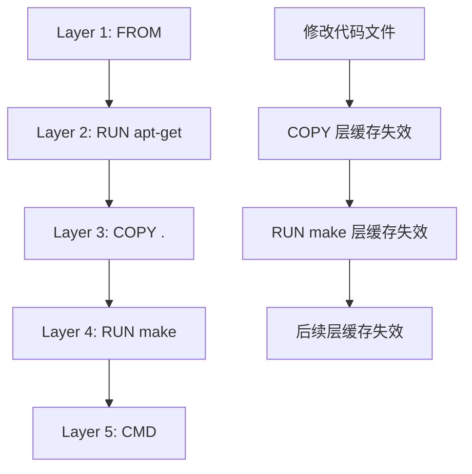

你写 Dockerfile 的时候，有没有遇到过这些问题：

- 构建一次要 10 分钟，改一行代码就要重头开始？
- 镜像 2GB，部署到服务器要下载半小时？
- 容器跑起来后发现缺少某个动态链接库？
- 镜像里有敏感信息，被 `docker history` 看得一清二楚？

这些问题的根源，往往是 Dockerfile 写得不够好。好的 Dockerfile 应该能快速构建、产出小巧镜像、避免安全问题。

## 基础原则：分层与缓存

Dockerfile 的每一行指令都会创建一个镜像层。理解这个机制，是写出好 Dockerfile 的基础。

```docker
# Dockerfile 示例
FROM ubuntu:22.04              # Layer 0: 基础镜像
RUN apt-get update             # Layer 1
RUN apt-get install -y nginx   # Layer 2
COPY ./app /app                # Layer 3
CMD ["nginx", "-g", "daemon off;"]  # Layer 4
```

**层数不是越少越好，也不是越多越好**。合理的分层能让缓存最大化利用。

## RUN 指令：多行 vs 单行

这是一个常见的纠结点。

### 反面教材：每条 RUN 一层

```docker
# 错误写法
RUN apt-get update
RUN apt-get install -y nginx
RUN apt-get install -y curl
RUN apt-get clean
RUN rm -rf /var/lib/apt/lists/*
```

这种写法有两个问题：

1. **apt-get 缓存不会清理**：每条 RUN 在不同层执行，clean 操作无法影响其他层
2. **层数爆炸**：3 条安装指令 + 清理指令 = 4 层

### 正确做法：合并相关操作

```docker
# 正确写法
RUN apt-get update && \
    apt-get install -y nginx curl vim && \
    apt-get clean && \
    rm -rf /var/lib/apt/lists/* /tmp/* /var/tmp/*
```

这样写的好处：

- 只有一层 apt 操作
- 清理操作在同一层生效
- 安装多个包时利用 apt 批量下载的优化

### 多行 RUN 的特殊情况

但也不是所有情况都要合并。在某些场景下，分层反而更好：

```docker
# 场景：需要保留中间层用于调试
RUN curl -SL https://example.com/binary.tar.gz | tar -xz -C /opt
RUN ./configure && make -j$(nproc)

# 每层保留一个完整的工具链步骤
# 如果 make 失败，可以 docker build --target builder 进入该层调试
```

:::info
**什么时候应该分层？**

当中间层可能有调试价值时，可以保留分层��对于大多数场景，合并是更省空间的选择。
:::

## 善用 .dockerignore

.dockerignore 告诉 Docker 忽略哪些文件，避免它们进入构建上下文。

```bash title=".dockerignore"
# 版本控制
.git
.gitignore
.md

# 构建产物
target/
dist/
build/
*.class
*.o

# 本地配置
.env
.env.local
*.local

# IDE 配置
.idea/
.vscode/
*.iml

# 日志和临时文件
*.log
*.tmp
.DS_Store

# 测试文件（构建阶段不需要）
**/*test*
**/test/**
**/tests/**
```

### .dockerignore 的陷阱

```bash
# 陷阱：使用通配符时不小心排除了有用文件
*.md    # 会排除 docs/README.md，但你也想保留这个

# 正确：精确指定
/README.md
/docs/

# 陷阱：路径错误
./src   # 相对路径可能在构建时产生意外行为

# 正确：使用完整路径（相对于构建上下文根目录）
src/
```

## 基础镜像选择

基础镜像决定了镜像的起点，选得好可以让镜像小很多。

### 常见基础镜像类型

| 基础镜像 | 大小 | 适用场景 |
| --- | --- | --- |
| `ubuntu:22.04` | ~77MB | 通用场景，需要完整 Linux 环境 |
| `alpine:3.18` | ~7MB | 极致轻量，兼容 musl 而非 glibc |
| `eclipse-temurin:17-jre` | ~200MB | Java 运行时代码 |
| `eclipse-temurin:17-jdk` | ~400MB | Java 开发，需要编译能力 |
| `python:3.11-slim` | ~130MB | Python 运行时代码 |
| `golang:1.21-alpine` | ~260MB | Go 编译型语言 |

:::warning
**Alpine 的坑：动态链接库**

Alpine 使用 musl 而不是 glibc，某些依赖 glibc 的软件（如 Oracle JDK）无法在 Alpine 上运行。遇到「找不到 libstdc++.so.6」等错误时，首先检查是否用了 Alpine 基础镜像。
:::

### 多阶段构建分离构建依赖

```docker title="Java 多阶段构建"
# Stage 1: 构建阶段
FROM maven:3.9-eclipse-temurin-17 AS builder
WORKDIR /app

# 先复制依赖文件，单独缓存
COPY pom.xml .
# maven 会在这一步下载所有依赖
RUN mvn dependency:go-offline -B

# 再复制源代码
COPY src ./src/
RUN mvn package -DskipTests -B

# Stage 2: 运行阶段
FROM eclipse-temurin:17-jre-alpine

# 只复制构建产物，不包含 Maven、源码等
COPY --from=builder /app/target/app.jar /app/app.jar

WORKDIR /app
EXPOSE 8080
ENTRYPOINT ["java", "-jar", "app.jar"]
```

```docker title="Node.js 多阶段构建"
# Stage 1: 构建阶段
FROM node:20-alpine AS builder
WORKDIR /app

# 复制依赖配置（变化少）
COPY package*.json ./
RUN npm ci --only=production && \
    npm cache clean --force

# 复制源代码（变化频繁）
COPY . .

# 构建
RUN npm run build

# Stage 2: 运行阶段
FROM node:20-alpine
WORKDIR /app

# 只复制运行时必要文件
COPY --from=builder /app/dist ./dist
COPY --from=builder /app/node_modules ./node_modules
COPY package*.json ./

# 非 root 用户运行
USER node
CMD ["node", "dist/main.js"]
```

## 层数优化策略

### 理论：Dockerfile 层数限制

Docker 对镜像层数有限制（最大 127 层），但这不是关键——真正重要的是**缓存利用效率**。

### 缓存失效的级联效应



### 优化策略

**策略 1：按变化频率排序指令**

```docker
# 错误：变化频繁的放前面
FROM ubuntu:22.04
COPY . /app        # 每次代码变化都要重新 apt-get
RUN apt-get install -y openjdk-17-jdk
CMD ["java", "-jar", "/app/app.jar"]

# 正确：变化频率低的放前面
FROM ubuntu:22.04
RUN apt-get update && apt-get install -y openjdk-17-jdk  # 不常变化
COPY config/ /config/  # 配置不常变化
COPY app/ /app/        # 代码经常变化
CMD ["java", "-jar", "/app/app.jar"]
```

**策略 2：分离依赖和代码**

```docker
# 分离依赖安装和代码复制
FROM python:3.11-slim

WORKDIR /app

# 先复制依赖文件
COPY requirements.txt .
# 依赖变化时，这层缓存有效
RUN pip install --no-cache-dir -r requirements.txt

# 后复制代码
COPY . .
# 代码变化时，才需要重新构建这一层
```

**策略 3：利用 BuildKit 缓存**

```bash
# 启用 BuildKit（现代 Docker 默认支持）
DOCKER_BUILDKIT=1 docker build .

# 或在 Dockerfile 中使用
# syntax=docker/dockerfile:1
```

```docker title="使用 BuildKit 缓存 mount"
FROM python:3.11-slim

WORKDIR /app

# pip 缓存跨构建保持
RUN --mount=type=cache,target=/root/.cache/pip \
    pip install --no-cache-dir -r requirements.txt

COPY . .
```

## 最小化镜像大小

### 方法 1：选择合适的基础镜像

```docker
# 错误：使用完整系统镜像运行单个二进制文件
FROM ubuntu:22.04
COPY my-binary /usr/local/bin/
CMD ["my-binary"]

# 正确：使用 distroless 或 scratch
FROM gcr.io/distroless/static-debian12
COPY my-binary /my-binary
CMD ["/my-binary"]
```

### 方法 2：清理所有不必要的文件

```docker
RUN apt-get update && \
    apt-get install -y --no-install-recommends \
        openjdk-17-jdk \
        curl \
    && rm -rf /var/lib/apt/lists/* \
              /tmp/* \
              /var/tmp/* \
              /usr/share/doc/* \
              /usr/share/man/* \
              /var/cache/apt/archives/*.deb

# 说明：
# --no-install-recommends: 只安装必需依赖
# /usr/share/doc/*: 文档占用空间大但运行不需要
```

### 方法 3：使用多阶段构建

这是最有效的减小镜像大小的方法，见上面的多阶段构建示例。

## 安全最佳实践

### 1. 避免在镜像中存储敏感信息

```docker
# 错误：敏感信息进入镜像层
ENV DATABASE_PASSWORD=secret123
COPY ./secrets /run/secrets

# 正确：使用运行时注入
ENV DATABASE_PASSWORD_FILE=/run/secrets/db_password
# 或使用 K8s Secret 挂载
```

### 2. 非 root 用户运行

```docker
# 创建非 root 用户
RUN groupadd --gid 1000 appgroup && \
    useradd --uid 1000 --gid appgroup --shell /bin/bash appuser

# 复制文件后切换用户
COPY --chown=appuser:appgroup . /app
USER appuser

CMD ["/app/entrypoint.sh"]
```

### 3. 扫描镜像漏洞

```bash
# 使用 Trivy 扫描
trivy image myapp:latest

# 或在 CI 中集成
trivy image --exit-code 1 --severity HIGH,CRITICAL myapp:latest
```

## 常见反模式

### 反模式 1：「玄学」COPY

```docker
# 错误：COPY 整个目录，不确定哪些文件会进入镜像
COPY . /app

# 正确：明确指定需要的文件
COPY package*.json /app/
COPY src /app/src/
COPY public /app/public/
```

### 反模式 2：滥用 ADD

```docker
# ADD 有隐式解压功能，可能导致意外
ADD archive.tar.gz /app/  # 这会自动解压

# COPY 是更安全的选择，只有远程 URL 场景才用 ADD
COPY archive.tar.gz /app/  # 只复制不解压
```

### 反模式 3：忽略健康检查

```docker
# 错误：没有健康检查
CMD ["python", "app.py"]

# 正确：添加 HEALTHCHECK
HEALTHCHECK --interval=30s --timeout=10s --retries=3 \
    CMD curl -f http://localhost:8080/health || exit 1

CMD ["python", "app.py"]
```

### 反模式 4：启动脚本不在镜像中

```docker
# 错误：ENTRYPOINT 使用外部脚本
ENTRYPOINT ["./entrypoint.sh"]  # 这个脚本不在镜像中

# 正确：脚本应该在镜像中，或使用 CMD
COPY entrypoint.sh /entrypoint.sh
ENTRYPOINT ["/entrypoint.sh"]
```

## Dockerfile 模板

### Java 应用模板

```docker title="java-app.Dockerfile"
# syntax=docker/dockerfile:1
FROM eclipse-temurin:17-jdk AS builder

WORKDIR /app

# 分离依赖下载和代码编译
COPY pom.xml .
RUN mvn dependency:go-offline -B

COPY src ./src/
RUN mvn package -DskipTests -B

# 运行阶段
FROM eclipse-temurin:17-jre-alpine

# 非 root 用户
RUN addgroup -g 1000 -S appgroup && \
    adduser -u 1000 -S appuser -G appgroup

WORKDIR /app

COPY --from=builder --chown=appuser:appgroup \
    /app/target/app.jar app.jar

USER appuser
EXPOSE 8080

HEALTHCHECK --interval=30s --timeout=5s --retries=3 \
    CMD wget --no-verbose --tries=1 --spider http://localhost:8080/actuator/health || exit 1

ENTRYPOINT ["java", "-XX:+UseContainerSupport", "-jar", "app.jar"]
```

### Node.js 应用模板

```docker title="nodejs-app.Dockerfile"
# syntax=docker/dockerfile:1
FROM node:20-alpine AS builder

WORKDIR /app

# 利用层缓存分离依赖和代码
COPY package*.json ./
RUN npm ci --only=production && npm cache clean --force

COPY . .
RUN npm run build

FROM node:20-alpine

WORKDIR /app

RUN addgroup -g 1000 -S appgroup && \
    adduser -u 1000 -S appuser -G appgroup

COPY --from=builder --chown=appuser:appgroup \
    /app/dist ./dist \
    /app/node_modules ./node_modules \
    package*.json ./

USER appuser
EXPOSE 3000

HEALTHCHECK --interval=30s --timeout=5s --retries=3 \
    CMD wget --no-verbose --tries=1 --spider http://localhost:3000/health || exit 1

CMD ["node", "dist/main.js"]
```

## 权衡矩阵

| 策略 | 构建速度 | 镜像大小 | 维护性 | 适用场景 |
| --- | --- | --- | --- | --- |
| 单层大 RUN | 快（缓存好） | 大 | 差 | 静态二进制部署 |
| 多阶段构建 | 中（重建阶段） | 小 | 好 | 所有场景 |
| Alpine 基础 | 中（首次拉取快） | 小 | 需注意 glibc | 轻量服务 |
| distroless | 慢（拉取大） | 最小 | 好 | 安全敏感场景 |

## 延伸思考

好的 Dockerfile 不是一蹴而就的，而是逐步优化出来的。建议：

1. **用 `docker history` 检查镜像层**：看看哪层占的空间最大
2. **用 `trivy` 扫描漏洞**：安全问题不能忽视
3. **用 `dive` 分析层内容**：直观看到每层的变化

```bash
# 安装 dive 分析镜像层
brew install dive

# 使用
dive myapp:latest
```

Dockerfile 优化是一个持续的过程。随着项目复杂度增加，构建时间会逐渐变长。早期的优化会为后期省下大量时间。