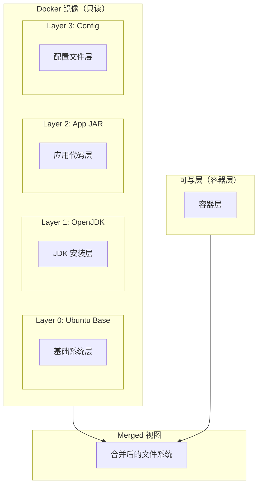
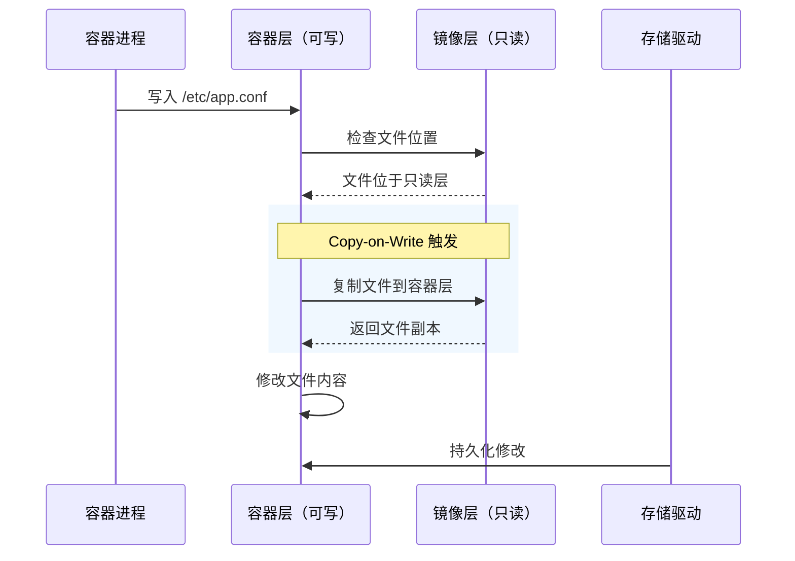
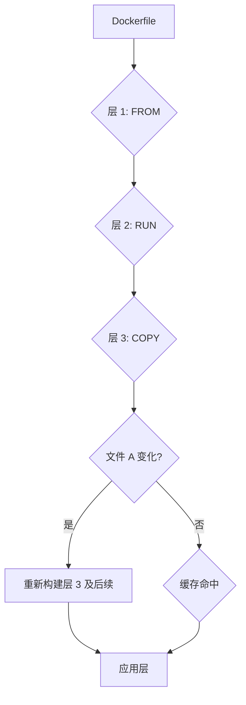
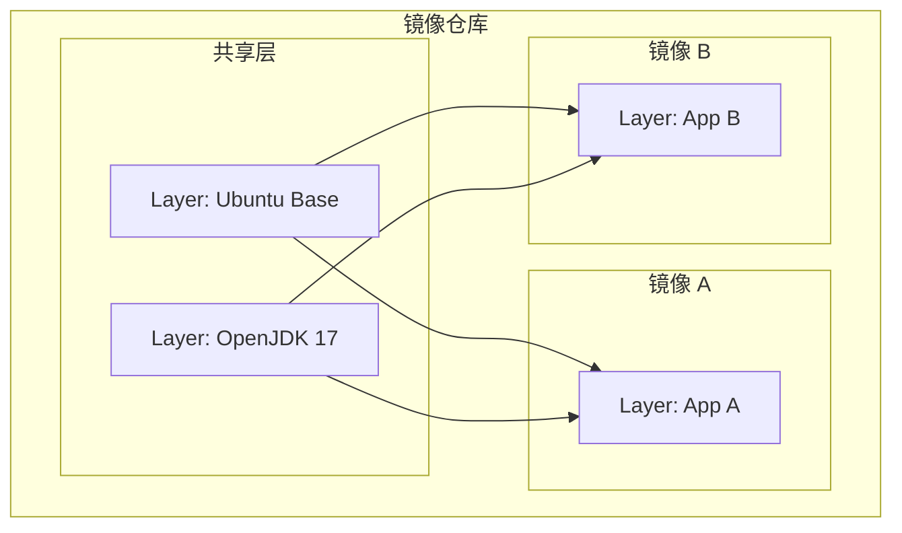

你是否有这样的经历：第一次拉取镜像用了 3 分钟，第二次拉取同样的镜像只用了 5 秒？

这不是网络变快了，而是镜像层的功劳。Docker 镜像的分层机制，让增量更新和缓存复用成为可能。理解这个机制，是写出高效 Dockerfile 的前提。

## 镜像层的本质

Docker 镜像由多个只读的层（Layer）叠加而成。每条 Dockerfile 指令（`FROM`、`RUN`、`COPY`、`ADD` 等）都会在原有层的基础上生成一个新的层。



### 层的内容

镜像层的存储位置通常在 `/var/lib/docker/overlay2/`（使用 overlay2 存储驱动）。每一层存储为独立的目录，层与层之间通过「父子关系」链接。

```bash
# 查看镜像层信息
docker inspect nginx:latest | jq '.[0].RootFS.Layers'

# 输出示例
[
    "sha256:abc123...",
    "sha256:def456...",
    "sha256:ghi789..."
]
```

## 联合文件系统（UnionFS）

镜像层通过 UnionFS（联合文件系统）叠加。UnionFS 的核心思想是：**多个只读文件系统叠加为一个统一的视图**。

在 Docker 中，这个视图叫做「Merged」视图——容器看到的文件系统是这个叠加后的结果。

```mermaid
flowchart LR
    subgraph Lower["Lower Layers（只读）"]
        Lower1["Layer 0: Ubuntu"]
        Lower2["Layer 1: OpenJDK"]
        Lower3["Layer 2: App"]
    end

    subgraph Upper["Upper Layer（可写）"]
        Upper["Container Layer"]
    end

    subgraph Merged["Merged（容器视角）"]
        Merged["完整文件系统"]
    end

    Lower1 --> Merged
    Lower2 --> Merged
    Lower3 --> Merged
    Upper --> Merged
```

### overlay2 目录结构

使用 overlay2 存储驱动时，每个镜像层对应一个目录：

```bash
# overlay2 目录结构示例
/var/lib/docker/overlay2/
├── l/  # 短标识符目录
│   ├── ABC123...  # 层内容
│   └── DEF456...
├── abc123.../  # 镜像层
│   ├── diff/   # 该层的实际内容
│   ├── link    # 短标识符
│   └── work/   # overlay 工作目录（用于 merged）
└── def456.../  # 另一个镜像层
    └── diff/
```

:::info
**为什么用短标识符？**

层目录名使用完整的 SHA256 摘要（64 字符），但系统会创建 `l/` 子目录存放 2~3 字符的短标识符。这是为了避免文件系统单个目录下文件数量过多导致的性能问题（ext4 单目录文件数建议不超过 10 万）。
:::

## Copy-on-Write 机制

当容器需要修改一个文件时，会发生 Copy-on-Write（写时复制）：

1. 容器首先尝试在可写层（容器层）直接写入
2. 如果文件位于只读层，Docker 会将该文件从只读层复制到容器层
3. 然后在容器层中修改文件的副本



### 写时复制的性能影响

Copy-on-Write 机制会带来一定的性能开销：

- **首次写入延迟**：需要先复制文件，再写入
- **磁盘空间增加**：修改过的文件会占用容器层的空间
- **IO 性能下降**：相对于直接写入，数据经过额外的复制和合并层

:::warning
**大文件修改的坑**：如果容器内需要频繁修改大文件（如日志文件、数据库文件），写时复制的开销会显著影响性能。这种场景下，建议使用**绑定挂载（Bind Mount）**或**数据卷（Volume）**，让数据直接写入宿主机文件系统。
:::

## 层缓存机制

Docker 在构建镜像时会缓存每一层。当重新构建时：

- 如果 Dockerfile 指令及其上下文（文件内容）没有变化，Docker 直接使用缓存层
- 如果任何变化导致层失效，该层及其后续所有层都需要重新构建

```docker title="缓存失效示例"
# Stage 1: 每次都重新构建（缓存失效）
FROM ubuntu:22.04
RUN apt-get update && apt-get install -y curl

# Stage 2: 依赖 Stage 1 的结果
COPY ./app /app
RUN ./build.sh

# Stage 3: 只有文件变化时重新构建
COPY ./config /config
```

### 缓存命中条件

Docker 判定缓存命中需要满足：

1. 基础镜像相同（FROM 指令）
2. 指令相同（如 `RUN apt-get install`）
3. 构建上下文相同（被 COPY 的文件内容未变）



## 镜像层数的影响

Docker 限制了最大层数为 127（Dockerfile 指令数），但更重要的是**层数对性能和存储的影响**：

| 因素 | 影响 |
| --- | --- |
| **构建时间** | 层数多可能导致每次都要重建更多层 |
| **镜像大小** | 镜像层有元数据开销，过多层会增加存储成本 |
| **拉取速度** | 多层���能导致并行下载效率下降 |
| **运行时 IO** | 层数越多，文件系统遍历路径越长 |

:::tip
**最佳实践：减少层数**

相关操作尽量合并在一条 RUN 指令中：

```docker
# 错误：创建多层
RUN apt-get update
RUN apt-get install -y curl
RUN apt-get install -y vim
RUN rm -rf /var/lib/apt/lists/*

# 正确：合并为单层
RUN apt-get update && \
    apt-get install -y curl vim && \
    rm -rf /var/lib/apt/lists/*
```
:::

## 镜像层共享原理

多个镜像可以共享相同的层。这是镜像仓库节省存储空间的关键机制。



```bash
# 查看镜像层共享
docker history nginx:latest

# 输出示例（显示每层的创建方式和大小）
IMAGE          CREATED        SIZE
abc123...      2 days ago     142MB   # 容器层（运行时）
def456...      2 days ago     1.2MB   # 配置文件层
ghi789...      2 days ago     45MB    # 应用代码层
jkl012...      2 days ago     78MB    # OpenJDK 层
mno345...      3 weeks ago    77MB    # Ubuntu 层（多个镜像共享）
```

:::info
**为什么 `docker history` 显示的 SIZE 看起来不对？**

`docker history` 显示的 SIZE 是该层相对于父层增加的大小，不是层内容的总大小。基础层（如 Ubuntu）在所有基于它的镜像中都是共享的，所以看到 77MB；应用层只有几 MB，因为它们只是增量。
:::

## 构建缓存实战技巧

### 1. 按变化频率排序

变化频繁的层放在后面，变化少的层放在前面：

```docker
# 正确：依赖层在前，应用层在后
FROM ubuntu:22.04                    # 不常变化
RUN apt-get update && apt-get install -y \
    openjdk-17-jre \                  # 不常变化
    curl \
    && rm -rf /var/lib/apt/lists/*
COPY config/ /config/                # 不常变化
COPY app/ /app/                      # 经常变化
CMD ["java", "-jar", "/app/app.jar"]
```

### 2. 利用 .dockerignore 排除无关文件

```bash title=".dockerignore"
# 排除版本控制
.git
.gitignore

# 排除构建产物
target/
dist/
build/

# 排除本地文件
*.log
*.tmp
.env
```

### 3. 多阶段构建分离依赖

```docker title="Multi-stage Dockerfile"
# Stage 1: 构建阶段
FROM maven:3.9-eclipse-temurin-17 AS builder
WORKDIR /app
COPY pom.xml .
RUN mvn dependency:go-offline        # 缓存依赖下载
COPY src ./src/
RUN mvn package -DskipTests          # 编译

# Stage 2: 运行阶段
FROM eclipse-temurin:17-jre-alpine
COPY --from=builder /app/target/app.jar /app/app.jar
WORKDIR /app
CMD ["java", "-jar", "app.jar"]
```

### 4. 依赖变化的检测优化

```docker title="优化 COPY 顺序"
# 如果 src 代码变化不影响依赖，先复制依赖部分
FROM python:3.11-slim
WORKDIR /app

# 先复制依赖文件（变化少）
COPY requirements.txt .
RUN pip install --no-cache-dir -r requirements.txt

# 再复制代码（变化频繁）
COPY . .
CMD ["python", "app.py"]
```

## 权衡矩阵

| 策略 | 优势 | 劣势 |
| --- | --- | --- |
| **多层分离** | 缓存粒度细，构建快 | 存储开销大，运行 IO 稍慢 |
| **少层合并** | 存储紧凑，运行 IO 略快 | 任何变化都导致大范围重建 |
| **多阶段构建** | 最终镜像小，依赖少 | 构建复杂度增加 |
| **依赖缓存** | 依赖下载只执行一次 | 需要合理的 COPY 顺序 |

## 常见反模式

### 反模式 1：每条指令一层

```docker
# 错误写法
FROM ubuntu:22.04
RUN apt-get update
RUN apt-get install -y openjdk-17-jdk
RUN apt-get install -y curl
RUN mkdir /app
COPY app.jar /app/
RUN chmod +x /app/app.jar
```

这种写法会让镜像层数爆炸，而且每条 RUN 都会让镜像变大（因为 apt-get 缓存不会被清理）。

### 反模式 2：不清理安装缓存

```docker
# 错误写法
FROM ubuntu:22.04
RUN apt-get update && apt-get install -y openjdk-17-jdk

# apt 缓存仍在，镜像多了 ~100MB
```

### 反模式 3：忽视 .dockerignore

```docker
# 如果 .dockerignore 缺失
COPY . /app
# 大量无关文件（.git、node_modules、target/）会被复制进镜像
```

## 延伸思考

镜像分层机制的本质是**存储与传输的解耦**。当你在北京构建镜像推送到仓库，上海的机器拉取时只需要下载缺失的层。如果上海已有相同的 Ubuntu 基础层，就不需要重复下载。

这个设计让镜像分发变得高效。但也带来一个问题：**当层数很多时，overlay 文件系统的遍历开销会累积**。这也是为什么现代镜像（如 Alpine）倾向于精简基础镜像，减少层数��降低运行时开销。

理解层的工作原理，才能写出既能快速构建、又能在生产环境高效运行的 Dockerfile。