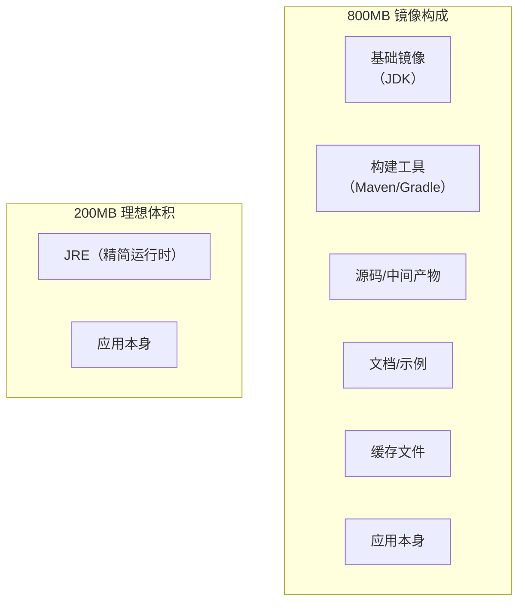

# 容器镜像优化与瘦身

一个 Java 应用，代码只有 30MB，镜像却有 800MB。这 770MB 的差距，来自 JDK、构建工具、中间文件、不必要的依赖。

镜像太大不只是存储问题——拉取慢、启动慢、攻击面大、安全更新成本高。在生产环境中，镜像体积直接影响交付效率。

## 镜像大小的来源分析

构建镜像之前，先了解镜像为什么会这么大：



### 常见问题

1. **基础镜像过大**：使用完整 JDK 而非 JRE
2. **构建工具残留**：Maven/Gradle 缓存、node_modules
3. **源码残留**：构建产物之外的源文件
4. **文档和示例**：README、docs、sample files
5. **临时文件**：构建缓存、日志文件

## 优化策略一：选择合适的基础镜像

基础镜像的选择直接影响最终镜像大小：

| 基础镜像 | 典型大小 | 适用场景 |
| --- | --- | --- |
| `ubuntu` | ~80MB | 需要完整系统 |
| `debian` | ~75MB | 需要 Debian 生态 |
| `alpine` | ~5MB | 追求极致小巧 |
| `eclipse-temurin` | ~200MB（JRE） | Java 应用 |
| `openjdk` | ~400MB | 通用 Java |
| `scratch` | 0MB | 完全自包含二进制 |
| `distroless` | ~2MB | 需要安全最小化 |

### Java 应用的基础镜像选择

```dockerfile title="Dockerfile"
# 不好：完整 OpenJDK（~400MB）
FROM openjdk:17

# 好：Eclipse Temurin JRE（~200MB）
FROM eclipse-temurin:17-jre

# 更好：Alpine + JRE（~120MB）
FROM eclipse-temurin:17-jre-alpine

# 最好：多阶段构建 + 精简（< 100MB）
FROM eclipse-temurin:17-jdk-alpine AS builder
RUN ${JAVA_HOME}/bin/jlink \
    --add-modules java.base,java.logging \
    --output /jlink

FROM alpine:3.18 AS final
COPY --from=builder /jlink /opt/java
COPY myapp.jar /app/
ENTRYPOINT ["/opt/java/bin/java", "-jar", "/app/myapp.jar"]
```

## 优化策略二：多阶段构建

多阶段构建是最有效的优化手段，它能将构建依赖和运行环境分离：

```dockerfile title="Dockerfile"
# 阶段 1：构建
FROM maven:3.9-eclipse-temurin-17 AS builder
WORKDIR /app
COPY pom.xml .
# 利用构建缓存，只在 pom.xml 变化时重新下载依赖
RUN mvn dependency:go-offline
COPY src ./src
RUN mvn package -DskipTests

# 阶段 2：运行（极小镜像）
FROM eclipse-temurin:17-jre-alpine
WORKDIR /app
# 只复制 JAR 包，不复制 Maven 和 JDK
COPY --from=builder /app/target/myapp.jar .
ENTRYPOINT ["java", "-jar", "myapp.jar"]
```

### Go 应用的极致优化

```dockerfile title="Dockerfile"
# 阶段 1：构建
FROM golang:1.21-alpine AS builder
WORKDIR /build
COPY go.mod go.sum ./
RUN go mod download
COPY . .
# 静态编译 + 去除符号表
RUN CGO_ENABLED=0 GOOS=linux go build \
    -ldflags="-w -s" \
    -o api-server \
    ./cmd/api

# 阶段 2：scratch 镜像
FROM scratch
COPY --from=builder /etc/ssl/certs/ca-certificates.crt /etc/ssl/certs/
COPY --from=builder /etc/passwd /etc/passwd
COPY --from=builder /build/api-server /api-server
USER nobody
ENTRYPOINT ["/api-server"]
```

## 优化策略三：减少镜像层数

### 合并 RUN 指令

```dockerfile title="Dockerfile"
# 不好：6 层
RUN apt-get update
RUN apt-get install -y nginx
RUN apt-get install -y curl
RUN apt-get install -y git
RUN apt-get clean
RUN rm -rf /var/lib/apt/lists/*

# 好：1 层
RUN apt-get update && \
    apt-get install -y nginx curl git && \
    apt-get clean && \
    rm -rf /var/lib/apt/lists/*
```

### 调整指令顺序

```dockerfile title="Dockerfile"
# 不好：源代码在依赖之前
COPY src/ ./src/
COPY requirements.txt .
RUN pip install -r requirements.txt

# 好：依赖在源代码之前（利用缓存）
COPY requirements.txt .
RUN pip install --no-cache-dir -r requirements.txt
COPY src/ ./src/
```

## 优化策略四：排除无关文件

### .dockerignore

```bash title=".dockerignore"
# 版本控制
.git
.gitignore
.svn

# IDE
.idea
.vscode
*.iml

# 构建产物
target/
dist/
build/
out/

# 开发文件
.env
.env.*
*.log
*.tmp

# 测试
test/
tests/
coverage/
*.test.js

# 文档
*.md
docs/

# 其他
*.sh
docker-compose*.yml
Dockerfile*
```

### 选择性复制

```dockerfile title="Dockerfile"
# 不好：复制整个目录
COPY . .

# 好：只复制需要的文件
COPY package.json package-lock.json ./
COPY src/ ./src/
COPY public/ ./public/
COPY config/ ./config/
```

## 优化策略五：运行时清理

在构建最后阶段清理不必要的文件：

```dockerfile title="Dockerfile"
FROM alpine:3.18 AS final
WORKDIR /app
COPY app.tar.gz .
RUN tar -xzf app.tar.gz && \
    rm app.tar.gz && \
    # 清理不必要的文件
    rm -rf /app/*.md && \
    rm -rf /app/test && \
    # 清理 apk 缓存
    rm -rf /var/cache/apk/*
```

## 优化策略六：使用压缩层

在构建阶段启用 gzip 压缩：

```bash
# Docker BuildKit 自动压缩
docker buildx build --compress .
```

## 镜像优化实践案例

### Node.js 应用优化

```dockerfile title="Dockerfile"
# 阶段 1：依赖安装
FROM node:18-alpine AS deps
WORKDIR /app
COPY package*.json ./
RUN npm ci --only=production

# 阶段 2：构建
FROM node:18-alpine AS builder
WORKDIR /app
COPY package*.json ./
RUN npm ci
COPY . .
RUN npm run build

# 阶段 3：运行
FROM node:18-alpine AS runner
WORKDIR /app
# 复制依赖（跳过 devDependencies）
COPY --from=deps /app/node_modules ./node_modules
# 复制构建产物
COPY --from=builder /app/dist ./dist
COPY --from=builder /app/package.json ./
# 创建非 root 用户
RUN addgroup --system --gid 1001 nodejs && \
    adduser --system --uid 1001 appuser
USER appuser
CMD ["node", "dist/main.js"]
```

### Python 应用优化

```dockerfile title="Dockerfile"
# 阶段 1：构建
FROM python:3.11-slim AS builder
WORKDIR /app
# 先复制依赖文件
COPY requirements.txt .
# 安装到指定目录
RUN pip install --no-cache-dir --target=/install -r requirements.txt

# 阶段 2：运行
FROM python:3.11-slim
WORKDIR /app
# 从构建阶段复制依赖
COPY --from=builder /install /usr/local/lib/python3.11/site-packages
COPY . .
# 清理缓存
RUN find . -type f -name '*.pyc' -delete && \
    find . -type d -name '__pycache__' -exec rm -rf {} +
CMD ["python", "app.py"]
```

## 镜像体积监控

### CI/CD 中检查镜像大小

```bash
#!/bin/bash
# build.sh

# 构建镜像
docker build -t myapp:$TAG .

# 检查镜像大小
SIZE=$(docker image inspect myapp:$TAG --format='{{.Size}}')
SIZE_MB=$((SIZE / 1024 / 1024))

echo "镜像大小: ${SIZE_MB}MB"

# 超过阈值则失败
if [ $SIZE_MB -gt 500 ]; then
    echo "镜像超过 500MB 限制!"
    exit 1
fi
```

### 镜像大小对比

```bash
# 镜像历史
docker history myapp:latest

# 清理构建缓存
docker builder prune -f
```

## 镜像优化清单

| 优化项 | 预期收益 | 优先级 |
| --- | --- | --- |
| 多阶段构建 | 50-80% | 高 |
| 使用 alpine/scratch | 30-90% | 高 |
| 合并 RUN 指令 | 5-15% | 中 |
| .dockerignore | 10-30% | 高 |
| 选择性复制 | 5-20% | 中 |
| 运行时清理 | 5-10% | 低 |

## 常见问题

### 构建缓存失效

```bash
# 强制不使用缓存
docker build --no-cache .

# 分析缓存使用情况
docker buildx build --progress=plain .
```

### 多阶段构建失败

```bash
# 检查阶段是否正确引用
docker build -t myapp --target=builder .
docker cp $(docker create myapp):/app/dist ./dist
```

## 延伸思考

镜像优化不是一次性的工作，而是持续的过程。建议：

1. **设置镜像大小上限**：在 CI/CD 中强制执行
2. **监控镜像变化**：每次 PR 的镜像大小变化应该可见
3. **定期更新基础镜像**：获取安全补丁
4. **平衡优化与可维护性**：过度优化会增加维护成本

对于频繁部署的服务，优化镜像大小能显著提升交付效率。但对于不常更新的基础设施服务，投入过多精力优化可能是得不偿失的。
