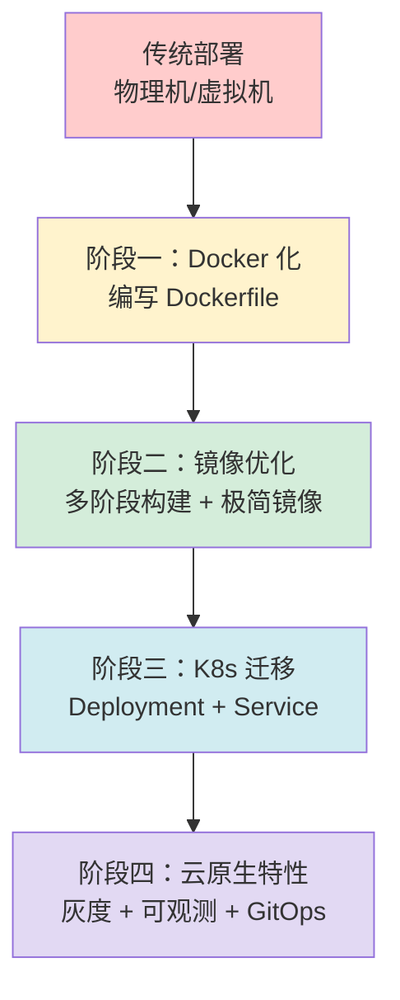
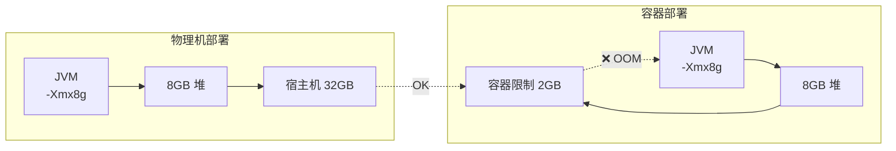

# 容器化

当「在我机器上能跑」变成「一次构建，到处运行」，软件开发进入了新的纪元。Docker 带来的不只是技术变革，更是一种思维方式的转变：从管理机器到管理应用，从手动部署到自动化交付，从烟囱式架构到云原生架构。

这个模块聚焦容器化的核心知识体系：从镜像优化、Java 应用容器化、JVM 内存配置，到容器化改造实战。无论你的团队正在经历容器化转型，还是希望深入理解容器技术的底层原理，这里都能找到有价值的内容。

## 模块结构

本模块涵盖容器化的关键知识领域：

| 章节 | 核心内容 | 解决什么问题 |
| --- | --- | --- |
| 镜像优化与瘦身 | 多阶段构建、极简基础镜像、层优化策略 | 镜像太大、构建太慢、拉取超时 |
| Java 容器化 | Jib vs Dockerfile、内存配置、Docker Compose | Java 应用进容器就 OOM |
| JVM 内存配置 | 容器感知、MaxRAMPercentage、G1/ZGC | JVM 不认识容器限制 |
| 容器化改造实战 | 12-Factor、配置外部化、有状态应用 | 如何把老系统迁移到容器 |

## 核心演进路径

容器化改造是一个渐进的过程，每个阶段都有其核心挑战：

### 各阶段关键能力

**阶段一：Docker 化**
- 理解容器与镜像的关系
- 编写基础 Dockerfile
- 容器内运行和调试

**阶段二：镜像优化**
- 多阶段构建
- 基础镜像选型（alpine/distroless/scratch）
- 层缓存优化

**阶段三：K8s 迁移**
- Deployment/Service/ConfigMap 编写
- 健康检查配置
- 资源限制与调度

**阶段四：云原生**
- 服务网格（Istio）
- GitOps 流水线
- 可观测性体系

## Java 容器化的独特挑战

Java 应用与脚本语言不同，JVM 的内存管理和 GC 机制在容器环境中需要特殊处理：

**核心问题**：JVM 默认以物理机为假想敌配置内存，进入容器后必须适配 cgroup 限制。

## 学习建议

### 从问题出发，而非从概念出发

容器化不是「学 Docker」「学 K8s」，而是「解决容器化过程中的问题」。建议带着问题学习：

- 镜像太大 → 学习多阶段构建和基础镜像选型
- 容器 OOM → 学习 JVM 容器感知配置
- 部署太慢 → 学习构建缓存和 CI/CD 集成
- 环境不一致 → 学习配置外部化和 12-Factor

### 渐进式实践

不要试图一次性完成所有改造：

1. **先让应用跑起来**：一个能工作的 Dockerfile 比完美的 Dockerfile 更有价值
2. **再优化**：构建速度、镜像体积、运行时配置
3. **最后迁移**：K8s 迁移可以在本地 minikube/kind 上先行试验

### 关注边界情况

容器化的很多坑都藏在边界情况里：

- JVM 内存配置不只是 `-Xmx`
- 健康检查要等待应用真正就绪
- 优雅关闭要处理请求处理中的情况
- 有状态应用的容器化要慎之又慎

## 延伸阅读

容器化只是云原生之旅的第一步。在掌握容器化之后，可以继续探索：

- [服务网格](/cloud-native/service-mesh/overview)：Sidecar 代理、流量管理、安全通信
- [GitOps](/cloud-native/cicd/gitops)：声明式部署、ArgoCD/Flux
- [可观测性](/observability/)：日志、指标、链路追踪的统一方案
- [Kubernetes Operator](/cloud-native/kubernetes/operator)：有状态应用的自动化管理

## 思考题

**问题 1**：为什么 Java 应用在容器中容易 OOM，但物理机上运行正常？

参考答案

物理机上，JVM 可以使用全部可用内存；容器中，JVM 必须遵守 cgroup 限制。如果使用固定的 `-Xmx` 而不是容器感知的 `-XX:MaxRAMPercentage`，JVM 可能分配超过容器限制的内存。同时，JVM 的内存消耗不只是堆，还包括元空间、直接内存、线程栈、代码缓存等。这些加起来很容易超过容器限制。

**问题 2**：多阶段构建的「构建阶段」和「运行阶段」分别需要什么？

参考答案

构建阶段需要完整的 JDK、Maven/Gradle、源代码、依赖库，用于编译和打包。运行阶段只需要 JRE（或极简运行时）、最终产物（JAR/二进制）、运行时依赖（如 CA 证书）。两者分离后，运行时镜像可以非常小。

**问题 3**：StatefulSet 和 Deployment 的本质区别是什么？

参考答案

核心区别在于「Pod 标识」和「存储」：

1. StatefulSet 的 Pod 有固定、稳定的标识（如 mysql-0、mysql-1），Deployment 的 Pod 标识是随机的
2. StatefulSet 每个 Pod 有独立的 PVC，Deployment 的 Pod 共享存储
3. StatefulSet 按顺序启动和终止，Deployment 并行处理

这使得 StatefulSet 适合数据库、消息队列等需要固定网络标识和持久化存储的应用。

准备好开始容器化之旅了吗？让我们从镜像优化开始。
