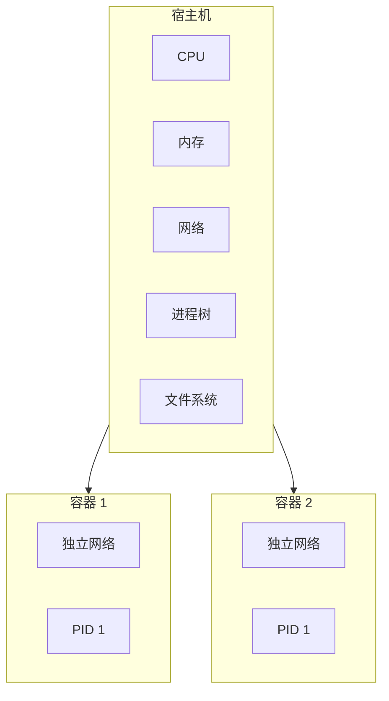
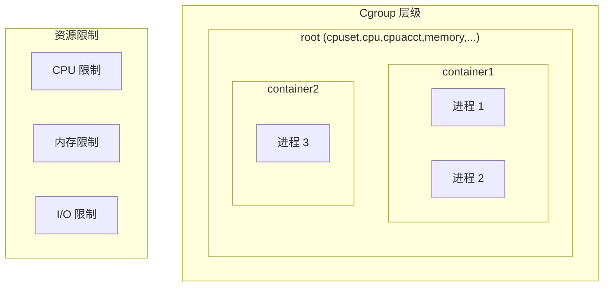
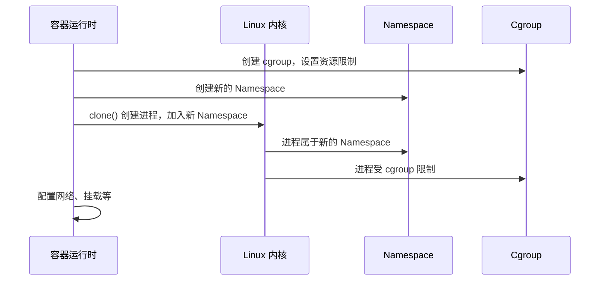

# 容器资源隔离（Namespace/Cgroup）

「为什么同一个宿主机上的两个容器，一个内存泄漏不会影响另一个？」

这个问题的答案，藏在 Linux 内核的两个核心机制中：**Namespace（命名空间）** 和 **Cgroup（控制组）**。

Namespace 负责「隔离」，让容器拥有独立的视图；Cgroup 负责「限制」，确保容器不会耗尽系统资源。两者结合，构成了容器的底层基础。

## Namespace：隔离的视图

Namespace 将系统的全局资源「划分」成不同的视图。容器内的进程「看到」的是自己独立的资源，而不是宿主机的全部资源。



### 六种类型的 Namespace

Linux 内核提供了六种类型的 Namespace：

| 类型 | 标志 | 隔离内容 | 用途 |
| --- | --- | --- | --- |
| **PID** | `CLONE_NEWPID` | 进程 ID | 容器内 PID 从 1 开始 |
| **Network** | `CLONE_NEWNET` | 网络设备、端口 | 独立网络栈 |
| **Mount** | `CLONE_NEWNS` | 文件系统挂载点 | 独立文件系统视图 |
| **UTS** | `CLONE_NEWUTS` | 主机名、域名 | 独立的主机名 |
| **IPC** | `CLONE_NEWIPC` | 共享内存、信号量 | 进程间通信隔离 |
| **User** | `CLONE_NEWUSER` | 用户 ID、组 ID | 用户命名空间 |

### Namespace 的工作原理

```bash
# 查看进程的 Namespace
ls -la /proc/self/ns

# 输出示例
lrwxrwxrwx 1 root root 0 Apr  9 10:00 cgroup -> cgroup:[4026531835]
lrwxrwxrwx 1 root root 0 Apr  9 10:00 ipc -> ipc:[4026531839]
lrwxrwxrwx 1 root root 0 Apr  9 10:00 mnt -> mnt:[4026531840]
lrwxrwxrwx 1 root root 0 Apr  9 10:00 net -> net:[4026531841]
lrwxrwxrwx 1 root root 0 Apr  9 10:00 pid -> pid:[4026531836]
lrwxrwxrwx 1 root root 0 Apr  9 10:00 user -> user:[4026531837]
lrwxrwxrwx 1 root root 0 Apr  9 10:00 uts -> uts:[4026531838]

# 查看容器进程的 Namespace
docker inspect nginx --format='{{.State.Pid}}'
# 假设是 12345
ls -la /proc/12345/ns/
```

### 容器内的进程视图

当你进入容器内部，看到的是隔离后的视图：

```bash
# 宿主机上看到的进程
ps aux | head -10
# root  12345  ...  /usr/bin/containerd-shim
# root  12346  ...  nginx: master process
# nginx 12347 ...  nginx: worker process

# 容器内看到的进程
docker exec container ps aux
# root      1  ...  /bin/sh
# nginx     7  ...  nginx: master process
# nginx     8  ...  nginx: worker process
```

容器的 PID 1 是隔离后独立的进程空间，与宿主机上的 PID 12346 对应。

## Cgroup：资源的限制

Namespace 提供了隔离，Cgroup 则提供了**资源限制**。没有 Cgroup，一个容器可能会耗尽整台机器的资源。



### Cgroup 的层级结构

Cgroup 采用树形层级结构，每个层级的限制继承自父节点。

```bash
# 查看 cgroup 挂载点
mount | grep cgroup

# 输出示例
cgroup on /sys/fs/cgroup/cpuset
cgroup on /sys/fs/cgroup/cpu,cpuacct
cgroup on /sys/fs/cgroup/memory
cgroup on /sys/fs/cgroup/blkio
cgroup on /sys/fs/cgroup/devices

# 查看 cgroup 目录结构
ls /sys/fs/cgroup/
```

### 常见的 Cgroup 控制器

| 控制器 | 限制内容 | 关键参数 |
| --- | --- | --- |
| **cpu** | CPU 时间分配 | `cpu.cfs_quota_us`, `cpu.cfs_period_us` |
| **cpuset** | CPU 核心绑定 | `cpuset.cpus`, `cpuset.mems` |
| **memory** | 内存使用 | `memory.limit_in_bytes`, `memory.soft_limit_in_bytes` |
| **blkio** | 块设备 I/O | `blkio.throttle.read_bps_device` |
| **pids** | 进程数量 | `pids.max` |
| **devices** | 设备访问 | 允许/禁止列表 |

## Namespace 与 Cgroup 的配合

容器运行时创建容器时，会同时配置 Namespace 和 Cgroup：



## Docker 中的资源限制

### 内存限制

```bash
# 限制容器最大使用 512MB 内存
docker run -d --name app \
    --memory=512m \
    --memory-swap=1g \
    nginx:alpine

# 软限制（内存不足时触发）
docker run -d --name app \
    --memory=1g \
    --memory-reservation=512m \
    nginx:alpine
```

### CPU 限制

```bash
# 限制最多使用 1.5 个 CPU 核心
docker run -d --name app \
    --cpus=1.5 \
    nginx:alpine

# 限制使用特定的 CPU 核心
docker run -d --name app \
    --cpuset-cpus=0,1 \
    nginx:alpine

# 限制 CPU 权重（相对限制）
docker run -d --name app \
    --cpu-shares=1024 \
    nginx:alpine
```

### 其他资源限制

```bash
# 限制进程数量
docker run -d --name app \
    --pids-limit=100 \
    nginx:alpine

# 限制块设备 I/O
docker run -d --name app \
    --blkio-weight=500 \
    --device-read-bps=/dev/sda:10mb \
    nginx:alpine
```

## 容器隔离的局限性

### 共享内核带来的风险

容器与宿主机共享内核，这意味着：

1. **内核漏洞影响所有容器**：宿主机内核的漏洞，所有容器都可能受影响
2. **系统调用是共用的**：不存在真正的「虚拟内核」
3. **资源竞争**：共享资源可能被某个容器耗尽

```bash
# 容器内的进程看到的内核版本
docker exec container uname -r
# 与宿主机相同
uname -r
```

### 容器逃逸风险

隔离不完美时，可能发生容器逃逸：

1. **特权容器**：`--privileged` 标志禁用大部分隔离
2. **挂载敏感目录**：不当的 volume 挂载可能暴露宿主机
3. **内核漏洞**：容器运行时或内核的漏洞可能导致逃逸

```bash
# 危险：不使用特权容器
docker run --privileged ubuntu:latest

# 危险：挂载宿主机根目录
docker run -v /:/host ubuntu:latest
```

## 权衡矩阵

| 隔离级别 | 安全性 | 性能开销 | 灵活性 |
| --- | --- | --- | --- |
| Namespace + Cgroup | 中 | 低 | 高 |
| gVisor | 高 | 中 | 中 |
| Kata Containers | 极高 | 高 | 中 |
| 虚拟机 | 极高 | 高 | 低 |

## 常见问题与排查

### 容器被 OOM Killer 杀死

```bash
# 查看容器是否被 OOM
docker inspect container --format='{{.State.OOMKilled}}'

# 查看内存使用
docker stats container

# 调整内存限制
docker update --memory=1g container
```

### CPU 节流导致性能下降

```bash
# 检查 CPU 节流情况
docker run -d --name app --cpus=1 nginx
cat /sys/fs/cgroup/cpu/docker/$(docker inspect --format='{{.Id}}' app)/cpu.stat

# 观察 cfs 周期
cat /sys/fs/cgroup/cpu/cpu.cfs_period_us
cat /sys/fs/cgroup/cpu/cpu.cfs_quota_us
```

### 进程数达到限制

```bash
# 检查 pids 限制
docker inspect container --format='{{.HostConfig.PidsLimit}}'

# 查看容器内进程数
docker exec container ps -eLf | wc -l
```

## 延伸思考

Namespace 和 Cgroup 是 Linux 内核提供的强大功能，让容器成为可能。但它们的隔离是「软隔离」，不是「硬隔离」——共享内核的本质意味着不可能达到 VM 级别的安全。

在实际生产中，理解这些局限性有助于做出正确的架构决策：

1. **多租户环境需要更强的隔离**：考虑使用 gVisor 或 Kata Containers
2. **不要盲目使用特权容器**：特权容器几乎等于放弃了所有隔离
3. **资源限制要合理配置**：过紧的限制会导致应用不稳定，过松则失去隔离意义

容器安全是一场猫鼠游戏。理解底层机制，才能在享受容器便利性的同时，把风险控制在可接受范围内。
