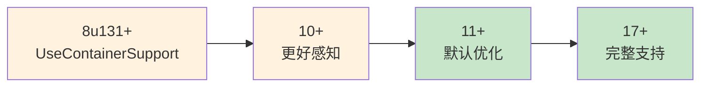
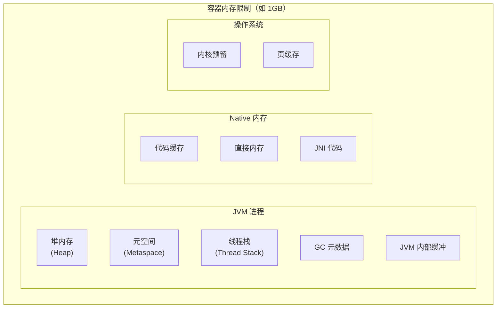
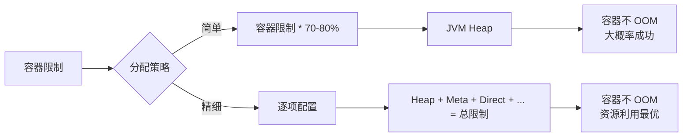

# JVM 在容器中的内存配置

Java 应用容器化后，最常遇到的第一个问题是什么？**内存配置**。

很多团队把 Spring Boot 应用容器化后，发现 Pod 不断重启，日志里写着 `java.lang.OutOfMemoryError: Container memory limit exceeded`。登上服务器一看：容器限制了 512MB 内存，JVM 竟然分配了 2GB 堆内存。

这不是 JVM 的 bug，而是 Java 与容器深度集成的一个演进过程。理解这个过程，才能正确配置 JVM 在容器中的内存使用。

## JVM 内存配置的演进

### 传统 JVM 时代的问题

在 Java 8u131 之前，JVM 并不「知道」自己运行在容器里。它读取的是**宿主机的物理内存**，而不是容器的 cgroup 限制：

```bash
# 宿主机内存：32GB
# 容器内存限制：1GB
java -jar app.jar

# JVM 看到的：32GB
# JVM 分配的堆：32GB * 1/4 ≈ 8GB
# 结果：容器 OOM
```

这是一个经典问题：JVM 看到的内存与实际可用内存不符。

### 容器感知的 JVM

从 **Java 8u131** 开始，JVM 引入了对容器资源限制的支持。通过 `-XX:+UseContainerSupport`（默认开启），JVM 可以读取 cgroup 信息。

但这还不够。默认的启发式算法仍然基于物理内存分配，不够精准。从 **Java 10** 开始，引入了更完善的容器感知机制：



## JVM 与容器的内存交互

### 容器内存的组成

容器申请的内存不仅仅是 JVM 堆，还包括：



| 内存区域 | 默认行为 | 配置参数 |
| --- | --- | --- |
| **堆内存（Heap）** | `物理内存/容器限制 * 1/4` | `-Xmx`, `-Xms` |
| **元空间（Metaspace）** | 动态增长 | `-XX:MaxMetaspaceSize` |
| **线程栈（Thread Stack）** | 每线程 1MB | `-Xss` |
| **直接内存（Direct Memory）** | 堆大小 | `-XX:MaxDirectMemorySize` |
| **代码缓存（Code Cache）** | 动态增长 | `-XX:ReservedCodeCacheSize` |

### 正确的内存配置公式



## 容器感知的 JVM 参数

### 核心参数

| 参数 | 说明 | Java 版本 |
| --- | --- | --- |
| `UseContainerSupport` | 启用容器感知 | 8u131+ |
| `ActiveProcessorCount` | 自动检测可用 CPU | 10+ |
| `UseNUMA` | 自动启用 NUMA | 10+ |

### 内存限制参数

| 参数 | 说明 | 备注 |
| --- | --- | --- |
| `-XX:+UseContainerAllocatingHeapOnFailures` | 容器超限时回退分配 | 11.0.10+ |
| `-XX:+UnlockExperimentalVMOptions` | 解锁实验参数 | 需要配合其他参数 |
| `-XX:SoftMaxHeapSize` | 软目标堆大小 | 11+ |

## 容器内存配置实践

### 方案一：简单配置（推荐）

适用于大多数场景，使用 JVM 的容器感知默认行为：

```dockerfile title="简单配置示例"
FROM eclipse-temurin:21-jre-jammy

# 容器内存限制 1GB，JVM 会自动感知并调整
# 堆大约 285MB 元大约 256MB
WORKDIR /app
COPY myapp.jar /app/myapp.jar

ENTRYPOINT ["java", "-jar", "/app/myapp.jar"]
```

```bash
# 运行时限制内存
docker run -m 1g myapp

# JVM 会自动感知容器限制
# 堆大小会自动调整为 ~250-300MB
```

### 方案二：显式配置（更可控）

显式指定堆大小，避免 JVM 自动调整的不可预测性：

```dockerfile title="显式配置示例"
FROM eclipse-temurin:21-jre-jammy

WORKDIR /app
COPY myapp.jar /app/myapp.jar

# 显式配置堆大小为容器限制的 50%
# 容器限制 1GB 时，堆 = 512MB
ENTRYPOINT ["java", "-XX:MaxRAMPercentage=50", "-jar", "/app/myapp.jar"]
```

### 方案三：精确配置（生产环境）

为每种内存区域设置明确的上限：

```dockerfile title="精确配置示例"
FROM eclipse-temurin:21-jre-jammy

WORKDIR /app
COPY myapp.jar /app/myapp.jar

ENTRYPOINT ["java", "-server", \
    # 堆配置：容器限制 2GB * 50% = 1GB
    "-Xms512m", \
    "-Xmx1g", \
    "-XX:MaxRAMPercentage=50", \
    # 元空间：固定 256MB 足够了
    "-XX:MaxMetaspaceSize=256m", \
    # 线程栈：默认 1MB 够了，如果线程多可以调小
    "-Xss1m", \
    # 直接内存：通常是堆的 1/10
    "-XX:MaxDirectMemorySize=128m", \
    # G1 收集器，适合容器环境
    "-XX:+UseG1GC", \
    # G1 堆比例
    "-XX:InitiatingHeapOccupancyPercent=45", \
    # GC 日志
    "-Xlog:gc*:file=/app/logs/gc.log", \
    "-jar", "/app/myapp.jar"]
```

## Spring Boot 应用的特殊配置

### 使用 jib-maven-plugin 优化镜像

jib 是 Google 开发的容器镜像构建工具，专门优化 Java 应用的镜像构建：

```xml title="pom.xml 配置
<plugin>
    <groupId>com.google.cloud.tools</groupId>
    <artifactId>jib-maven-plugin</artifactId>
    <version>3.4.0</version>
    <configuration>
        <from>
            <image>eclipse-temurin:21-jre-jammy</image>
        </from>
        <to>
            <image>registry.example.com/myapp:1.0</image>
        </to>
        <container>
            <jvmFlags>
                <jvmFlag>-Xmx1g</jvmFlag>
                <jvmFlag>-XX:MaxRAMPercentage=50</jvmFlag>
                <jvmFlag>-XX:+UseG1GC</jvmFlag>
            </jvmFlags>
            <ports>
                <port>8080</port>
            </ports>
            <creationTime>USE_CURRENT_TIMESTAMP</creationTime>
        </container>
    </configuration>
</plugin>
```

```bash
mvn compile jib:dockerBuild
```

### 使用 Spring Boot 的 Docker 支持

Spring Boot 提供专门的 Dockerfile：

```dockerfile title="使用分层 JAR
# 构建分层 JAR
./mvnw package -Pnative

# Dockerfile
FROM eclipse-temurin:21-jre-jammy AS builder
WORKDIR app
COPY target/*.jar app.jar
RUN java -Djarmode=layertools -jar app.jar extract

FROM eclipse-temurin:21-jre-jammy
WORKDIR app
COPY --from=builder app/dependencies/ ./
COPY --from=builder app/spring-boot-loader/ ./
COPY --from=builder app/snapshot-dependencies/ ./
COPY --from=builder app/application/ ./
ENTRYPOINT ["java", "org.springframework.boot.loader.launch.JarLauncher"]
```

## Kubernetes 内存配置建议

### 资源限制与请求

```yaml title="合理的资源请求与限制"
apiVersion: v1
kind: Pod
metadata:
  name: myapp
spec:
  containers:
  - name: myapp
    image: registry.example.com/myapp:1.0
    resources:
      # 请求：保证分配给 Pod 的内存
      requests:
        memory: "512Mi"
        cpu: "250m"
      # 限制：最大可使用的资源
      limits:
        memory: "1Gi"
        cpu: "500m"
    # 健康检查
    livenessProbe:
      httpGet:
        path: /actuator/health
        port: 8080
      initialDelaySeconds: 60
      periodSeconds: 10
```

:::tip
**为什么请求和限制要不同？**
- `requests`：调度时使用，应该设置为你期望的正常使用量
- `limits`：触发 OOM 的阈值，不应该轻易达到

对于 Java 应用，内存请求通常设为 `-Xmx` 值，内存限制设为 `requests * 1.2~1.5`。
:::

### 内存超限时的行为

```bash
# 当容器内存超过 limits 时会发生什么？
# 1. Kubernetes 触发 OOMKilled
# 2. Pod 进入 CrashLoopBackOff 状态
# 3. 查看事件：kubectl describe pod

Events:
  Type     Reason     Age   From               Message
  ----     ------     ----  ----               -------
  Warning  BackOff    1m    kubelet            Back-off restarting failed container
  Reason: OOMKilled
```

### 配置存活探针（很重要）

Java 应用启动慢是常态。如果不配置存活探针，Kubernetes 可能在应用还没启动完成时就杀掉它：

```yaml
livenessProbe:
  httpGet:
    path: /actuator/health/liveness
    port: 8080
  initialDelaySeconds: 60   # 等待应用启动
  periodSeconds: 10
  timeoutSeconds: 5
  failureThreshold: 3
```

## JVM 内存监控

### 诊断接口

Java 11+ 提供了一组诊断 API：

```bash
# 进入容器查看
docker exec -it myapp /bin/sh

# 查看进程
jps -l

# 查看内存使用
jcmd <pid> VM.native_memory summary

# JDK 11+ 的更好工具
java -XX:NativeMemoryTracking=summary -jar app.jar
```

### 健康端点

Spring Boot Actuator 提供了内存监控端点：

```properties title="application.properties"
# 启用健康检查
management.endpoint.health.show-details=always
management.health.livenessState.enabled=true
management.health.readinessState.enabled=true

# 暴露指标
management.metrics.export.prometheus.enabled=true
```

```bash
# 查看健康状态
curl http://localhost:8080/actuator/health

# 查看内存指标
curl http://localhost:8080/actuator/metrics/jvm.memory.used
curl http://localhost:8080/actuator/metrics/jvm.memory.max
```

## 常见问题与排查

### 问题一：OOMKilled

**症状**：Pod 被杀掉，显示 `OOMKilled`。

**排查**：

```bash
# 查看 Pod 事件
kubectl describe pod myapp | grep -A5 Events

# 查看容器退出码
kubectl get pod myapp -o jsonpath='{.status.containerStatuses[*].lastState.terminated.exitCode}'

# 确认是 OOM
kubectl get pod myapp -o jsonpath='{.status.containerStatuses[*].lastState.terminated.reason}'
```

**解决方案**：增加内存限制，或减少 JVM 堆大小。

### 问题二：JVM 没有感知容器限制

**症状**：JVM 分配的堆大于容器限制。

**排查**：

```bash
# 检查容器 cgroup 信息
cat /sys/fs/cgroup/memory/memory.limit_in_bytes

# 检查 JVM 看到的内存
docker exec myapp java -XX:+PrintFlagsFinal -version | grep MaxHeap
```

**解决方案**：使用支持容器感知的 JVM 版本，或显式设置 `-XX:MaxRAMPercentage`。

### 问题三：Metaspace 增长失控

**症状**：应用启动后 Metaspace 持续增长，最终 OOM。

**原因**：动态类加载过多，或有内存泄漏。

**解决方案**：设置 `-XX:MaxMetaspaceSize=256m` 并监控。

## 权衡矩阵

| 配置方案 | 优点 | 缺点 | 适用场景 |
| --- | --- | --- | --- |
| **MaxRAMPercentage=70** | 简单、自适应 | 可能不够精确 | 开发测试环境 |
| **精确配置（-Xmx 等）** | 可控、可预测 | 需要了解各区域需求 | 生产环境 |
| **软目标（SoftMaxHeapSize）** | 灵活性高 | 行为复杂 | 内存敏感场景 |

## 常见反模式

### 反模式一：不配置内存限制

```bash
# 错误：没有限制容器内存
docker run myapp

# JVM 会分配大堆，可能影响宿主机上其他进程
```

**正确做法**：总是设置容器内存限制，并让 JVM 感知这个限制。

### 反模式二：JVM 堆设得太满

```bash
# 错误：JVM 堆占满容器限制
docker run -m 1g java -Xmx1g -jar app.jar

# 没有为 Metaspace、线程栈、GC 预留空间
```

**正确做法**：JVM 堆只占容器限制的 50-70%。

### 反模式三：忽略直接内存

NIO 操作会使用直接内存，如果不限制，可能分配超过容器限制：

```bash
# 限制直接内存
java -Xmx512m -XX:MaxDirectMemorySize=128m -jar app.jar
```

### 反模式四：不监控内存使用

```bash
# 错误：不监控
docker run myapp

# 正确：使用 Prometheus + JMX Exporter
java -javaagent:/app/jmx_exporter.jar=8080:config.yaml -jar app.jar
```

## 延伸思考

JVM 与容器的内存交互，本质上是一个资源感知和分配的问题。理解这个问题的关键，是明白 JVM 进程不只是堆内存，还有元空间、线程栈、直接内存、代码缓存等区域。

配置 JVM 内存的核心原则是：**让 JVM 知道容器限制，让各区域有合理空间**。

对于大多数应用，使用 `-XX:MaxRAMPercentage=50` 是简单有效的方案。但对于内存敏感或资源受限的环境，精确配置每个区域是更好的选择。

当你遇到容器 OOM 时，先问自己：JVM 堆是多少？Metaspace 有没有限制？直接内存上限是多少？这些问题加起来，是不是超过了容器限制？

答案往往就藏在这几个数字里。