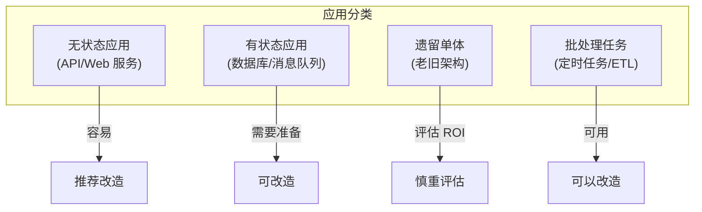
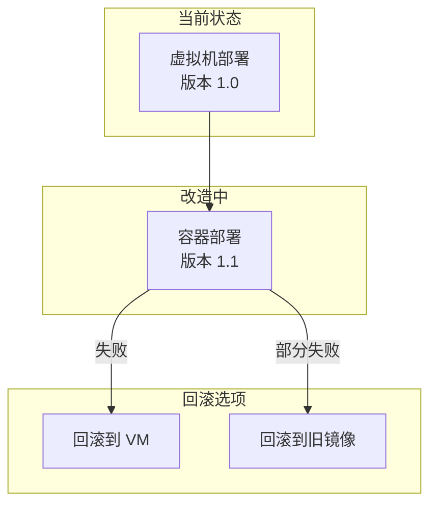

三年前，你接手了一个单体 Java 应用。它跑在虚拟机上，部署靠手动拷贝 war 包，回滚靠备份目录。运维团队抱怨：「每次发布都像拆炸弹。」

现在，团队决定迁移到 Kubernetes。你知道这不只是在 Docker 里跑起来那么简单——应用的启动脚本、配置文件、日志路径、依赖版本，都需要重新审视。

这篇文章，是一个真实容器化改造项目的完整复盘。

## 容器化改造的评估阶段

在动手之前，先回答三个问题：**要不要改、能不能改、怎么改**。

### 改造价值评估

不是所有应用都值得容器化。评估维度：

| 维度 | 问题 | 结论参考 |
| --- | --- | --- |
| **部署频率** | 每周部署几次？ | 高频（>3次/周）→ 优先改造 |
| **团队规模** | 需要协调多少团队？ | 多团队 → 容器化收益大 |
| **基础设施** | 是否已有 K8s 环境？ | 没有 → 改造代价高 |
| **应用类型** | 有状态还是无状态？ | 有状态 → 需要额外改造 |
| **技术栈** | 是否过于老旧？ | 太老 → 可能无法容器化 |

### 应用类型分类



### 常见改造障碍

| 障碍 | 说明 | 解决方案 |
| --- | --- | --- |
| 硬编码路径 | `/opt/app/logs` 等 | 配置外部化 |
| 本地文件系统 | 写入 `/tmp` 或 `/var` | 使用 Volume 或内存文件系统 |
| 依赖固定端口 | 无法通过环境变量配置 | 配置化改造 |
| 缺少健康检查 | 没有 `/health` 接口 | 添加健康检查端点 |
| 依赖特定 UID | 需要 root 或固定用户 | User Namespace + 权限配置 |

## 容器化改造的典型步骤

### 第一步：环境配置外部化

传统应用的配置文件往往硬编码在代码中。容器化要求所有配置通过环境变量或配置文件注入。

```java title="原代码 - 硬编码配置"
public class DatabaseConfig {
    private static final String DB_HOST = "10.0.0.100";
    private static final int DB_PORT = 3306;
    private static final String DB_NAME = "proddb";
}
```

```java title="改造后 - 环境变量配置"
public class DatabaseConfig {
    private static final String DB_HOST = getEnv("DB_HOST", "localhost");
    private static final int DB_PORT = Integer.parseInt(getEnv("DB_PORT", "3306"));
    private static final String DB_NAME = getEnv("DB_NAME", "appdb");

    private static String getEnv(String key, String defaultValue) {
        String value = System.getenv(key);
        return value != null ? value : defaultValue;
    }
}
```

```bash title="Docker 环境变量"
$ docker run -e DB_HOST=mysql.prod.svc \
             -e DB_PORT=3306 \
             -e DB_NAME=proddb \
             myapp
```

### 第二步：日志输出标准化

容器中的日志应该输出到标准输出（stdout），而不是写入本地文件。这样 Kubernetes 的日志收集可以正常工作。

```java title="日志改造 - 输出到 stdout"
import org.slf4j.Logger;
import org.slf4j.LoggerFactory;

// 不要写入文件
// private static final File logFile = new File("/var/log/app.log");

// 使用 SLF4J 输出到 stdout
public class App {
    private static final Logger logger = LoggerFactory.getLogger(App.class);

    public static void main(String[] args) {
        logger.info("应用启动中...");
        logger.info("数据库连接: {}", dbHost);
    }
}
```

```dockerfile title="Dockerfile 配置日志"
# 避免程序把日志写到文件
ENV LOG_DIR=/dev/stdout

# 或者使用符号链接
RUN ln -sf /dev/stdout /var/log/app.log
```

### 第三步：健康检查与优雅关闭

容器需要响应 Kubernetes 的健康检查，并在收到 SIGTERM 时优雅关闭。

```java title="Spring Boot 健康检查端点"
import org.springframework.web.bind.annotation.*;

@RestController
public class HealthController {

    @GetMapping("/health")
    public Health health() {
        // 检查关键依赖
        boolean dbHealthy = checkDatabase();
        boolean cacheHealthy = checkRedis();

        if (dbHealthy && cacheHealthy) {
            return new Health("OK", true);
        } else {
            return new Health("DEGRADED", false);
        }
    }

    private boolean checkDatabase() {
        try {
            jdbcTemplate.execute("SELECT 1");
            return true;
        } catch (Exception e) {
            return false;
        }
    }
}
```

```java title="优雅关闭处理"
import org.springframework.context.event.*;
import jakarta.annotation.*;

public class GracefulShutdown {

    @PreDestroy
    public void onDestroy() {
        logger.info("收到关闭信号，开始优雅关闭...");

        // 1. 停止接收新请求
        logger.info("停止接收新请求");

        // 2. 等待现有请求完成（最多 30 秒）
        int waitTime = 30;
        while (activeRequests > 0 && waitTime > 0) {
            Thread.sleep(1000);
            waitTime--;
            logger.info("等待 {} 个请求完成...", activeRequests);
        }

        // 3. 关闭数据库连接
        dataSource.close();

        logger.info("优雅关闭完成");
    }
}
```

### 第四步：多阶段 Dockerfile 构建

```dockerfile title="Java 应用 Dockerfile"
# 阶段 1：构建
FROM maven:3.9-eclipse-temurin-21 AS builder

WORKDIR /build

# 复制 pom.xml 并下载依赖（利用缓存）
COPY pom.xml .
RUN mvn dependency:go-offline -B

# 复制源码并构建
COPY src ./src
RUN mvn package -DskipTests -B

# 阶段 2：运行
FROM eclipse-temurin:21-jre-jammy

# 创建非 root 用户
RUN groupadd -r appuser && useradd -r -g appuser appuser

# 复制构建产物
COPY --from=builder /build/target/app.jar app.jar

# 安全配置
RUN chmod 500 app.jar
USER appuser

# 健康检查
HEALTHCHECK --interval=30s --timeout=3s --retries=3 \
    CMD curl -f http://localhost:8080/health || exit 1

# 启动命令
ENTRYPOINT ["java", "-jar", "app.jar"]
```

```dockerfile title="Go 应用 Dockerfile"
# 多阶段构建
FROM golang:1.22 AS builder

WORKDIR /build

# 复制源码（利用缓存）
COPY go.mod go.sum ./
RUN go mod download

COPY . .
RUN CGO_ENABLED=0 GOOS=linux go build -a -installsuffix cgo -o app .

# 运行阶段
FROM scratch

COPY --from=builder /etc/ssl/certs/ca-certificates.crt /etc/ssl/certs/
COPY --from=builder /build/app /app

ENTRYPOINT ["/app"]
```

## 改造后的验证清单

### 功能验证

```bash title="基础功能验证"
# 1. 容器启动测试
$ docker run -d --name myapp-test myapp:latest
$ docker logs myapp-test
$ docker exec myapp-test curl http://localhost:8080/health

# 2. 配置注入测试
$ docker run -e DB_HOST=localhost -e DB_PORT=3306 myapp
$ docker logs | grep "数据库连接"

# 3. 资源限制测试
$ docker run -m 512m --cpus=0.5 myapp
$ docker stats myapp

# 4. 日志输出测试
$ docker logs myapp | grep -E "INFO|ERROR|WARN"
```

### Kubernetes 验证

```yaml title="deployment-validation.yaml"
apiVersion: apps/v1
kind: Deployment
metadata:
  name: myapp
spec:
  replicas: 2
  strategy:
    type: RollingUpdate
    rollingUpdate:
      maxSurge: 1
      maxUnavailable: 0
  template:
    spec:
      terminationGracePeriodSeconds: 30  # 优雅关闭时间
      containers:
        - name: myapp
          image: myapp:latest
          ports:
            - containerPort: 8080
          env:
            - name: DB_HOST
              valueFrom:
                secretKeyRef:
                  name: db-credentials
                  key: host
          livenessProbe:
            httpGet:
              path: /health
              port: 8080
            initialDelaySeconds: 30
            periodSeconds: 10
          readinessProbe:
            httpGet:
              path: /ready
              port: 8080
            initialDelaySeconds: 5
            periodSeconds: 5
          resources:
            requests:
              memory: "256Mi"
              cpu: "100m"
            limits:
              memory: "512Mi"
              cpu: "500m"
```

```bash title="Kubernetes 部署验证"
# 1. 部署测试
$ kubectl apply -f deployment.yaml
$ kubectl rollout status deployment myapp

# 2. 健康检查验证
$ kubectl describe pod -l app=myapp | grep -A 5 "Liveness"
$ kubectl get pods -l app=myapp

# 3. 滚动更新测试
$ kubectl set image deployment/myapp myapp=myapp:v2
$ kubectl rollout undo deployment/myapp  # 测试回滚

# 4. 负载测试
$ kubectl run load-test --image=busybox -- /bin/sh -c \
    "while true; do wget -q -O- http://myapp:8080/health; done"
```

## 回滚策略

容器化改造不是单向的。必须准备好回滚方案。

### 回滚方案设计



### 保留旧版本

```bash title="保留旧版本"
# 1. 不要立即删��旧镜像
$ docker tag myapp:v1.0 myapp:v1.0-backup-$(date +%Y%m%d)
$ docker push harbor.example.com/myapp:v1.0-backup-20240115

# 2. 保留旧的 VM 版本（容器化初期）
$ ssh vm-server "cp -r /opt/app /opt/app-backup-$(date +%Y%m%d)"

# 3. 配置回滚脚本
$ cat rollback.sh
#!/bin/bash
kubectl rollout undo deployment myapp
echo "已回滚到上一版本"
```

## 常见问题与反模式

### 问题 1：硬编码文件路径

**现象**：应用写入 `/var/log/app.log`，容器删除后日志消失。

**解决方案**：使用 `stdout` + 日志收集，或挂载 Volume。

```dockerfile
# 错误
RUN mkdir -p /var/log && chmod 777 /var/log

# 正确
ENV LOG_DIR=/dev/stdout
```

### 问题 2：缺少启动检查

**现象**：容器启动后立即接收流量，但数据库连接还没建立。

**解决方案**：添加 `readinessProbe`，确保依赖就绪后再接收流量。

### 问题 3：敏感信息硬编码

**现象**：数据库密码写在 Dockerfile 中。

**解决方案**：使用 Kubernetes Secret 或环境变量。

```yaml title="Secret 使用"
apiVersion: v1
kind: Secret
metadata:
  name: db-credentials
type: Opaque
stringData:
  password: my-secret-password
---
apiVersion: apps/v1
kind: Deployment
spec:
  template:
    spec:
      containers:
        - name: app
          env:
            - name: DB_PASSWORD
              valueFrom:
                secretKeyRef:
                  name: db-credentials
                  key: password
```

### 问题 4：忽略资源限制

**现象**：应用内存泄漏导致宿主机 OOM。

**解决方案**：始终设置内存限制和请求值。

## 权衡矩阵

| 场景 | 推荐做法 | 说明 |
| --- | --- | --- |
| 老旧单体 | 整体容器化 | 不拆分，减少风险 |
| 微服务 | 逐个改造，验证后推进 | 每改造一个服务，都进行完整验证 |
| 数据库 | 评估后决定是否容器化 | 优先使用云服务或外部数据库 |
| 定时任务 | CronJob + 镜像 | 任务容器化，调度平台化 |
| 有状态服务 | 使用 Operator | 需要额外的状态管理机制 |

## 延伸思考

容器化改造不是终点，而是起点。

改造完成后，你会获得：更快的部署速度、更一致的环境、更容易的回滚。但同时也需要面对新的挑战：

1. **镜像安全**：容器内的依赖需要定期更新和安全扫描
2. **网络复杂性**：Service、Ingress、NetworkPolicy 的配置更复杂
3. **可观测性**：需要统一的日志、Metrics、Trace 收集方案
4. **CI/CD 重构**：从「上传 war 包」到「构建并推送镜像」

更深一层的问题是：**你的团队准备好运维容器了吗？**

容器化不只是技术转型，也是运维模式的转型。从「手动部署」到「声明式部署」，从「登录机器排查问题」到「查看日志和监控面板」。培训和工具建设，同样重要。

改造完成后，记得问自己：我的团队现在能比以前更可靠地发布吗？如果答案是肯定的，改造才算真正成功。