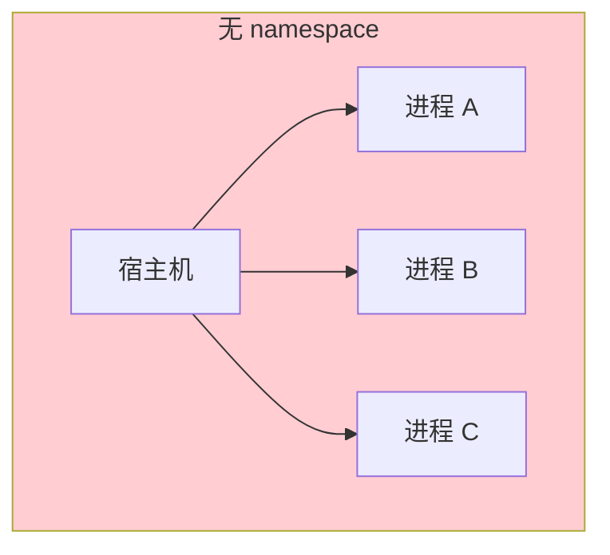
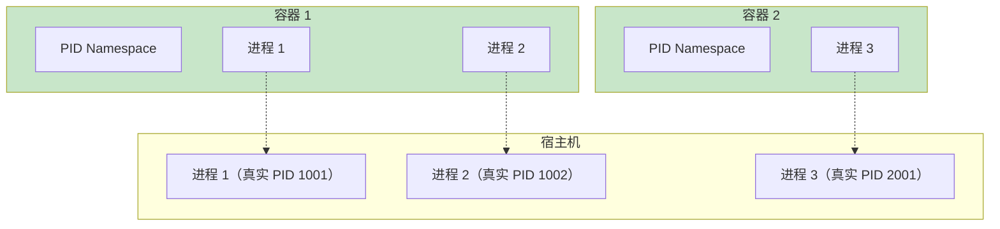
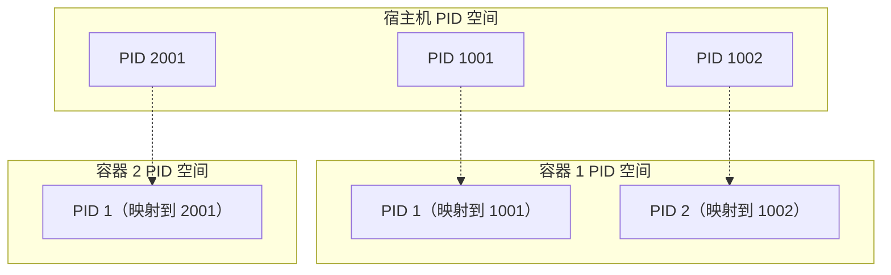
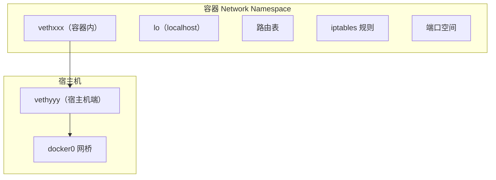
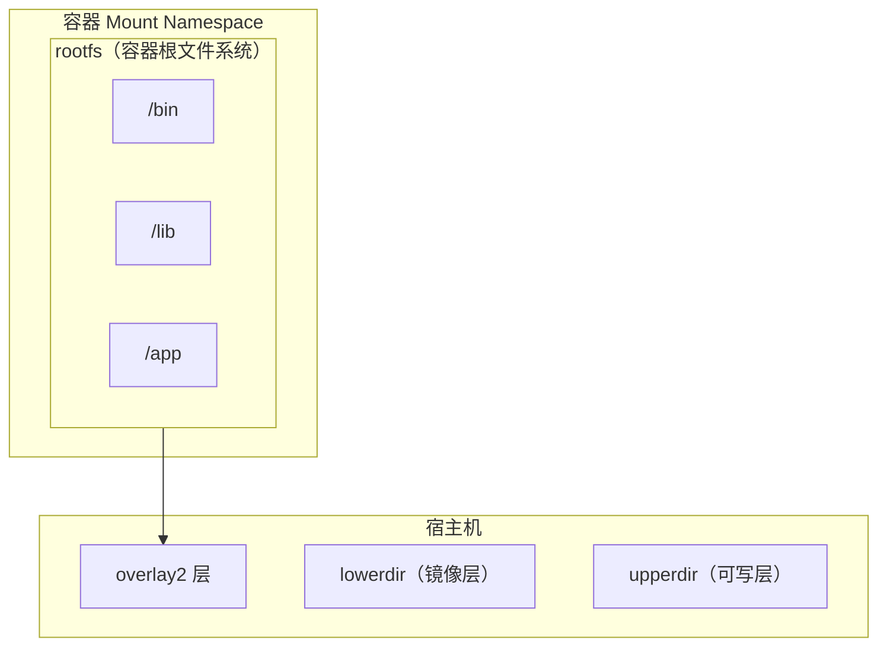
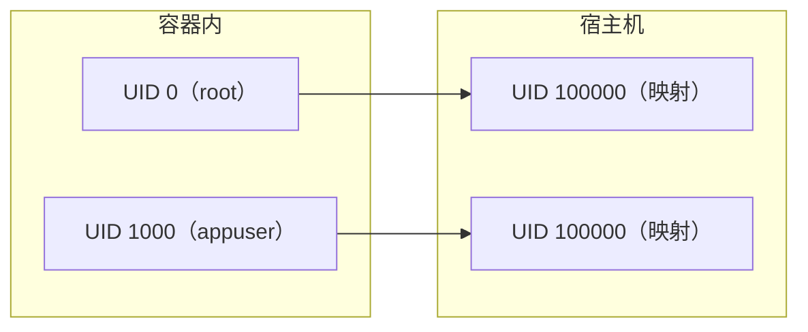

# namespace 详解（PID/Net/Mount/UTS/IPC/User）

一个容器内的进程可以看到 PID 1，可以监听端口 80，可以有自己的主机名。这些「独立性」是怎么实现的？

答案是 **Linux namespace（命名空间）**。

namespace 是 Linux 内核提供的一种资源隔离机制。它让进程看起来拥有自己独立的视图——独立的进程 ID、独立的网络栈、独立的主机名等。这种隔离，正是容器技术的核心。

## namespace 的设计哲学

在 namespace 出现之前，所有进程共享同一个视图：



namespace 出现后，每个容器可以有自己的「视图」：



关键点：
- **进程看到的 PID vs 真实的 PID**：容器内看到 PID 1，宿主机上可能是 PID 1001
- **隔离性**：容器 A 的进程看不到容器 B 的进程
- **资源共享**：底层硬件资源仍然是共享的，只是视图被隔离

## 六种 namespace 类型

Linux 支持六种主要的 namespace 类型：

| namespace | 隔离内容 | 内核参数 |
| --- | --- | --- |
| **PID** | 进程 ID | `CLONE_NEWPID` |
| **Network** | 网络设备、端口、路由 | `CLONE_NEWNET` |
| **Mount** | 文件系统挂载点 | `CLONE_NEWNS` |
| **UTS** | 主机名和域名 | `CLONE_NEWUTS` |
| **IPC** | 共享内存、信号量、消息队列 | `CLONE_NEWIPC` |
| **User** | 用户 ID 和组 ID 映射 | `CLONE_NEWUSER` |

### 查看进程的 namespace

```bash
# 查看进程所属的 namespace
ls -la /proc/<pid>/ns/

# 示例输出：
# lrwxrwxrwx 1 root root 0 Apr  9 10:00 pid -> pid:[4026531836]
# lrwxrwxrwx 1 root root 0 Apr  9 10:00 net -> net:[4026531837]
# lrwxrwxrwx 1 root root 0 Apr  9 10:00 mnt -> mnt:[4026531838]
# lrwxrwxrwx 1 root root 0 Apr  9 10:00 uts -> uts:[4026531839]
# lrwxrwxrwx 1 root root 0 Apr  9 10:00 ipc -> ipc:[4026531840]
# lrwxrwxrwx 1 root root 0 Apr  9 10:00 user -> user:[4026531837]
```

## PID namespace：进程隔离

### PID namespace 的工作原理



### PID namespace 的特性

1. **PID 1**：每个 PID namespace 都有自己的 PID 1（init 进程）
2. **进程树**：父 namespace 可以看到子 namespace 的进程（通过 /proc）
3. **信号隔离**：PID 1 可以接收子 namespace 中进程的 SIGTERM

### 验证 PID namespace

```bash
# 在容器内查看 PID
docker run --rm alpine cat /proc/1/status | grep ^Pid

# 输出：Pid:    1

# 在宿主机上查看同一进程的真实 PID
docker run -d --name test alpine sleep 1000
cat /proc/<真实PID>/status | grep ^Pid

# 清理
docker rm -f test
```

## Network namespace：网络隔离

### Network namespace 的组件



Network namespace 隔离的内容：

| 组件 | 说明 |
| --- | --- |
| **网络设备** | 每个 namespace 有自己的网络设备 |
| **IP地址** | 独立的 IP 地址和路由表 |
| **端口空间** | 独立的 TCP/UDP 端口范围 |
| **iptables** | 独立的防火墙规则 |
| **/proc/net** | 独立的网络��计信息 |

### 查看网络 namespace

```bash
# 查看容器使用的网络 namespace
docker inspect <container-id> --format '{{.NetworkSettings.SandboxKey}}'

# 进入容器的 network namespace
nsenter -t <pid> -n ip addr
```

### 常用操作

```bash
# 创建网络 namespace
ip netns add myns

# 在 namespace 中执行命令
ip netns exec myns ip addr

# 删除 namespace
ip netns del myns

# 连接两个 namespace（创建 veth 对）
ip link add veth0 type veth peer name veth1
ip link set veth1 netns myns
```

## Mount namespace：文件系统隔离

### Mount namespace 的原理

Mount namespace 让每个进程看到不同的文件系统视图：



### 容器根文件系统的挂载

容器启动时，Docker 会为容器创建一个新的 Mount namespace，并挂载容器所需的 rootfs：

1. **Pivot_root**：将容器的 rootfs 作为新的根目录
2. **挂载 /proc、/sys、/dev**：容器需要的特殊文件系统
3. **只读挂载**：镜像层通常以只读方式挂载

### 查看 Mount namespace

```bash
# 查看容器的 mount 信息
docker exec myapp cat /proc/mounts

# 查看宿主机上容器的挂载点
mount | grep /var/lib/docker
```

## UTS namespace：主机名隔离

### UTS namespace 的作用

UTS namespace 隔离主机名和域名：

```bash
# 宿主机
hostname
# 输出：server01

# 容器内
docker run --rm alpine hostname
# 输出：随机字符串或容器 ID

# 带主机名启动
docker run --rm --hostname myapp alpine hostname
# 输出：myapp
```

### 域名隔离

```bash
# 设置容器的主机名和域名
docker run --rm \
  --hostname myapp \
  --domainname localdomain \
  alpine hostname -f

# 输出：myapp.localdomain
```

## IPC namespace：进程间通信隔离

### IPC 隔离的内容

IPC namespace 隔离以下进程间通信机制：

| IPC 机制 | 说明 |
| --- | --- |
| **共享内存** | 不同 namespace 的进程不能共享内存 |
| **信号量** | 独立的信号量集合 |
| **消息队列** | 独立的消息队列命名空间 |

### IPC namespace 的必要性

某些应用（如 Oracle、PostgreSQL）依赖共享内存进行进程间通信。如果不隔离，可能与宿主机或其他容器冲突。

```bash
# 查看容器的 IPC namespace
ls -la /proc/1/ns/ipc
```

## User namespace：用户隔离

### User namespace 的工作原理

User namespace 映射容器内的用户到宿主机的不同用户：



### Rootless 容器的实现

User namespace 是 Rootless 容器的基础：

```bash
# 查看容器进程的用户映射
cat /proc/1/uid_map

# 示例输出：
#          0       100000      65536
# 表示容器内 UID 0-65535 映射到宿主机 UID 100000-165535
```

### Rootless Docker 配置

```bash
# 安装 rootless-docker 后
dockerd-rootless.sh

# 实际上是在 User namespace 中运行 Docker daemon
```

## namespace 的组合使用

### Docker 创建容器时的 namespace 配置

```bash
# 查看容器创建的所有 namespace
docker run --rm --pid=host alpine cat /proc/1/status | grep ^NS

# 隔离所有 namespace（默认行为）
docker run --rm alpine hostname

# 共享部分 namespace
docker run --rm --network=host alpine hostname
```

### Kubernetes Pod 的 namespace 共享

Pod 中的容器共享部分 namespace：

| namespace | 共享性 | 说明 |
| --- | --- | --- |
| **Network** | 共享 | Pod 内所有容器共享同一个网络栈 |
| **UTS** | 共享 | Pod 内所有容器共享主机名 |
| **PID** | 可选共享 | `shareProcessNamespace=true` 共享 PID namespace |
| **Mount** | 不共享 | 每个容器有独立的文件系统视图 |
| **IPC** | 可选共享 | 某些场景下需要共享 |
| **User** | 不共享 | 容器有独立的用户映射 |

```yaml title="Pod 共享 PID namespace
apiVersion: v1
kind: Pod
metadata:
  name: myapp
spec:
  shareProcessNamespace: true
  containers:
  - name: app
    image: myapp
  - name: sidecar
    image: sidecar
    # 可以看到 app 容器的进程
```

## namespace 与安全

### namespace 的安全边界

虽然 namespace 提供了隔离，但并非绝对安全：

| 隔离类型 | 安全性 | 说明 |
| --- | --- | --- |
| **PID namespace** | 中 | 可以通过 /proc 看到宿主机的进程（需配置） |
| **Network namespace** | 中 | 需要配置 iptables 规则 |
| **Mount namespace** | 中 | 需要正确的 seccomp 配置 |
| **User namespace** | 高 | 可以实现真正的 root 隔离 |

### namespace 逃逸的风险

一些漏洞可以利用 namespace 实现容器逃逸：

| CVE | 影响 | 描述 |
| --- | --- | --- |
| CVE-2019-5736 | runc | 通过 /proc/self/exe 提权 |
| CVE-2022-0492 | containerd | cgroup v1 release_agent 逃逸 |
| CVE-2022-0847 | Linux Kernel | Dirty COW 变体 |

### 缓解措施

1. **使用 seccomp**：限制可使用的系统调用
2. **使用 User namespace**：实现真正的 root 隔离
3. **保持内核更新**：及时修复已知漏洞
4. **使用 gVisor/Kata**：更强的隔离方案

## 常用工具

### nsenter：进入 namespace

```bash
# 获取容器进程的 PID
PID=$(docker inspect <container-id> -f '{{.State.Pid}}')

# 进入容器的 namespace
nsenter -t $PID -m -u -i -n -p /bin/sh
```

### unshare：创建新 namespace

```bash
# 创建新的 PID namespace
unshare --pid --fork bash

# 创建新的网络 namespace
unshare --net bash

# 创建独立的 Mount namespace
unshare --mount bash
```

### lsns：列出 namespace

```bash
# 列出所有 namespace
lsns

# 按类型筛选
lsns -t pid
lsns -t net

# 查看特定进程所属的 namespace
lsns -p <pid>
```

## 常见问题与排查

### 问题一：容器内看不到宿主机进程

这是正确的行为。PID namespace 提供了进程隔离。

**如果需要看到宿主机的进程**（调试场景）：

```bash
# 共享宿主机 PID namespace（危险，不建议生产使用）
docker run --pid=host alpine
```

### 问题二：网络不通

```bash
# 检查容器的网络 namespace
docker exec myapp ip addr

# 检查网络路由
docker exec myapp ip route

# 检查 iptables 规则
docker exec myapp iptables -L
```

### 问题三：文件系统权限问题

```bash
# 检查 Mount namespace 的挂载信息
docker exec myapp cat /proc/mounts

# 检查用户映射
docker exec myapp cat /proc/self/uid_map
```

## namespace 的限制与权衡

### namespace 的局限性

| 限制 | 说明 | 缓解方案 |
| --- | --- | --- |
| **内核共享** | 所有容器共享同一个内核 | 使用 gVisor/Kata |
| **资源竞争** | namespace 不能限制资源使用量 | 使用 cgroup |
| **时间隔离** | 所有容器共享系统时间 | 使用 seccomp 限制 time 系统调用 |
| **硬件隔离** | 不能直接访问硬件 | 通过设备映射或设备插件 |

### namespace vs 虚拟机

| 维度 | namespace（容器） | 虚拟机 |
| --- | --- | --- |
| **��离级别** | 内核共享 | 独立内核 |
| **启动速度** | < 1 秒 | 30 秒+ |
| **资源开销** | 1-2% | 10-30% |
| **密度** | 高（100+ 容器/主机） | 低（10-20 VM/主机） |
| **安全性** | 中等 | 高 |
| **兼容性** | 需要内核支持 | 完整硬件模拟 |

## 常见反模式

### 反模式一：--privileged 禁用所有 namespace 保护

```bash
# 错误：特权容器禁用所有安全限制
docker run --privileged myapp

# 危险：容器内 root 实际上就是宿主机 root
```

**正确做法**：只添加必要的 capabilities，不要使用 `--privileged`。

### 反模式二：--pid=host 共享 PID namespace

```bash
# 错误：容器可以看到宿主机所有进程
docker run --pid=host myapp

# 危险：容器内进程可以看到并操作宿主机进程
```

**正确做法**：保持默认的 PID namespace 隔离。

### 反模式三：忽略 User namespace

**正确做法**：在安全要求高的场景，考虑使用 User namespace 实现真正的 root 隔离。

## 延伸思考

namespace 是容器技术的「眼睛」——它决定了容器「看到」什么。一个没有 PID namespace 的容器，能看到宿主机的所有进程；一个没有 Network namespace 的容器，能访问宿主机的所有网络接口。

理解 namespace 的关键，是明白**隔离不是绝对的，而是有层次的**。namespace 提供了视图层面的隔离，但底层资源仍然是共享的。真正理解这一点，才能在安全性和便利性之间找到平衡。

当你设计容器安全策略时，想想：容器需要哪些 namespace 隔离？哪些可以共享？哪些必须隔离？这个决策，决定了容器能「看到」什么，也决定了攻击者能「利用」什么。