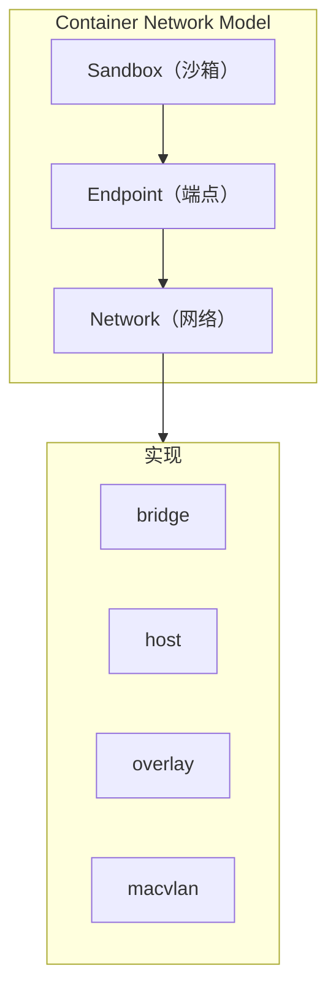
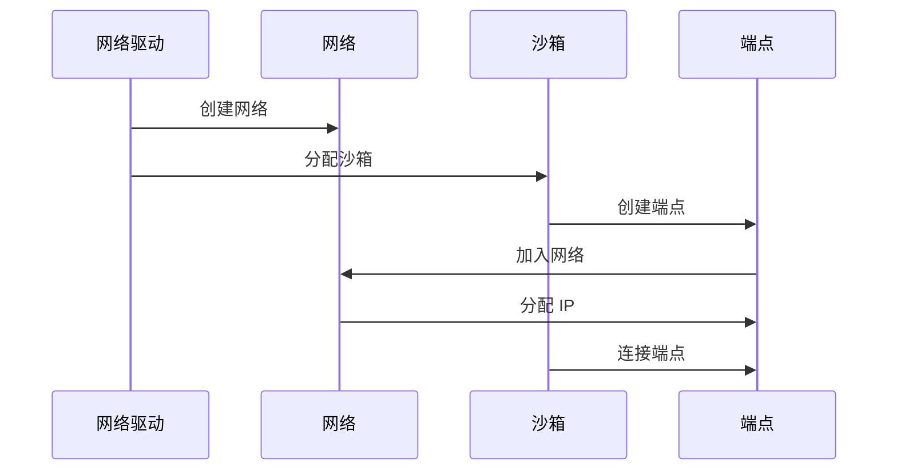
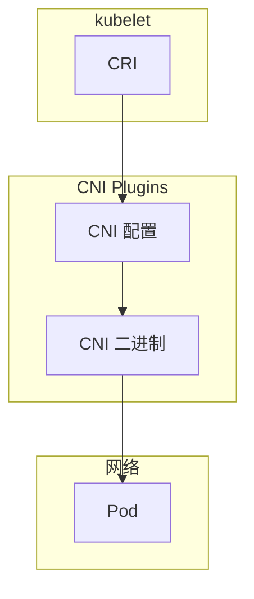
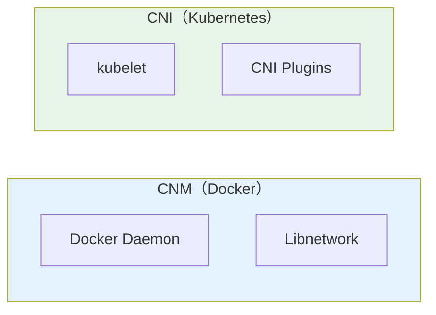
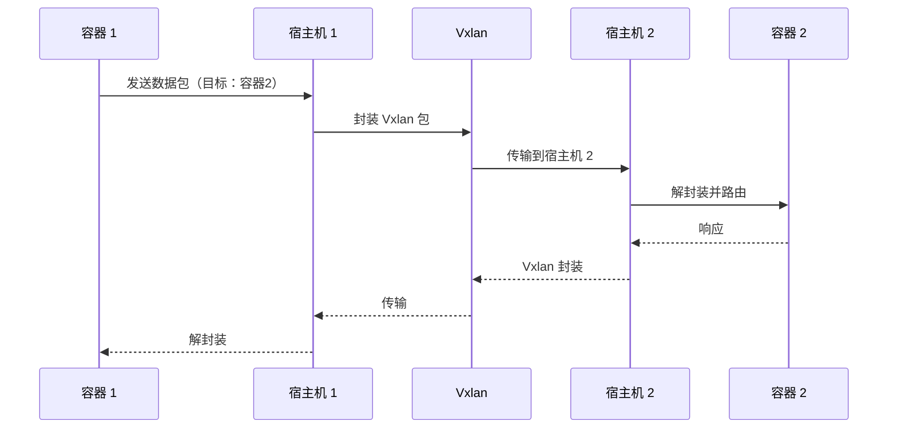

# 容器网络模型（CNM/CNI）

容器网络是容器化中最复杂的领域之一。容器如何与外界通信？如何实现容器间的网络隔离？如何让 Kubernetes 中的 Pod 获得网络能力？

这些问题的答案，藏在两个核心的网络模型中：**CNM（Container Network Model）** 和 **CNI（Container Network Interface）**。

## 为什么容器网络复杂

传统 VM 的网络很简单：每个 VM 有独立的网卡和 IP，通过虚拟化层的网桥或 NAT 与外界通信。

容器则不同：数十上百个容器共享宿主机的网络命名空间，每个容器都需要网络，但它们在同一个宿主机上运行。网络模型必须解决：

1. **容器间的通信**：同一主机上不同容器的通信
2. **容器与外界的通信**：容器如何访问外部网络，外部如何访问容器
3. **跨主机通信**：不同宿主机上的容器如何通信
4. **网络隔离**：不同项目/租户的容器网络如何隔离

## CNM：Docker 的网络模型

CNM 是 Docker 原生的网络模型，定义了容器与网络交互的接口。

### CNM 的三大组件



| 组件 | 说明 | 类比 |
| --- | --- | --- |
| **Sandbox** | 容器的网络命名空间，包含网络配置 | 容器 |
| **Endpoint** | 连接 Sandbox 和 Network 的「插头」 | 网卡 |
| **Network** | 容器组所在的网络 | 交换机/网段 |

### CNM 的生命周期



### CNM 网络驱动

Docker 内置了多种网络驱动：

| 驱动 | 模式 | 适用场景 |
| --- | --- | --- |
| **bridge** | 桥接模式 | 单主机容器通信 |
| **host** | 主机模式 | 追求网络性能 |
| **overlay** | 覆盖网络 | 跨主机容器通信 |
| **macvlan** | MACVLAN | 需要真实 IP |
| **none** | 无网络 | 完全隔离 |

### 自定义网络

```bash
# 创建自定义 bridge 网络
docker network create --driver bridge \
    --subnet=172.20.0.0/16 \
    --gateway=172.20.0.1 \
    my-network

# 创建 overlay 网络（需要 Swarm 模式）
docker network create --driver overlay my-overlay

# 查看网络
docker network ls
docker network inspect my-network
```

## CNI：Kubernetes 的网络模型

CNI（Container Network Interface）是 Kubernetes 采用的网络接口标准，由 CoreOS 提出并贡献给 CNCF。

### CNI 的设计哲学

CNI 的设计原则是**简单、声明式、插件化**：

1. **由容器运行时调用**：Kubelet 创建容器时调用 CNI 插件
2. **JSON 配置**：网络配置以 JSON 格式传递
3. **可插拔**：任何 CNI 插件都可以实现网络功能



### CNI 插件的职责

CNI 插件需要实现以下操作：

```bash
# ADD：容器创建时调用
cni-add --container-id=<id> --netns=<ns-path> --interface=<ifname> <config>

# DEL：容器删除时调用
cni-del --container-id=<id> --netns=<ns-path> --interface=<ifname> <config>

# CHECK：检查网络配置
cni-check --container-id=<id> <config>

# VERSION：查询插件版本
cni-version
```

### 主流 CNI 插件对比

| 插件 | 模式 | 特点 | 适用场景 |
| --- | --- | --- | --- |
| **Flannel** | overlay | 简单，Vxlan 后端 | 简单集群 |
| **Calico** | 路由 | 高性能，Policy | 性能敏感 |
| **Cilium** | eBPF | 可观测性，安全 | 安全优先 |
| **Weave** | overlay | 易用，自动加密 | 快速部署 |
| **Macvlan** | 路由 | 真实 IP | 需要直接路由 |

### Calico 的路由模式

Calico 通过 BGP 协议在宿主机间传播路由，实现高效的 Pod 间通信：

```yaml title="calico.yaml"
apiVersion: projectcalico.org/v3
kind: IPPool
metadata:
  name: default-ipv4-ippool
spec:
  cidr: 192.168.0.0/16
  natOutgoing: true
  nodeSelector: all()
---
apiVersion: projectcalico.org/v3
kind: BGPPeer
metadata:
  name: peer-with-router
spec:
  peerIP: 10.0.0.1
  asNumber: 64512
```

### Cilium 的 eBPF 模式

Cilium 使用 eBPF（Extended Berkeley Packet Filter）在内核层实现网络功能：

```yaml title="network-policy.yaml"
apiVersion: cilium.io/v2
kind: CiliumNetworkPolicy
metadata:
  name: web-policy
spec:
  endpointSelector:
    matchLabels:
      app: nginx
  ingress:
    - fromEndpoints:
        - matchLabels:
            app: frontend
      toPorts:
        - port: "80"
          protocol: TCP
```

## CNM vs CNI：两大模型的对比



| 维度 | CNM | CNI |
| --- | --- | --- |
| **提出者** | Docker | CoreOS |
| **设计者** | Docker Daemon | kubelet |
| **配置方式** | Docker CLI/API | JSON 配置 |
| **插件注册** | 驱动注册 | 二进制 + 配置 |
| **网络范围** | 单机或集群 | 集群级别 |
| **代表实现** | Docker Network | Flannel/Calico |

## 容器网络通信原理

### 单主机容器通信

同一 bridge 网络的容器通过 Docker 网桥通信：

```bash
# 查看 docker0 网桥
ip link show docker0

# 查看容器网络命名空间
docker exec container1 cat /proc/1/net/dev

# 容器间通信流程
container1 -> veth pair -> docker0 -> veth pair -> container2
```

### 跨主机容器通信

Overlay 网络模式下：



## 常见问题与排查

### 容器无法访问外网

```bash
# 检查 NAT 转发
cat /proc/sys/net/ipv4/ip_forward

# 检查 iptables 规则
iptables -t nat -L -n

# 检查 DNS
docker run --rm busybox nslookup google.com
```

### 跨主机容器通信问题

```bash
# 检查 Vxlan 接口
ip link show | grep vxlan

# 检查 BGP 连接（Calico）
calicoctl node status

# 检查路由表
ip route
```

### 网络性能问题

```bash
# 测试网络带宽
iperf3 -s &
docker run --rm networkstatic/iperf3 -c <server-ip>

# 抓包分析
docker exec -it container1 tcpdump -i eth0
```

## 延伸思考

容器网络模型的设计哲学，折射出 Docker 和 Kubernetes 不同的设计目标。

Docker 的 CNM 更强调**用户体验**，通过 Docker CLI 提供了简洁的网络管理方式。但这种设计让网络功能与 Docker Daemon 紧耦合。

Kubernetes 的 CNI 则更强调**开放性**和**可替换性**。通过标准化的 JSON 配置，任何 CNI 插件都可以接入 Kubernetes。这种设计让用户可以根据需求选择不同的网络方案。

理解这两个模型，不只是为了面试——在实际工作中，当你需要 debug 网络问题，或者选择 CNI 插件时，这些知识都会派上用场。
