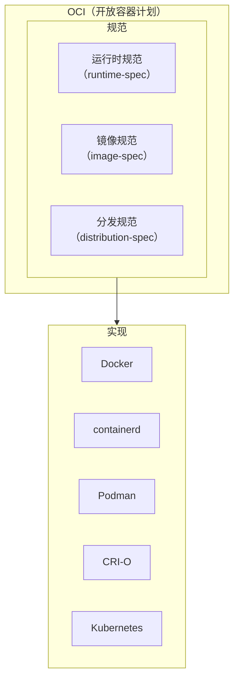
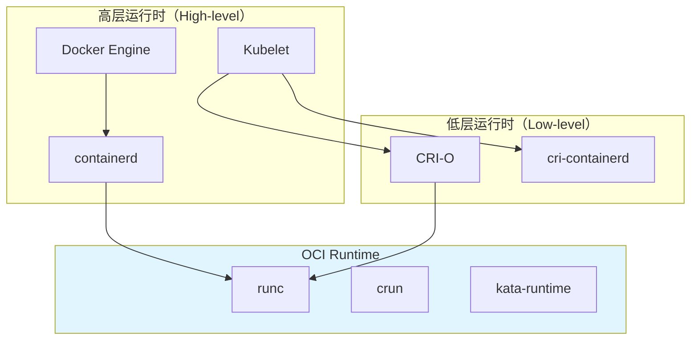
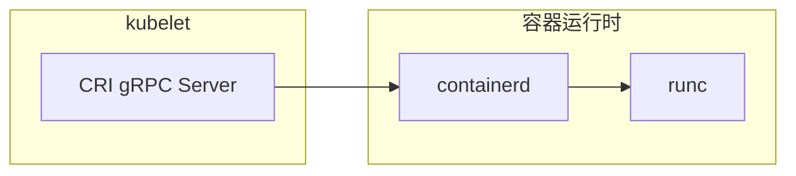

# 容器运行时规范（OCI）

Docker 一开始是闭源的，CoreOS 推出了 rkt 作为竞争方案。那时候每个容器运行时都有自己的镜像格式和运行时规范，整个生态处于碎片化状态。

2015 年，Docker 将 libcontainer 贡献给 Open Container Initiative（OCI），并催生了 OCI 规范。OCI 的出现，让「一次构建，到处运行」真正成为了行业标准——无论你用的是 Docker、containerd 还是 Podman，OCI 规范确保了它们可以运行同一个镜像。

理解 OCI，是理解现代容器生态的钥匙。

## OCI 是什么

OCI（Open Container Initiative）是 Linux 基金会旗下的一个项目，旨在制定容器格式和运行时的开放标准。



## OCI 三大规范

### 运行时规范（runtime-spec）

定义了容器运行时的标准接口。符合 OCI Runtime 标准的实现，必须能运行任何符合 OCI Image 标准的镜像。

**核心概念**：

| 概念 | 说明 |
| --- | --- |
| **Bundle** | 包含配置和根文件系统的一组文件 |
| **Container** | 运行时中实际运行进程的实体 |
| **Runtime** | 创建和运行容器的程序 |

**配置规范（config.json）**：

```json title="config.json"
{
    "ociVersion": "1.1.0",
    "process": {
        "terminal": true,
        "user": {
            "uid": 0,
            "gid": 0
        },
        "args": [
            "/bin/sh"
        ],
        "cwd": "/"
    },
    "root": {
        "path": "rootfs",
        "readonly": true
    },
    "hostname": "container",
    "mounts": [
        {
            "destination": "/proc",
            "type": "proc",
            "source": "proc"
        },
        {
            "destination": "/dev",
            "type": "tmpfs",
            "source": "tmpfs"
        }
    ],
    "linux": {
        "namespaces": [
            { "type": "pid" },
            { "type": "network" },
            { "type": "mount" },
            { "type": "uts" }
        ],
        "resources": {
            "memory": {
                "limit": 209715200,
                "swap": 419430400
            },
            "cpu": {
                "shares": 1024,
                "quota": 100000
            }
        }
    }
}
```

### 镜像规范（image-spec）

定义了容器镜像的标准格式。核心是**镜像清单（Manifest）** 和**文件系统层（Layer）**。

**镜像清单结构**：

```json title="manifest.json"
{
    "schemaVersion": 2,
    "mediaType": "application/vnd.oci.image.manifest.v1+json",
    "config": {
        "mediaType": "application/vnd.oci.image.config.v1+json",
        "digest": "sha256:b5b2b2c507a0944348e0303114d8d93aaaa081732b86451d9bce1f432a537bc7",
        "size": 7023
    },
    "layers": [
        {
            "mediaType": "application/vnd.oci.image.layer.v1.tar+gzip",
            "digest": "sha256:e692418e4cbaf90ca69d05a66403747baa33ee08806650b51fab815ad7fc331f",
            "size": 32654
        },
        {
            "mediaType": "application/vnd.oci.image.layer.v1.tar+gzip",
            "digest": "sha256:3c3a4604a545a2e0bac3e3dd93733a2c76a244b317a12389eb60ee42f6315d72",
            "size": 16724
        }
    ]
}
```

**镜像配置（config.json）**：

```json title="image-config.json"
{
    "architecture": "amd64",
    "os": "linux",
    "config": {
        "Env": ["PATH=/usr/local/sbin:/usr/local/bin:/usr/sbin:/usr/bin:/sbin:/bin"],
        "Cmd": ["/bin/sh"],
        "ExposedPorts": {"80/tcp": {}}
    },
    "rootfs": {
        "type": "layers",
        "diff_ids": [
            "sha256:e692418e4cbaf90ca69d05a66403747baa33ee08806650b51fab815ad7fc331f",
            "sha256:3c3a4604a545a2e0bac3e3dd93733a2c76a244b317a12389eb60ee42f6315d72"
        ]
    }
}
```

### 分发规范（distribution-spec）

定义了镜像分发（push/pull）的 API 标准，确保不同 registry 之间可以互操作。

```bash
# OCI 分发规范定义了这些 API 端点
GET  /v2/                  # 检查 API 版本
GET  /v2/<name>/blobs/<digest>    # 获取 blob
POST /v2/<name>/blobs/uploads/    # 上传 blob
GET  /v2/<name>/manifests/<ref>    # 获取镜像清单
PUT  /v2/<name>/manifests/<ref>   # 推送镜像清单
```

## runc：OCI 运行时规范的参考实现

runc 是 Docker 贡献给 OCI 的运行时实现，也是 OCI Runtime 规范的参考实现。

```bash
# 安装 runc
apt-get install runc

# 创建一个 OCI bundle
mkdir -p /tmp/mycontainer/rootfs
docker export $(docker create busybox) | tar -C /tmp/mycontainer/rootfs -xf -

# 生成默认配置
cd /tmp/mycontainer
runc spec

# 运行容器
runc run mycontainer
```

## OCI 运行时分层

现代容器运行时是一个**多层架构**，每一层各司其职：



### 高层运行时 vs 低层运行时

| 层级 | 职责 | 代表实现 |
| --- | --- | --- |
| **高层运行时** | 镜像管理、API、存储 | containerd、CRI-O |
| **低层运行时** | 创建容器进程、配置 namespace/cgroup | runc、crun、gVisor |

**containerd** 位于高层，它调用 runc 来创建容器。Kubernetes 的 kubelet 通过 CRI（Container Runtime Interface）接口与 containerd 交互。

## CRI：Kubernetes 的运行时接口

CRI（Container Runtime Interface）是 Kubernetes 定义的一套 API，用于 kubelet 与容器运行时通信。



**CRI 的核心服务**：

```protobuf
// RuntimeService：容器生命周期管理
service RuntimeService {
    rpc RunPodSandbox(RunPodSandboxRequest) returns (RunPodSandboxResponse);
    rpc StopPodSandbox(StopPodSandboxRequest) returns (StopPodSandboxResponse);
    rpc RemovePodSandbox(RemovePodSandboxRequest) returns (RemovePodSandboxResponse);
    rpc CreateContainer(CreateContainerRequest) returns (CreateContainerResponse);
    rpc StartContainer(StartContainerRequest) returns (StartContainerResponse);
    rpc StopContainer(StopContainerRequest) returns (StopContainerResponse);
    rpc ListContainers(ListContainersRequest) returns (ListContainersResponse);
}

// ImageService：镜像管理
service ImageService {
    rpc PullImage(PullImageRequest) returns (PullImageResponse);
    rpc ListImages(ListImagesRequest) returns (ListImagesResponse);
    rpc RemoveImage(RemoveImageRequest) returns (RemoveImageResponse);
}
```

## 容器运行时的选择

| 运行时 | 定位 | 适用场景 |
| --- | --- | --- |
| **runc** | OCI 参考实现，轻量 | Docker、k8s + containerd |
| **crun** | Rust 实现，资源占用更低 | 资源受限环境 |
| **gVisor** | 用户态内核隔离 | 需要更强隔离 |
| **Kata Containers** | 硬件虚拟化 | 高安全要求 |
| **firecracker** | 微型 VM | AWS Lambda/Fargate |

## 常见问题与排查

### 镜像格式不兼容

```bash
# Docker 镜像导出为 OCI 格式
docker save nginx:alpine -o nginx.tar

# 使用 OCI 工具处理
docker buildx imagetools create \
    --tag myregistry/myapp:latest \
    ./nginx.tar
```

### OCI Runtime 错误

```bash
# 检查 runc 是否正确安装
runc --version

# 检查内核支持
cat /proc/filesystems | grep overlay

# 查看容器运行时日志
journalctl -u containerd -f
```

## 延伸思考

OCI 规范的出现，彻底改变了容器生态的游戏规则。在 OCI 之前，Docker 镜像只能在 Docker 中运行；在 OCI 之后，任何符合 OCI Runtime 标准的运行时都可以运行任何符合 OCI Image 标准的镜像。

这种解耦带来了显著的好处：

1. **生态竞争**：不同的实现可以专注于各自的优势
2. **供应商锁定**：可以选择不同的运行时，而不用改镜像
3. **标准化**：整个行业有了共同的规范

但 OCI 规范也有其局限性：它只定义了「如何运行一个容器」，而没有定义「如何管理多个容器」。这正是 Kubernetes 解决的问题——容器编排与容器运行时的分离，让整个系统更加灵活和可扩展。
