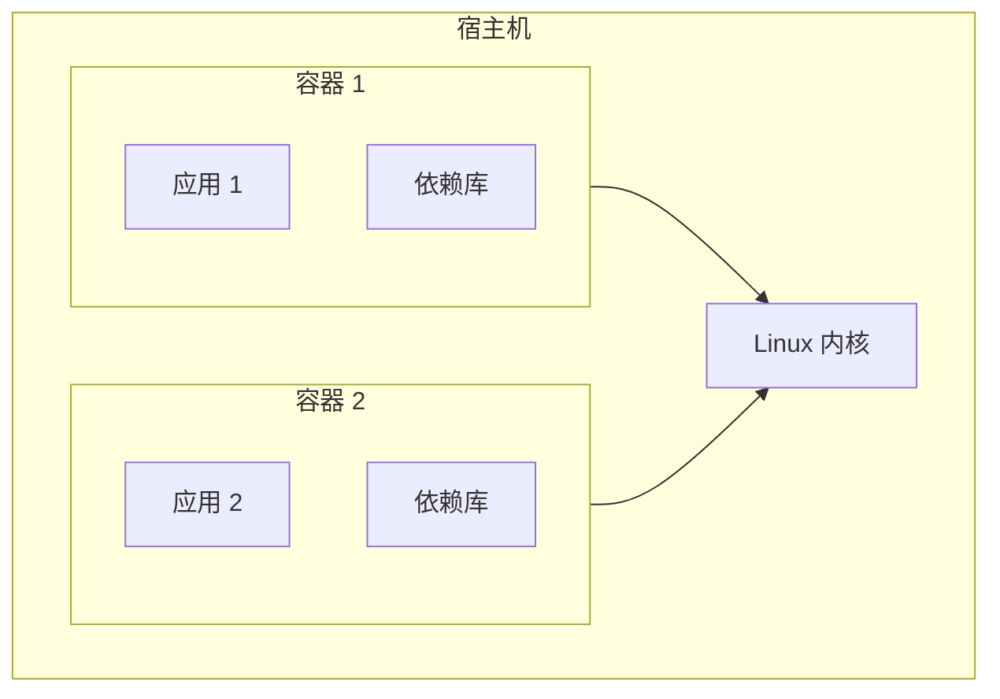
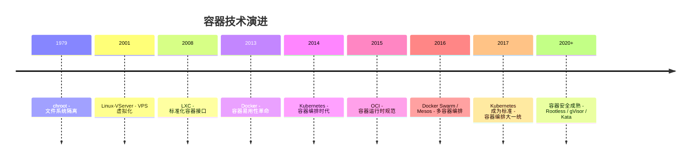
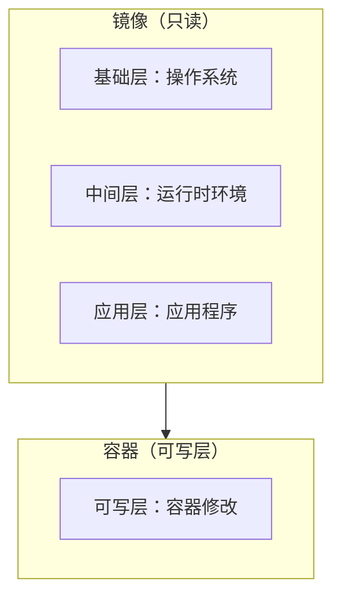

# 容器化概述与演进

凌晨 3 点，你被线上故障叫醒。问题是：开发环境跑得好好的代码，在生产环境就是报错。「环境差异」这四个字，是所有运维工程师的噩梦。

2013 年，Docker 开源，改变了这一切。「一次构建，到处运行」不再是口号，而是真实可落地的工程实践。十年后的今天，容器已经成为云原生时代的基石，Kubernetes 主导着容器编排，Serverless 建立在容器之上，几乎所有现代化的软件交付都在容器化。

但容器化到底是什么？它解决了什么问题？又带来了哪些新的挑战？

## 虚拟化与容器化：两种隔离哲学

要理解容器，首先要理解它的前辈——虚拟机（Virtual Machine，VM）。

虚拟机通过**Hypervisor（虚拟机监控器）** 在物理机上虚拟出多个完整的硬件环境，每个虚拟机运行自己的操作系统（Guest OS）。这种隔离是硬件级别的隔离，虚拟机之间完全独立，一个虚拟机崩溃不会影响其他虚拟机。

```mermaid
flowchart TB
    subgraph Hardware["物理服务器"]
        CPU["CPU"]
        MEM["内存"]
        DISK["磁盘"]
    end

    subgraph VM["虚拟机 1"]
        VM1OS["Guest OS 1"]
        VM1APP["应用 1"]
    end

    subgraph VM2["虚拟机 2"]
        VM2OS["Guest OS 2"]
        VM2APP["应用 2"]
    end

    subgraph Hypervisor["Hypervisor"]
        H1[""]
    end

    Hardware --> Hypervisor
    Hypervisor --> VM
    Hypervisor --> VM2
```

虚拟机的代价是明显的：**每个虚拟机都需要完整的操作系统**，包括内核、系统库、运行时等。这带来两个问题：

1. **资源开销大**：操作系统本身占用大量内存和磁盘空间
2. **启动慢**：启动一个虚拟机需要几十秒甚至几分钟

容器则采用了一种完全不同的隔离哲学：**操作系统级虚拟化**。

## 容器的核心思想：进程隔离而非机器虚拟

容器不是虚拟化硬件，而是隔离运行在同一个操作系统上的进程。容器共享宿主机的内核（Kernel），但通过 Linux Namespace（命名空间）和 Cgroup（控制组）技术，让每个容器看起来像是一个独立的系统。



这种设计带来显著优势：**启动快**（秒级甚至毫秒级）、**资源占用低**（不需要预分配完整操作系统资源）、**密度高**（单台主机可以运行几十上百个容器）。

| 维度 | 虚拟机 | 容器 |
| --- | --- | --- |
| 隔离级别 | 硬件级隔离 | 操作系统级隔离 |
| 启动时间 | 30 秒 ~ 数分钟 | 毫秒 ~ 秒级 |
| 资源开销 | 10%~20% OS 开销 | `<5%` 开销 |
| 密度 | 数十台/主机 | 数百容器/主机 |
| 安全性 | 更高（完全隔离） | 依赖内核安全机制 |

## 容器化的演进历程

容器不是 2013 年才出现的，它的技术根基可以追溯到更早。

### 1979 年：chroot——隔离的起点

Unix 的 `chroot` 系统调用，允许将进程的根目录切换到指定目录，从而实现文件系统的隔离。虽然功能简陋，但它开创了「隔离进程运行环境」的先河。

### 2000 年：FreeBSD Jails——第一个成熟方案

FreeBSD 引入 Jails 机制，在进程隔离之外增加了用户、进程、网络的隔离，是第一个商业级别的操作系统虚拟化方案。

### 2001 年：Linux-VServer——虚拟专用服务器

通过打补丁的方式，为 Linux 添加了类似 Jails 的隔离能力，广泛用于虚拟专用服务器（VPS）场景。

### 2004-2005 年：Solaris Containers / OpenVZ

Sun Microsystems 的 Solaris Containers 和开源社区的 OpenVZ，进一步完善了操作系统级虚拟化技术。

### 2008 年：LXC（Linux Containers）

LXC 是 Linux 内核提供的容器技术的标准化接口，提供了完整的操作系统级虚拟化能力。LXC 的出现，让容器技术第一次变得易用和通用。

### 2013 年：Docker 改变游戏规则

Docker 的出现是容器化的转折点。它没有发明新技术，而是把 Linux Namespace、Cgroup、UnionFS 等技术整合起来，加上友好的 CLI 和镜像机制，让容器变得**前所未有地易用**。



Docker 的关键创新在于**镜像**。传统容器需要手动配置环境，而 Docker 镜像将应用及其依赖打包成只读模板，通过分层存储和增量更新，实现了「构建一次，到处运行」的承诺。

## 容器与镜像：核心概念

理解容器化，必须清楚两个核心概念：**镜像（Image）** 和 **容器（Container）**。

**镜像**是一个只读模板，包含运行应用所需的代码、运行时、系统工具、库文件。镜像是分层的，每一层代表 Dockerfile 中的一步操作。

**容器**是镜像的运行实例。当你从镜像启动一个容器时，Docker 会在镜像顶层添加一个可写层，所有对容器的修改都发生在这个可写层中。



## 容器化的价值：为什么值得学习

容器化带来的价值是全方位的。

**一致性环境**：开发、测试、生产环境完全一致，「在我机器上能跑」变成「在容器里能跑」。

**快速交付**：镜像构建一次，可以快速部署到任何支持容器的地方，大幅缩短交付周期。

**弹性伸缩**：容器轻量的特性使得水平扩展变得简单，结合 Kubernetes 可以实现自动化的弹性伸缩。

**资源隔离**：不同应用运行在独立容器中，资源竞争和依赖冲突大幅减少。

**不可变基础设施**：容器不可变，任何变更都通过重新构建镜像来实现，便于版本管理和回滚。

## 容器化的挑战与局限

容器化不是银弹，它有自己适用范围和挑战。

### 什么时候适合容器化

微服务架构的应用天然适合容器化，每个服务独立构建、独立部署、独立伸缩。持续集成/持续部署（CI/CD）流程中，容器提供了标准化的构建和运行环境。需要高密度部署的场景，容器比虚拟机更节省资源。跨环境部署的应用，容器确保环境一致性。

### 什么时候容器化需要谨慎

对性能敏感的应用，容器共享内核的特性带来额外的上下文切换开销。单核高频交易系统可能不适合容器化。对实时性要求极高的场景，容器调度带来的延迟可能无法接受。强监管行业的应用，传统虚拟化提供的硬件级隔离可能更符合合规要求。

## 术语表

| 术语 | 英文 | 解释 |
| --- | --- | --- |
| 容器 | Container | 镜像的运行实例，提供进程级隔离 |
| 镜像 | Image | 包含应用及其依赖的只读模板 |
| Dockerfile | Dockerfile | 定义镜像构建步骤的配置文件 |
| Docker | Docker | 容器化平台，提供构建、运行、管理容器的能力 |
| 命名空间 | Namespace | Linux 内核提供的资源隔离机制 |
| 控制组 | Cgroup | Linux 内核提供的资源限制机制 |
| 联合文件系统 | UnionFS | 支持分层的文件系统，如 OverlayFS、AUFS |
| 容器编排 | Container Orchestration | 管理多个容器集群的自动化平台 |

## 延伸思考

容器化解决了「环境一致性」的问题，但这只是第一步。容器化之后，你会面临新的问题：如何管理数十上百个容器？如何确保它们高可用？如何实现滚动更新而不中断服务？

这些问题的答案，就是 Kubernetes 诞生的背景。

但无论技术如何演进，容器作为应用交付单元的价值不会改变。理解容器的原理和最佳实践，是理解整个云原生技术栈的基础。
