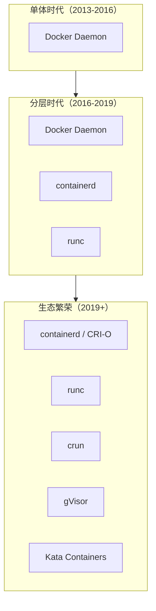
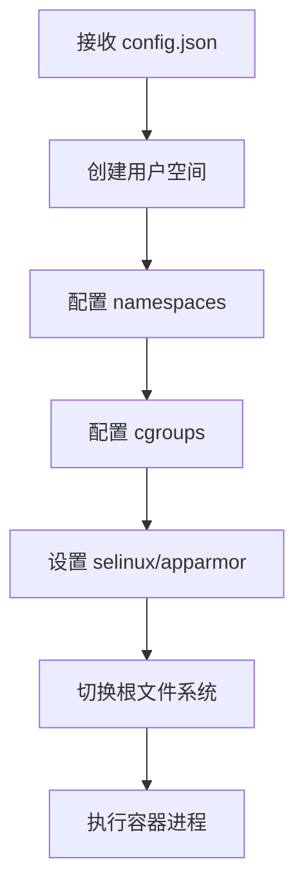
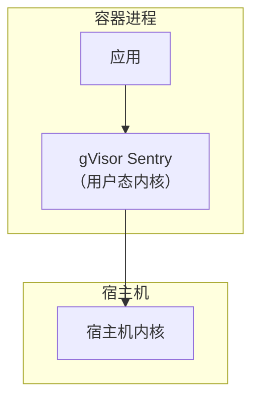
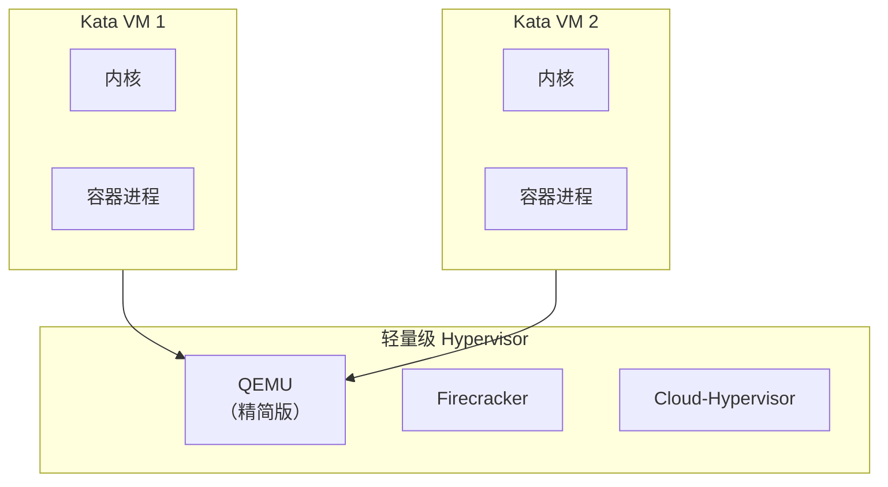
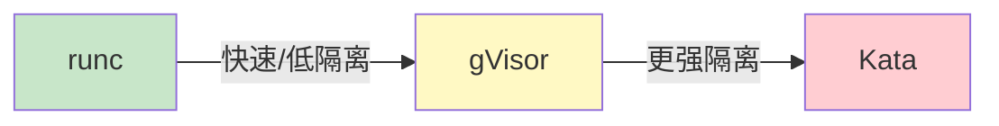

# 容器运行时对比（runc/crun/gVisor/Kata）

容器运行时是容器生态的核心，不同的运行时在隔离性、性能、资源占用、安全性上有显著差异。理解这些差异，才能在生产环境中做出正确的选择。

这不是一个「哪个最好」的问题，而是一个「哪个更适合你的场景」的问题。

## 容器运行时的演进

容器运行时经历了从单体到分层的演进：



## runc：标准与基石

runc 是 OCI Runtime 规范的参考实现，Docker 默认使用的低层运行时。

### 工作原理

runc 直接与 Linux 内核交互，通过系统调用创建容器进程：



### 核心特点

**优点**：

- 符合 OCI 标准，兼容性最好
- 性能接近原生，直接使用内核特性
- 代码成熟，经过大规模生产验证

**缺点**：

- 共享宿主机内核，隔离性依赖内核安全机制
- 不支持非 Linux 系统（Windows/macOS 需要额外虚拟化层）

### 性能数据

| 操作 | 延迟 | 备注 |
| --- | --- | --- |
| 容器启动 | `~100ms` | 冷启动 |
| 内存开销 | `<10MB` | 无额外内存占用 |
| CPU 开销 | `<1%` | 空闲状态 |

## crun：用 Rust 重写的轻量选择

crun 是 Red Hat 开发的 OCI Runtime 实现，用 C 和 Rust 编写，相比 runc 更轻量。

### 为什么需要 crun

runc 用 C 编写，包含大量 GNU C 库和复杂的状态管理。crun 的设计目标是：

1. **更快的启动速度**：目标 < 10ms 启动
2. **更低的内存占用**：静态编译，无额外依赖
3. **更好的资源控制**：精确的 cgroup 配置

### 性能对比

```bash
# 测试启动速度
time runc run test-container

time crun run test-container

# crun 通常快 2-3 倍
```

| 指标 | runc | crun |
| --- | --- | --- |
| 启动时间 | `~100ms` | `~30ms` |
| 内存占用 | `~2MB` | `~200KB` |
| 二进制大小 | `~15MB` | `~400KB` |
| 依赖 | glibc | 无静态 |

### 适用场景

crun 特别适合以下场景：

- **资源受限环境**：边缘设备、IoT、嵌入式系统
- **短生命周期容器**：Serverless 函数、批处理任务
- **大规模部署**：需要快速启动大量容器的场景

```bash
# 安装 crun
apt-get install crun

# 切换 Docker 使用 crun
# /etc/docker/daemon.json
{
    "runtimes": {
        "crun": {
            "path": "/usr/bin/crun"
        }
    }
}
```

## gVisor：用户态内核隔离

gVisor 是 Google 开发的容器运行时，通过在用户态实现 Linux 内核来提供更强的隔离。

### 架构设计

gVisor 不依赖宿主机的内核来运行容器，而是实现了一个用户态内核（Sentry）来处理系统调用：



### 核心特性

**优点**：

- 强隔离：应用崩溃不会直接导致内核崩溃
- 低资源占用：比 VM 轻量，比 runc 隔离强
- 沙箱化：适合运行不受信任的代码

**缺点**：

- 系统调用转换开销，性能损失约 10-30%
- 不支持所有 Linux 系统调用
- 配置相对复杂

### 使用方式

```bash
# 安装 gVisor
install runsc

# /etc/docker/daemon.json
{
    "runtimes": {
        "runsc": {
            "path": "/usr/bin/runsc",
            "runtimeArgs": ["--platform=ptrace"]
        }
    }
}

# 运行沙箱容器
docker run --runtime=runsc nginx
```

## Kata Containers：硬件虚拟化安全

Kata Containers 使用轻量级虚拟机来运行容器，兼顾容器的便捷性和 VM 的安全性。

### 架构设计

Kata Containers 为每个容器创建一个独立的微型 VM：



### 核心特性

**优点**：

- 硬件级隔离，安全性最高
- 每个容器有独立内核
- 符合安全合规要求（PCI-DSS、FIPS 等）

**缺点**：

- 启动较慢（秒级 vs 毫秒级）
- 资源占用较高（每个容器一个 VM）
- 复杂度增加

### 性能对比

| 指标 | runc | gVisor | Kata |
| --- | --- | --- | --- |
| 启动时间 | `~100ms` | `~150ms` | `~1-2s` |
| 内存开销 | `<10MB` | `~50MB` | `~100-200MB` |
| 隔离级别 | 内核命名空间 | 用户态内核 | 硬件虚拟化 |
| 适用场景 | 标准工作负载 | 多租户、沙箱 | 高安全要求 |

## 选择指南

### 场景化选择

| 场景 | 推荐运行时 | 原因 |
| --- | --- | --- |
| 标准微服务 | runc | 成熟、性能好 |
| Serverless 函数 | crun | 启动快、资源省 |
| CI/CD 构建 | runc/crun | 快速执行 |
| 多租户环境 | gVisor | 强隔离 |
| 不受信任代码 | gVisor/Kata | 沙箱化 |
| 金融/医疗合规 | Kata | 硬件隔离 |
| 边缘计算 | crun | 资源受限 |

### 安全考虑

隔离强度与性能开销是成正比的：



### 混合使用

生产环境中，可以针对不同类型的工作负载使用不同的运行时：

```yaml title="Kubernetes runtimeClass"
apiVersion: node.k8s.io/v1
kind: RuntimeClass
metadata:
  name: gvisor
handler: runsc
```

```yaml title="Kata RuntimeClass"
apiVersion: node.k8s.io/v1
kind: RuntimeClass
metadata:
  name: kata
handler: kata
```

```yaml title="Trusted Pod"
apiVersion: v1
kind: Pod
metadata:
  name: trusted-app
spec:
  runtimeClassName: runc
```

```yaml title="Sandboxed Pod"
apiVersion: v1
kind: Pod
metadata:
  name: sandboxed-app
spec:
  runtimeClassName: gvisor
```

```yaml title="Secure Pod"
apiVersion: v1
kind: Pod
metadata:
  name: secure-app
spec:
  runtimeClassName: kata
```

## 常见问题与排查

### 运行时切换问题

```bash
# 检查当前运行时
docker info | grep "Runtime"

# 切换默认运行时
# /etc/docker/daemon.json
{
    "default-runtime": "crun",
    "runtimes": {
        "crun": {
            "path": "/usr/bin/crun"
        }
    }
}
```

### gVisor 兼容性问题

```bash
# gVisor 不支持的系统调用
dmesg | grep "syzsaller"

# 检查容器是否使用 gVisor
docker inspect --format='{{.HostConfig.Runtime}}' container_id
```

### Kata 性能调优

```bash
# 使用 Firecracker 后端（更快）
# Kata 配置文件
[kata_conf.qemu]
path = "/usr/bin/firecracker"
```

## 延伸思考

容器运行时的选择，本质上是在**隔离性、性能、资源占用**三者之间做权衡。

对于大多数应用来说，runc 是最稳妥的选择——它成熟、性能好、生态完善。只有在遇到特定场景时，才需要考虑 gVisor（隔离）或 Kata（安全）。

但随着技术的演进，这些边界正在模糊。Kata Containers 的启动时间已经从秒级缩短到亚秒级，gVisor 的兼容性也在不断改善。未来可能会有更统一的方案出现。

更重要的是，不要为了「先进技术」而引入复杂性。如果 runc 能满足需求，就不要强行使用 Kata。技术选型的第一原则永远是：解决实际问题，而不是追求技术本身。
