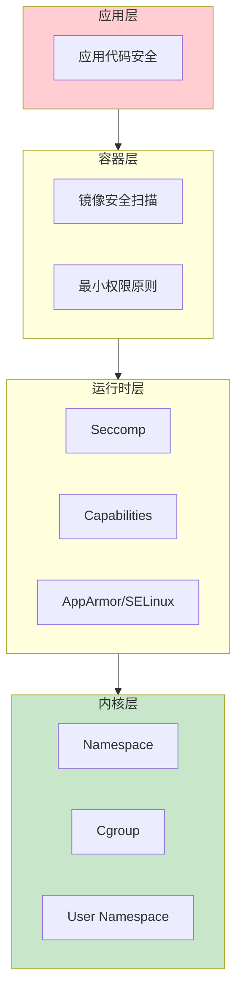
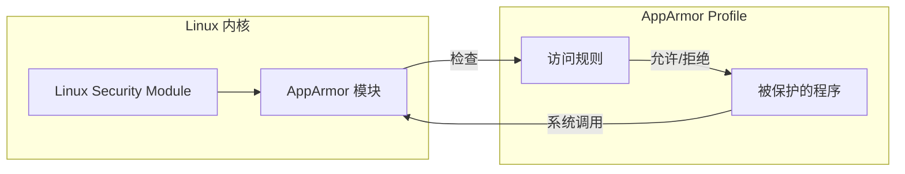
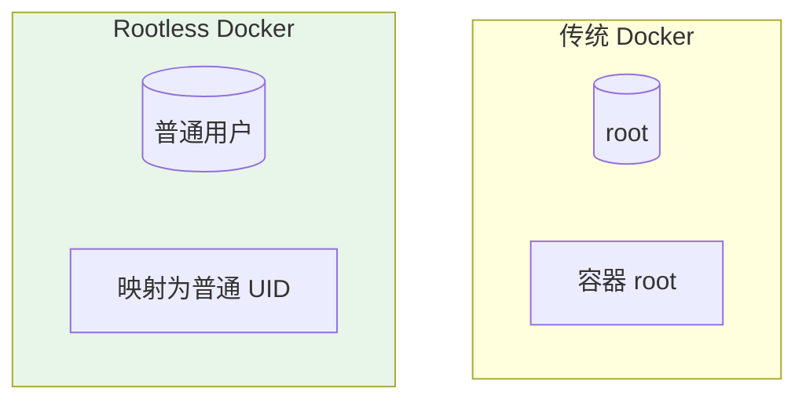
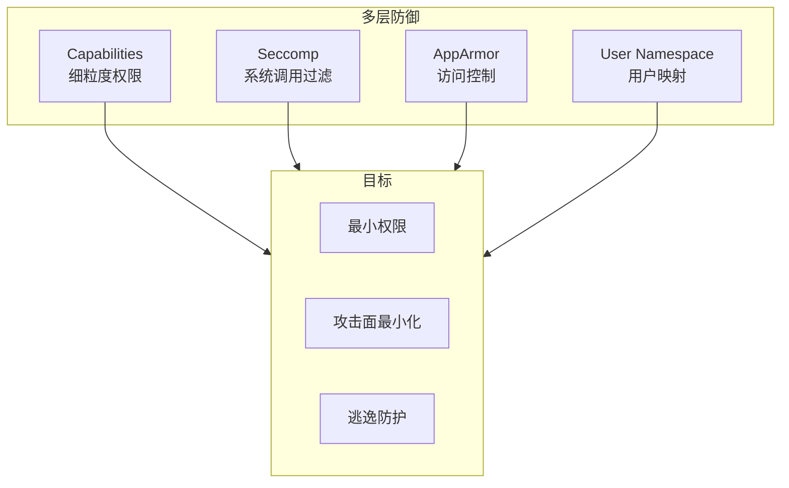

2019 年，某云厂商的容器服务发生了一次逃逸漏洞：攻击者通过一个配置不当的 Docker API 端口，获得了宿主机的 root 权限。这不是 Docker 本身的漏洞，而是**安全配置的缺失**。

容器安全是一个多层次的挑战：Namespace 提供隔离，Cgroup 限制资源，Linux 内核的安全机制（Seccomp、AppArmor、Capabilities）进一步收窄攻击面。如果这些配置被跳过或配置错误，容器就不再「隔离」，而是一个随时可能影响宿主机的炸弹。

理解这些安全机制，是构建安全容器环境的前提。

## 容器安全的多层模型

容器安全可以用「洋葱模型」来理解——每一层都是一道防线：



## Capabilities：细粒度权限控制

Linux 的 root 权限不是「全有或全无」的。Capabilities 把传统意义上的 root 权限分解为多个独立单元。

### 为什么需要 Capabilities？

传统 UNIX 权限模型只有两个角色：root（UID 0）和普通用户。但 root 的权限太大了——它可以做任何事，包括挂载文件系统、修改网络配置、绑定特权端口等。

Capabilities 解决了这个问题：把 root 的特权分解成 40+ 个独立的权限单元，容器只需要其中一部分。

### 常见的 Capabilities

| Capability | 含义 | 典型用途 |
| --- | --- | --- |
| `CAP_NET_BIND_SERVICE` | 绑定 1024 以下端口 | Web 服务监听 80 端口 |
| `CAP_SYS_ADMIN` | 大量系统管理操作 | 挂载文件系统 |
| `CAP_SYS_CHROOT` | 使用 chroot | 创建隔离环境 |
| `CAP_DAC_OVERRIDE` | 绕过文件权限检查 | 读写任意文件 |
| `CAP_NET_ADMIN` | 修改网络配置 | 配置防火墙规则 |
| `CAP_SYS_MODULE` | 加载/卸载内核模块 | 危险，应禁用 |
| `CAP_SYS_RAWIO` | 直接访问磁盘 | 危险，应禁用 |

```bash title="Docker Capabilities 操作"
# 查看 Docker 默认丢弃的 Capabilities
$ docker run --rm alpine cat /proc/self/status | grep Cap
CapInh: 00000000a80425fb
CapPrm: 00000000a80425fb
CapEff: 00000000a80425fb
CapBnd: 00000000a80425fb
CapAmb: 00000000a80425fb

# 查看具体权限
$ capsh --decode=00000000a80425fb
0x00000000a80425fb=cap_chown,cap_dac_override,cap_fowner,cap_fsetid,
cap_kill,cap_setgid,cap_setuid,cap_setpcap,cap_net_bind_service,
cap_net_raw,cap_sys_chroot,cap_mknod,cap_audit_write,cap_setfcap

# 移除所有 Capabilities
$ docker run --rm --cap-drop ALL alpine

# 只保留网络绑定的权限
$ docker run --rm --cap-drop ALL --cap-add CAP_NET_BIND_SERVICE alpine

# 禁用特定 Capability
$ docker run --rm --cap-drop CAP_SYS_ADMIN alpine
```

:::warning
**CAP_SYS_ADMIN 是危险的**

`CAP_SYS_ADMIN` 是最强大的 Capabilities 之一，授予它相当于授予了大部分 root 权限。很多容器化应用错误地请求了这个权限。

在 Kubernetes 中，可以通过 `securityContext.allowPrivilegeEscalation: false` 防止容器获取额外权限。
:::

## Seccomp：系统调用过滤

Seccomp（Secure Computing Mode）是 Linux 内核的系统调用过滤器。它允许你指定哪些系统调用可以被执行。

### 为什么需要 Seccomp？

容器共享宿主机的内核。恶意容器可能利用内核漏洞执行危险系统调用，如：
- `ptrace`：附加到其他进程
- `perf_event_open`：性能分析，可能泄露信息
- `init_module`/`delete_module`：加载内核模块

Seccomp 通过限制可用的系统调用，减少内核暴露的攻击面。

### Docker 默认 Seccomp 配置

Docker 默认提供了一个 Seccomp 配置，阻止了约 44 个危险系统调用：

```bash title="查看 Docker 默认 Seccomp 配置"
$ docker run --rm \
    --security-opt seccomp=unconfined \
    alpine \
    cat /proc/self/status | grep Seccomp

# 输出：Seccomp: 0  （0=关闭，1=strict，2=filter）
```

```json title="Docker 默认 Seccomp 配置（简化）"
{
  "defaultAction": "SCMP_ACT_ERRNO",  // 默认拒绝
  "architectures": ["amd64", "arm64"],
  "syscalls": [
    {
      "names": ["read", "write", "open", "close", ...],
      "action": "SCMP_ACT_ALLOW"       // 允许常见系统调用
    },
    {
      "names": ["mount", "umount2", "unshare", ...],
      "action": "SCMP_ACT_ERRNO",       // 阻止危险系统调用
      "errnoRet": 1,
      "comment": "禁用 mount 等容器逃逸相关的系统调用"
    }
  ]
}
```

### 自定义 Seccomp 配置

```json title="web-server-seccomp.json"
{
  "defaultAction": "SCMP_ACT_ERRNO",
  "syscalls": [
    {
      "names": [
        "read", "write", "open", "close", "stat", "fstat",
        "poll", "lseek", "mmap", "mprotect", "brk", "rt_sigaction",
        "rt_sigprocmask", "rt_sigreturn", "ioctl", "readlink",
        "access", "pipe", "dup", "dup2", "getpid", "socket",
        "connect", "sendto", "recvfrom", "sendmsg", "recvmsg",
        "shutdown", "bind", "listen", "accept", "getsockname",
        "getpeername", "socketpair", "setsockopt", "getsockopt",
        "clone", "fork", "vfork", "execve", "exit", "wait4",
        "kill", "uname", "getpriority", "prctl", "arch_prctl",
        "gettid", "readahead", "setthreadarea", "clock_gettime",
        "exit_group", "epoll_wait", "epoll_ctl", "tgkill"
      ],
      "action": "SCMP_ACT_ALLOW"
    }
  ]
}
```

```bash
$ docker run --security-opt seccomp=web-server-seccomp.json nginx
```

## AppArmor：进程安全配置文件

AppArmor（Application Armor）是 Linux 的强制访问控制（MAC）系统。它通过配置文件定义进程的访问权限。

### AppArmor vs SELinux

| 维度 | AppArmor | SELinux |
| --- | --- | --- |
| 复杂度 | 简单，基于路径 | 复杂，基于标签 |
| 学习曲线 | 低 | 高 |
| 兼容性 | Ubuntu/Debian 默认 | RHEL/CentOS 默认 |
| Docker 支持 | 原生支持 | 需要额外配置 |

### AppArmor 工作原理



### AppArmor Profile 示例

```bash title="nginx-apparmor-profile"
# 基础信息
profile nginx-container flags=(attach_disconnected) {
  # 引入基础规则
  include <abstractions/base>

  # 程序路径
  /usr/sbin/nginx mr,

  # 允许读取的文件
  /etc/nginx/** r,
  /var/log/nginx/** rw,
  /var/cache/nginx/** rw,

  # 允许的网络操作
  network inet tcp,
  bind inet tcp port 80,

  # 允许的系统调用
  capability net_bind_service,
  capability dac_override,

  # 拒绝其他所有访问
  deny /etc/shadow r,
  deny /sys/** w,
}
```

```bash title="加载和使用 AppArmor Profile"
# 1. 创建 profile
$ cat > /etc/apparmor.d/usr.sbin.nginx << 'EOF'
profile nginx-container /usr/sbin/nginx {
  # ... 规则 ...
}
EOF

# 2. 加载 profile
$ apparmor_parser -r /etc/apparmor.d/usr.sbin.nginx

# 3. 在 Docker 中使用
$ docker run --security-opt apparmor=nginx-container nginx
```

### Kubernetes 中的 AppArmor

```yaml title="pod-with-apparmor.yaml"
apiVersion: v1
kind: Pod
metadata:
  name: nginx-with-apparmor
spec:
  containers:
    - name: nginx
      image: nginx
      securityContext:
        seccompProfile:
          type: Localhost
          localhostProfile: profiles/nginx-profile
```

:::info
**AppArmor 在 Kubernetes 中需要节点配置**

AppArmor 需要在 Kubernetes 节点上预先安装和配置。如果节点不支持 AppArmor，Pod 调度会失败。

使用 `kubectl annotate pod <name> container.apparmor.security.beta.kubernetes.io/<container>=unconfined` 可以禁用特定容器的 AppArmor。
:::

## Rootless Container：无根容器

传统 Docker daemon 以 root 运行，容器内的 root 实际上是宿主机的 root。Rootless Container 通过 User Namespace，让 daemon 和容器都不需要 root 权限。

### Rootless Docker 工作原理



### 配置 Rootless Docker

```bash title="安装 Rootless Docker"
# 1. 官方安装脚本
$ curl -fsSL https://get.docker.com/rootless | sh

# 2. 环境变量（可选）
$ export DOCKER_HOST=unix:///run/user/1000/docker.sock

# 3. 验证
$ docker info | grep -i rootless
Security Options: seccomp unconfined
 KernelSupports: userns remap userns

# 4. 查看警告
$ cat ~/.docker/start-notice
WARNING: Running as root is not supported.
```

### Rootless 的限制

| 功能 | Rootless 支持 | 说明 |
| --- | --- | --- |
| 用户命名空间映射 | ✓ | 核心功能 |
| 网络（bridge） | ✓ | 需要额外配置 |
| 端口映射 | ✓ | 通过 slirp4netns |
| 存储（overlay2） | ✓ | 用户模式挂载 |
| 某些 Capabilities | ✗ | 如 CAP_SYS_ADMIN |
| AppArmor | ✗ | 当前不支持 |
| 性能 | 略低 | 额外的用户空间网络 |

```bash title="Rootless 网络配置"
# Rootless Docker 使用 slirp4netns 提供网络
# 默认支持 10.0.2.0/24 网段

# 如果需要端口映射，需要额外配置
$ cat ~/.config/docker/daemon.json
{
  "rootless": {
    "verbose": true,
    "networkveth": true,
    "port-driver": "slirp4netns"
  }
}
```

## Capabilities + Seccomp + AppArmor 协同

真正的容器安全来自多层防护：



### Kubernetes 安全上下文

```yaml title="pod-security-context.yaml"
apiVersion: v1
kind: Pod
metadata:
  name: secure-app
spec:
  securityContext:
    runAsNonRoot: true
    runAsUser: 1000
    runAsGroup: 1000
    fsGroup: 1000
    seccompProfile:
      type: RuntimeDefault  # 使用容器运行时的默认 Seccomp
  containers:
    - name: app
      image: my-app:latest
      securityContext:
        allowPrivilegeEscalation: false  # 禁止权限提升
        readOnlyRootFilesystem: true     # 只读根文件系统
        capabilities:
          drop:
            - ALL                          # 丢弃所有 Capabilities
          add:
            - NET_BIND_SERVICE             # 只添加需要的
```

## 常见问题与反模式

### 问题 1：使用特权容器

**现象**：容器可以挂载宿主机的文件系统、修改网络配置等。

**风险**：容器逃逸，攻击宿主机。

**解决方案**：

```bash
# 错误：特权容器
$ docker run --privileged nginx

# 正确：只授予必要的 Capabilities
$ docker run \
    --cap-drop ALL \
    --cap-add NET_BIND_SERVICE \
    nginx
```

### 问题 2：忽略 Seccomp 配置

**现象**：使用默认的 Seccomp 配置，不根据应用定制。

**风险**：可能阻止了必要的系统调用，或允许了危险的系统调用。

**解决方案**：

```bash
# 审计应用需要的系统调用
$ strace -f -c my-app

# 根据审计结果创建最小化的 Seccomp 配置
```

### 问题 3：镜像使用 root 用户

**现象**：Dockerfile 使用 `USER root`，应用以 root 身份运行。

**风险**：如果攻击者获得容器内代码执行权限，可以造成更大破坏。

**解决方案**：

```dockerfile title="Dockerfile"
FROM python:3.11-slim

# 创建非 root 用户
RUN groupadd -r appuser && useradd -r -g appuser appuser

# 安装依赖
RUN pip install --no-cache-dir -r requirements.txt

# 复制代码
COPY --chown=appuser:appuser . .

# 切换到非 root 用户
USER appuser

CMD ["python", "app.py"]
```

### 问题 4：挂载宿主机的敏感目录

**现象**：`docker run -v /:/host nginx`，容器可以直接访问宿主机文件系统。

**风险**：容器内恶意代码可以修改宿主机系统文件。

**解决方案**：使用 Volume 时明确指定目录，避免挂载整个根目录。

## 权衡矩阵

| 场景 | 推荐配置 | 不推荐 | 说明 |
| --- | --- | --- | --- |
| 普通 Web 服务 | `--cap-drop ALL --cap-add NET_BIND_SERVICE` | `--privileged` | 最小权限 |
| 需要修改网络 | `--cap-add NET_ADMIN` | `--privileged` | 只加网络权限 |
| 无状态 API | `readOnlyRootFilesystem: true` | 读写根文件系统 | 防止篡改 |
| 安全敏感环境 | Rootless + Seccomp + AppArmor | 传统 Docker | 多层防护 |
| CI/CD 构建 | 禁用网络 `--network=none` | 完全网络访问 | 防止恶意下载 |

## 延伸思考

容器安全是一个持续的过程，不是配置一次就一劳永逸。

传统的安全思维是「边界防御」——把容器当作不可信的，但把宿主机当作可信的。但容器的威胁模型告诉我们：**没有任何一层是完全可信的**。

现代容器安全趋势包括：

1. **零信任容器**：不信任任何镜像，强制验证签名
2. **运行时安全**：Falco、Sysdig 等工具监控容器行为
3. **eBPF 安全**：用 eBPF 实现更细粒度的安全策略
4. **机密容器**：Kata Containers、AMD SEV 保护运行时数据

更深一层的问题是：**你的容器安全是合规驱动还是风险驱动？**

合规（如 PCI-DSS、SOC2）只能保证达到最低标准。真正的安全需要理解你的应用、数据、威胁模型，然后选择合适的防护措施。

安全没有银弹，但每一层防护都让攻击者的难度增加一分。