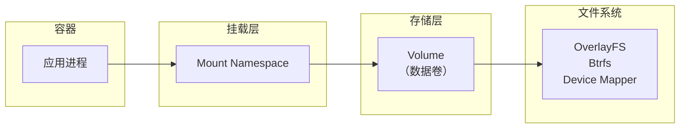
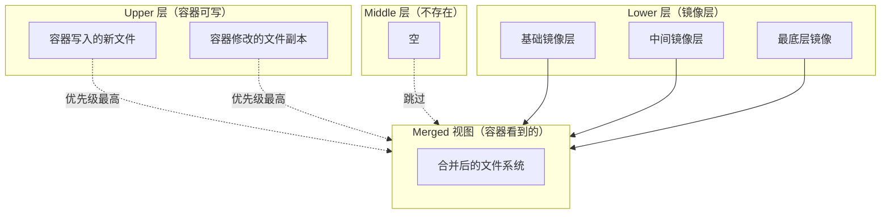

# 容器存储

容器最初设计为「无状态」的运行环境。但现实中的应用程序总需要存储数据：数据库的文件、用户上传的内容、应用的配置文件。这些数据不能随着容器销毁而消失。

**容器存储**解决了这个问题——它为容器提供了持久化或临时的数据存储能力。

## 容器存储模型

### 核心概念



**存储流**：

1. 容器内的进程写入挂载点
2. 挂载层将请求转发到 Volume
3. Volume 与实际存储后端交互
4. 数据持久化到文件系统

### 临时存储 vs 持久存储

| 类型 | 生命周期 | 数据保留 | 性能 | 适用场景 |
| --- | --- | --- | --- | --- |
| **tmpfs** | 容器运行期间 | 容器终止后丢失 | 最快（内存） | 临时缓存、敏感数据 |
| **bind mount** | 取决于宿主机路径 | 取决于宿主机 | 取决于宿主机 | 配置文件、日志 |
| **named volume** | 独立于容器 | 持久化 | 取决于存储类型 | 数据持久化 |
| **tmpfs mount** | 容器运行期间 | 容器终止后丢失 | 最快（内存） | 临时缓存 |

## Docker Volume 命令

### 基本操作

```bash title="创建数据卷"
docker volume create my-data
docker volume ls
docker volume inspect my-data
```

```bash title="使用数据卷启动容器"
# 匿名卷
docker run -v /app/data nginx

# 命名卷
docker run -v my-data:/app/data nginx

# 只读卷
docker run -v my-data:/app/data:ro nginx

# tmpfs
docker run --tmpfs /app/tmp nginx
```

```bash title="数据卷维护"
# 查看数据卷使用情况
docker volume ls

# 删除未使用的卷
docker volume prune

# 删除指定卷
docker volume rm my-data
```

### 绑定挂载

```bash title="绑定宿主机目录"
# 绑定宿主机的配置目录
docker run -v /etc/app/config:/app/config:ro nginx

# 绑定单个文件
docker run -v /etc/app/secret.json:/app/secret.json nginx

# 绑定临时目录
docker run -v /tmp:/app/tmp nginx
```

:::warning
**绑定挂载的风险**：

1. 容器内的进程可以修改宿主机文件（安全风险）
2. 宿主机路径必须存在，否则 Docker 会创建（权限可能不对）
3. 不同平台的路径格式不同（Windows/macOS vs Linux）
:::

## 存储驱动

### 工作原理



### 存储驱动对比

| 驱动 | 原理 | 性能 | 适用场景 | 限制 |
| --- | --- | --- | --- | --- |
| **overlay2** | 叠加层 | 高 | 生产环境首选 | 需要磁盘配额 |
| **aufs** | 叠加层 | 中 | 旧版本 Docker | 不支持容器内 chown |
| **devicemapper** | 块设备 | 中 | 旧版本 CentOS/RHEL | 不支持共享存储 |
| **btrfs** | COW 文件系统 | 高 | 需要 btrfs | 单文件大小限制 |
| **vfs** | 直接复制 | 低 | 测试环境 | 无分层 |
| **zfs** | ZFS 文件系统 | 高 | 需要 ZFS | 内存消耗大 |

```bash title="查看当前存储驱动"
docker info | grep "Storage Driver"
# Storage Driver: overlay2
```

### 选择存储驱动

```bash title="配置存储驱动（daemon.json）"
{
  "storage-driver": "overlay2",
  "storage-opts": [
    "overlay2.size=50G"
  ]
}
```

:::info
**生产环境建议**：

- Linux：使用 `overlay2`（默认）
- Windows：使用 `windowsfilter`
- 特殊场景：需要考虑特定驱动的功能（如 ACL、快照）

现代 Docker 默认使用 `overlay2`，不需要额外配置。
:::

## 数据持久化机制

### 命名卷

```bash title="创建和管理命名卷"
# 创建卷
docker volume create my-db

# 在容器中使用
docker run -v my-db:/var/lib/postgresql/data postgres:15

# 查看卷详情
docker volume inspect my-db
```

```json title="卷详情示例"
{
    "CreatedAt": "2024-01-15T10:00:00Z",
    "Driver": "local",
    "Labels": {},
    "Mountpoint": "/var/lib/docker/volumes/my-db/_data",
    "Name": "my-db",
    "Options": {},
    "Scope": "local"
}
```

### 只读挂载

```bash title="配置只读挂载"
# 配置文件只读挂载
docker run -v config:/app/config:ro nginx

# 系统文件只读挂载
docker run --read-only -v /tmp:/tmp nginx

# 组合使用
docker run \
  --read-only \
  -v my-data:/app/data:ro \
  -v /tmp:/tmp \
  nginx
```

### tmpfs 内存存储

```bash title="使用 tmpfs 存储敏感数据"
docker run --tmpfs /app/sessions:rw,size=100M,mode=1700 nginx

# 或者使用 docker volume
docker volume create --driver=tmpfs session-data
docker run -v session-data:/app/sessions nginx
```

```bash title="tmpfs 特点"
# tmpfs 的优势：
# - 存储在内存中，速度极快
# - 容器终止后自动清空（适合存储敏感临时数据）
# - 不会写入磁盘（适合安全敏感场景）

# tmpfs 的限制：
# - 受内存大小限制
# - 重启容器后数据丢失
```

## 容器存储最佳实践

### 分离应用层和数据层

```docker title="Dockerfile 分离数据和应用"
# 避免的做法：
# 将数据存储在镜像层
FROM nginx
COPY ./uploads /usr/share/nginx/html/uploads  # 数据在镜像层

# 正确的做法：
# 数据通过卷挂载
FROM nginx
COPY ./static /usr/share/nginx/html/static    # 静态资源在镜像层
# 动态内容（用户上传）通过 -v 挂载
```

### 使用卷插件扩展存储

```bash title="RexRay 卷插件示例"
# 安装 RexRay
docker plugin install rexray/ebs \
  EBS_ACCESSKEY=xxx \
  EBS_SECRETKEY=yyy

# 使用 EBS 卷
docker volume create --driver rexray/ebs --name my-ebs-volume
docker run -v my-ebs-volume:/data nginx
```

### 数据库存储配置

```bash title="PostgreSQL 数据持久化"
# 创建专用卷
docker volume create pg-data

# 使用命名卷持久化数据
docker run -d \
  --name postgres \
  -v pg-data:/var/lib/postgresql/data \
  -e POSTGRES_PASSWORD=secret \
  postgres:15

# 确认数据持久化
docker stop postgres
docker rm postgres
docker run -d \
  --name postgres2 \
  -v pg-data:/var/lib/postgresql/data \
  -e POSTGRES_PASSWORD=secret \
  postgres:15

# 数据完整保留
```

## 存储权限

### 用户权限控制

```bash title="指定容器用户"
# 指定 UID 运行
docker run -u 1000 nginx

# 指定用户组
docker run -u 1000:2000 nginx

# 使用用户名
docker run -u nginx nginx
```

### 卷权限问题

```bash title="常见的权限问题"
# 问题：卷的 UID/GID 与容器内不匹配
# 表现：容器无法写入数据

# 解决方案 1：容器内创建用户
docker run -u 0 nginx  # 先用 root 创建目录
mkdir -p /app/data
chown 1000:1000 /app/data

# 解决方案 2：挂载时指定 uid:gid
docker run -v $(pwd)/data:/app/data:rw,U nginx

# 解决方案 3：使用 ACL
setfacl -m u:1000:rw /host/path
```

```docker title="Dockerfile 中预创建用户"
FROM nginx

# 创建应用用户
RUN groupadd -g 1000 app && \
    useradd -u 1000 -g app -s /bin/bash appuser

# 应用用户拥有工作目录
RUN mkdir -p /app/data && \
    chown -R appuser:app /app

USER appuser
```

## 常见问题与反模式

### 问题一：匿名卷堆积

```bash title="问题场景"
# 每次创建容器都会产生匿名卷
docker run -v /data nginx
docker run -v /data nginx
docker run -v /data nginx

# 检查卷
docker volume ls
# DRIVER    VOLUME NAME
# local     a123456...
# local     b789012...
# local     c345678...
```

**问题**：忘记使用命名卷，导致匿名卷堆积，难以清理。

**正确做法**：始终使用命名卷。

```bash title="正确示例"
docker volume create my-data
docker run -v my-data:/data nginx
```

### 问题二：挂载覆盖关键目录

```bash title="问题场景"
docker run -v /etc/nginx/nginx.conf:/etc/nginx/nginx.conf nginx

# 问题：如果 /etc/nginx/nginx.conf 不存在
# Docker 会创建一个目录，容器无法启动
```

**正确做法**：

1. 先检查宿主机路径是否存在
2. 使用 `ro` 模式挂载只读配置
3. 考虑使用 `docker cp` 或进入容器修改

```bash title="替代方案：使用 docker cp"
# 先启动容器
docker run -d --name nginx nginx

# 复制配置文件
docker cp nginx.conf nginx:/etc/nginx/nginx.conf

# 提交修改
docker commit nginx my-nginx
```

### 问题三：混合使用多种存储方式

```bash title="混乱的配置示例"
docker run \
  -v /data:/app/data \           # 绑定挂载
  -v /logs:/var/log \            # 绑定挂载
  -v db-data:/var/lib/mysql \    # 命名卷
  --tmpfs /session \             # tmpfs
  mysql:8
```

**问题**：维护困难，难以追踪数据位置。

**正确做法**：统一存储策略，清晰区分数据用途。

```bash title="清晰配置示例"
# 使用 docker-compose.yml 管理
version: '3.8'
services:
  mysql:
    image: mysql:8
    volumes:
      - mysql-data:/var/lib/mysql
      - ./config:/etc/mysql/conf.d:ro
      - ./logs:/var/log/mysql

volumes:
  mysql-data:
```

### 问题四：生产环境使用绑定挂载

```bash title="生产环境错误配置"
# 将宿主机的 /var/data 绑定到容器
docker run -v /var/data:/app/data -p 80:80 myapp
```

**问题**：紧耦合宿主机，难以迁移和扩展。

**正确做法**：使用命名卷或云存储。

```bash title="生产环境正确配置"
# 使用云存储插件
docker plugin install cloudstor:aws

# 创建云卷
docker volume create --driver cloudstor:aws my-cloud-volume

# 使用云卷
docker run -v my-cloud-volume:/app/data myapp
```

## 存储监控

### 查看存储使用

```bash title="检查卷使用情况"
docker system df

# 输出
TYPE            TOTAL     ACTIVE    SIZE      RECLAIMABLE
Images          10        3        2.5GB     1.2GB (48%)
Containers      3         2        0B        0B (0%)
Local Volumes   5         3        500MB     200MB (40%)
```

```bash title="清理未使用的资源"
docker system prune

# 完整清理
docker system prune -a

# 清理卷
docker volume prune

# 清理构建缓存
docker builder prune
```

## 权衡矩阵

|| 存储类型 | 性能 | 持久性 | 共享性 | 推荐场景 |
| --- | --- | --- | --- | --- | --- |
| 匿名卷 | 中 | 容器期间 | 无 | 临时测试 |
| 命名卷 | 高 | 持久 | 无 | 生产应用数据 |
| 绑定挂载 | 高 | 取决于宿主机 | 困难 | 配置文件 |
| tmpfs | 最高 | 容器期间 | 无 | 敏感临时数据 |
| 云存储卷 | 中 | 持久 | 是 | 跨主机共享 |

## 延伸思考

容器存储看似简单，但有几个值得深入思考的问题：

1. **数据备份策略**：命名卷不会自动备份，需要外部机制
2. **存储迁移**：跨主机迁移容器时，数据是否可用？
3. **性能优化**：存储是否成为瓶颈？

```bash title="数据备份策略示例"
#!/bin/bash
# 备份命名卷

VOLUME_NAME=$1
BACKUP_DIR=${2:-./backups}
DATE=$(date +%Y%m%d_%H%M%S)

# 创建临时容器用于备份
docker run --rm \
  -v ${VOLUME_NAME}:/data \
  -v ${BACKUP_DIR}:/backup \
  alpine tar czf /backup/${VOLUME_NAME}_${DATE}.tar.gz /data

echo "Backup saved to ${BACKUP_DIR}/${VOLUME_NAME}_${DATE}.tar.gz"
```

对于需要高性能、大容量或跨主机共享的存储，可以考虑：

- **GlusterFS**：分布式文件系统
- **Ceph**：统一的软件定义���储
- **NFS**：简单共享存储
- **云厂商存储服务**：AWS EBS、GCP PD、Azure Disk

理解容器存储的原理和限制，才能设计出既高效又可靠的应用架构。

