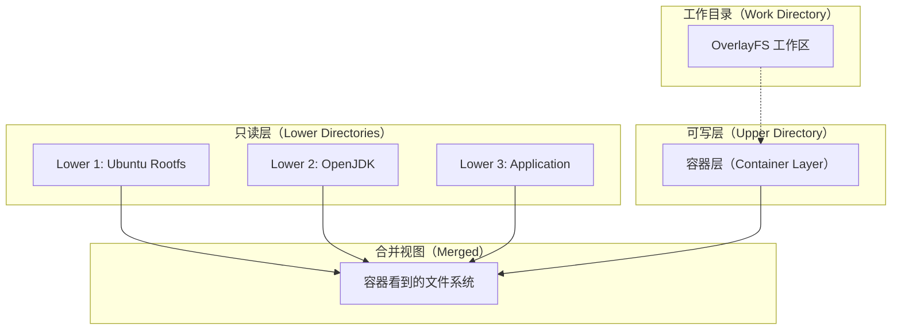
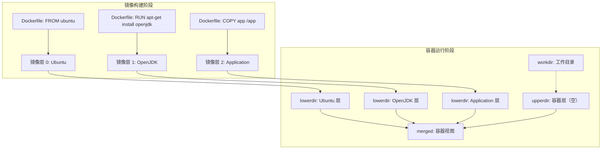
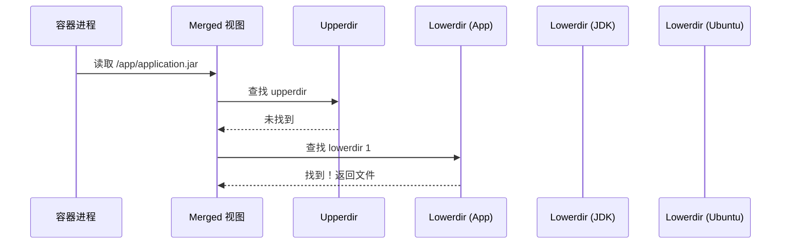
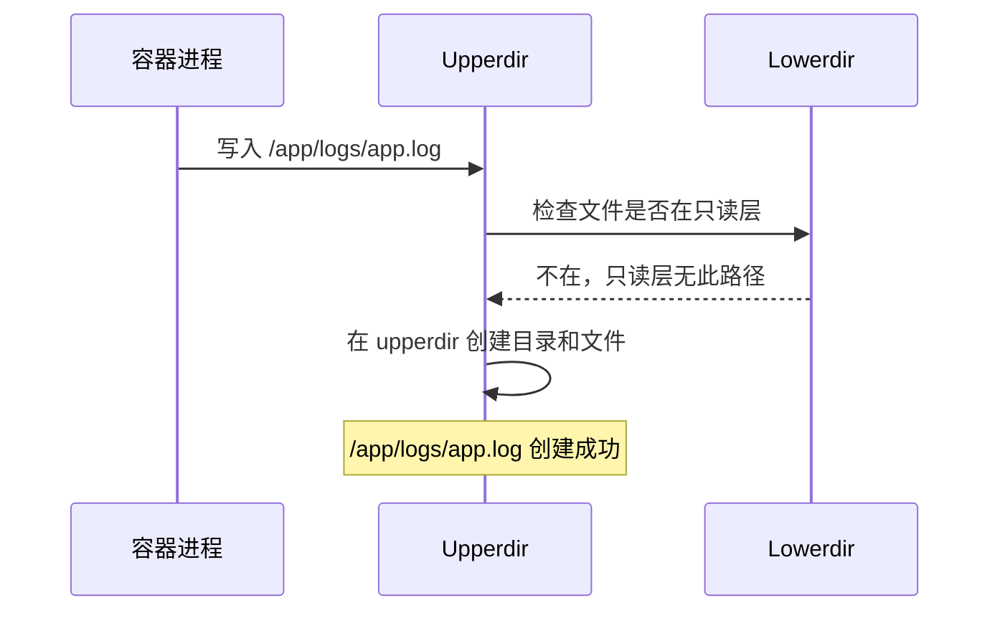
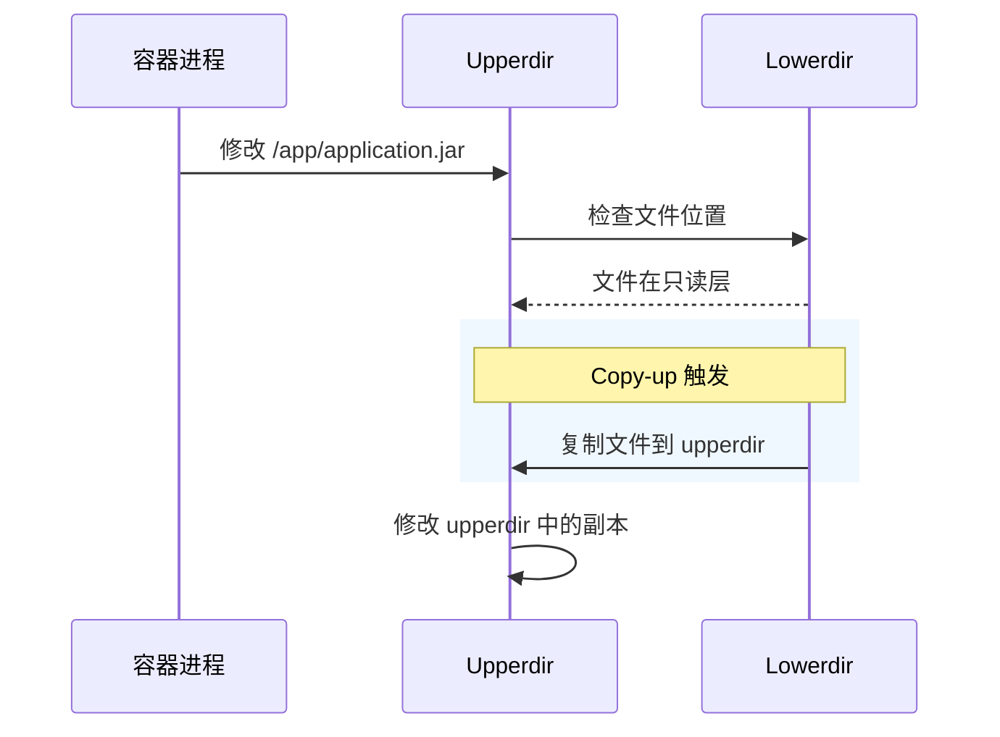
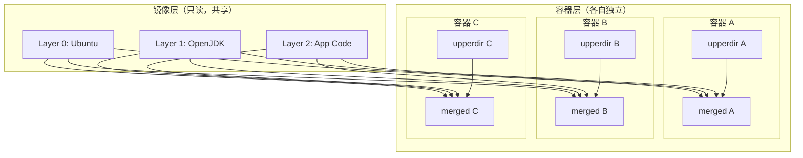
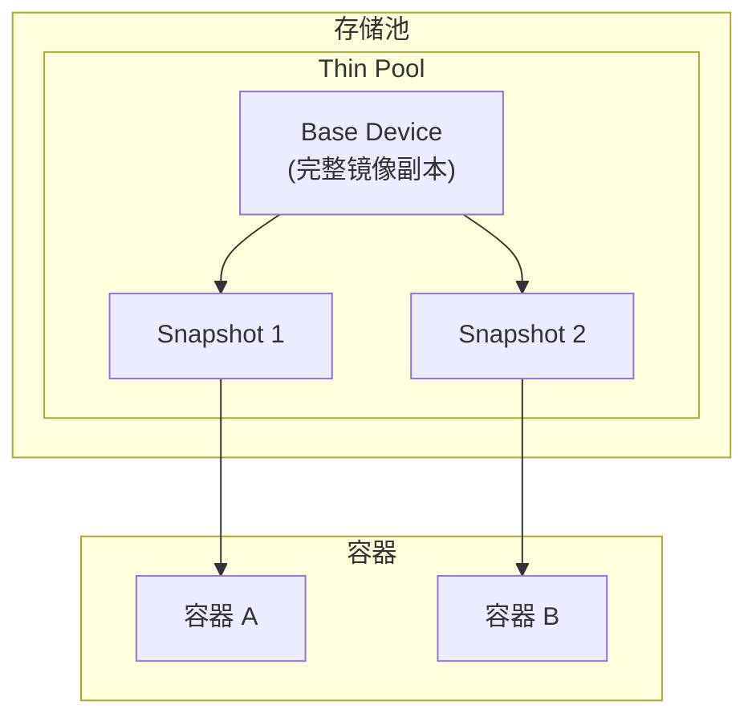

当你 `docker run` 一个容器，容器内的文件系统是如何「变」出来的？

基础镜像是 Ubuntu，但你的应用却跑在 `/app` 目录下。这个目录并不存在于原始的 Ubuntu 文件系统中——它来自容器层。OverlayFS（联合文件系统）就是实现这个「叠加」效果的核心技术。

## 什么是 UnionFS？

UnionFS（Union File System，联合文件系统）是一种**将多个文件系统目录「联合」成一个统一视图**的技术。类似于 Linux 的 mount 绑定，但远比 mount 更强大。

联合文件系统的核心特性：

- **层次叠加**：多个目录（层）按优先级叠加，上层覆盖下层同名文件
- **写时复制**：对只读层的修改会「分流」到可写层
- **空间共享**：相同内容只存储一份，节省空间



## OverlayFS 架构详解

OverlayFS 是 Linux 内核 3.18 引入的联合文件系统，相比 AUFS 性能更好、兼容性更强，目前是 Docker 默认的存储驱动。

### 四个核心目录

OverlayFS 通过四个目录协同工作：

| 目录 | 作用 | 容器层可见性 |
| --- | --- | --- |
| **lowerdir** | 只读层，可以有多个，优先级从下到上递增 | 不可见原始路径 |
| **upperdir** | 可写层，容器对文件的修改写入这里 | 不可见 |
| **workdir** | OverlayFS 内部工作目录，用于原子操作 | 完全不可见 |
| **merged** | 合并后的视图，容器进程实际看到的文件系统 | 可见 |

### 文件操作的行为

在 OverlayFS 中，不同操作有不同行为：

```java title="OverlayFS 文件操作行为"
public class OverlayFSOperations {
    // 读取文件
    // 1. 先在 upperdir 查找
    // 2. 未找到则在 lowerdir 由上到下查找
    // 3. 找到即返回

    // 写入新文件
    // 直接创建在 upperdir

    // 修改已存在文件
    // 1. 从 lowerdir 复制到 upperdir（copy-up）
    // 2. 在 upperdir 的副本上修改

    // 删除文件
    // 1. 在 upperdir 创建 "whiteout" 文件
    // 2. 标记 lowerdir 中同名文件被删除
}
```

### whiteout 文件

当容器删除一个来自只读层的文件时，OverlayFS 不会真的删除下层文件，而是**在可写层创建一个字符设备文件（whiteout）来「遮盖」下层文件**。

```bash
# 容器内删除文件后，upperdir 中的 whiteout
ls -la /var/lib/docker/overlay2/xxx/upper/

# 输出类似：
# c------c root root 0 Apr  9 10:30 deleted
# 该文件没有名字，长度为 0，用于标记下层文件被删除
```

:::info
**为什么用 whiteout 而不是直接删除？**

因为只读层可能被多个容器共享（镜像层），直接删除会影响其他容器。whiteout 只是「遮盖」了文件名，让它对当前容器不可见，但实际内容仍然存在。
:::

## OverlayFS 目录结构

实际查看 overlay2 存储的目录结构：

```bash
# 查看某个镜像层
ls -la /var/lib/docker/overlay2/l/ABC123.../

# 查看某个容器
docker inspect --format='{{.GraphDriver.Data}}' container_id

# 输出示例
{
    "LowerDir": "/var/lib/docker/overlay2/abc.../diff",
    "UpperDir": "/var/lib/docker/overlay2/def.../diff",
    "WorkDir": "/var/lib/docker/overlay2/def.../work",
    "MergedDir": "/var/lib/docker/overlay2/def.../merged"
}
```

### 多层 lowerdir

OverlayFS 支持多个 lowerdir：

```bash
# 实际查看 overlay2 挂载信息
cat /proc/mounts | grep overlay

# 输出示例
overlay /var/lib/docker/overlay2/xxx/merged overlay lowerdir=/var/lib/docker/overlay2/yyy/diff:/var/lib/docker/overlay2/zzz/diff,upperdir=/var/lib/docker/overlay2/xxx/diff,workdir=/var/lib/docker/overlay2/xxx/work 0 0
```

可以看到 **lowerdir 可以有多个，用冒号分隔**，优先级由左到右递增（左边是低优先级，右边是高优先级）。

## AUFS 回顾与对比

在 OverlayFS 出现之前，Docker 默认使用的存储驱动是 AUFS（Another UnionFS）。了解 AUFS 有助于理解 OverlayFS 的设计取舍。

### AUFS 的特点

- 2006 年进入 Linux 内核主线（部分发行版未合并）
- 支持**任意数量的分支**（branch/whiteout layer）
- 早期 Docker 唯一可选的存储驱动

### AUFS vs OverlayFS

| 维度 | AUFS | OverlayFS |
| --- | --- | --- |
| **进入内核** | 2006 年 | 2014 年（Linux 3.18） |
| **Docker 默认** | 早期是默认 | 现在是默认 |
| **分支数量** | 无限制 | 最多 128 层 |
| **跨内核兼容性** | 部分发行版未包含 | 主流发行版都支持 |
| **性能** | 元数据操作较慢 | 元数据操作更快 |
| **删除性能** | 较慢（需遍历所有层） | 较快（whiteout 机制） |

:::warning
**AUFS 的删除噩梦**：在 AUFS 中，删除一个深层文件需要遍历所有层找到该文件，然后标记删除。当层数很多时，这个操作可能非常慢。OverlayFS 的 whiteout 机制避免了这个问题。
:::

## 容器层叠原理图

下面用 Mermaid 图展示容器文件系统的完整叠加过程：



### 文件查找路径

当容器进程访问 `/app/application.jar` 时，OverlayFS 按以下顺序查找：



### 文件写入路径

当容器进程写入 `/app/logs/app.log` 时：



当容器进程修改 `/app/application.jar` 时：



:::tip
**Copy-up 的时机**：Copy-up 不是在容器启动时发生，而是在第一次写入时才触发。这意味着如果你的应用从未修改 `/usr/lib` 下的文件，这些文件就不会被复制到 upperdir，节省了存储空间。
:::

## 跨容器层共享

多个容器可以共享同一个镜像层，这是 Docker 高密度的关键技术：



这解释了为什么可以在一台机器上运行数百个容器，而不需要数百倍的磁盘空间——基础镜像层只存储一份。

## OverlayFS 局限性

### inode 耗尽

OverlayFS 的每个文件（包括 whiteout）都会消耗 inode。在大量容器的环境中，inode 耗尽可能比磁盘空间耗尽更早发生。

```bash
# 检查 inode 使用情况
df -i

# 限制：OverlayFS 默认最多 128 层
# 实际使用中，过多层会导致性能下降
```

### 跨层移动和硬链接

OverlayFS **不支持跨 lowerdir 的硬链接**，也不完全支持 rename 操作（某些场景下会失败）。

:::danger
**危险的 `mv` 操作**：如果把一个来自 lowerdir 的文件 `mv` 到 lowerdir 中不存在的目录，OverlayFS 会尝试直接移动。但这个操作可能失败，因为 lowerdir 是只读的。正确的做法是 `cp` 然后 `rm`。
:::

### NFS 和某些网络文件系统

OverlayFS **不能直接挂载在 NFS 上**，因为它需要 POSIX 文件系统的某些特性（如 rename 的原子性）。

## 其他联合文件系统

### devicemapper（快照模式）



devicemapper 的快照模式采用**写时分配（allocate-on-write）**策略，而不是 OverlayFS 的 Copy-up。性能更好，但配置复杂，已被淘汰。

### Btrfs 和 ZFS 原生支持

如果 Docker 使用 btrfs 或 zfs 作为存储驱动，它们可以利用文件系统原生的快照和克隆功能：

```bash
# 查看 Docker 存储驱动
docker info | grep "Storage Driver"

# 如果是 btrfs，镜像层就是 btrfs 子卷
# 快照创建几乎无开销
```

## 权衡矩阵

| 场景 | 推荐存储驱动 | 原因 |
| --- | --- | --- |
| **通用 Linux 生产环境** | overlay2 | 性能和兼容性最佳 |
| **需要频繁创建快照** | btrfs/zfs | 原生快照支持 |
| **超大规模容器集群** | overlay2 | 经过大规模验证 |
| **内核版本低（`< 4.0`）** | overlay | 兼容旧内核 |
| **需要块设备性能** | devicemapper | 直接块设备 IO |

## 延伸思考

OverlayFS 是容器技术的底层基础设施，理解它的工作原理有助于：

1. **诊断问题**：当容器启动失败或文件系统异常时，知道去哪里排查
2. **优化性能**：理解 Copy-up 机制，避免频繁修改只读层文件
3. **容量规划**：理解存储开销来源，合理规划磁盘和 inode

但更重要的是，OverlayFS 体现了 Unix 哲学的精髓：**一切皆文件，分层解复杂**。多个只读层叠加为一个视图，可写层按需修改，下层保持不变——这正是容器的核心理念。

如果你想深入了解，可以查看 `/proc/mounts` 中的 overlay 挂载信息，亲眼看看 lowerdir、upperdir、workdir 的实际内容。
