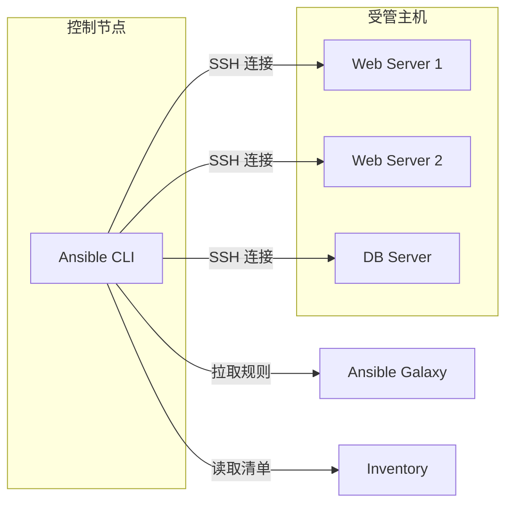

Terraform 和 CloudFormation 解决了「**创建**」基础设施的问题，但它们不太擅长「**配置**」已创建的资源。比如：

- 在已创建的服务器上安装软件包
- 修改配置文件
- 部署应用程序
- 执行一次性运维任务

这就是 **Ansible** 的强项。作为配置管理工具，Ansible 可以让你**幂等地**修改服务器状态，而不管服务器当前是什么状态。

## Ansible 核心概念

### Ansible 工作原理



### Ansible vs Terraform

| 维度 | Ansible | Terraform |
| --- | --- | --- |
| **类型** | 配置管理 | 基础设施编排 |
| **工作方式** | Push（SSH 推送） | Plan & Apply |
| **状态管理** | 无状态，幂等操作 | State 文件 |
| **擅长** | 配置服务器、安装软件 | 创建/销毁基础设施 |
| **适用场景** | 配置管理、应用部署 | 基础设施创建 |

## Inventory 管理

### 静态 Inventory

```ini title="inventory/hosts"
# 主机分组
[web_servers]
web1.example.com
web2.example.com
192.168.1.101

[database_servers]
db1.example.com ansible_user=dbadmin ansible_ssh_private_key_file=~/.ssh/db_key

[production:children]
web_servers
database_servers

[production:vars]
ansible_user=admin
ansible_ssh_private_key_file=~/.ssh/prod_key
ansible_python_interpreter=/usr/bin/python3
```

### 动态 Inventory

```python title="inventory/ec2.py"
#!/usr/bin/env python3
import boto3
import json
import os

def get_ec2_inventory():
    ec2 = boto3.client('ec2', region_name='us-east-1')

    inventory = {
        'web_servers': {'hosts': []},
        'database_servers': {'hosts': []},
        '_meta': {'hostvars': {}}
    }

    response = ec2.describe_instances(
        Filters=[
            {'Name': 'instance-state-name', 'Values': ['running']},
        ]
    )

    for reservation in response['Reservations']:
        for instance in reservation['Instances']:
            instance_id = instance['InstanceId']
            public_ip = instance.get('PublicIpAddress', '')
            tags = {t['Key']: t['Value'] for t in instance.get('Tags', [])}

            instance_name = tags.get('Name', instance_id)
            instance_type = tags.get('Type', 'unknown')

            if instance_type == 'web':
                inventory['web_servers']['hosts'].append(instance_id)
            elif instance_type == 'database':
                inventory['database_servers']['hosts'].append(instance_id)

            inventory['_meta']['hostvars'][instance_id] = {
                'ansible_host': public_ip,
                'instance_id': instance_id,
                'tags': tags
            }

    return inventory

if __name__ == '__main__':
    print(json.dumps(get_ec2_inventory()))
```

```bash title="使用动态 Inventory"
# 执行命令
ansible -i inventory/ec2.py web_servers -m ping

# 更新缓存
ansible-inventory -i inventory/ec2.py --list

# 图形化查看
ansible-inventory -i inventory/ec2.py --graph
```

## Playbook 基础

### 简单 Playbook

```yaml title="playbooks/nginx.yml"
---
- name: 安装并配置 Nginx
  hosts: web_servers
  become: true
  vars:
    nginx_version: "1.25.0"

  tasks:
    - name: 安装 Nginx
      apt:
        name: nginx
        state: present
        update_cache: yes

    - name: 复制 Nginx 配置
      template:
        src: nginx.conf.j2
        dest: /etc/nginx/nginx.conf
        mode: '0644'
      notify: 重启 Nginx

    - name: 启动 Nginx
      service:
        name: nginx
        state: started
        enabled: yes

  handlers:
    - name: 重启 Nginx
      service:
        name: nginx
        state: restarted
```

### 条件执行

```yaml title="条件执行"
---
- name: 配置服务器
  hosts: all
  vars:
    enable_monitoring: true

  tasks:
    - name: 安装监控 Agent
      apt:
        name: prometheus-node-exporter
        state: present
      when: enable_monitoring | bool

    - name: 配置数据库
      include_tasks: tasks/setup-database.yml
      when: "'database' in group_names"

    - name: 调试变量
      debug:
        msg: "实例类型是 {{ ansible_facts['ec2_instance_type'] }}"
      when: ansible_facts['ec2_instance_type'] is defined
```

### 循环

```yaml title="循环使用"
---
- name: 创建多个用户
  hosts: all
  become: true

  vars:
    users:
      - name: alice
        groups: ["wheel", "docker"]
      - name: bob
        groups: ["developers"]
      - name: charlie
        groups: ["analysts"]

  tasks:
    - name: 创建用户
      user:
        name: "{{ item.name }}"
        groups: "{{ item.groups }}"
        shell: /bin/bash
        create_home: yes
      loop: "{{ users }}"

    - name: 安装多个软件包
      apt:
        name:
          - nginx
          - git
          - vim
          - htop
          - curl
        state: present
        update_cache: yes
```

## Roles 结构

### Role 目录结构

```
roles/
├── common/
│   ├── defaults/          # 默认变量（优先级最低）
│   │   └── main.yml
│   ├── files/             # 静态文件
│   │   └── template.conf
│   ├── handlers/
│   │   └── main.yml
│   ├── meta/
│   │   └── main.yml       # Role 依赖
│   ├── tasks/
│   │   └── main.yml
│   ├── templates/          # Jinja2 模板
│   │   └── config.j2
│   └── vars/
│       └── main.yml       # 变量（优先级高于 defaults）
```

### Role 示例：Web 服务器

```yaml title="roles/webserver/tasks/main.yml"
---
- name: 安装 Apache
  apt:
    name:
      - apache2
      - libapache2-mod-php
    state: present
    update_cache: yes

- name: 配置 Apache
  template:
    src: apache2.conf.j2
    dest: /etc/apache2/apache2.conf
    mode: '0644'
  notify: 重启 Apache

- name: 启用站点
  command: a2ensite {{ site_name }}
  when: site_enabled | bool

- name: 部署网站文件
  synchronize:
    src: files/website/
    dest: /var/www/html/
    delete: yes
    recursive: yes
```

```yaml title="roles/webserver/handlers/main.yml"
---
- name: 重启 Apache
  service:
    name: apache2
    state: restarted

- name: 重载 Apache
  service:
    name: apache2
    state: reloaded
```

```yaml title="roles/webserver/defaults/main.yml"
---
site_name: default
site_enabled: true
apache_version: "2.4"
```

```text title="roles/webserver/templates/apache2.conf.j2"
ServerName {{ ansible_fqdn }}
Listen {{ http_port | default(80) }}

<VirtualHost *:{{ http_port | default(80) }}>
    ServerAdmin {{ admin_email }}
    DocumentRoot /var/www/html

    <Directory /var/www/html>
        Options -Indexes +FollowSymLinks
        AllowOverride All
        Require all granted
    </Directory>

    ErrorLog ${APACHE_LOG_DIR}/error.log
    CustomLog ${APACHE_LOG_DIR}/access.log combined
</VirtualHost>
```

### 使用 Role

```yaml title="site.yml"
---
- name: 配置所有服务器
  hosts: all
  roles:
    - role: common
      tags: [common]

- name: 配置 Web 服务器
  hosts: web_servers
  roles:
    - role: webserver
      vars:
        site_name: mysite
        http_port: 8080
      tags: [web]

- name: 配置数据库服务器
  hosts: database_servers
  roles:
    - role: database
      vars:
        db_port: 5432
      tags: [database]
```

## Vault 加密

### 加密敏感数据

```bash title="Vault 操作"
# 创建加密文件
ansible-vault create vars/secrets.yml

# 编辑加密文件
ansible-vault edit vars/secrets.yml

# 加密已有文件
ansible-vault encrypt vars/secrets.yml

# 解密文件
ansible-vault decrypt vars/secrets.yml

# 查看加密文件
ansible-vault view vars/secrets.yml

# 更改密码
ansible-vault rekey vars/secrets.yml
```

```yaml title="vars/secrets.yml（加密后）"
---
database_password: SuperSecretPassword123!
api_key: sk-xxxxxxxxxxxxxxxxxxxx
ssl_certificate: |
  -----BEGIN CERTIFICATE-----
  MIIDXTCCAkWgAwIBAgIJAKZ...
  -----END CERTIFICATE-----
```

### Playbook 中使用 Vault

```bash title="执行带加密的 Playbook"
# 交互式输入密码
ansible-playbook site.yml --ask-vault-pass

# 使用密码文件
ansible-playbook site.yml --vault-password-file ~/.vault_pass

# 使用多个 Vault
ansible-playbook site.yml --vault-id prod@prompt
```

## Galaxy 和集合

### Ansible Galaxy

```bash title="使用 Galaxy"
# 搜索 Role
ansible-galaxy search nginx

# 查看 Role 详情
ansible-galaxy info geerlingguy.nginx

# 安装 Role
ansible-galaxy role install geerlingguy.nginx
ansible-galaxy install -r requirements.yml

# requirements.yml
---
roles:
  - name: geerlingguy.nginx
  - name: geerlingguy.php
    version: "3.3.0"
  - src: git+https://github.com/myorg/ansible-role-myapp.git
    name: myapp
```

### Ansible Collections

```bash title="使用 Collection"
# 安装 Collection
ansible-galaxy collection install community.general

# 安装 Collection 依赖
ansible-galaxy collection install -r requirements.yml

# requirements.yml
---
collections:
  - name: community.general
  - name: amazon.aws
    version: "6.0.0"
```

```yaml title="使用 Collection 模块"
---
- name: 创建 S3 Bucket
  hosts: localhost
  tasks:
    - name: Create S3 Bucket
      amazon.aws.s3_bucket:
        name: my-bucket
        state: present
        tags:
          Environment: production
```

## 测试

### ansible-lint

```bash title="代码检查"
# 安装 ansible-lint
pip install ansible-lint

# 检查 Playbook
ansible-lint playbooks/nginx.yml

# 检查 Role
ansible-lint roles/webserver/
```

### 本地测试

```bash title="本地测试"
# 检查语法
ansible-playbook --syntax-check playbooks/nginx.yml

# 列出任务（不执行）
ansible-playbook playbooks/nginx.yml --list-tasks

# 列出主机
ansible-playbook playbooks/nginx.yml --list-hosts

# 测试运行（检查模式）
ansible-playbook playbooks/nginx.yml --check

# 模拟运行
ansible-playbook playbooks/nginx.yml --check --diff
```

### Molecule 测试

```yaml title="molecule/default/molecule.yml"
---
dependency:
  name: galaxy
driver:
  name: docker
platforms:
  - name: instance
    image: geerlingguy/docker-ubuntu2204-container
    pre_build_image: true
provisioner:
  name: ansible
  env:
    ANSIBLE_ROLES_PATH: ../../roles
verifier:
  name: ansible
```

```bash title="Molecule 测试"
# 创建测试环境
molecule create

# 运行测试
molecule test

# 运行特定场景
molecule test --scenario-name default

# 调试
molecule converge
molecule login
```

## 最佳实践

### 目录结构

```
project/
├── inventory/
│   ├── hosts
│   └── group_vars/
│       └── all.yml
├── playbooks/
│   ├── site.yml
│   └── webserver.yml
├── roles/
│   ├── common/
│   └── webserver/
├── vars/
│   └── secrets.yml
├── ansible.cfg
└── requirements.yml
```

### ansible.cfg

```ini title="ansible.cfg"
[defaults]
inventory = inventory/hosts
roles_path = roles
host_key_checking = False
retry_files_enabled = False
gathering = smart
fact_caching = jsonfile
fact_caching_connection = /tmp/ansible_facts
fact_caching_timeout = 86400

[privilege_escalation]
become = True
become_method = sudo
become_user = root
become_ask_pass = False

[ssh_connection]
pipelining = True
ssh_args = -o ControlMaster=auto -o ControlPersist=60s
```

## Ansible 检查清单

| 检查项 | 说明 |
| --- | --- |
| 使用 Role | 复用和模块化 |
| 使用 Vault | 加密敏感数据 |
| Idempotency | 确保幂等性 |
| 使用 Handler | 事件驱动 |
| 条件执行 | 只在需要时执行 |
| 测试验证 | 使用 check 模式 |
| 代码检查 | ansible-lint |

Ansible 是配置管理的利器。它的幂等性和无代理设计，使它成为服务器运维的首选工具。记住核心原则：**幂等执行、模块化设计、安全加密**。
