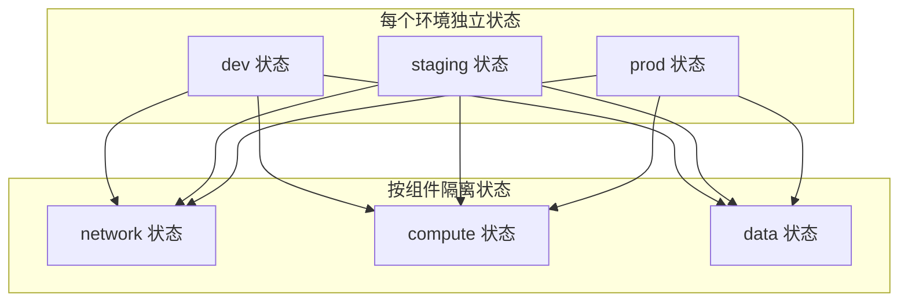
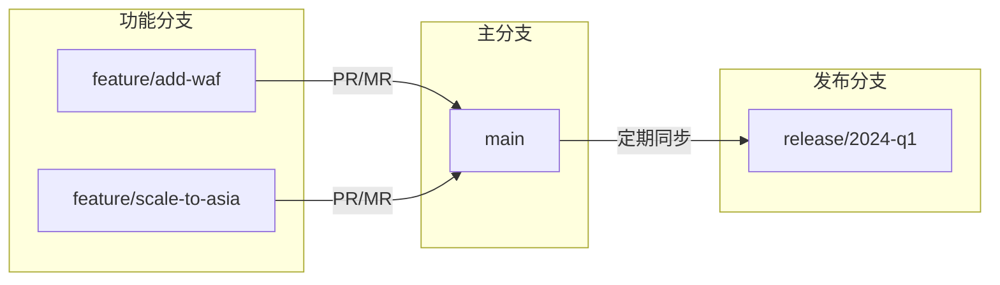

某公司的 IaC 实践是这样的：一位资深工程师用了两年时间，把所有基础设施都写进了 Terraform 代码里。代码结构清晰，命名规范，一切都很美好。

然后这位工程师离职了。

接手的工程师发现：代码里的每个变量都对应什么意思，没有人能说清楚；状态文件里记录的资源，和 Git 里的代码版本不匹配；生产环境有一台服务器，在 Terraform 代码里找不到对应的定义。

这不是 Terraform 的问题，这是 IaC 工程实践的问题。**代码能跑起来，不等于代码写得好。**

本文将深入探讨 IaC 的工程化最佳实践，涵盖模块化设计、状态管理、环境隔离、版本控制和代码审查五个核心维度。

## 模块化设计

模块化是 IaC 可维护性的基石。一个好的模块设计，可以让团队像搭积木一样快速构建基础设施。

### 为什么要模块化

**问题**：假设你需要在 AWS 上创建 10 个不同的服务，每个服务都需要 VPC、安全组、ECS 集群、负载均衡器。

**不使用模块**：
```hcl title="每个服务都重复写 VPC 定义"
# service-a/main.tf
resource "aws_vpc" "service_a" {
  cidr_block           = "10.0.1.0/16"
  enable_dns_hostnames = true
  tags = { Name = "service-a-vpc" }
}

# service-b/main.tf
resource "aws_vpc" "service_b" {
  cidr_block           = "10.0.2.0/16"
  enable_dns_hostnames = true
  tags = { Name = "service-b-vpc" }
}

# ... 再来 8 个类似定义
```

**使用模块**：
```hcl title="模块化后：一次定义，多次复用"
# 引用 VPC 模块
module "vpc" {
  source  = "../../../modules/network/vpc"
  version = "~> 2.0"

  environment = "production"
  project     = "service-a"
  cidr_block  = "10.0.1.0/16"
}
```

### 模块设计原则

**原则 1：单一职责**

每个模块只负责一类资源。比如，不要把 VPC、安全组、ECS 全塞进一个模块，而是拆成：

- `modules/network/vpc` —— 只负责 VPC
- `modules/security/security-group` —— 只负责安全组
- `modules/compute/ecs-cluster` —— 只负责 ECS 集群

**原则 2：松耦合**

模块之间通过变量和输出交互，不直接依赖对方的内部实现：

```hcl title="模块接口清晰"
# modules/network/vpc/outputs.tf
output "vpc_id" {
  description = "VPC 的 ID"
  value       = aws_vpc.main.id
}

output "private_subnet_ids" {
  description = "私有子网 ID 列表"
  value       = aws_subnet.private[*].id
}

output "public_subnet_ids" {
  description = "公有子网 ID 列表"
  value       = aws_subnet.public[*].id
}
```

**原则 3：合理抽象**

模块不是越小越好。太细的模块会导致目录爆炸；太粗的模块会导致难以复用。

常见经验值：

- **基础设施层**（VPC、子网、路由表）：细粒度，跨项目复用
- **应用层**（ECS + ALB + Auto Scaling）：中等粒度，按业务域复用
- **全栈**（整个微服务）：粗粒度，新项目初始化用

### 模块版本管理

```hcl title="使用版本约束"
module "vpc" {
  source  = "terraform-aws-modules/vpc/aws"
  version = "~> 3.0"  # 允许 3.x，但禁止 4.0

  # ...
}

# 更严格的版本约束
module "vpc_strict" {
  source  = "git::https://github.com/org/terraform-aws-vpc.git?ref=v2.3.0"
  version = "2.3.0"

  # ...
}
```

:::tip
**私有模块注册表**

对于公司内部模块，建议搭建 Terraform Cloud 或私有注册表来管理模块版本。好处是：

- 可以对模块进行版本控制和发布
- 消费者可以看到模块的变更日志
- 可以对模块进行测试和质量把关
:::

## 状态管理

Terraform 状态是 IaC 中最容易被忽视、但最关键的组成部分。状态文件记录了「代码定义的」和「云上实际的」之间的映射关系。

### 为什么要远程状态

**本地状态的问题**：

- 团队成员各自有一份状态，无法协同
- 电脑重装或硬盘损坏，状态丢失
- 无法追踪「谁在什么时候改了什么」

**远程状态的好处**：

- 所有成员共享同一份状态
- 状态文件有版本控制，可以回滚
- 可以锁定的，防止并发修改

### AWS S3 + DynamoDB 状态后端

```hcl title="backend.tf"
terraform {
  backend "s3" {
    bucket         = "my-org-terraform-state"
    key            = "production/app/main.tfstate"
    region         = "us-east-1"
    encrypt        = true
    dynamodb_table = "terraform-locks"
  }
}
```

```yaml title="DynamoDB 表配置"
TableName: terraform-locks
PartitionKey:
  Name: LockID
  Type: S
BillingMode: PAY_PER_REQUEST
```

:::warning
**状态文件是最后一道防线**

Terraform 状态文件丢失或损坏，意味着你失去了「真相来源」。之后所有 `terraform apply` 都可能：

1. 尝试创建已存在的资源（因状态丢失，Terraform 不知道资源已存在）
2. 无法更新已有资源（无法定位资源）
3. 在某些情况下，可能创建重复资源导致冲突

最佳实践：除了远程状态存储，还要定期备份状态文件。
:::

### 状态隔离策略



常见的状态隔离方式：

| 策略 | 适用场景 | 优点 | 缺点 |
| --- | --- | --- | --- |
| 按环境隔离 | 小团队，资源少 | 简单 | 状态文件可能很大 |
| 按组件隔离 | 中大型团队 | 并行开发友好 | 资源依赖管理复杂 |
| 按环境+组件隔离 | 大型团队 | 最灵活 | 需要良好的模块设计 |

### 状态锁定与并发控制

```hcl title="DynamoDB 锁定的自动机制"
# 当 terraform apply 在执行时，DynamoDB 会自动锁定
# 防止其他 terraform apply 同时执行导致状态冲突

# 可以通过以下命令手动检查锁定状态
terraform force-unlock <LOCK_ID>
```

## 环境隔离

开发、测试、预生产、生产——多环境管理是 IaC 落地最难的部分之一。

### 三种多环境策略对比

| 策略 | 实现方式 | 适用场景 | 风险 |
| --- | --- | --- | --- |
| **工作目录分离** | 每个环境一个目录 | 小团队 | 代码重复，难以同步 |
| **工作空间（Workspace）** | 同一份代码，不同状态 | 中等复杂度 | 变量爆炸，难以维护 |
| **环境模块** | 模块 + 环境配置 | 大团队 | 需要良好的模块设计 |

### 策略 1：工作目录分离

```
infrastructure/
├── shared/              # 共享代码
│   ├── modules/
│   └── main.tf
├── development/
│   ├── terraform.tfvars
│   └── backend.tf
├── staging/
│   ├── terraform.tfvars
│   └── backend.tf
└── production/
    ├── terraform.tfvars
    └── backend.tf
```

```bash title="各环境独立执行"
cd infrastructure/production
terraform init
terraform plan -var-file="production.tfvars"
terraform apply -var-file="production.tfvars"
```

### 策略 2：环境模块（推荐）

```hcl title="environments/production/main.tf"
module "app" {
  source  = "../../modules/app"

  environment = "production"

  # 生产环境特定配置
  instance_type      = "t3.large"
  desired_capacity   = 10
  min_capacity       = 5
  max_capacity       = 20
  enable_autoscaling = true

  # 生产环境特定的安全配置
  allowed_cidr_blocks = ["10.0.0.0/8"]  # 仅内网访问
  enable_waf          = true
  enable_dDoS_protection = true
}
```

```hcl title="environments/staging/main.tf"
module "app" {
  source  = "../../modules/app"

  environment = "staging"

  # 预生产环境配置
  instance_type      = "t3.medium"
  desired_capacity   = 2
  min_capacity       = 1
  max_capacity       = 5
  enable_autoscaling = false  # 预生产不需要扩缩容

  # 预生产允许外部访问测试
  allowed_cidr_blocks = ["0.0.0.0/0"]
  enable_waf          = false
}
```

:::info
**为什么推荐环境模块策略？**

1. **代码复用**：环境间的共同模式抽象到模块中
2. **配置集中**：环境差异清晰可见
3. **安全隔离**：敏感配置只在特定环境文件中
4. **易于审计**：生产配置变更可以单独 review
:::

### 敏感值管理

敏感配置（密码、密钥、API Token）绝对不能写进 IaC 代码或 git 仓库。

**方式 1：AWS SSM Parameter Store**

```hcl title="从 SSM 读取敏感配置"
data "aws_ssm_parameter" "db_password" {
  name = "/myapp/production/database/password"
}

resource "aws_rds_cluster" "main" {
  password = data.aws_ssm_parameter.db_password.value
}
```

**方式 2：AWS Secrets Manager**

```hcl title="从 Secrets Manager 读取密钥"
data "aws_secretsmanager_secret_version" "db_credentials" {
  secret_id = "prod/database/credentials"
}

locals {
  db_creds = jsondecode(data.aws_secretsmanager_secret_version.db_credentials.secret_string)
}

resource "aws_rds_cluster" "main" {
  password = local.db_creds.password
}
```

**方式 3：Azure Key Vault / GCP Secret Manager**

类似 AWS 的方案，各云厂商都有自己的密钥管理服务。

## 版本控制

基础设施代码的版本控制，与普通代码既有相同点，也有特殊考量。

### 分支策略



常见分支策略：

| 分支策略 | 说明 | 适用场景 |
| --- | --- | --- |
| **GitFlow** | 功能分支 + 发布分支 + 主分支 | 需要严格发布的团队 |
| **Trunk-Based** | 直接提交 main，快速集成 | 小团队，CI 成熟 |
| **环境分支** | 每个环境一个分支 | 需要环境级审批 |

### 提交规范

```bash title="Conventional Commits 规范"
# feat(infrastructure): add RDS multi-AZ support
# fix(network): correct VPC CIDR for prod
# refactor(compute): migrate ECS to Launch Template
# chore(deps): upgrade terraform-aws-vpc to v3.0

# IaC 特有的 prefix
# ci(infrastructure): add terraform plan check
# docs(infrastructure): update module documentation
```

### 标签与发布

```bash title="语义化版本标签"
# 补丁版本：修复 bug，不改变 API
git tag v1.2.1
git push origin v1.2.1

# 次版本：新增功能，向后兼容
git tag v1.3.0
git push origin v1.3.0

# 主版本：不兼容的变更
git tag v2.0.0
git push origin v2.0.0
```

## 代码审查

IaC 代码审查（Code Review）是保证基础设施质量的关键环节。

### 审查清单

**语法与最佳实践**：

- [ ] Terraform 语法正确，`terraform fmt` 已执行
- [ ] `terraform validate` 通过
- [ ] `terraform plan` 输出符合预期
- [ ] 资源命名符合规范
- [ ] 标签（Tags）完整且规范

**安全审查**：

- [ ] 没有硬编码敏感信息
- [ ] 安全组规则最小化原则
- [ ] 存储了加密（AES256 或 KMS）
- [ ] IAM 权限遵循最小权限原则
- [ ] 公有资源（如 S3 桶）有明确的理由

**架构审查**：

- [ ] 资源依赖关系正确
- [ ] 可用性配置合理（多 AZ、Auto Scaling）
- [ ] 成本估算合理
- [ ] 变更影响范围评估

### 自动化检查

```yaml title="GitHub Actions CI 流水线"
name: Terraform CI

on:
  pull_request:
    branches: [main]

jobs:
  terraform:
    runs-on: ubuntu-latest
    steps:
      - uses: actions/checkout@v4

      - uses: hashicorp/setup-terraform@v2
        with:
          terraform_version: 1.6.0

      - name: Terraform Format Check
        run: terraform fmt -check -recursive

      - name: Terraform Init
        run: terraform init -backend=false

      - name: Terraform Validate
        run: terraform validate

      - name: Terraform Plan
        run: terraform show
        continue-on-error: true
```

```bash title="本地 pre-commit 钩子"
# .git/hooks/pre-commit
#!/bin/bash
set -e

echo "Running terraform fmt..."
terraform fmt -recursive

echo "Running terraform validate..."
terraform validate

echo "Running tflint..."
tflint

echo "Running checkov..."
checkov -d .

echo "All checks passed!"
```

### Plan 输出审查

Terraform `plan` 的���出是 Code Review 的核心内容。Reviewer 应该：

1. **检查变更类型**：`+` 是新增，`-` 是删除，`~` 是修改
2. **确认变更范围**：没有意外的变更
3. **评估影响**：这个变更对其他系统有什么影响？

```bash title="Plan 输出示例"
Terraform will perform the following actions:

  # aws_instance.app_server will be created
  + resource "aws_instance" "app_server" {
      + ami                          = "ami-0c55b159cbfafe1f0"
      + instance_type                = "t3.medium"
      + tags                        = {
          + "Environment" = "production"
          + "Name"       = "app-server"
        }
    }

  # aws_security_group.app_sg will be created
  + resource "aws_security_group" "app_sg" {
      + ingress {
          + from_port   = 8080
          + to_port     = 8080
          + protocol    = "tcp"
        }
    }

Plan: 2 to add, 0 to change, 0 to destroy.
```

## 常见问题与反模式

### 反模式 1：状态文件过大

把所有资源都放进一个 Terraform 状态文件，导致状态文件过大，`terraform plan` 和 `apply` 越来越慢。

**正确做法**：

- 按组件拆分状态（网络、计算、数据）
- 使用 `terraform state mv` 迁移现有资源
- 定期清理不再使用的资源

### 反模式 2：忽略 plan 输出

直接执行 `terraform apply`，不看 plan 输出。plan 是你了解变更内容的唯一机会。

**正确做法**：

- 始终先看 plan，理解每个变更
- 使用 `-out` 保存 plan 文件，再执行 `apply -out`
- CI 流水线必须提供 plan 输出供审查

### 反模式 3：手动画 State

手动修改 Terraform 状态文件来「修复」问题。这是最危险的操作之一。

**正确做法**：

- 使用 `terraform state` 命令操作状态
- 如果必须手动修改，先备份状态文件
- 操作完成后立即 `terraform plan` 验证

### 反模式 4：忽略 drift

代码定义了期望状态，但实际云上环境已经被手工修改（配置漂移），但没有人去检测和修复。

**正确做法**：

- 定期执行 `terraform plan` 检测漂移
- 禁止手工修改云资源
- 发现 drift 后，通过修改代码来修复，而不是「同步代码」

### 反模式 5：模块过度抽象

创建了太多层次的抽象，每个模块都套娃，导致代码难以理解和调试。

**正确做法**：

- 不要过度抽象，3 层结构通常足够
- 模块应该有明确的边界和文档
- 定期 review 模块结构，合��或拆分不合理的模块

## 总结

IaC 最佳实践的核心目标是：**让基础设施代码像业务代码一样可靠、可维护、可协作**。

关键要点回顾：

| 实践 | 核心价值 |
| --- | --- |
| **模块化** | 代码复用，减少重复，维护成本低 |
| **状态管理** | 真相来源，支持协作，可回滚 |
| **环境隔离** | 安全隔离，灵活配置，降低风险 |
| **版本控制** | 变更可追溯，协作更顺畅 |
| **代码审查** | 质量把关，知识共享，团队成长 |

> 没有银弹，只有持续改进。IaC 实践的成熟度，是团队工程化能力的一面镜子。

## 延伸思考

到这里，我们已经涵盖了 IaC 的主要最佳实践。但还有一个核心问题没有解决：**声明式和命令式这两种 IaC 设计哲学，到底该怎么选？**

这个话题将在下一篇文章《[声明式 vs 命令式 IaC](/cloud-native/iac/declarative-vs-imperative)》中深入探讨。我们会分析：

- 声明式和命令式的核心区别
- Terraform（声明式）vs Ansible（命令式）的适用场景
- 如何在实践中组合使用两种范式

以及更多关于 IaC 的深度实践，敬请期待。
