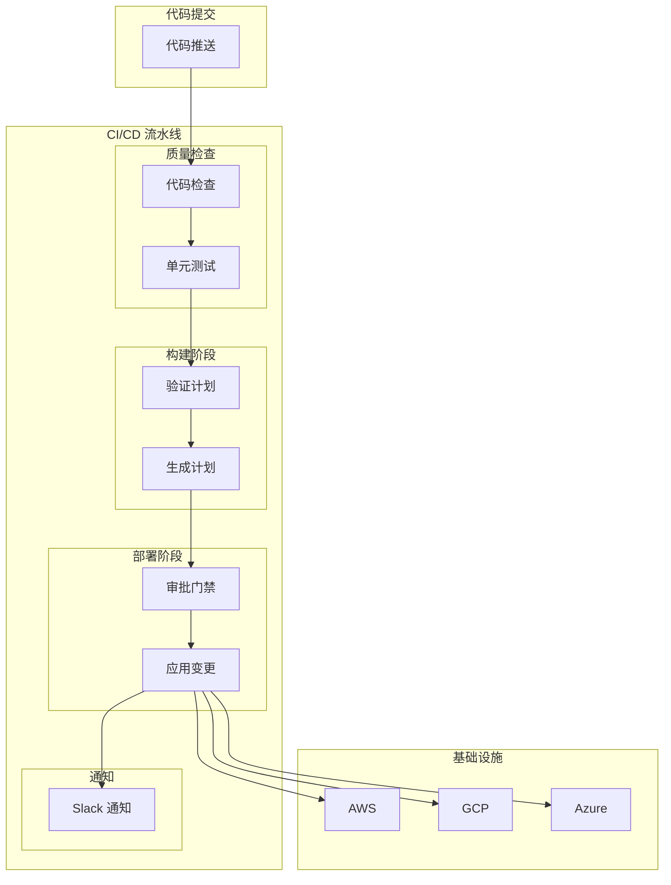

基础设施即代码的最终目标是**自动化**。手动执行 `terraform apply` 或 `ansible-playbook` 不是终点，真正的价值在于：**每次代码提交，都能自动验证和部署基础设施变更**。

这就需要将 IaC 工具与 CI/CD 流水线深度集成。

## CI/CD 集成架构

### 典型流水线



### 工具选择

| 场景 | 推荐工具 | 原因 |
| --- | --- | --- |
| GitHub | GitHub Actions | 原生集成，体验好 |
| GitLab | GitLab CI | 内置 CI/CD，流水线即代码 |
| Jenkins | Jenkins +插件 | 灵活可控 |
| Azure DevOps | Azure Pipelines | Azure 深度集成 |

## GitHub Actions 集成

### Terraform 流水线

```yaml title=".github/workflows/terraform.yml"
name: Terraform CI/CD

on:
  push:
    branches: [main]
    paths:
      - 'terraform/**'
      - '.github/workflows/terraform.yml'
  pull_request:
    branches: [main]
    paths:
      - 'terraform/**'
      - '.github/workflows/terraform.yml'

env:
  TF_VERSION: 1.6.0
  TF_CLOUD_TOKEN: ${{ secrets.TF_API_TOKEN }}

jobs:
  # ===========================================================================
  # 质量检查
  # ===========================================================================
  quality:
    name: 代码质量检查
    runs-on: ubuntu-latest

    steps:
      - name: 检出代码
        uses: actions/checkout@v4

      - name: 设置 Terraform
        uses: hashicorp/setup-terraform@v2
        with:
          terraform_version: ${{ env.TF_VERSION }}

      - name: Terraform 格式检查
        working-directory: terraform
        run: terraform fmt -check -recursive

      - name: Terraform 初始化
        working-directory: terraform
        run: terraform init -backend=false

      - name: Terraform 验证
        working-directory: terraform
        run: terraform validate

      - name: terraform-docs 生成文档
        uses:武林tdk53/terraform-docs@v1
        with:
          working-directory: terraform

      - name: TFLint 检查
        uses: terraform-linters/setup-tflint@v3
        with:
          tflint_version: v0.48.0
        working-directory: terraform

      - name: TFLint 运行
        run: tflint --recursive

  # ===========================================================================
  # Plan（PR 和 Merge）
  # ===========================================================================
  plan:
    name: 生成执行计划
    runs-on: ubuntu-latest
    needs: quality
    if: github.event_name == 'pull_request'

    permissions:
      contents: read
      id-token: write

    steps:
      - name: 检出代码
        uses: actions/checkout@v4
        with:
          ref: ${{ github.event.pull_request.head.ref }}

      - name: 配置 AWS 凭证
        uses: aws-actions/configure-aws-credentials@v4
        with:
          role-to-assume: ${{ secrets.AWS_ROLE_ARN }}
          aws-region: us-east-1

      - name: 设置 Terraform
        uses: hashicorp/setup-terraform@v2
        with:
          terraform_version: ${{ env.TF_VERSION }}

      - name: Terraform 初始化
        working-directory: terraform
        env:
          AWS_ACCESS_KEY_ID: ${{ secrets.AWS_ACCESS_KEY_ID }}
          AWS_SECRET_ACCESS_KEY: ${{ secrets.AWS_SECRET_ACCESS_KEY }}
        run: |
          terraform init
          terraform workspace select ${{ github.head_ref }} || terraform workspace new ${{ github.head_ref }}

      - name: 生成执行计划
        working-directory: terraform
        run: |
          terraform plan -no-color -out=tfplan
          echo "plan_exit_code=$?" >> $GITHUB_OUTPUT

      - name: 上传执行计划
        uses: actions/upload-artifact@v3
        with:
          name: tfplan
          path: terraform/tfplan

      - name: 评论 PR
        uses: actions/github-script@v6
        with:
          script: |
            const plan = require('fs').readFileSync('terraform/tfplan', 'utf8');
            github.rest.issues.createComment({
              issue_number: context.issue.number,
              owner: context.repo.owner,
              repo: context.repo.repo,
              body: '## Terraform Plan\n\n```terraform\n' + plan.slice(0, 65535) + '\n```'
            });

  # ===========================================================================
  # Apply（仅 Merge）
  # ===========================================================================
  apply:
    name: 应用变更
    runs-on: ubuntu-latest
    needs: quality
    if: github.ref == 'refs/heads/main' && github.event_name == 'push'

    permissions:
      contents: read
      id-token: write

    environment:
      name: production
      url: https://console.aws.amazon.com

    steps:
      - name: 检出代码
        uses: actions/checkout@v4

      - name: 配置 AWS 凭证
        uses: aws-actions/configure-aws-credentials@v4
        with:
          role-to-assume: ${{ secrets.AWS_ROLE_ARN }}
          aws-region: us-east-1

      - name: 设置 Terraform
        uses: hashicorp/setup-terraform@v2
        with:
          terraform_version: ${{ env.TF_VERSION }}

      - name: Terraform 初始化
        working-directory: terraform
        run: terraform init

      - name: Terraform 计划
        working-directory: terraform
        run: terraform plan -no-color

      - name: Terraform 应用
        working-directory: terraform
        run: terraform apply -auto-approve -no-color

      - name: Slack 通知
        if: always()
        uses: slackapi/slack-github-action@v1
        with:
          payload: |
            {
              "text": "Terraform ${{ job.status }}: ${{ github.event_name }} by ${{ github.actor }}",
              "blocks": [
                {
                  "type": "section",
                  "text": {
                    "type": "mrkdwn",
                    "text": "*Terraform Apply ${{ job.status }}*"
                  }
                }
              ]
            }
        env:
          SLACK_WEBHOOK_URL: ${{ secrets.SLACK_WEBHOOK_URL }}
```

### Ansible 流水线

```yaml title=".github/workflows/ansible.yml"
name: Ansible CI/CD

on:
  push:
    branches: [main]
    paths:
      - 'ansible/**'
  pull_request:
    branches: [main]
    paths:
      - 'ansible/**'

jobs:
  # ===========================================================================
  # 质量检查
  # ===========================================================================
  lint:
    name: 代码检查
    runs-on: ubuntu-latest

    steps:
      - name: 检出代码
        uses: actions/checkout@v4

      - name: 设置 Python
        uses: actions/setup-python@v4
        with:
          python-version: '3.11'

      - name: 安装依赖
        run: |
          pip install ansible-lint yamllint

      - name: YAML 格式检查
        run: yamllint ansible/

      - name: Ansible Lint
        run: ansible-lint ansible/

  # ===========================================================================
  # 语法检查
  # ===========================================================================
  syntax:
    name: Ansible 语法检查
    runs-on: ubuntu-latest
    needs: lint

    steps:
      - name: 检出代码
        uses: actions/checkout@v4

      - name: 设置 Python
        uses: actions/setup-python@v4
        with:
          python-version: '3.11'

      - name: 安装 Ansible
        run: pip install ansible

      - name: Ansible 语法检查
        run: ansible-playbook --syntax-check ansible/site.yml

  # ===========================================================================
  # 测试
  # ===========================================================================
  test:
    name: Molecule 测试
    runs-on: ubuntu-latest
    needs: syntax

    steps:
      - name: 检出代码
        uses: actions/checkout@v4

      - name: 设置 Python
        uses: actions/setup-python@v4
        with:
          python-version: '3.11'

      - name: 安装依赖
        run: |
          pip install ansible ansible-lint molecule molecule-docker docker

      - name: Molecule 测试
        working-directory: ansible
        run: molecule test --all

  # ===========================================================================
  # 部署
  # ===========================================================================
  deploy:
    name: 部署到 ${{ matrix.environment }}
    runs-on: ubuntu-latest
    needs: test
    if: github.ref == 'refs/heads/main'

    strategy:
      matrix:
        environment: [staging, production]

    steps:
      - name: 检出代码
        uses: actions/checkout@v4

      - name: 设置 Python
        uses: actions/setup-python@v4
        with:
          python-version: '3.11'

      - name: 安装 Ansible
        run: pip install ansible ansible-core

      - name: 安装 Collection
        run: |
          ansible-galaxy collection install community.general
          ansible-galaxy collection install amazon.aws

      - name: 配置 SSH
        run: |
          mkdir -p ~/.ssh
          echo "${{ secrets.SSH_KEY }}" > ~/.ssh/id_rsa
          chmod 600 ~/.ssh/id_rsa

      - name: 部署
        run: |
          ansible-playbook \
            -i inventory/${{ matrix.environment }}/hosts \
            --vault-id @${{ secrets.VAULT_PASSWORD_FILE }} \
            ansible/site.yml
        env:
          ANSIBLE_VAULT_PASSWORD: ${{ secrets.ANSIBLE_VAULT_PASSWORD }}
```

## GitLab CI 集成

### Terraform 流水线

```yaml title=".gitlab-ci.yml"
variables:
  TF_VERSION: "1.6.0"
  AWS_DEFAULT_REGION: "us-east-1"

stages:
  - validate
  - plan
  - apply
  - notify

# ============================================================================
# 缓存配置
# ============================================================================
.terraform_cache:
  cache:
    key: ${CI_COMMIT_REF_SLUG}
    paths:
      - .terraform
    policy: pull-push

# ============================================================================
# 阶段：验证
# ============================================================================
terraform:validate:
  stage: validate
  image:
    name: hashicorp/terraform:${TF_VERSION}
    entrypoint: [""]
  before_script:
    - cd terraform
    - terraform init -backend=false
  script:
    - terraform validate
    - terraform fmt -check -recursive
  only:
    changes:
      - terraform/**/*

terraform:security-scan:
  stage: validate
  image:
    name: aquasec/trivy:latest
    entrypoint: [""]
  script:
    - trivy config --exit-code 1 --severity HIGH,CRITICAL .
  allow_failure: true
  only:
    changes:
      - terraform/**/*

# ============================================================================
# 阶段：计划
# ============================================================================
terraform:plan:
  stage: plan
  image:
    name: hashicorp/terraform:${TF_VERSION}
    entrypoint: [""]
  before_script:
    - cd terraform
    - terraform init
    - terraform workspace select ${CI_COMMIT_REF_SLUG} 2>/dev/null || terraform workspace new ${CI_COMMIT_REF_SLUG}
  script:
    - terraform plan -out=tfplan
  dependencies:
    - terraform:validate
  artifacts:
    name: tfplan
    paths:
      - terraform/tfplan
    expire_in: 1 week
  only:
    - merge_request
  except:
    variables:
      - $CI_COMMIT_BRANCH == "main"

terraform:plan-auto:
  stage: plan
  image:
    name: hashicorp/terraform:${TF_VERSION}
    entrypoint: [""]
  before_script:
    - cd terraform
    - terraform init
    - terraform workspace select ${CI_COMMIT_REF_SLUG} 2>/dev/null || terraform workspace new ${CI_COMMIT_REF_SLUG}
  script:
    - terraform plan
  dependencies:
    - terraform:validate
  only:
    - main
  when: manual

# ============================================================================
# 阶段：应用
# ============================================================================
terraform:apply:
  stage: apply
  image:
    name: hashicorp/terraform:${TF_VERSION}
    entrypoint: [""]
  before_script:
    - cd terraform
    - terraform init
  script:
    - terraform apply -auto-approve tfplan
  environment:
    name: production
  artifacts:
    paths:
      - terraform/.terraform/terraform.tfstate
    when: always
  dependencies:
    - terraform:plan
  only:
    - main
  when: manual

# ============================================================================
# 阶段：通知
# ============================================================================
notify:slack:
  stage: notify
  image: curlimages/curl:latest
  script:
    - |
      curl -X POST -H 'Content-type: application/json' \
        --data '{"text":"Terraform $CI_JOB_STATUS: $CI_COMMIT_TITLE by $CI_COMMIT_AUTHOR"}' \
        $SLACK_WEBHOOK_URL
  only:
    - main
  when: always
```

## 环境管理策略

### 分支与环境映射

| 分支 | 环境 | 自动部署 | 审批 |
| --- | --- | --- | --- |
| `feature/*` | 临时环境 | 否 | 否 |
| `develop` | 开发环境 | 是 | 否 |
| `staging` | 预发布环境 | 是 | 部分 |
| `main` | 生产环境 | 否 | 是 |

### 临时环境

```yaml title="Terraform 临时环境"
resource "aws_ec2_instance" "dev" {
  count = terraform.workspace != "production" ? 1 : 0

  ami           = var.ami_id
  instance_type = "t3.micro"

  tags = {
    Name        = "${terraform.workspace}-dev-server"
    Environment = terraform.workspace
    TTL         = "24h"  # 用于清理脚本
  }

  lifecycle {
    create_before_destroy = true
  }
}

# 自动清理过期资源
resource "null_resource" "cleanup" {
  provisioner "local-exec" {
    command = <<-EOF
      # 删除超过 24 小时的临时环境
      aws ec2 describe-instances \
        --filters "Name=tag:TTL,Values=<24h ago" \
        --query 'Reservations[*].Instances[*].InstanceId' \
        --output text | xargs aws ec2 terminate-instances --instance-ids
    EOF
  }
}
```

## 审批与门禁

### Terraform Cloud 工作流

```yaml title="使用 Terraform Cloud"
terraform {
  backend "remote" {
    organization = "mycompany"

    workspaces {
      name = "production-networking"
    }
  }
}
```

### 手动审批

```yaml title="手动审批门禁"
# GitHub Actions
environment:
  name: production
  url: https://console.aws.amazon.com

# 部署需要手动触发
terraform:apply:
  environment:
    name: production
  when: manual
```

## 安全考虑

### 敏感信息管理

```bash title="使用 CI/CD Secrets"
# GitHub Secrets
# - AWS_ACCESS_KEY_ID
# - AWS_SECRET_ACCESS_KEY
# - TF_API_TOKEN
# - SLACK_WEBHOOK_URL

# 永远不要在日志中输出敏感信息
- name: Terraform Apply
  run: terraform apply -auto-approve -no-color
  env:
    AWS_ACCESS_KEY_ID: ${{ secrets.AWS_ACCESS_KEY_ID }}
    AWS_SECRET_ACCESS_KEY: ${{ secrets.AWS_SECRET_ACCESS_KEY }}
```

### OIDC 联合认证

```yaml title="使用 OIDC（更安全）"
- name: 配置 AWS 凭证
  uses: aws-actions/configure-aws-credentials@v4
  with:
    role-to-assume: arn:aws:iam::123456789012:role/GitHubActionsRole
    aws-region: us-east-1
```

```json title="IAM OIDC 信任策略"
{
  "Version": "2012-10-17",
  "Statement": [
    {
      "Effect": "Allow",
      "Principal": {
        "Federated": "arn:aws:iam::123456789012:oidc-provider/token.actions.githubusercontent.com"
      },
      "Action": "sts:AssumeRoleWithWebIdentity",
      "Condition": {
        "StringEquals": {
          "token.actions.githubusercontent.com:sub": "repo:myorg/myrepo:ref:refs/heads/main"
        }
      }
    }
  ]
}
```

## 监控与反馈

### Plan 输出分析

```bash title="分析 Plan 输出"
# 检查变更的资源数量
PLAN_OUTPUT=$(terraform show -no-color tfplan)
RESOURCE_COUNT=$(echo "$PLAN_OUTPUT" | grep -c "Terraform will perform the following actions")

if [ "$RESOURCE_COUNT" -gt 50 ]; then
  echo "Warning: Large number of changes ($RESOURCE_COUNT)"
  # 发送警告通知
fi
```

### 部署后验证

```yaml title="部署后验证"
- name: Terraform Apply
  run: terraform apply -auto-approve

- name: 验证部署
  run: |
    # 等待资源就绪
    sleep 30

    # 验证 ELB
    aws elbv2 describe-target-health \
      --target-group-arn $(terraform output -raw target_group_arn)

    # 验证 CloudWatch
    aws cloudwatch get-metric-statistics \
      --namespace AWS/EC2 \
      --metric-name CPUUtilization
```

## CI/CD 集成检查清单

| 检查项 | 说明 |
| --- | --- |
| 代码检查 | terraform fmt、ansible-lint |
| 语法验证 | terraform validate |
| 测试 | Molecule、terraform test |
| 分支策略 | 匹配开发/生产环境 |
| 审批门禁 | 生产部署需要审批 |
| Secrets 管理 | 使用 CI/CD Secrets |
| OIDC 认证 | 推荐使用 OIDC 替代密钥 |
| 通知 | Slack/Teams 通知 |
| 回滚方案 | 保留 State 历史版本 |

IaC 与 CI/CD 的集成让基础设施变更变得可追溯、可验证、可重复。好的集成应该让团队**充满信心地部署**，同时在出现问题时能够**快速回滚**。
