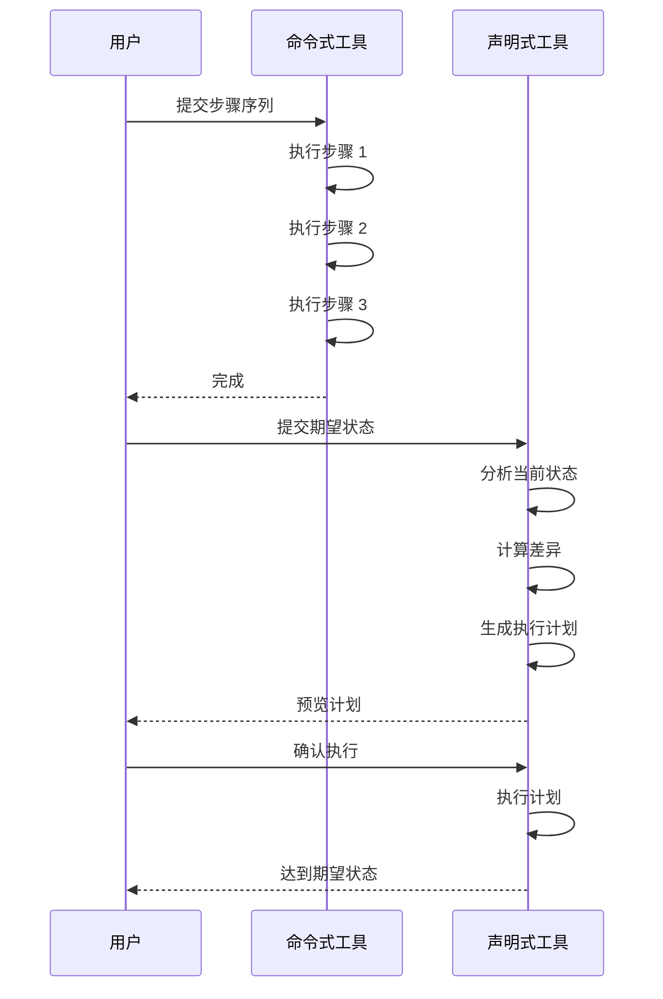
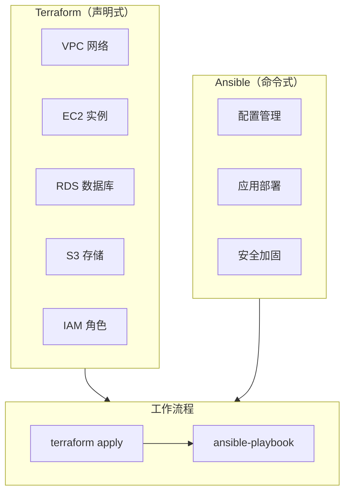
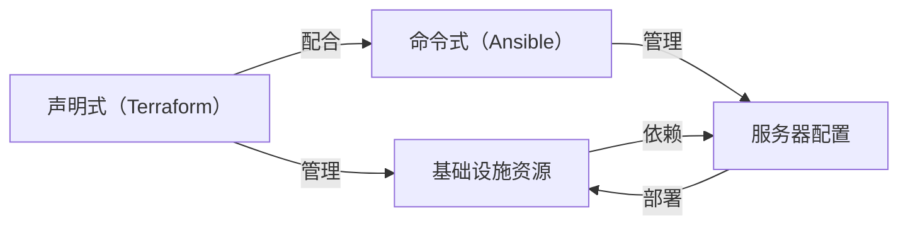

一位 DevOps 工程师在技术分享会上说：「Terraform 是声明式的，Ansible 是命令式的，所以我们用 Terraform 来做基础设施，用 Ansible 来做配置管理。」

这个说法看似正确，但实际上混淆了**语法**和**范式**两个概念。Ansible 也可以写得像 Terraform 一样声明式；Terraform 的某些特性（比如 Provisioner）也可以执行命令式操作。

本文将深入探讨**声明式**和**命令式**这两种 IaC 核心范式的本质区别，帮助你在实际项目中做出正确的架构选择。

## 核心概念

### 命令式：步骤序列

命令式编程的核心思想是：**描述一系列步骤，告诉机器「怎么做」**。


在 IaC 场景下，命令式意味着：

- 描述的是「执行的操作序列」
- 每一步都是明确的动作
- 程序员需要控制执行的流程

```yaml title="Ansible 命令式示例"
# 明确告诉 Ansible：先创建目录，再复制文件，再启动服务
- name: 部署应用
  hosts: servers
  tasks:
    - name: 创建应用目录
      file:
        path: /opt/myapp
        state: directory

    - name: 复制应用包
      copy:
        src: ./build/myapp.tar.gz
        dest: /opt/myapp/myapp.tar.gz

    - name: 解压应用包
      unarchive:
        src: /opt/myapp/myapp.tar.gz
        dest: /opt/myapp
        remote_src: yes

    - name: 启动服务
      systemd:
        name: myapp
        state: started
```

### 声明式：期望状态

声明式编程的核心思想是：**描述期望的状态，告诉机器「要什么」**。


在 IaC 场景下，声明式意味着：

- 描述的是「最终应该是什么样」
- 工具自动计算如何达到期望状态
- 程序员只需要关心结果，不关心过程

```hcl title="Terraform 声明式示例"
# 告诉 Terraform：我需要一个运行中的 EC2 实例
# 具体怎么创建、配置、启动，由 Terraform 决定
resource "aws_instance" "app" {
  ami           = "ami-0c55b159cbfafe1f0"
  instance_type = "t3.medium"

  user_data = <<-EOF
              #!/bin/bash
              docker run -d myregistry/myapp:latest
              EOF

  tags = {
    Name    = "app-server"
    Managed = "Terraform"
  }
}
```

## 深度对比

### 执行模型对比



### 关键差异

| 维度 | 命令式 | 声明式 |
| --- | --- | --- |
| **描述对象** | 操作序列 | 期望状态 |
| **执行控制** | 程序员控制每一步 | 工具自动编排 |
| **幂等性** | 需要手动实现 | 天然幂等 |
| **执行计划** | 无（直接执行） | 有（可预览） |
| **状态追踪** | 无内置状态 | 有状态管理 |
| **回滚** | 需要手动定义 | 通常内置回滚 |
| **调试** | 步骤清晰，易调试 | 黑盒执行，难调试 |

### 幂等性对比

**命令式的幂等性需要手动实现**：

```yaml title="Ansible：需要考虑幂等性"
- name: 确保 nginx 已安装
  package:
    name: nginx
    state: present  # present = 幂等：已安装则忽略

- name: 确保 nginx 配置正确
  template:
    src: nginx.conf.j2
    dest: /etc/nginx/nginx.conf
  notify: reload nginx  # 只有变更时才触发
```

**声明式的幂等性是天然的**：

```hcl title="Terraform：天然幂等"
resource "aws_instance" "app" {
  ami           = "ami-0c55b159cbfafe1f0"
  instance_type = "t3.medium"

  # 无论执行多少次，只要配置不变，结果都一样
  # 如果配置变了，Terraform 会自动检测并更新
}
```

## Terraform（声明式）vs Ansible（命令式）

这是最常见的选择困境。让我来深入分析。

### Terraform 的声明式哲学

Terraform 的核心思想是：**维护「代码定义的期望状态」和「云上的实际状态」之间的映射**。

```hcl title="Terraform 执行流程"
# 1. 读取配置文件（.tf 文件）
# 2. 读取当前状态（.tfstate 文件）
# 3. 读取云上实际状态（通过 API）
# 4. 计算差异（Desired - Current）
# 5. 生成执行计划
# 6. 执行计划
# 7. 更新状态文件
```

### Ansible 的命令式哲学

Ansible 的核心思想是：**按顺序执行任务，每个任务描述一个操作**。

```yaml title="Ansible 执行流程"
# 1. 读取 Playbook
# 2. 连接目标主机
# 3. 按顺序执行每个 Task
# 4. 每个 Task：检查状态 → 执行操作 → 验证结果
# 5. 报告执行结果
```

### 场景对比

| 场景 | 推荐工具 | 原因 |
| --- | --- | --- |
| **创建云资源**（VPC、EC2、RDS） | Terraform | 声明式更自然，避免重复创建 |
| **配置管理**（安装软件、修改配置） | Ansible | 丰富的模块，命令式更灵活 |
| **应用部署**（部署微服务） | 两者皆可 | 根据团队熟悉度选择 |
| **多云管理** | Terraform | Provider 生态完整 |
| **混合环境**（云 + 物理机） | Ansible | SSH 连接即可管理 |
| **容器编排** | kubectl/Helm | 专为 K8s 设计 |

## 组合使用策略

现实中，最佳实践往往是**组合使用**两种范式。

### 典型组合架构



### 具体实践

**阶段 1：用 Terraform 创建基础设施**

```hcl title="infrastructure.tf"
# 创建 VPC
resource "aws_vpc" "main" {
  cidr_block = "10.0.0.0/16"
}

# 创建 EC2 实例
resource "aws_instance" "app" {
  ami           = "ami-0c55b159cbfafe1f0"
  instance_type = "t3.medium"
  vpc_security_group_ids = [aws_security_group.app.id]
}

# 创建安全组
resource "aws_security_group" "app" {
  name = "app-sg"
  ingress {
    from_port   = 8080
    to_port     = 8080
    protocol    = "tcp"
    cidr_blocks = ["0.0.0.0/0"]
  }
}
```

**阶段 2：用 Ansible 配置服务器**

```yaml title="configure.yml"
- name: 配置应用服务器
  hosts: tag_Name_app_server
  become: true

  tasks:
    - name: 安装 Docker
      include_role:
        name: docker

    - name: 拉取应用镜像
      docker_image:
        name: myregistry/myapp
        tag: "{{ app_version }}"
        source: pull

    - name: 启动应用容器
      docker_container:
        name: myapp
        image: "myregistry/myapp:{{ app_version }}"
        ports:
          - "8080:8080"
        restart_policy: always
        restart_policy_retries: 3
```

### 进阶：Terraform + Ansible + Packer

```
┌─────────────────────────────────────────────────────────────────┐
│                        构建层                                    │
├─────────────────────────────────────────────────────────────────┤
│  Packer: 构建自定义 AMI                                          │
│  ├── 基础镜像 (Amazon Linux 2)                                   │
│  ├── 系统级依赖 (Docker, CloudWatch Agent)                      │
│  └── 优化：预热数据、优化启动速度                                  │
└─────────────────────────────────────────────────────────────────┘
                              │
                              ▼
┌─────────────────────────────────────────────────────────────────┐
│                        供应层                                    │
├─────────────────────────────────────────────────────────────────┤
│  Terraform: 创建云资源                                            │
│  ├── VPC、子网、路由表                                           │
│  ├── 安全组、NAT Gateway                                         │
│  ├── EC2 实例（使用 Packer 构建的 AMI）                          │
│  └── RDS、ElastiCache、Load Balancer                             │
└─────────────────────────────────────────────────────────────────┘
                              │
                              ▼
┌─────────────────────────────────────────────────────────────────┐
│                        配置层                                    │
├─────────────────────────────────────────────────────────────────┤
│  Ansible: 配置服务器                                              │
│  ├── 安装应用级依赖                                              │
│  ├── 部署应用代码                                               │
│  ├── 配置监控埋点                                               │
│  └── 设置日志收集                                               │
└─────────────────────────────────────────────────────────────────┘
```

```hcl title="Terraform 使用 Packer 构建的 AMI"
# 基础设施引用 Packer 构建的镜像
resource "aws_instance" "app" {
  ami           = var.app_ami_id  # Packer 构建的 AMI ID
  instance_type = "t3.medium"

  # Terraform 不需要再安装 Docker
  # 因为 AMI 已经包含了
}
```

## 选择指南

### 什么时候选 Terraform（声明式）

**场景 1：需要管理云资源**

Terraform 的 Provider 生态是 IaC 领域最完整的。几乎所有云资源都有对应的 Provider。

**场景 2：需要跨多云部署**

Terraform 的云无关语法让你可以用同一套代码管理 AWS、Azure、GCP。

**场景 3：需要执行计划预览**

Terraform 的 `plan` 命令让你在执行前看到变更内容。这对变更管理非常重要。

**场景 4：团队有基础设施背景**

Terraform 的 HCL 语法对熟悉云资源的工程师很友好。

### 什么时候选 Ansible（命令式）

**场景 1：需要配置管理**

Ansible 的模块库非常丰富，适合做配置管理和应用部署。

**场景 2：有大量物理机或虚拟机**

Ansible 通过 SSH 连接管理，不需要在被管机器上安装 Agent。

**场景 3：需要即时执行**

Ansible 可以直接执行命令，不需要「计划 → 审批 → 执行」流程。

**场景 4：团队有运维背景**

Ansible 的 YAML 语法对运维人员很友好，不需要学习新的 DSL。

### 什么时候两者都用

**场景 1：完整的云原生部署流水线**

- Terraform：创建基础设施
- Packer：构建镜像
- Ansible：配置和部署

**场景 2：混合云环境**

- Terraform：管理云资源
- Ansible：管理云资源和物理机

**场景 3：复杂的企业环境**

- Terraform：基础设施供应
- Ansible：配置管理、应用部署、安全加固

:::tip
**我的选择建议**

对于大多数团队：

1. **Terraform 是必须的**：云资源管理是 IaC 的核心场景
2. **Ansible 是可选的**：如果只有云资源，用 Terraform 就够了；如果需要配置物理机或复杂应用部署，加上 Ansible

不要为了「工具多样化」而引入 Ansible。引入每一种工具都有学习成本和维护成本。
:::

## 常见问题与反模式

### 反模式 1：用 Terraform 执行命令式操作

过度使用 `local-exec`/`remote-exec` 或 `null_resource`，让 Terraform 执行它不擅长的操作：

```hcl title="错误示例：Terraform 执行 shell 命令"
resource "null_resource" "setup" {
  provisioner "local-exec" {
    command = <<-EOT
      # 这不是 Terraform 的工作方式
      curl -X POST https://api.example.com/deploy
      echo "Done!"
    EOT
  }
}
```

**正确做法**：

- 使用 Terraform 的资源来管理一切
- 如果没有对应资源，考虑用 Provider 或 API
- `local-exec` 只用于 Terraform 无法完成的场景

### 反模式 2：用 Ansible 做复杂的状态管理

Ansible 的 Inventory 可以存储状态，但它不是为复杂状态管理设计的：

```yaml title="Ansible：不适合做状态管理"
# Ansible 的主机变量
all:
  hosts:
    web01:
      ansible_host: 10.0.1.10
      app_version: "2.1.0"
      # 这些信息会过时
```

**正确做法**：

- 云资源用 Terraform 管理状态
- Ansible 的 Inventory 只用于简单的主机清单

### 反模式 3：两种工具做同一件事

在 Terraform 和 Ansible 中重复定义相同的资源：

```hcl title="不要在两个工具中定义同一个安全组"
# Terraform
resource "aws_security_group" "app" {
  name = "app-sg"
  # ...
}
```

```yaml title="Ansible：不要重复定义"
# Ansible
- amazon.aws.ec2_security_group:
    name: app-sg  # 与 Terraform 冲突！
    # ...
```

**正确做法**：

- 明确分工：Terraform 管云资源，Ansible 管服务器配置
- 共享配置时，用变量或变量文件，而不是重复定义

### 反模式 4：混淆语法和范式

「Ansible 不是声明式的」——这个说法不完全正确。Ansible 也可以写得像声明式一样：

```yaml title="Ansible 声明式写法"
# 不关心执行的顺序，只关心最终状态
- name: 确保 nginx 运行
  systemd:
    name: nginx
    state: started
    enabled: true
  # Ansible 会自动处理依赖关系
```

**关键区别**：

- **语法**：Ansible 用 YAML，Terraform 用 HCL
- **范式**：Ansible 偏向命令式（描述任务），Terraform 是纯声明式（描述状态）

## 总结

声明式和命令式，不是非此即彼的选择，而是互补的工具。



**核心原则**：

- 云资源 → Terraform（声明式）
- 服务器配置 → Ansible（命令式）
- 两者组合使用，发挥各自优势
- 不要在两个工具中重复定义同一个资源

> 没有最好的工具，只有最适合场景的组合。

## 延伸思考

到这里，我们已经完成了 IaC 基础模块的所有文档。从[不可变基础设施](/cloud-native/iac/immutable-infra)到 [IaC 概述](/cloud-native/iac/overview)，从[最佳实践](/cloud-native/iac/best-practices)到声明式与命令式的选择，你应该对 IaC 有了完整的认知框架。

但这只是开始。实际项目中，你可能还想深入了解：

- **Terraform 进阶**：
  - [Terraform 架构深度解析](/cloud-native/iac/terraform-architecture)
  - [Terraform State 管理](/cloud-native/iac/terraform-state)
  - [Terraform 模块化设计](/cloud-native/iac/terraform-modules)
- **其他工具**：
  - [Pulumi vs Terraform](/cloud-native/iac/pulumi-vs-terraform)
  - [CloudFormation 实践](/cloud-native/iac/cloudformation)
  - [Packer 镜像构建](/cloud-native/iac/packer)
- **工程化实践**：
  - [IaC 安全与合规](/cloud-native/iac/security)
  - [IaC 测试策略](/cloud-native/iac/testing)
  - [IaC 与 CI/CD 集成](/cloud-native/iac/cicd-integration)

每一条深入路径都值得单独成篇。希望这个系列能成为你在架构之路上的可靠参考。
