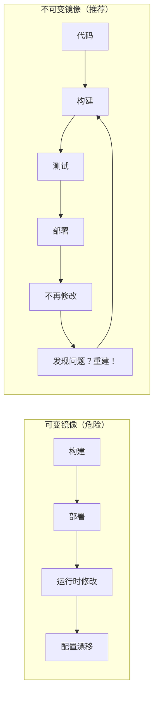
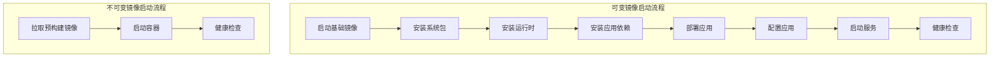
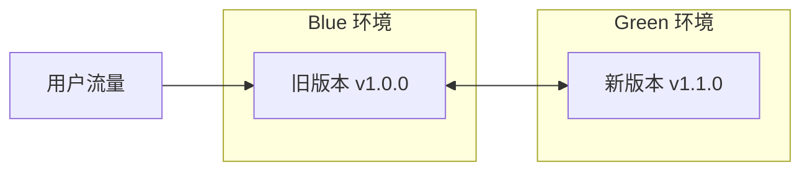

2017 年，某公司的一次部署导致服务中断 4 小时。事故原因是：部署脚本在运行时更新了 Nginx 配置，但部署脚本的版本与测试环境不同——测试通过，生产却挂了。

如果他们使用了**不可变镜像**，这个问题就不会发生。因为镜像在构建时就已经「固化」，不存在「部署时版本不一致」的问题。

本文探讨如何正确地构建和管理不可变镜像。

## 什么是不可变镜像

不可变镜像（Immutable Image）是指**一旦构建完成，就不再修改**的镜像。每次变更都通过重新构建镜像来实现，而不是在运行中的容器或服务器上打补丁。



## 不可变镜像的价值

### 一致性保证

| 场景 | 可变镜像 | 不可变镜像 |
| --- | --- | --- |
| **环境一致性** | 运行时安装可能有差异 | 构建时确定，100% 一致 |
| **回滚** | 需要恢复配置 | 重新部署旧镜像即可 |
| **扩展** | 新实例可能有不同配置 | 克隆镜像，完全一致 |
| **审计** | 谁改了什么不知道 | Git 历史记录一切 |
| **测试** | 难以在 CI 中验证 | 镜像可测试 |

### 快速启动



不可变镜像的启动时间可以从 3-5 分钟缩短到几秒钟。

## Dockerfile 最佳实践

### 多阶段构建

```dockerfile title="Dockerfile"
# 阶段 1: 构建
FROM maven:3.9-eclipse-temurin-21 AS builder

WORKDIR /app
COPY pom.xml .
RUN mvn dependency:go-offline

COPY src ./src
RUN mvn package -DskipTests

# 阶段 2: 运行
FROM eclipse-temurin:21-jre-alpine

# 不创建 root 用户
RUN addgroup -S appgroup && adduser -S appuser -G appgroup

WORKDIR /app
COPY --from=builder /app/target/myapp.jar ./myapp.jar

# 使用非 root 用户运行
USER appuser

EXPOSE 8080
HEALTHCHECK --interval=30s --timeout=3s --start-period=5s --retries=3 \
    CMD wget --quiet --tries=1 --spider http://localhost:8080/health || exit 1

ENTRYPOINT ["java", "-jar", "myapp.jar"]
```

### 优化镜像大小

```dockerfile title="Dockerfile.optimized"
# 使用 Alpine 减小体积
FROM eclipse-temurin:21-jre-alpine

# 按需安装（如果需要）
RUN apk add --no-cache curl

# 清理缓存
RUN rm -rf /var/cache/apk/* /tmp/* /var/tmp/*

# 多阶段构建
COPY --from=builder /app/target/myapp.jar /app/
```

### 构建缓存优化

```dockerfile title="Dockerfile.cache"
# 先复制依赖文件，利用 Docker 缓存
FROM maven:3.9-eclipse-temurin-21 AS builder

WORKDIR /app
COPY pom.xml .
RUN mvn dependency:go-offline  # 这个层会被缓存

# 代码变更后，这个层会失效，但依赖层仍然有效
COPY src ./src
RUN mvn package -DskipTests
```

## 镜像标签策略

### 语义化版本

```bash
# 推荐：语义化版本
registry.example.com/myapp:1.0.0
registry.example.com/myapp:1.0.1
registry.example.com/myapp:1.1.0

# 不推荐：latest
registry.example.com/myapp:latest  # 永远不要在生产用 latest
```

### 标签命名规范

| 标签 | 用途 | 示例 |
| --- | --- | --- |
| **版本号** | 生产部署 | `1.0.0`, `1.1.0` |
| **Git SHA** | 可追溯 | `sha-abc1234` |
| **日期** | 每日构建 | `2024-01-15` |
| **环境** | 环境区分 | `dev`, `staging` |
| **架构** | 多架构支持 | `amd64`, `arm64` |

```yaml title="GitHub Actions 镜像标签"
- name: Extract metadata
  id: meta
  uses: docker/metadata-action@v5
  with:
    images: registry.example.com/myapp
    tags: |
      type=semver,pattern={{version}}
      type=sha,prefix=sha-
      type=date

- name: Push to registry
  uses: docker/build-push-action@v5
  with:
    tags: ${{ steps.meta.outputs.tags }}
```

## 镜像安全

### 基础镜像选择

```dockerfile title="安全基础镜像"
# 推荐：官方精简镜像
FROM node:20-alpine
FROM eclipse-temurin:21-jre-alpine
FROM python:3.12-slim

# 不推荐：完整系统镜像
FROM ubuntu:latest
FROM centos:latest
```

### 安全扫描

```yaml title="GitHub Actions 安全扫描"
- name: Run Trivy
  uses: aquasecurity/trivy-action@master
  with:
    image-ref: registry.example.com/myapp:${{ github.sha }}
    format: sarif
    output: trivy-results.sarif

- name: Upload to GitHub Security
  uses: github/codeql-action/upload-sarif@v2
  with:
    sarif_file: trivy-results.sarif
```

```bash title="本地扫描"
# Trivy
trivy image registry.example.com/myapp:1.0.0

# Grype
grype registry.example.com/myapp:1.0.0

# Snyk
snyk container test registry.example.com/myapp:1.0.0
```

### 镜像签名

```bash
# Cosign 签名
cosign sign --key cosign.key registry.example.com/myapp:1.0.0

# 验证签名
cosign verify --key cosign.pub registry.example.com/myapp:1.0.0
```

```yaml title="Admission Controller"
apiVersion: admissionregistration.k8s.io/v1
kind: ValidatingWebhookConfiguration
metadata:
  name: verify-signatures
webhooks:
  - name: verify.k8s.example.com
    rules:
      - apiGroups: [""]
        apiVersions: ["v1"]
        operations: ["CREATE"]
        resources: ["pods"]
    clientConfig:
      service: cosign-verify
      caBundle: <base64-encoded-ca>
```

## 镜像版本管理

### 保持镜像精简

```bash
# 查看镜像大小
docker images | head
docker history myapp:1.0.0

# 优化步骤
# 1. 删除不必要的文件
RUN apt-get purge -y --auto-remove \
    && rm -rf /var/lib/apt/lists/*

# 2. 使用 .dockerignore
cat .dockerignore
.git
*.md
tests/
node_modules/
.env*
```

### 镜像清理

```bash title="清理策略"
# 清理未使用的镜像
docker image prune -a

# 清理悬空镜像
docker image prune

# 使用构建缓存限制
# Docker daemon.json
{
  "builder": {
    "gc": {
      "enabled": true,
      "defaultKeepStorage": "20GB"
    }
  }
}
```

## 部署策略

### 蓝绿部署



```yaml title="Kubernetes 蓝绿部署"
apiVersion: v1
kind: Service
metadata:
  name: myapp-service
spec:
  selector:
    app: myapp
    version: v1.0.0  # 切换 version 标签即可切换流量
---
apiVersion: apps/v1
kind: Deployment
metadata:
  name: myapp-v110
spec:
  replicas: 3
  selector:
    matchLabels:
      app: myapp
      version: v1.1.0
  template:
    metadata:
      labels:
        app: myapp
        version: v1.1.0
    spec:
      containers:
      - name: myapp
        image: registry.example.com/myapp:1.1.0
```

### 金丝雀部署

```yaml title="Istio 金丝雀配置"
apiVersion: networking.istio.io/v1alpha3
kind: VirtualService
metadata:
  name: myapp
spec:
  hosts:
    - myapp
  http:
    - route:
        - destination:
            host: myapp
            subset: v1
          weight: 90
        - destination:
            host: myapp
            subset: v2
          weight: 10  # 10% 流量到新版本
---
apiVersion: networking.istio.io/v1alpha3
kind: DestinationRule
metadata:
  name: myapp
spec:
  host: myapp
  subsets:
    - name: v1
      labels:
        version: v1.0.0
    - name: v2
      labels:
        version: v1.1.0
```

## 回滚策略

### 快速回滚

```bash title="回滚命令"
# Kubernetes 回滚
kubectl rollout undo deployment/myapp
kubectl rollout undo deployment/myapp --to-revision=3

# 查看历史
kubectl rollout history deployment/myapp

# Docker Compose 回滚
docker-compose down
docker-compose -f docker-compose.v1.yml up -d
```

### 回滚自动化

```yaml title="自动回滚策略"
apiVersion: argoproj.io/v1alpha1
kind: Rollout
metadata:
  name: myapp
spec:
  strategy:
    canary:
      steps:
        - setWeight: 10
        - pause: {duration: 10m}
        - setWeight: 50
        - pause: {duration: 10m}
      analysis:
        templates:
          - templateName: success-rate
        args:
          - name: service-name
            value: myapp-canary
      autoPromotionEnabled: false  # 自动回滚
```

## 监控与可观测性

### 镜像元数据

```yaml title="镜像标签注解"
apiVersion: apps/v1
kind: Deployment
metadata:
  annotations:
    kubernetes.io/change-cause: |
      Deployment at 2024-01-15 10:30:00
      Image: registry.example.com/myapp:1.1.0
      Commit: abc1234
      Author: developer@example.com
spec:
  template:
    metadata:
      labels:
        app: myapp
        version: "1.1.0"
        commit: "abc1234"
```

### 镜像变更检测

```bash title="镜像差异比较"
# 使用 crane 比较镜像
crane diff registry.example.com/myapp:1.0.0 \
              registry.example.com/myapp:1.1.0

# 使用 dive 分析层
dive registry.example.com/myapp:1.1.0
```

## 总结

不可变镜像的核心原则：

1. **构建时固化**：所有依赖和配置在构建时确定
2. **语义化版本**：清晰的版本管理策略
3. **安全优先**：精简镜像、安全扫描、签名验证
4. **快速回滚**：通过重新部署旧镜像实现回滚
5. **渐进发布**：蓝绿/金丝雀降低风险

不可变镜像是云原生时代的**最佳实践**，它将配置的不确定性降到最低，让基础设施真正变得可预测、可审计。

:::info 下一步

想了解 IaC 的安全实践？请阅读 [IaC 安全与合规](/cloud-native/iac/security)。
:::
