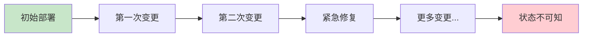
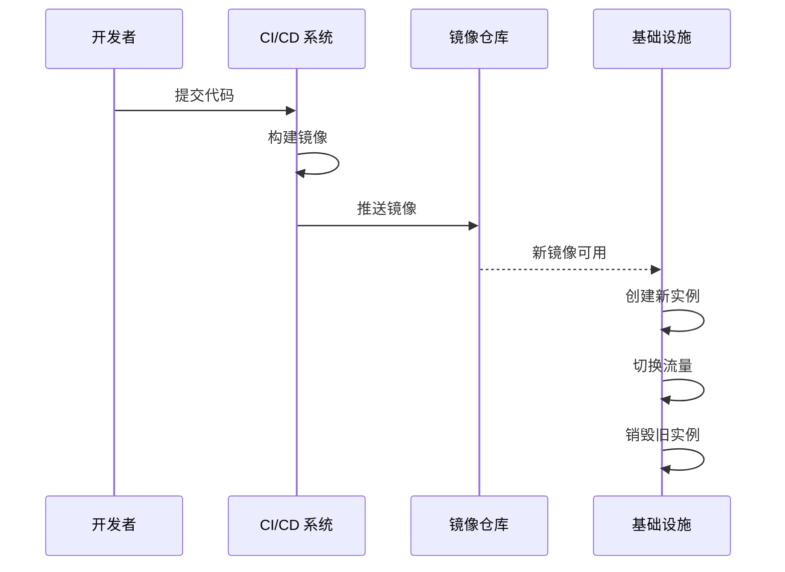
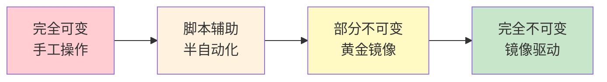

凌晨 3 点，线上告警。数据库连接数异常，问题指向某台应用服务器。你登录服务器查看，发现这台机器的配置和部署文档描述的不太一样——有人上周手动调整过 JVM 参数，但没有更新文档。追溯了一圈才发现，是上个月某次紧急扩容时，工程师为了快速解决问题，SSH 登录服务器直接改了配置。

这就是「可变基础设施」最大的问题：**服务器的状态是累积的、不可预测的、难以复制的**。每一台运行中的服务器，都记录着它自己的「历史」——有文档记录的操作，有临时性的调试修改，有环境差异导致的特殊配置。这些「历史」，让环境的差异变得不可避免。

不可变基础设施（Immutable Infrastructure）的核心理念，就是从根本上解决这个问题：**一旦创建，永不修改**。如果需要变更，就销毁旧实例，用新的配置重新创建。

## 什么是不可变基础设施

不可变基础设施是一种基础设施管理范式，其核心原则是：**任何对基础设施的变更，都应该通过创建新实例来实现，而不是修改现有实例**。

这意味着：

- 服务器不会收到任何运行时补丁
- 配置文件不会在运行时被修改
- 应用升级不是「更新」，而是「替换」

听起来激进？让我们先看看为什么传统模式会出问题。

## 可变基础设施的困境

传统运维模式下，服务器被视为可变的实体。我们需要 SSH 登录、修改配置、打补丁、更新包。久而久之，每台服务器都变成了一个「snowflake」——独一无二的、难以复制的、难以预测的。



### 可变基础设施的核心问题

**配置漂移（Configuration Drift）**：随着时间推移，服务器的实际配置与预期配置越来越远。没有人知道「标准配置」是什么，因为实际运行的环境早已偏离了最初的设计。

**难以复现问题**：线上出问题了，在本地或测试环境复现不了。不是代码的问题，而是环境差异。日志里记录的是「为什么这个请求失败了」，但环境本身才是真正的元凶。

**回滚困难**：如果升级后发现新版本有问题，最常见的做法是「再做一次变更把系统改回去」。但这次「改回去」的变更，可能引入新的不一致。

**难以扩展**：当需要扩容时，我们通常的做法是复制一台现有的服务器。但复制的过程中，难免会有遗漏——某些配置是临时的，某些设置是针对特定场景的。

:::warning
**为什么配置漂移如此危险？**

配置漂移最可怕的地方在于：它往往是**渐进的、不知不觉的**。不会有一天突然所有服务器都出问题了，而是慢慢累积，直到某台机器暴露出奇怪的问题，而你甚至无法解释为什么偏偏是这一台。

Netflix 曾在 2012 年提出「Pets vs Cattle」的概念：用宠物和牛来比喻两种服务器管理方式。宠物需要精心照料、独一无二；牛则是批量生产的，出了问题就替换，而不是修复。
:::

## 不可变基础设施如何解决这些问题

不可变基础设施的核心思想是：**把「变更」变成「重建」**。

当需要升级应用版本时，不是登录服务器停止旧进程、部署新程序、启动新进程，而是：

1. 构建包含新版本的新镜像
2. 用新镜像创建新的服务器实例
3. 将流量切换到新实例
4. 销毁旧实例



### 不可变基础设施的优势

**环境一致性**：所有环境（dev、staging、production）都基于同一个镜像创建。镜像就是「标准配置」的精确表达——它不是文档，不是记忆，而是实际可执行的定义。

**真正的幂等性**：在不可变基础设施中，「重新部署」和「首次部署」没有本质区别。回滚也是「部署旧版本」，而不是「逆向变更」。这让部署变得可预测、可测试。

**快速扩缩容**：当需要扩容时，从镜像启动一个新实例即可。新实例的状态与集群中其他实例完全一致，不需要逐台检查和调整。

**更快的故障恢复**：如果某个实例出现问题，直接销毁并重新创建一个即可。不需要排查「这个实例哪里被改过」，因为实例从来不会被修改。

## 实现方式：镜像驱动

不可变基础设施的实现，核心依赖是**镜像（Image）**。

### AMI（Amazon Machine Image）

对于 AWS 环境，AMI 是不可变基础设施的基础。每个 AMI 包含：
- 操作系统
- 运行时环境（Java、Node.js 等）
- 应用依赖（数据库客户端、缓存客户端等）
- 应用代码

```yaml title="EC2 实例启动配置"
# 使用 AMI 创建实例
InstanceType: t3.medium
ImageId: ami-0abcdef1234567890  # 包含完整应用的镜像

# 这个实例启动后，无需任何额外配置
# 任何基于这个 AMI 创建的实例都是等效的
```

### Packer：跨平台镜像构建

[Packer](https://www.packer.io/) 是 HashiCorp 出品的镜像构建工具，支持同时构建多种格式的镜像：

- AWS AMI
- Google Cloud Image
- Azure VM Image
- VMware、VBox 等本地虚拟化格式
- Docker 镜像

```hcl title="packer.pkr.hcl"
source "amazon-ebs" "example" {
  ami_name      = "my-app-${var.version}"
  instance_type = "t3.micro"
  region        = "us-east-1"

  source_ami    = "ami-0c55b159cbfafe1f0"  # 基础镜像
  ssh_username  = "ec2-user"

  # 构建时安装依赖
  provisioner "shell" {
    inline = [
      "sudo yum install -y java-17-openjdk",
      "sudo curl -sL https://repo.example.com/app.tar.gz | sudo tar xz -C /opt"
    ]
  }

  # 镜像构建完成后，实例会被自动销毁
  # 留下来的只有 AMI
}

build {
  sources = ["source.amazon-ebs.example"]
}
```

:::tip
**为什么用 Packer 而不是手动构建？**

手动构建的问题是：过程不可复制、步骤可能遗漏、难以版本化。Packer 的价值在于：**让镜像构建过程变成代码**——可以版本控制、可以审查、可以重复执行。

更重要的是，Packer 在构建完成后会**自动销毁临时实例**，确保最终产物只有镜像本身。
:::

### 容器镜像：更轻量的不可变单元

对于云原生应用，容器镜像（如 Docker 镜像）是更常见的不可变单元。

```docker title="Dockerfile"
FROM eclipse-temurin:17-jre-alpine

# 创建非 root 用户，提高安全性
RUN addgroup -S appgroup && adduser -S appuser -G appgroup

# 复制打包好的应用
COPY --chown=appuser:appgroup app.jar /opt/app/app.jar

WORKDIR /opt/app
USER appuser

# 暴露端口
EXPOSE 8080

# 启动命令
ENTRYPOINT ["java", "-jar", "app.jar"]
```

这个 Dockerfile 构建出的镜像，是不可变的基础单元。无论在哪里运行（开发机、K8s 集群、CI 环境），容器内的内容完全一致。

## 演进路径

从可变基础设施迁移到不可变基础设施，不是非此即彼的选择。现实中，更常见的做法是逐步演进：



### 阶段 1：从脚本开始

第一步不是彻底改变，而是把「手动操作」变成「脚本执行」。Ansible、Chef、Puppet 等工具可以帮助你：

- 把服务器配置写成代码
- 实现「一键部署」
- 让配置变更可追溯

### 阶段 2：引入镜像思维

当脚本稳定后，开始考虑镜像：

- 构建「黄金镜像」——包含所有标准依赖
- 应用变更通过更新镜像实现，而不是直接修改实例
- 保留旧镜像版本，支持回滚

### 阶段 3：完全不可变

最终形态下，运行时实例完全由镜像决定：

- 没有 SSH 登录服务器修改配置的概念
- 配置通过环境变量、ConfigMap 或远程配置中心注入
- 所有变更都通过重新部署实现

## 权衡矩阵

| 场景 | 推荐方案 | 说明 |
| --- | --- | --- |
| 快速迭代的互联网业务 | 不可变 | 需要快速扩缩容，环境一致性是刚需 |
| 传统企业系统 | 渐进迁移 | 可以先用脚本标准化，再逐步不可变 |
| 长期运行的数据库服务器 | 部分可变 | 核心数据不变，但周边配置可以不可变 |
| 开发/测试环境 | 不可变 | 环境构建快，销毁重建也快 |
| 紧急故障修复 | 需要权衡 | 严格不可变会降低灵活性，但能保证一致性 |

:::danger
**不可变基础设施不是银弹**

不可变基础设施的核心假设是「销毁重建比修改更安全」。但在某些场景下，这个假设不成立：

- **有状态数据**：如果实例上有不能丢失的数据，销毁实例会导致数据丢失
- **变更窗口短**：如果变更窗口只有 5 分钟，构建新镜像可能来不及
- **基础设施成本高**：如果每次变更都重建，成本可能难以接受

解决方案：将有状态和无状态部分分离。无状态部分完全不可变，有状态部分采用特殊的变更策略（如蓝绿部署）。
:::

## 常见问题与反模式

### 反模式 1：镜像构建包含敏感信息

把数据库密码、API 密钥等敏感信息直接写进镜像。镜像会分发到多个环境，敏感信息的安全性无法保证。

**正确做法**：敏感信息通过环境变量、密钥管理服务（如 AWS Secrets Manager）或配置中心注入，不进镜像。

### 反模式 2：「不可变」后仍保留 SSH 访问

嘴上说不可变，但为了「紧急情况」，仍然开放 SSH 访问。一旦开放，SSH 就一定会被使用——这是人性。

**正确做法**：如果真的需要 SSH 做调试，使用 bastion host 或 just-in-time access，而不是直接开放服务器 SSH。

### 反模式 3：镜像过大，构建时间过长

把所有东西都打包进镜像，包括应用代码的每次构建结果。导致镜像体积过大，构建时间过长，CI/CD 流水线效率降低。

**正确做法**：镜像只包含操作系统、运行时和依赖，应用代码通过 volume mount 或 sidecar 注入。

## 延伸思考

不可变基础设施的本质，是把「配置」从「运行时」转移到「构建时」。当你不再信任运行时的状态，而是只信任构建产物（镜像）时，很多运维难题会自然消解。

但不可变基础设施也给架构师提出了新的问题：**如果配置都在镜像里，那配置管理该如何做？** 这就引出了下一个话题：基础设施即代码（IaC）——如何用代码来管理基础设施的配置和变更。

接下来的几篇文章，我们将深入探讨：
- 可变 vs 不可变的选择与权衡
- IaC 的工具生态（Terraform、Ansible、Pulumi）
- 声明式 vs 命令式的设计哲学
