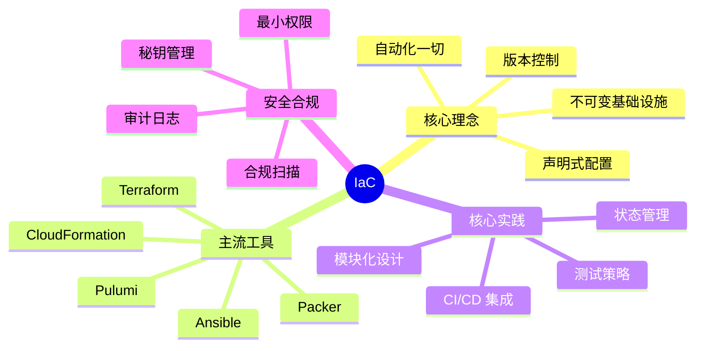

# 基础设施即代码（IaC）模块

基础设施即代码（Infrastructure as Code，IaC）是云原生时代最重要的工程实践之一。它不仅仅是「用代码管理服务器」，而是一种**将基础设施视为软件系统**的思维方式。

## 模块概述

本模块将带你从零开始，深入理解 IaC 的核心理念、主流工具、最佳实践，以及如何构建安全、可靠、可测试的基础设施代码体系。



## 学习路径

### 第一阶段：理念入门

如果你对 IaC 还比较陌生，建议从以下内容开始：

1. **[不可变基础设施概述](/cloud-native/iac/immutable-infra)** - 理解「不变性」的核心价值
2. **[可变 vs 不可变基础设施](/cloud-native/iac/mutable-vs-immutable)** - 两种范式的对比与选择

### 第二阶段：工具掌握

掌握主流 IaC 工具：

- **Terraform** - HashiCorp 出品的声明式 IaC 工具
  - [Terraform 架构深度解析](/cloud-native/iac/terraform-architecture)
  - [Terraform 核心语法](/cloud-native/iac/terraform-syntax)
  - [Terraform State 管理](/cloud-native/iac/terraform-state)
  - [Terraform 模块化设计](/cloud-native/iac/terraform-modules)
  - [Terraform 多环境管理](/cloud-native/iac/terraform-environments)

- **Pulumi** - 用编程语言编写基础设施
  - [Pulumi 架构深度解析](/cloud-native/iac/pulumi)
  - [Pulumi vs Terraform 对比](/cloud-native/iac/pulumi-vs-terraform)

- **其他工具**
  - [AWS CloudFormation](/cloud-native/iac/cloudformation)
  - [Ansible 配置管理](/cloud-native/iac/ansible)

### 第三阶段：镜像构建

理解不可变基础设施的重要组成部分——镜像：

- **[Packer 镜像构建](/cloud-native/iac/packer)** - 多平台镜像统一构建
- **[镜像不可变最佳实践](/cloud-native/iac/immutable-image)** - 镜像分层、版本管理与回滚策略

### 第四阶段：安全与测试

确保 IaC 代码的质量与安全：

- **[IaC 安全与合规](/cloud-native/iac/security)** - 敏感信息管理、IAM 最小权限、合规扫描
- **[IaC 测试策略](/cloud-native/iac/testing)** - 从静态分析到策略验证的全方位测试
- **[Terratest 基础设施测试](/cloud-native/iac/terratest)** - 用 Go 编写真实的基础设施测试

### 第五阶段：工程实践

将 IaC 融入持续交付管道：

- **[IaC 与 CI/CD 集成](/cloud-native/iac/cicd-integration)** - 构建完整的 IaC CI/CD 管道

## 核心概念速览

| 概念 | 说明 | 相关文档 |
| --- | --- | --- |
| **声明式 vs 命令式** | IaC 的两种编程范式 | [声明式 vs 命令式 IaC](/cloud-native/iac/declarative-vs-imperative) |
| **不可变基础设施** | 一旦创建，永不修改 | [不可变基础设施概述](/cloud-native/iac/immutable-infra) |
| **State 管理** | Terraform 的状态文件管理 | [Terraform State 管理](/cloud-native/iac/terraform-state) |
| **模块化** | 可复用、可组合的基础设施组件 | [Terraform 模块化设计](/cloud-native/iac/terraform-modules) |

## 推荐阅读顺序

### 零基础入门

```
不可变基础设施 → 可变 vs 不可变 → Terraform 核心语法 → Terraform State → 多环境管理
```

### 进阶提升

```
Terraform 模块化 → IaC 测试策略 → Terratest → IaC 安全与合规 → CI/CD 集成
```

### 架构设计

```
不可变基础设施 → Packer 镜像构建 → 镜像不可变最佳实践 → Pulumi vs Terraform → 安全与合规
```

## 快速开始

### 安装 Terraform

```bash
# macOS
brew install terraform

# 验证安装
terraform -version
```

### 初始化第一个项目

```hcl title="main.tf"
provider "aws" {
  region = "us-east-1"
}

resource "aws_instance" "web" {
  ami           = "ami-0c55b159cbfafe1f0"
  instance_type = "t3.small"

  tags = {
    Name = "hello-terraform"
  }
}
```

```bash
# 初始化
terraform init

# 预览变更
terraform plan

# 应用变更
terraform apply

# 销毁资源
terraform destroy
```

## 延伸学习

- [分布式理论](/distributed-theory) - 理解 Raft、共识算法
- [系统设计核心](/system-design) - 缓存、负载均衡、消息队列
- [云原生架构](/cloud-native) - Kubernetes、Service Mesh

:::tip 开始你的 IaC 之旅

建议从[不可变基础设施概述](/cloud-native/iac/immutable-infra)开始，建立正确的认知框架。
:::
