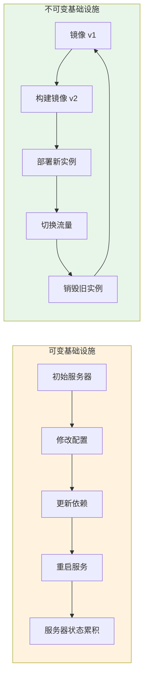
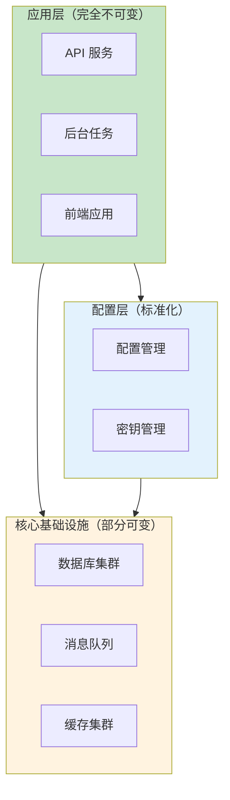

「不可变基础设施」听起来很美好，但现实是骨感的。某金融客户在尝试全面推行不可变基础设施后，发现一个问题：他们的核心交易系统，每次变更都需要重新构建镜像、重新部署，而整个流程需要 2 小时。在一个 24 小时交易窗口只有 4 小时的场景下，这个方案根本不可行。

这是不可变基础设施最常见的一种误用：**把「不可变」当成教条，而不是工具**。

本文将深入对比可变与不可变基础设施的差异，分析各自的适用场景，并给出「混合策略」的实践建议。

## 核心概念回顾

在深入对比之前，先明确两个概念的边界：

**可变基础设施（Mutable Infrastructure）**：服务器被视为可变的实体。变更通过直接修改现有服务器来实现——SSH 登录、更新配置、重新加载服务。服务器的状态是累积的。

**不可变基础设施（Immutable Infrastructure）**：服务器被视为不可变的。变更通过创建新服务器来实现——构建新镜像、部署新实例、销毁旧实例。服务器的状态由镜像决定。



## 深度对比

### 变更流程对比

| 维度 | 可变基础设施 | 不可变基础设施 |
| --- | --- | --- |
| **变更方式** | 直接修改运行中的实例 | 构建新镜像，部署新实例 |
| **回滚方式** | 逆向修改（可能有遗漏） | 重新部署旧镜像版本 |
| **一致性保证** | 依赖配置管理工具和人 | 镜像即一致性保证 |
| **故障定位** | 需要对比「实际」vs「预期」 | 镜像相同则实例相同 |
| **变更时间** | 通常较快（分钟级） | 可能较长（镜像构建需要时间） |

### 可变基础设施的适用场景

**场景 1：长时间运行的有状态服务**

数据库、消息队列、缓存系统——这些服务往往有 TB 级别的数据。销毁实例重建的代价是不可接受的。

在这种场景下，可变基础设施是更现实的选择。但即使是这种场景，也可以做一些改进：

- 使用「黄金配置」管理配置标准化
- 用配置管理工具（Ansible/Puppet）代替手工操作
- 对核心配置实施版本控制

**场景 2：变更窗口极短**

某些业务场景（如金融交易、游戏服务器维护）有严格的变更窗口。在极短的时间窗口内完成镜像构建、测试、部署、验证几乎不可能。

这种情况下，可以考虑「**不可变构建流程，可变部署策略**」：预先构建多个版本的镜像，变更时直接切换到已验证的版本。

**场景 3：调试和故障恢复**

在生产环境中遇到紧急故障时，不可变基础设施的「不能直接修改」原则可能成为障碍。

合理的做法是：建立**紧急访问协议**，而不是放宽安全约束。例如：

- 紧急情况下可以使用 bastion host 登录
- 但登录后只能做只读排查，不能做修改
- 任何修复都必须走标准变更流程

:::info
**弹性优先还是一致性优先？**

这是一个架构权衡，没有标准答案。选择取决于：
- 业务对一致性的要求有多高
- 故障的影响有多大
- 团队的技术能力如何

我的经验是：**无状态服务优先不可变，有状态服务可以可变但要标准化**。
:::

### 不可变基础设施的适用场景

**场景 1：云原生应用和容器化环境**

Kubernetes + Docker 的组合，几乎天然支持不可变基础设施：

- 镜像作为应用分发单元
- Deployment 作为声明式期望状态
- Pod 被视为临时实例，销毁重建是常态

```yaml title="Kubernetes Deployment"
apiVersion: apps/v1
kind: Deployment
metadata:
  name: my-app
spec:
  replicas: 3
  selector:
    matchLabels:
      app: my-app
  template:
    metadata:
      labels:
        app: my-app
    spec:
      containers:
      - name: app
        image: myregistry/my-app:v2.1.0  # 镜像版本即应用版本
        ports:
        - containerPort: 8080
```

**场景 2：需要频繁扩缩容的环境**

电商大促、直播流量洪峰、临时性业务——这些场景需要在短时间内创建大量实例。不可变基础设施让扩容变得简单：从镜像启动即可，不需要逐台配置。

**场景 3：追求极致一致性的团队**

当团队规模大、基础设施复杂、变更频繁时，可变基础设施的「配置漂移」问题会被放大。不可变基础设施可以显著降低协作成本。

## 混合策略：现实中的最佳实践

大多数团队最终采用的都是**混合策略**：



### 混合策略的实践原则

**原则 1：无状态层完全不可变**

应用服务（API、Worker、后台任务）应该完全不可变。它们：

- 不存储持久数据
- 可以随时销毁重建
- 缩扩容最频繁，需要一致性

**原则 2：有状态层标准化但允许变更**

数据库、消息队列、缓存等有状态服务：

- 使用配置管理工具标准化配置
- 但允许在紧急情况下直接修改
- 通过监控和对比机制检测漂移

**原则 3：配置外置**

无论可变还是不可变，**配置都应该与部署物分离**：

- 镜像中不包含环境特定配置
- 配置通过环境变量、ConfigMap、Secrets 注入
- 这样才能实现「一份镜像，多环境部署」

```yaml title="配置外置示例"
# Kubernetes Secret
apiVersion: v1
kind: Secret
metadata:
  name: db-credentials
type: Opaque
stringData:
  password: "xxx"

---
# Deployment 引用
spec:
  containers:
  - name: app
    env:
    - name: DB_PASSWORD
      valueFrom:
        secretKeyRef:
          name: db-credentials
          key: password
```

## 迁移路径

如果你的团队目前是完全可变的，迁移到不可变基础设施应该是一个**渐进的过程**：

### 第一步：配置标准化

在追求「不可变」之前，先实现「可管理」：

- 用 Ansible/Puppet 编写标准化配置 playbook
- 建立配置基线（baseline）
- 实现配置审计——定期对比「实际配置」与「预期配置」

```yaml title="Ansible 配置基线"
- name: 应用服务器基线配置
  hosts: app_servers
  vars:
    app_version: "2.1.0"
    jvm_memory: "2048m"
    connection_pool_size: 50

  tasks:
    - name: 安装 Java 运行时
      package:
        name: openjdk-17-jre
        state: present

    - name: 配置 JVM 参数
      lineinfile:
        path: /etc/default/app
        regexp: "^JVM_OPTS"
        line: "JVM_OPTS=-Xms{{ jvm_memory }} -Xmx{{ jvm_memory }}"
```

### 第二步：引入镜像思维

即使不彻底不可变，也可以开始用镜像来构建新服务器：

- 用 Packer 预构建「黄金镜像」
- 新服务器从镜像创建
- 变更通过更新镜像实现

### 第三步：建立变更门禁

- 所有配置变更必须通过配置管理工具
- 禁止手工 SSH 修改
- 建立 CI/CD 流水线验证配置变更

### 第四步：逐步扩大不可变范围

从最不敏感的服务开始，逐步扩大不可变范围：

1. 开发/测试环境（低风险）
2. 边缘服务（如日志收集、监控代理）
3. 无状态 API 服务
4. 有状态服务（谨慎推进）

## 工具对比

| 维度 | Terraform | Ansible | Chef | Puppet |
| --- | --- | --- | --- | --- |
| **核心范式** | 声明式 | 命令式 | 命令式 | 声明式 |
| **资源类型** | 基础设施（云资源） | 配置和应用 | 配置和应用 | 配置 |
| **状态管理** | 有状态文件 | 无状态 | 无状态 | 有状态 |
| **不可变友好度** | 高 | 中 | 中 | 中 |
| **学习曲线** | 陡峭 | 平缓 | 陡峭 | 陡峭 |

:::tip
**我的工具选择建议**

- **Terraform**：云资源管理首选，声明式语法天然支持不可变理念
- **Ansible**：配置管理和应用部署，适合可变基础设施的标准化
- **Packer**：镜像构建必备，与 Terraform 配合实现完整不可变流程
- **组合使用**：Terraform 管云资源，Ansible 做配置，Packer 构建镜像

更多工具对比，将在后续《IaC 工具全景对比》中详细展开。
:::

## 常见问题与反模式

### 反模式 1：不可变教条主义

「我们必须完全不可变」——当这个原则开始影响业务连续性时，说明你走极端了。

**正确做法**：根据服务类型选择策略，保留紧急访问通道。

### 反模式 2：配置内嵌镜像

把环境特定的配置（数据库地址、API 密钥）写进镜像。这破坏了「一份镜像多环境部署」的能力。

**正确做法**：配置外置，通过环境变量或配置中心注入。

### 反模式 3：忽视监控和告警

不可变基础设施不是「设置好就完了」。需要监控：

- 实例健康状态
- 部署成功率
- 回滚频率
- 配置一致性

### 反模式 4：镜像版本混乱

没有建立清晰的镜像版本策略，导致「这个实例用的是哪个版本？」成为灵魂拷问。

**正确做法**：建立 GitOps 工作流，镜像版本与 Git commit 绑定。

## 总结

可变与不可变，不是非此即彼的选择，而是需要根据实际情况权衡的工具。

**核心原则**：
- 无状态服务：优先不可变
- 有状态服务：标准化但允许变更
- 配置：必须外置，与部署物分离
- 迁移：渐进进行，不要企图一步到位

> 最好的架构，是能够适应业务发展的架构。不可变基础设施是一把利器，但要用在合适的地方。

## 延伸思考

当你确定了基础设施策略后，下一个问题是：**如何用代码来管理这些基础设施？**

这引出了「基础设施即代码」（IaC）的概念。接下来的文章将探讨：

- IaC 的核心原则和工具生态
- 声明式 vs 命令式的设计哲学
- Terraform、Ansible、Pulumi 的适用场景对比
- 模块化设计和状态管理最佳实践

没有银弹，只有适合的工具和适合的时机。
