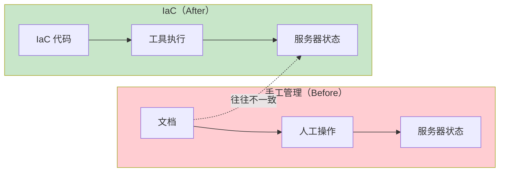
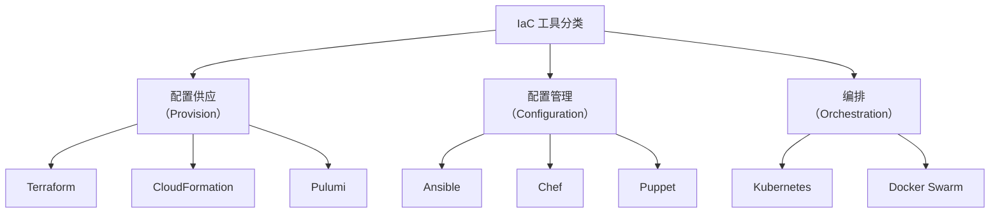
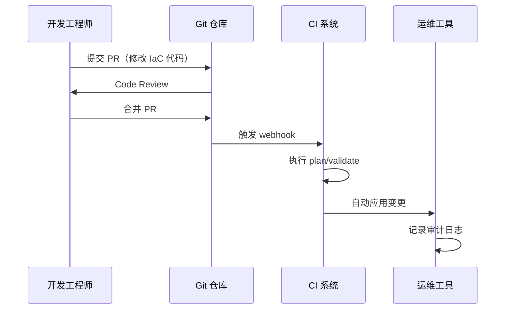

某互联网公司在 2020 年之前，所有基础设施都是手工管理。服务器、网络、存储——全靠工程师 SSH 登录手动配置。好处是「灵活」，想改什么改什么；坏处是，随着业务发展，问题开始显现：

- 新来的工程师根本不知道之前为什么那样配置
- 每次故障复盘，最大的困惑总是「这个配置是什么时候改的？谁改的？为什么改？」
- 测试环境搭了一个月，因为手动配置太慢，还和线上环境有差异
- 公司规定所有变更必须邮件审批，但邮件和实际配置永远对不上

这是手工管理基础设施的典型困境：**配置与文档脱节，人与流程脱节，变更与审计脱节。**

基础设施即代码（Infrastructure as Code，IaC）的出现，就是为了解决这些问题。

## 什么是 IaC

IaC 是一种基础设施管理方法，其核心理念是：**用代码来描述和管理基础设施，而不是通过手动操作或 GUI 工具**。



### IaC 的核心价值

**版本控制**：所有基础设施配置都在 Git 中管理。变更历史一目了然，谁在什么时候改了什么，全部可追溯。

**幂等性**：相同的代码执行多次，结果是一致的。无论在哪里执行，基础设施最终状态都是相同的。

**自动化**：人工操作变成自动化执行。减少人为错误，提高执行效率。

**协作**：代码审查（Code Review）成为标准流程。重大变更必须经过团队 review 才能合并。

**文档即代码**：配置本身就是文档。不再需要维护单独的文档，代码就是最新的配置说明。

## IaC 工具分类

IaC 工具可以按照不同的维度分类。按照功能定位，主要分为三类：



### 配置供应（Provision）

负责「创建」基础设施资源——云服务器、网络、存储、负载均衡器等。

**代表工具**：Terraform、CloudFormation、Pulumi

```hcl title="Terraform 示例：创建 AWS EC2 实例"
resource "aws_instance" "app_server" {
  ami           = "ami-0c55b159cbfafe1f0"
  instance_type = "t3.medium"

  tags = {
    Name        = "app-server-${var.environment}"
    Environment = var.environment
    ManagedBy   = "Terraform"
  }
}
```

### 配置管理（Configuration）

负责「配置」已存在的基础设施——安装软件、修改配置、部署应用。

**代表工具**：Ansible、Chef、Puppet

```yaml title="Ansible 示例：配置应用服务器"
- name: 配置应用服务器
  hosts: app_servers
  tasks:
    - name: 安装 Java 运行时
      package:
        name: openjdk-17-jre
        state: present

    - name: 复制应用配置
      template:
        src: app.conf.j2
        dest: /etc/app/conf

    - name: 启动应用服务
      systemd:
        name: app
        state: started
        enabled: true
```

### 编排（Orchestration）

负责「协调」多个基础设施组件之间的关系，处理部署顺序、服务发现、负载均衡等。

**代表工具**：Kubernetes、Docker Compose、Helm

## 主流 IaC 工具深度对比

### Terraform

Terraform 是 HashiCorp 出品的开源 IaC 工具，采用声明式语法，通过 Provider 插件机制支持多云。

**核心特点**：

- **声明式语法**：描述期望状态，Terraform 自动计算执行计划
- **执行计划（Plan）**：在真正执行前预览变更内容
- **状态管理**：维护当前状态与期望状态的对照
- **Provider 生态**：支持 AWS、Azure、GCP、阿里云等几乎所有主流云

```hcl title="Terraform 多云资源定义"
# AWS
resource "aws_instance" "aws_server" {
  ami           = "ami-xxxxx"
  instance_type = "t3.micro"
}

# Azure
resource "azurerm_virtual_machine" "azure_server" {
  name                  = "azure-server"
  vm_size              = "Standard_DS1_v2"
}

# GCP
resource "google_compute_instance" "gcp_server" {
  name         = "gcp-server"
  machine_type = "e2-micro"
}
```

:::tip
**Terraform 的适用场景**

Terraform 擅长管理云资源（计算、存储、网络）和基础设施层面的组件。对于需要跨多云或混合云部署的场景，Terraform 是首选。

但 Terraform 不太擅长做「配置管理」——它更适合「创建」资源，而不是「配置」已创建的资源。
:::

### Ansible

Ansible 是 Red Hat 出品的自动化工具，采用命令式语法（但也支持声明式 playbook），主要用 YAML 编写。

**核心特点**：

- **无 Agent**：通过 SSH 连接目标机器，不需要在被管机器上安装客户端
- **幂等性**：重复执行结果一致
- **YAML 语法**：对运维人员友好，学习曲线平缓
- **丰富模块**：内置大量模块，覆盖几乎所有运维场景

```yaml title="Ansible 完整的 Web 服务部署"
- name: 部署 Web 应用
  hosts: web_servers
  become: true
  vars:
    app_version: "2.1.0"
    app_port: 8080

  tasks:
    - name: 创建应用目录
      file:
        path: /opt/myapp
        state: directory
        owner: app
        group: app

    - name: 部署应用包
      unarchive:
        src: "builds/myapp-{{ app_version }}.tar.gz"
        dest: /opt/myapp
        remote_src: true

    - name: 配置环境变量
      template:
        src: env.j2
        dest: /opt/myapp/.env

    - name: 启动服务
      systemd:
        name: myapp
        state: restarted
        daemon_reload: true
```

:::info
**Ansible vs Terraform 的选择**

两者不是非此即彼的关系，而是互补的：

- **Terraform**：创建基础设施（创建 VPC、创建服务器、创建负载均衡器）
- **Ansible**：配置基础设施（安装软件、部署应用、修改配置）

最佳实践是：**Terraform 管理云资源，Ansible 管理服务器配置**。
:::

### CloudFormation

AWS 原生的 IaC 工具，只支持 AWS 云。

**核心特点**：

- **原生集成**：与 AWS 服务深度集成，新服务发布后立即可用
- **无额外状态管理**：AWS 自动维护状态，不需要单独的状态文件
- **跨账户部署**：通过 StackSets 支持跨账户批量部署
- **变更集**：预览变更内容

```yaml title="CloudFormation 示例"
AWSTemplateFormatVersion: '2010-09-09'
Resources:
  MyEC2Instance:
    Type: 'AWS::EC2::Instance'
    Properties:
      ImageId: ami-0c55b159cbfafe1f0
      InstanceType: t3.micro
      Tags:
        - Key: Name
          Value: !Sub '${AWS::StackName}-instance'
```

### Pulumi

Pulumi 是一个用编程语言（TypeScript、Python、Go、C#）编写 IaC 的工具。

**核心特点**：

- **真正的编程语言**：可以使用 if/else、循环、函数等
- **类型安全**：使用强类型语言，减少配置错误
- **IDE 支持**：享受完整的 IDE 补全、类型检查、重构支持
- **逻辑复用**：可以抽取公共逻辑为函数、类、包

```typescript title="Pulumi 示例（TypeScript）"
import * as aws from "@pulumi/aws";

const group = new aws.ec2.SecurityGroup("web", {
    ingress: [
        { protocol: "tcp", fromPort: 80, toPort: 80, cidrBlocks: ["0.0.0.0/0"] },
        { protocol: "tcp", fromPort: 443, toPort: 443, cidrBlocks: ["0.0.0.0/0"] },
    ],
});

const server = new aws.ec2.Instance("web-server", {
    instanceType: "t3.micro",
    ami: "ami-0c55b159cbfafe1f0",
    vpcSecurityGroupIds: [group.id],
    userData: `#!/bin/bash
        echo "Hello, World" > index.html
        nohup python -m SimpleHTTPServer 80 &`,
});
```

:::warning
**Pulumi 的风险**

Pulumi 使用编程语言编写 IaC，理论上可以做「任何事情」——包括编写复杂的业务逻辑。

但这也是风险所在：如果把太多业务逻辑放进 IaC 代码，IaC 代码会变得难以维护。最佳实践是：**Pulumi 适合复杂的云资源配置，但不适合做通用编程**。
:::

## IaC 核心原则

无论使用哪种工具，成功的 IaC 实践都需要遵循以下原则：

### 原则 1：一切皆代码

所有基础设施配置都必须用代码表示。禁止手工操作 GUI。禁止「先在控制台测试，成功后再写成代码」的流程。

### 原则 2：代码审查

所有变更必须经过 Code Review。基础设施变更和业务代码变更同等重要。

```bash title="典型的 IaC PR 流程"
1. 从 main 分支创建功能分支
2. 在分支上修改 Terraform/Ansible 代码
3. 本地执行 plan/validate 预览变更
4. 提交 PR，请求团队 review
5. CI 流水线自动执行检查
6. Review 通过后合并到 main
7. CI/CD 自动应用变更
```

### 原则 3：自动化执行

人工执行 IaC 代码是危险的。应该建立 CI/CD 流水线，让机器自动执行：

- 代码合并触发自动 plan
- 审批后触发自动 apply
- 记录所有执行的审计日志

### 原则 4：状态即真相

Terraform 等工具维护的「状态」是真相的唯一来源。不要手动修改状态，不要直接修改云控制台——所有变更都通过代码。

### 原则 5：模块化设计

不要重复自己。提取可复用的基础设施模式为模块（Module），在多个项目间共享。

```hcl title="Terraform 模块化"
# 复用模块创建负载均衡器
module "alb" {
  source  = "terraform-aws-modules/alb/aws"
  version = "~> 8.0"

  name = "my-app"

  vpc_id     = var.vpc_id
  subnet_ids = var.subnet_ids

  security_groups = [module.security_group.security_group_id]

  target_groups = [
    {
      name             = "api"
      backend_protocol = "HTTP"
      backend_port     = 8080
      targets          = [{ target_id = module.ecs_cluster.instance_id, port = 8080 }]
    }
  ]
}
```

## 团队协作模式

### GitOps 工作流

GitOps 是云原生时代的 IaC 最佳实践。其核心理念是：**Git 仓库是声明式基础设施的唯一真相来源**。



### 多环境管理

典型团队会有多个环境：development、staging、production。IaC 代码如何管理多环境？

**方式 1：工作目录分离**

```
infrastructure/
├── dev/
│   └── main.tf
├── staging/
│   └── main.tf
└── prod/
    └── main.tf
```

缺点：代码重复，难以同步变更。

**方式 2：工作空间（Workspace）**

```bash
# 使用 Terraform Workspace
terraform workspace new dev
terraform workspace new staging
terraform workspace new prod

# 同一份代码，不同的状态
terraform workspace select prod
terraform apply -var-file="prod.tfvars"
```

**方式 3：环境模块（推荐）**

```hcl title="使用模块管理多环境"
# environments/prod/main.tf
module "app" {
  source = "../../modules/app"

  environment = "prod"
  instance_type = "t3.large"
  desired_capacity = 10
  # ... 更多 prod 特定配置
}
```

### 权限与审批

基础设施变更需要合适的权限控制：

```yaml title="GitHub Actions 审批策略"
name: Production Deploy

on:
  push:
    branches:
      - main

jobs:
  deploy:
    runs-on: ubuntu-latest
    environment: production  # 需要在 GitHub 设置审批
    steps:
      - uses: actions/checkout@v4
      - uses: hashicorp/setup-terraform@v2
      - run: terraform apply -auto-approve
```

## 工具选型矩阵

| 维度 | Terraform | Ansible | CloudFormation | Pulumi |
| --- | --- | --- | --- | --- |
| **语法** | HCL | YAML | YAML/JSON | TypeScript/Python/Go/C# |
| **状态管理** | 需要远程 backend | 无状态 | AWS 托管 | Pulumi 服务或自托管 |
| **多云支持** | 优秀 | 良好 | 仅 AWS | 优秀 |
| **学习曲线** | 中等 | 平缓 | 平缓 | 较陡（需要编程基础） |
| **表达力** | 中等 | 高 | 低 | 很高 |
| **模块化** | Module | Role/Playbook | 嵌套 Stack | Package/Component |
| **CI/CD 集成** | 优秀 | 优秀 | 良好 | 优秀 |

## 常见问题与反模式

### 反模式 1：IaC 代码和实际环境不一致

IaC 代码定义了「期望状态」，但由于手工修改或其他原因，实际环境偏离了代码定义。这就是「配置漂移」。

**正确做法**：
- 禁止手工操作基础设施
- 定期执行 `terraform refresh` 或 `ansible-playbook --check` 检测漂移
- 建立漂移检测的监控告警

### 反模式 2：把 IaC 当成脚本

Terraform 不是 shell 脚本。大量使用 `local-exec`/`remote-exec` 调用外部命令，会失去 Terraform 的声明式优势。

**正确做法**：
- 使用 Terraform 资源来管理一切
- 如果某个场景没有 Terraform 资源，考虑用 Provider 或 Provisioner
- `local-exec` 只用于 Terraform 无法完成的场景（如调用 API）

### 反模式 3：状态文件丢失

Terraform 状态文件丢失是最灾难性的问题之一。这意味着 Terraform 失去了「真相来源」，之后的所有操作都可能造成重复创建或不一致。

**正确做法**：
- 使用远程状态存储（S3 + DynamoDB、Consul、Terraform Cloud）
- 开启状态版本控制
- 定期备份状态文件

## 延伸思考

IaC 是手段，不是目的。我们的真正目标是：**让基础设施变得可预测、可审计、可协作**。

选什么工具是其次的。更重要的问题是：

- 你的团队准备好了吗？有没有足够的技能储备？
- 你的流程准备好了吗？有没有 CI/CD 流水线来执行 IaC？
- 你的文化准备好了吗？能不能做到「禁止手工操作 GUI」？

工具只是杠杆，流程和文化才是支点。

接下来的文章将深入探讨：
- [IaC 最佳实践](/cloud-native/iac/best-practices) ——模块化、状态管理、代码审查的具体方法
- [声明式 vs 命令式](/cloud-native/iac/declarative-vs-imperative) ——两种 IaC 设计哲学的深入对比
