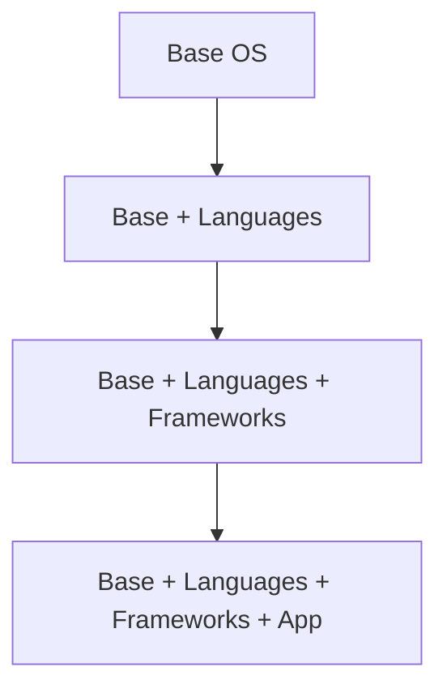

服务器启动时，有两个选择：

1. **从基础镜像启动**，然后在运行时安装依赖、配置应用
2. **从预构建镜像启动**，所有依赖已经打包好，开机即用

第一种方式意味着每次部署都要等待包下载、依赖安装、应用配置。10 台服务器同时扩容时，这个过程可能持续 5-10 分钟。

第二种方式呢？Packer 构建的镜像已经包含了所有内容。服务器启动后立即就绪，扩容时间可以缩短到 30 秒。

这就是 Packer 的价值：**把构建时间从运行时转移到构建时**。

## Packer 是什么

Packer 是 HashiCorp 开发的**镜像构建工具**，通过声明式配置同时为多个平台构建镜像（AMI、Docker Image、GCP Image 等）。

```json title="example.json"
{
  "builders": [
    {
      "type": "amazon-ebs",
      "region": "us-east-1",
      "ami_name": "my-web-app-{{ timestamp }}",
      "source_ami": "ami-12345678",
      "instance_type": "t3.micro",
      "ssh_username": "ubuntu",
      "ami_description": "Web application image"
    }
  ],
  "provisioners": [
    {
      "type": "shell",
      "inline": [
        "sudo apt-get update",
        "sudo apt-get install -y nginx",
        "sudo systemctl enable nginx"
      ]
    }
  ]
}
```

## 核心概念

### Builders

Builder 是 Packer 的核心，负责**创建镜像**。每个 Builder 对应一个目标平台。

```json title="builders.json"
{
  "builders": [
    {
      "type": "amazon-ebs",
      "access_key": "{{ user `aws_access_key` }}",
      "secret_key": "{{ user `aws_secret_key` }}",
      "region": "us-east-1",
      "source_ami": "ami-ubuntu-22-04",
      "ami_name": "my-app-{{ timestamp }}",
      "instance_type": "t3.micro",
      "ssh_username": "ubuntu",
      "ami_users": ["123456789012"],
      "ami_product_codes": []
    }
  ]
}
```

### HCL2 格式（推荐）

```hcl title="aws.pkr.hcl"
source "amazon-ebs" "web" {
  ami_name      = "my-web-app-${formatdate("YYYYMMDD", timestamp())}"
  instance_type = "t3.micro"
  region        = "us-east-1"
  source_ami    = "ami-ubuntu-22-04"
  ssh_username  = "ubuntu"

  tags = {
    Name        = "my-web-app"
    Environment = "production"
    BuiltBy     = "Packer"
    Date        = formatdate("YYYY-MM-DD", timestamp())
  }
}

build {
  name    = "web-app"
  sources = ["source.amazon-ebs.web"]

  provisioner "shell" {
    inline = [
      "sudo apt-get update",
      "sudo apt-get install -y nginx"
    ]
  }

  post-processor "manifest" {
    output     = "manifest.json"
    strip_path = true
  }
}
```

### Provisioners

Provisioner 负责**配置镜像**，在构建过程中执行安装和配置任务。

```hcl title="provisioners.pkr.hcl"
build {
  sources = ["source.amazon-ebs.web"]

  # Shell provisioner
  provisioner "shell" {
    script = "./scripts/install-deps.sh"
  }

  # Ansible provisioner
  provisioner "ansible" {
    playbook_file = "./ansible/webserver.yml"
    extra_arguments = ["--tags", "nginx"]
  }

  # File provisioner
  provisioner "file" {
    source      = "./config/nginx.conf"
    destination = "/tmp/nginx.conf"
  }

  # 开机脚本
  provisioner "windows-restart" {
    restart_timeout = "10m"
  }
}
```

## 多平台构建

### 同时构建多个镜像

```hcl title="multi-platform.pkr.hcl"
source "amazon-ebs" "ubuntu" {
  ami_name      = "my-app-ubuntu-${formatdate("YYYYMMDD", timestamp())}"
  source_ami    = "ami-ubuntu-22-04"
  instance_type = "t3.micro"
  region        = "us-east-1"
  ssh_username  = "ubuntu"
}

source "amazon-ebs" "amazon-linux" {
  ami_name      = "my-app-amazonlinux-${formatdate("YYYYMMDD", timestamp())}"
  source_ami    = "ami-amazon-linux-latest"
  instance_type = "t3.micro"
  region        = "us-east-1"
  ssh_username  = "ec2-user"
}

source "googlecompute" "ubuntu" {
  project_id = "my-project"
  source_image_family = "ubuntu-2204-lts"
  zone = "us-east1-b"
  image_name = "my-app-${formatdate("YYYYMMDD", timestamp())}"
  machine_type = "e2-medium"
  ssh_username = "ubuntu"
}

build {
  name = "multi-platform"
  sources = [
    "source.amazon-ebs.ubuntu",
    "source.amazon-ebs.amazon-linux",
    "source.googlecompute.ubuntu"
  ]

  provisioner "shell" {
    inline = ["sudo apt-get update && sudo apt-get install -y nginx"]
  }
}
```

### 变量使用

```hcl title="variables.pkr.hcl"
variable "aws_region" {
  type    = string
  default = "us-east-1"
}

variable "app_version" {
  type = string
}

variable "env" {
  type    = string
  default = "prod"
}

locals {
  timestamp = formatdate("YYYYMMDD", timestamp())
  ami_name  = "myapp-${var.env}-${local.timestamp}"
}

source "amazon-ebs" "web" {
  ami_name      = local.ami_name
  instance_type = "t3.micro"
  region        = var.aws_region
  # ...
}
```

## Provisioners 详解

### Shell Provisioner

```hcl title="shell-provisioner.pkr.hcl"
provisioner "shell" {
  # 内联命令
  inline = [
    "sudo apt-get update",
    "sudo apt-get install -y nginx postgresql-client",
    "sudo systemctl enable nginx"
  ]

  # 或脚本文件
  script = "./scripts/setup.sh"

  # 环境变量
  env {
    APP_ENV = "production"
  }

  # 执行超时
  execute_command = "echo '{{ .Vars }}' | sudo -S bash -c '{{ .Path }}'"
}
```

```bash title="scripts/setup.sh"
#!/bin/bash
set -e

echo "Setting up application..."

# 安装依赖
apt-get update
apt-get install -y nginx postgresql-client curl

# 下载应用
curl -o /opt/app.tar.gz https://example.com/app.tar.gz
tar -xzf /opt/app.tar.gz -C /opt

# 配置应用
cat > /etc/systemd/system/myapp.service <<EOF
[Unit]
Description=My Application
After=network.target

[Service]
Type=simple
WorkingDirectory=/opt/app
ExecStart=/opt/app/bin/start
Restart=on-failure

[Install]
WantedBy=multi-user.target
EOF

systemctl enable myapp
```

### Ansible Provisioner

```hcl title="ansible-provisioner.pkr.hcl"
provisioner "ansible" {
  playbook_file   = "./ansible/webserver.yml"
  extra_arguments = [
    "--verbose",
    "--tags", "nginx,database"
  ]
  ansible_env_vars = [
    "ANSIBLE_ROLES_PATH=./ansible/roles"
  ]
}
```

```yaml title="ansible/webserver.yml"
---
- name: Configure web server
  hosts: all
  become: yes
  roles:
    - nginx
    - app
```

### Windows Provisioner

```hcl title="windows.pkr.hcl"
source "amazon-ebs" "windows" {
  ami_name      = "my-windows-app-${formatdate("YYYYMMDD", timestamp())}"
  instance_type = "t3.medium"
  region        = "us-east-1"
  source_ami    = "ami-windows-server-2022"
  user_data_file = "./scripts/windows-setup.ps1"
  communicator  = "winrm"
  winrm_username = "Administrator"
  winrm_password = "SecretPassword123!"
}

provisioner "powershell" {
  inline = [
    "Install-WindowsFeature -Name Web-Server",
    "Set-Content -Path C:\\inetpub\\wwwroot\\index.html -Value 'Hello from Packer'"
  ]
}

provisioner "windows-restart" {
  restart_timeout = "10m"
}
```

## Post-Processors

### 镜像发布

```hcl title="post-processors.pkr.hcl"
build {
  sources = ["source.amazon-ebs.web"]

  # 主要配置...

  # 生成 manifest
  post-processor "manifest" {
    output     = "build_manifest.json"
    strip_path = true
  }

  # 压缩镜像
  post-processor "compress" {
    output = "my-app.tar.gz"
  }

  # 上传到 Artifactory
  post-processor "artifactory" {
    api_url = "https://artifactory.example.com"
    repo    = "packer-images"
    os      = "linux"
  }

  # 打标签
  post-processor "tag" {
    only_cmds = ["docker"]
    tag = ["latest", "v1.0.0"]
  }
}
```

### 触发器

```hcl title="triggers.pkr.hcl"
build {
  name = "web-app"
  sources = ["source.amazon-ebs.web"]

  # 只有代码变更时才重新构建
  trigger {
    name    = "app-update"
    include = ["app/**/*"]
  }

  # 代码变更时重新构建数据层
  trigger {
    name    = "data-layer"
    include = ["data/**/*"]
    exclude = ["app/**/*"]
  }
}
```

## CI/CD 集成

### GitHub Actions

```yaml title=".github/workflows/packer.yml"
name: Build Packer Images

on:
  push:
    branches:
      - main
    paths:
      - 'packer/**'
      - 'ansible/**'

jobs:
  build:
    runs-on: ubuntu-latest
    steps:
      - uses: actions/checkout@v3

      - name: Setup Packer
        uses: hashicorp/setup-packer@v2
        with:
          version: "1.10.0"

      - name: Run Packer Build
        run: |
          packer init .
          packer validate .
          packer build -timestamp-ui .
        env:
          AWS_ACCESS_KEY_ID: ${{ secrets.AWS_ACCESS_KEY_ID }}
          AWS_SECRET_ACCESS_KEY: ${{ secrets.AWS_SECRET_ACCESS_KEY }}

      - name: Upload Manifest
        uses: actions/upload-artifact@v3
        with:
          name: build-manifest
          path: manifest.json
```

### Jenkins

```groovy title="Jenkinsfile"
pipeline {
    agent any

    environment {
        AWS_REGION = 'us-east-1'
    }

    stages {
        stage('Checkout') {
            steps {
                checkout scm
            }
        }

        stage('Validate') {
            steps {
                sh 'packer init .'
                sh 'packer validate .'
            }
        }

        stage('Build') {
            steps {
                sh '''
                    packer build \
                        -var "env=production" \
                        -timestamp-ui \
                        .
                '''
            }
        }

        stage('Notify') {
            steps {
                slackSend(
                    channel: '#infrastructure',
                    message: "Packer build completed: ${env.JOB_NAME} - ${env.BUILD_NUMBER}"
                )
            }
        }
    }

    post {
        always {
            archiveArtifacts artifacts: 'manifest.json'
        }
    }
}
```

## 最佳实践

### 1. 镜像分层



```hcl title="分层构建"
# 基础镜像（共享）
source "amazon-ebs" "base" {
  ami_name      = "my-base-${formatdate("YYYYMMDD", timestamp())}"
  source_ami    = "ami-ubuntu-22-04"
  instance_type = "t3.micro"
}

build {
  name = "base"
  sources = ["source.amazon-ebs.base"]

  provisioner "shell" {
    inline = [
      "sudo apt-get update",
      "sudo apt-get upgrade -y"
    ]
  }
}

# 应用镜像（基于基础镜像）
source "amazon-ebs" "app" {
  ami_name      = "my-app-${formatdate("YYYYMMDD", timestamp())}"
  source_ami_filter {
    filters = {
      name = "my-base-*"
      tag:BuiltBy = "Packer"
    }
    most_recent = true
  }
  instance_type = "t3.micro"
}

build {
  name = "app"
  sources = ["source.amazon-ebs.app"]

  provisioner "shell" {
    inline = ["sudo apt-get install -y my-application"]
  }
}
```

### 2. 安全性

```hcl title="安全加固"
source "amazon-ebs" "secure" {
  ami_name      = "my-secure-app-${formatdate("YYYYMMDD", timestamp())}"
  source_ami    = "ami-ubuntu-22-04"
  instance_type = "t3.micro"

  # 加密根卷
  root_volume_size = 20
  encrypted = true

  # SSH 密钥
  ssh_keypair_name = "packer-build-key"
  ssh_private_key_file = "./keys/packer.pem"
}

provisioner "shell" {
  inline = [
    # 安全更新
    "sudo apt-get update && sudo unattended-upgrades",

    # 配置防火墙
    "sudo ufw default deny incoming",
    "sudo ufw default allow outgoing",
    "sudo ufw allow ssh",
    "sudo ufw --force enable",

    # 禁用 SSH 密码登录
    "sudo sed -i 's/PasswordAuthentication yes/PasswordAuthentication no/' /etc/ssh/sshd_config",
    "sudo systemctl restart sshd"
  ]
}
```

### 3. 验证

```hcl title="Testinfra 验证"
provisioner "shell" {
  inline = [
    "pip install testinfra pytest",
    "python -m pytest /tmp/tests/"
  ]
}

provisioner "file" {
  content = <<-EOF
    import pytest

    def test_nginx_installed(host):
        nginx = host.package("nginx")
        assert nginx.is_installed

    def test_nginx_running(host):
        nginx = host.service("nginx")
        assert nginx.is_running
        assert nginx.is_enabled

    def test_nginx_config(host):
        config = host.file("/etc/nginx/nginx.conf")
        assert config.exists

    def test_app_port_listening(host):
        socket = host.socket("8080/tcp")
        assert socket.is_listening
  EOF
  destination = "/tmp/tests/test_app.py"
}
```

## 常见问题

### 问题一：构建时间长

:::tip 优化建议

- 使用更小的基础镜像
- 减少不必要的包安装
- 使用 Ansible 的 `tags` 只运行必要的任务
- 考虑分层构建，只重建必要的层
:::

### 问题二：构建失败难排查

:::tip 调试方法

- 使用 `-debug` 模式逐步执行
- 配置 `ssh_disconnect_script` 保留环境
- 查看 `/var/log/cloud-init-output.log`
:::

## 总结

Packer 的核心价值：

1. **构建时间前置**：把运行时安装转移到构建时
2. **多平台支持**：一个配置，多种镜像格式
3. **不可变镜像**：确保环境一致性
4. **CI/CD 集成**：自动化构建流程

:::info 下一步

想了解不可变镜像的最佳实践？请阅读 [镜像不可变最佳实践](/cloud-native/iac/immutable-image)。
:::
