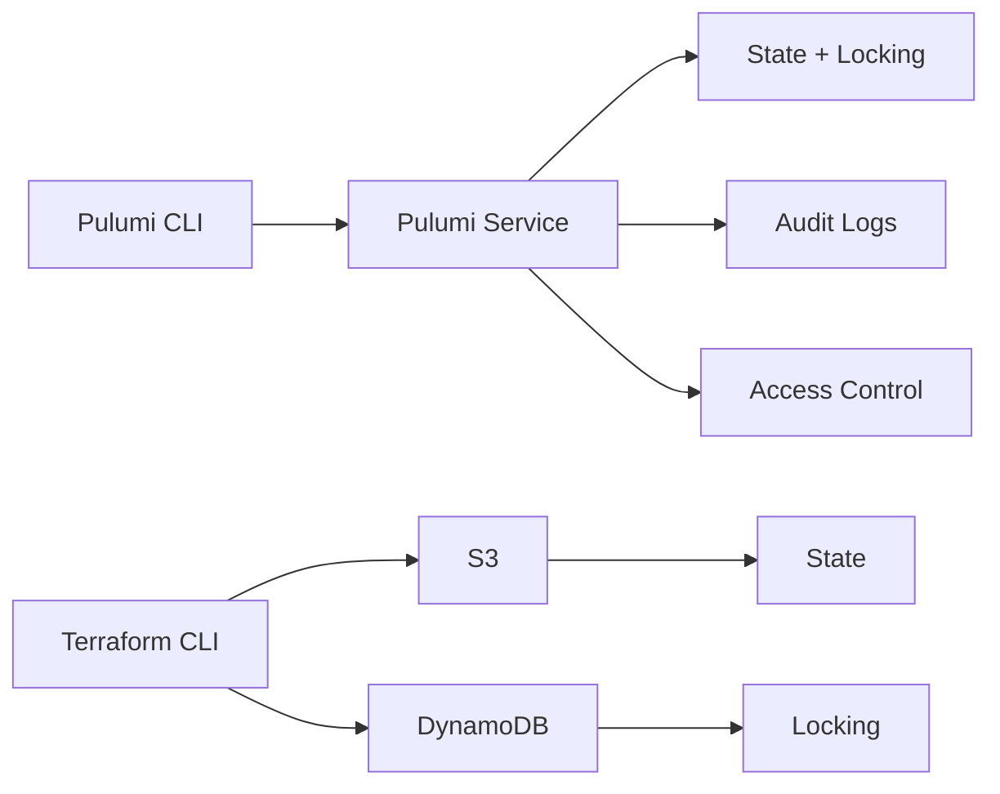
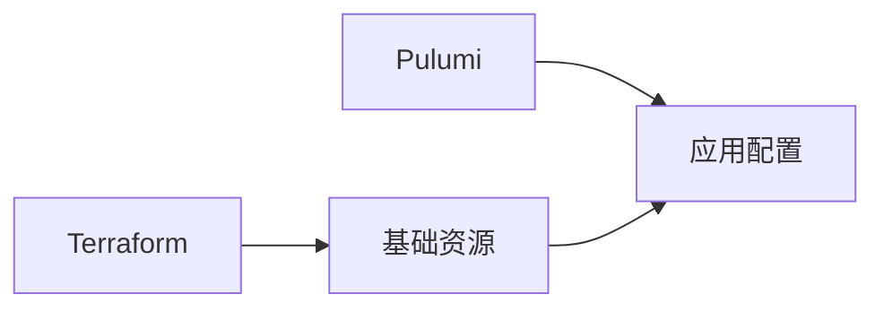

选择 IaC 工具时，Terraform 和 Pulumi 是最常见的两个选项。它们都能帮你用代码管理云基础设施，但设计理念和使用体验完全不同。

Terraform 用 HCL（HashiCorp Configuration Language）定义配置，Pulumi 用真正的编程语言（TypeScript、Python、Go 等）定义基础设施。

这不是「哪个更好」的问题，而是「哪个更适合你的场景」的问题。

## 核心哲学对比

### Terraform：声明式配置

```hcl title="Terraform"
resource "aws_vpc" "main" {
  cidr_block = "10.0.0.0/16"

  tags = {
    Name = "main-vpc"
  }
}
```

Terraform 要求你描述「**想要什么结果**」，而不是「**如何实现**」。你告诉 Terraform：「我需要一个 VPC，CIDR 是 10.0.0.0/16」，Terraform 负责计算如何达成这个目标。

### Pulumi：命令式编程

```typescript title="Pulumi"
import * as aws from "@pulumi/aws";

const vpc = new aws.ec2.Vpc("main", {
    cidrBlock: "10.0.0.0/16",
});

vpc.tags.set("Name", "main-vpc");
```

Pulumi 的程序是**命令式**的，但效果是**声明式**的——你写的是程序，但表达的是期望的最终状态。

## 语法对比

### 变量和条件

**Terraform HCL**：

```hcl title="variables.tf"
variable "environment" {
  type = string
}

locals {
  instance_type = var.environment == "prod" ? "t3.medium" : "t3.micro"

  tags = merge(
    var.common_tags,
    {
      Environment = var.environment
    }
  )
}
```

**Pulumi TypeScript**：

```typescript title="index.ts"
import * as pulumi from "@pulumi/pulumi";

const config = new pulumi.Config();
const environment = config.require("environment");

const instanceType = environment === "prod" ? "t3.medium" : "t3.micro";

const tags: Record<string, string> = {
    ...config.requireObject("commonTags"),
    Environment: environment,
};
```

### 循环和动态创建

**Terraform HCL**：

```hcl title="for_each"
resource "aws_security_group_rule" "http" {
  for_each = toset(["80", "443"])

  type              = "ingress"
  from_port         = each.value
  to_port           = each.value
  protocol          = "tcp"
  cidr_blocks       = ["0.0.0.0/0"]
  security_group_id = aws_security_group.web.id
}
```

**Pulumi TypeScript**：

```typescript title="index.ts"
import * as aws from "@pulumi/aws";

const ports = [80, 443];

const rules = ports.map(port =>
    new aws.ec2.SecurityGroupRule(`http-${port}`, {
        type: "ingress",
        fromPort: port,
        toPort: port,
        protocol: "tcp",
        cidrBlocks: ["0.0.0.0/0"],
        securityGroupId: securityGroup.id,
    })
);
```

### 自定义逻辑

**Terraform**：

```hcl title="需要使用外部工具"
# Terraform 本身不支持复杂逻辑
# 需要用 Terratest（Go）或外部脚本
```

```hcl title="动态块"
dynamic "ingress" {
  for_each = var.rules
  content {
    from_port   = ingress.value.from
    to_port     = ingress.value.to
    cidr_blocks = ingress.value.cidrs
  }
}
```

**Pulumi**：

```typescript title="完整编程能力"
import * as aws from "@pulumi/aws";

class NetworkBuilder {
    private subnets: aws.ec2.Subnet[] = [];

    addSubnet(cidr: string, az: string, isPublic: boolean): this {
        const subnet = new aws.ec2.Subnet(`subnet-${az}`, {
            vpcId: this.vpc.id,
            cidrBlock: cidr,
            availabilityZone: az,
            mapPublicIpOnLaunch: isPublic,
        });
        this.subnets.push(subnet);
        return this;
    }

    build() {
        return this.subnets;
    }
}

const network = new NetworkBuilder()
    .addSubnet("10.0.1.0/24", "us-east-1a", true)
    .addSubnet("10.0.2.0/24", "us-east-1b", false)
    .addSubnet("10.0.3.0/24", "us-east-1c", true)
    .build();
```

## 依赖管理

### Terraform

```hcl title="自动依赖解析"
resource "aws_vpc" "main" {
  cidr_block = "10.0.0.0/16"
}

resource "aws_subnet" "public" {
  vpc_id     = aws_vpc.main.id  # Terraform 自动追踪依赖
  cidr_block = "10.0.1.0/24"
}
```

### Pulumi

```typescript title="自动 + 显式依赖"
const vpc = new aws.ec2.Vpc("main", { cidrBlock: "10.0.0.0/16" });

// Pulumi 自动从 vpc.id 追踪依赖
const subnet = new aws.ec2.Subnet("public", {
    vpcId: vpc.id,
    cidrBlock: "10.0.1.0/24",
});

// 显式依赖
const instance = new aws.ec2.Instance("web", {
    vpcId: vpc.id,
    subnetId: subnet.id,
}, { dependsOn: [instanceProfile] });
```

## 状态管理

### Terraform

```hcl title="手动配置 Backend"
terraform {
  backend "s3" {
    bucket         = "my-state"
    key            = "prod/terraform.tfstate"
    region         = "us-east-1"
    dynamodb_table = "terraform-locks"
  }
}
```

### Pulumi

```bash
# Pulumi Service（默认）
pulumi login

# 或自托管
pulumi login s3://my-state-bucket
```



| 维度 | Terraform | Pulumi |
| --- | --- | --- |
| **托管服务** | 无（自托管） | Pulumi Service（可选） |
| **状态格式** | JSON | JSON |
| **锁定机制** | DynamoDB/Consul 等 | 自动（Pulumi Service）或手动 |
| **历史记录** | S3 版本控制 | Pulumi Service 内置 |

## 测试对比

### Terraform

```go title="Terratest"
package test

import (
    "testing"
    "github.com/gruntwork-io/terratest/modules/terraform"
)

func TestVpc(t *testing.T) {
    terraformOptions := &terraform.Options{
        TerraformDir: "./fixtures/vpc",
        Vars: map[string]interface{}{
            "environment": "test",
        },
    }
    defer terraform.Destroy(t, terraformOptions)
    terraform.InitAndApply(t, terraformOptions)

    vpcId := terraform.Output(t, terraformOptions, "vpc_id")
    assert.NotEmpty(t, vpcId)
}
```

### Pulumi

```typescript title="原生测试"
import * as aws from "@pulumi/aws";
import * as pulumi from "@pulumi/pulumi";
import * as network from "./network";

// Mock 提供者
pulumi.runtime.setMocks({
    newResource: (args) => ({
        id: `${args.name}-${Math.random()}`,
        state: args.inputs,
    }),
    call: (args) => args.inputs,
});

describe("Network", () => {
    it("creates VPC with correct CIDR", async () => {
        const net = new network.Vpc("test", {
            cidrBlock: "10.0.0.0/16",
        });

        // 使用 apply 等待输出
        pulumi.all([net.vpcId]).apply(([id]) => {
            expect(id).toBeDefined();
        });
    });
});
```

```bash
# 运行测试
npm test

# 或 Go 测试
go test ./...
```

| 维度 | Terraform | Pulumi |
| --- | --- | --- |
| **单元测试** | Terratest（Go） | 原生测试框架 |
| **测试语言** | Go | TypeScript/Python/Go 等 |
| **Mock** | 复杂 | 内置 Mock 支持 |
| **集成测试** | 完整环境 | 完整环境 |

## 调试对比

### Terraform

```bash
# plan 输出有限
terraform plan

# 调试模式
TF_LOG=TRACE terraform apply

# 查看状态
terraform state show aws_instance.web
```

### Pulumi

```typescript title="完整调试能力"
// 可以使用 console.log
const instance = new aws.ec2.Instance("web", {...});

console.log("Creating instance with AMI:", ami);

// 断点调试
debugger;

// 使用 inspect
pulumiinspector.analyze();
```

```bash
# Pulumi 调试模式
PULUMI_DEBUG_COMMANDS=true pulumi up

# 查看资源详情
pulumi stack --show-urns
```

## 生态系统对比

| 维度 | Terraform | Pulumi |
| --- | --- | --- |
| **Provider 数量** | 100+（官方）+ 社区 | 60+（官方）+ 社区 |
| **Provider 质量** | 非常成熟 | 成熟 |
| **Registry** | Terraform Registry | Pulumi Registry |
| **模块数量** | 10000+ | 快速增长中 |
| **社区规模** | 非常大 | 较大 |
| **企业支持** | HashiCorp | Pulumi Corp |

## 适用场景对比

### Terraform 更适合

- **HCL 团队**：团队已经熟悉 HCL，不想学新语言
- **Provider 生态**：需要的 Provider 只有 Terraform 有
- **简单的声明式需求**：资源类型固定，不需要复杂逻辑
- **大规模企业**：需要成熟的治理和安全实践
- **混合云**：需要同时管理多个云平台

### Pulumi 更适合

- **编程团队**：团队熟悉 TypeScript/Python/Go
- **复杂逻辑**：需要循环、条件、动态创建
- **代码复用**：想用 OOP、设计模式
- **测试集成**：想用统一的测试框架
- **内部抽象**：想构建复杂的内部组件库

## 决策矩阵

| 场景 | 推荐 | 原因 |
| --- | --- | --- |
| AWS 基础设施 | 两者皆可 | 生态都很好 |
| 多云管理 | Terraform | Provider 更全 |
| Kubernetes 配置 | Pulumi | YAML 抽象更强 |
| 内部平台 | Pulumi | 需要编程能力 |
| 小团队快速起步 | 两者皆可 | Terraform HCL 简单，Pulumi 编程能力强 |
| 大企业标准化 | Terraform | 生态成熟，治理完善 |

## 迁移路径

### 从 Terraform 到 Pulumi

```typescript title="等价转换"
// Terraform
resource "aws_instance" "web" {
  ami           = "ami-12345678"
  instance_type = "t3.micro"
  tags = {
    Name = "web-server"
  }
}

// Pulumi TypeScript
const instance = new aws.ec2.Instance("web", {
    ami: "ami-12345678",
    instanceType: "t3.micro",
    tags: {
        Name: "web-server",
    },
});
```

### 混合使用



可以在同一项目中使用两者：

- Terraform：基础网络、VPC、IAM
- Pulumi：应用部署、Helm Chart

## 总结

| 维度 | Terraform | Pulumi |
| --- | --- | --- |
| **语言** | HCL（DSL） | TypeScript/Python/Go |
| **学习曲线** | 中等 | 中等（需要编程基础） |
| **灵活性** | 受限 | 完整编程能力 |
| **测试** | Terratest | 原生测试框架 |
| **调试** | 有限 | 完整调试支持 |
| **生态** | 更成熟 | 快速发展 |
| **状态管理** | 手动配置 | 自动托管或手动 |

没有绝对的优劣，只有适合与否：

- **选 Terraform**：想要成熟生态、团队熟悉 HCL、需要广泛的 Provider 支持
- **选 Pulumi**：想要编程能力、团队熟悉编程语言、需要构建复杂抽象

:::info 下一步

想了解 AWS 原生的 IaC 工具？请阅读 [AWS CloudFormation](/cloud-native/iac/cloudformation)。
:::
