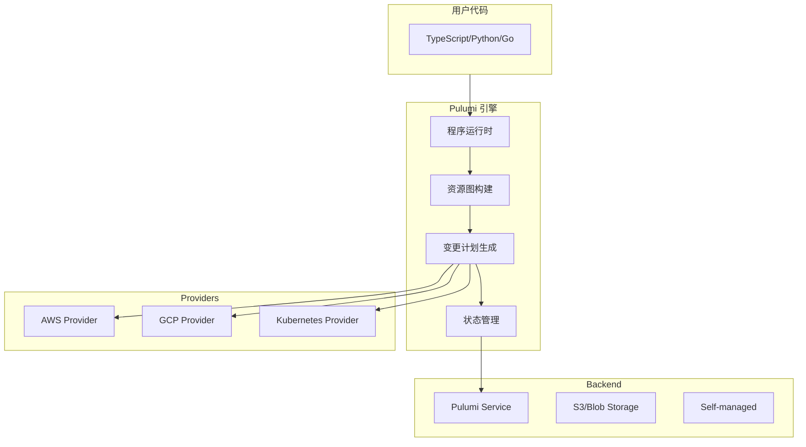
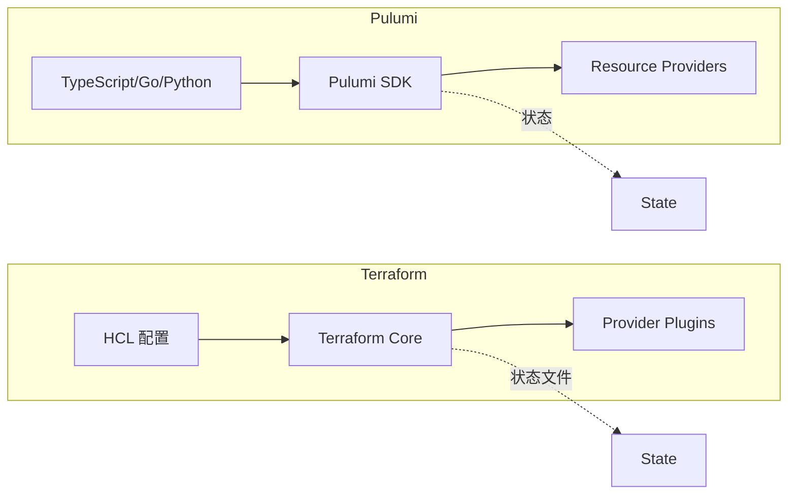
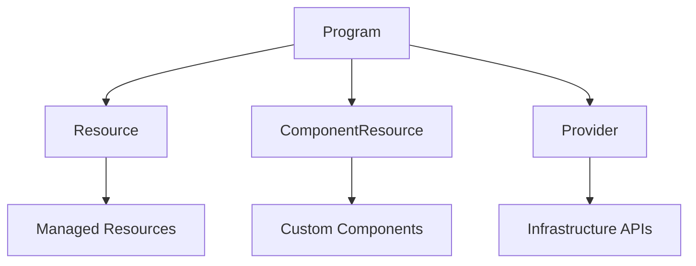
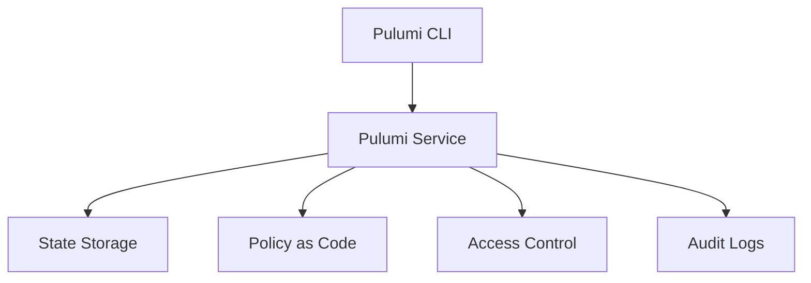
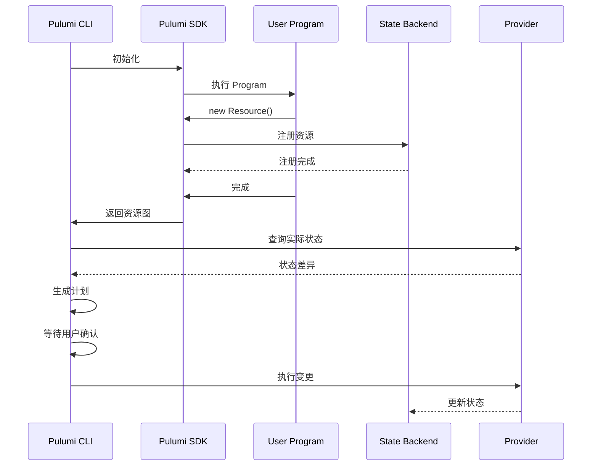

当你想用「真正的」编程语言来定义基础设施时，会发现 Terraform 的 HCL 总是有些力不从心。

比如，你想在循环中根据条件创建不同类型的资源；你想复用一段逻辑但又不想用 Terraform 的模块系统；你想写测试，却发现 HCL 的测试框架几乎不存在。

Pulumi 就是为了解决这些问题而生的：**用你熟悉的编程语言来定义云基础设施**。

## Pulumi 是什么

Pulumi 是一个开源的**基础设施即代码（IaC）平台**，支持使用 TypeScript、Python、Go、Java、C# 等真正的编程语言来定义云资源。

```typescript title="TypeScript 示例"
import * as aws from "@pulumi/aws";

const vpc = new aws.ec2.Vpc("main", {
    cidrBlock: "10.0.0.0/16",
    enableDnsHostnames: true,
    enableDnsSupport: true,
    tags: {
        Name: "main-vpc",
        Environment: "prod",
    },
});

const subnet = new aws.ec2.Subnet("public", {
    vpcId: vpc.id,
    cidrBlock: "10.0.1.0/24",
    availabilityZone: "us-east-1a",
    mapPublicIpOnLaunch: true,
});
```

## 核心架构

### 整体架构



### Pulumi vs Terraform 架构对比



### 关键区别

| 维度 | Terraform | Pulumi |
| --- | --- | --- |
| **语言** | HCL（自定义 DSL） | TypeScript/Python/Go/Java/C# |
| **程序结构** | 声明式配置块 | 命令式程序 |
| **状态管理** | 独立状态文件 | Pulumi Service 或自托管 |
| **依赖解析** | 自动构建 DAG | 程序执行顺序 + SDK 追踪 |
| **条件逻辑** | 受限 | 完整支持 |

## 编程模型

### 基本概念



### 资源类型

```typescript title="managed-resources.ts"
import * as aws from "@pulumi/aws";

// 托管资源：由 Provider 管理
const instance = new aws.ec2.Instance("web", {
    ami: "ami-12345678",
    instanceType: "t3.micro",
    tags: { Name: "web-server" },
});
```

```typescript title="component-resource.ts"
import * as pulumi from "@pulumi/pulumi";

// 自定义组件：组合多个资源
class Network extends pulumi.ComponentResource {
    public readonly vpcId: pulumi.Output<string>;
    public readonly subnetIds: pulumi.Output<string[]>;

    constructor(name: string, opts?: pulumi.ComponentResourceOptions) {
        super("my:Network", name, {}, opts);

        const vpc = new aws.ec2.Vpc("main", {
            cidrBlock: "10.0.0.0/16",
        }, { parent: this });

        const subnets: aws.ec2.Subnet[] = [];
        for (let i = 0; i < 3; i++) {
            const subnet = new aws.ec2.Subnet(`subnet-${i}`, {
                vpcId: vpc.id,
                cidrBlock: `10.0.${i}.0/24`,
            }, { parent: this });
            subnets.push(subnet);
        }

        this.vpcId = vpc.id;
        this.subnetIds = pulumi.all(subnets.map(s => s.id));
    }
}

const network = new Network("prod");
```

### 依赖追踪

```typescript title="dependencies.ts"
import * as aws from "@pulumi/aws";

// Pulumi 自动追踪资源依赖
const vpc = new aws.ec2.Vpc("main", {
    cidrBlock: "10.0.0.0/16",
});

// subnet 依赖 vpc，Pulumi 自动处理
const subnet = new aws.ec2.Subnet("public", {
    vpcId: vpc.id,  // pulumi 自动追踪这个依赖
    cidrBlock: "10.0.1.0/24",
});

// instance 依赖 subnet
const instance = new aws.ec2.Instance("web", {
    subnetId: subnet.id,  // pulumi 自动追踪
    ami: "ami-12345678",
});

// 使用 Output
export const instanceIp = instance.publicIp;
```

### Output 和 Input

```typescript title="inputs-outputs.ts"
import * as pulumi from "@pulumi/aws";

// Input: 接受字符串或 Output<string>
type VpcIdInput = string | pulumi.Input<string>;

// Output: 代表一个异步计算的值
const vpcId: pulumi.Output<string> = vpc.id;

// 在字符串中引用 Output
const subnetCidr = pulumi.interpolate`10.0.1.0/24`;

// 使用 apply 处理 Output
vpc.id.apply(id => {
    console.log(`VPC ID: ${id}`);
    return id;
});

// 使用 all 处理多个 Output
pulumi.all([vpc.id, subnet.id]).apply(([vpcId, subnetId]) => {
    return `VPC: ${vpcId}, Subnet: ${subnetId}`;
});
```

## 状态管理

### Pulumi Service（托管后端）

```bash
# 登录 Pulumi Service
pulumi login

# 创建新项目
pulumi new typescript

# 部署
pulumi up
```



### 自托管后端

```typescript title="self-managed-backend.ts"
// 使用 S3 作为状态后端
import * as pulumi from "@pulumi/pulumi";

// pulumi.stack.ts 中配置
export const pulumiConfig = {
    backend: {
        url: "s3://my-pulumi-state-bucket",
    },
};
```

```bash
# 登录 S3 后端
pulumi login s3://my-pulumi-state-bucket

# 或使用 Azure Blob
pulumi login azblob://my-pulumi-state-container

# 或使用 Google Cloud Storage
pulumi login gs://my-pulumi-state-bucket
```

### 状态锁定

```bash
# Pulumi 自动处理状态锁定
pulumi up

# 输出
Updating (prod)
     Type                     Name                 Plan       Info
     pulumi:pulumi:Stack      myapp-prod
     ...

# 锁定由 Pulumi Service 自动管理
# 其他人尝试同时操作会得到错误
```

## 程序执行模型

### 程序执行流程



### 预览 vs 更新

```bash
# 预览：执行程序但不实际创建资源
pulumi preview

# 更新：执行程序并应用变更
pulumi up

# 销毁：删除所有资源
pulumi destroy
```

```bash
$ pulumi preview

Previewing update (dev)

View Live: https://app.pulumi.com/myorg/myapp/dev/previews/12345

     Type                      Name            Plan
     +   pulumi:pulumi:Stack   myapp-dev      create
     +   ├─ aws:ec2:Vpc        main           create
     +   │  └─ aws:ec2:Subnet  public         create
     +   └─ aws:ec2:Instance  web            create

Resources:
    + 4 to create

Do you want to proceed? [No]  y
```

## 配置管理

### Stack 配置

```typescript title="Pulumi.yaml"
name: myapp
runtime: typescript
description: My application
```

```typescript title="Pulumi.dev.yaml"
config:
  aws:region: us-east-1
  myapp:instanceType: t3.micro
  myapp:desiredCapacity: "1"
```

```typescript title="Pulumi.prod.yaml"
config:
  aws:region: us-east-1
  myapp:instanceType: t3.medium
  myapp:desiredCapacity: "3"
```

```typescript title="读取配置.ts"
import * as pulumi from "@pulumi/pulumi";

const config = new pulumi.Config("myapp");

const instanceType = config.get("instanceType") || "t3.micro";
const desiredCapacity = config.requireNumber("desiredCapacity");

const asg = new aws.autoscaling.Group("web", {
    minSize: 1,
    maxSize: desiredCapacity,
    instanceType: instanceType,
});
```

### Secret 配置

```bash
# 创建 secret 配置
pulumi config set --secret dbPassword "super-secret"

# 配置加密存储
```

```typescript title="读取 secret.ts"
const config = new pulumi.Config("myapp");

// 自动解密
const dbPassword = config.requireSecret("dbPassword");

// 类型安全
dbPassword.apply(password => {
    console.log(`DB Password length: ${password.length}`);
    return password;
});
```

## 组件资源

### 创建可复用组件

```typescript title="component.ts"
import * as pulumi from "@pulumi/pulumi";
import * as aws from "@pulumi/aws";

export interface WebServerArgs {
    vpcId: pulumi.Input<string>;
    subnetIds: pulumi.Input<string[]>;
    instanceType?: string;
    desiredCapacity?: number;
}

export class WebServer extends pulumi.ComponentResource {
    public readonly url: pulumi.Output<string>;
    public readonly loadBalancerArn: pulumi.Output<string>;

    constructor(name: string, args: WebServerArgs, opts?: pulumi.ComponentResourceOptions) {
        super("my:WebServer", name, {}, opts);

        const securityGroup = new aws.ec2.SecurityGroup("web", {
            vpcId: args.vpcId,
            ingress: [
                { protocol: "tcp", fromPort: 80, toPort: 80, cidrBlocks: ["0.0.0.0/0"] },
                { protocol: "tcp", fromPort: 443, toPort: 443, cidrBlocks: ["0.0.0.0/0"] },
            ],
        }, { parent: this });

        const asg = new aws.autoscaling.Group("web", {
            vpcZoneIdentifiers: args.subnetIds,
            launchTemplate: {
                id: this.createLaunchTemplate(args),
            },
            minSize: 1,
            maxSize: args.desiredCapacity || 3,
        }, { parent: this });

        this.url = pulumi.interpolate`http://${asg.id}`;
        this.loadBalancerArn = asg.arn;
    }

    private createLaunchTemplate(args: WebServerArgs): aws.ec2.LaunchTemplate {
        // ...
    }
}
```

### 使用组件

```typescript title="main.ts"
import { WebServer } from "./component";

const webServer = new WebServer("prod", {
    vpcId: network.vpcId,
    subnetIds: network.subnetIds,
    instanceType: "t3.medium",
    desiredCapacity: 5,
});

export const webUrl = webServer.url;
```

## 动态 Providers

### 什么是动态 Providers

动态 Providers 允许你用任何语言实现自定义资源类型：

```typescript title="dynamic-provider.ts"
import * as pulumi from "@pulumi/pulumi";

const provider: pulumi.dynamic.ResourceProvider = {
    async create(inputs) {
        // 创建资源的逻辑
        return { id: "new-resource-id" };
    },
    async update(id, olds, news) {
        // 更新逻辑
        return { outs: news };
    },
    async delete(id) {
        // 删除逻辑
    },
};

class ConfigMap extends pulumi.dynamic.Resource {
    constructor(name: string, props: any, opts?: pulumi.ResourceOptions) {
        super(provider, "ConfigMap", props, opts);
    }
}

const configMap = new ConfigMap("my-config", {
    data: { key: "value" },
});
```

## 测试

### 单元测试

```typescript title="__tests__/network.test.ts"
import * as aws from "@pulumi/aws";
import * as pulumi from "@pulumi/pulumi";
import * as network from "../network";

pulumi.runtime.setMocks({
    newResource: (args: pulumi.runtime.MockResourceArgs): { id: string; state: any } => {
        return {
            id: `${args.name}-id`,
            state: { ...args.inputs, arn: `arn:aws:ec2:123456789:vpce/${args.name}` },
        };
    },
    call: (args: pulumi.runtime.MockCallArgs) => args.inputs,
    getStack: () => "dev",
    getProject: () => "myapp",
});

describe("Network", () => {
    it("creates a VPC with correct CIDR", () => {
        const net = new network.Vpc("test", { cidr: "10.0.0.0/16" });
        expect(net.vpcId).toBeDefined();
    });
});
```

### 集成测试

```typescript title="__tests__/integration.test.ts"
import * as pulumi from "@pulumi/pulumi";

async function testResource() {
    const stack = new pulumi.StackReference("myorg/myapp/dev");

    const vpcId = await stack.getOutputValue("vpcId");
    console.log(`VPC ID: ${vpcId}`);

    // 验证资源存在
    expect(vpcId).toBeTruthy();
}
```

## 与 Terraform 对比

| 维度 | Terraform | Pulumi |
| --- | --- | --- |
| **学习曲线** | HCL 简单，但高级特性复杂 | 需要熟悉编程语言 |
| **状态管理** | 手动配置 Backend | Pulumi Service 或自托管 |
| **调试** | plan 输出有限 | 可用调试器 |
| **测试** | Terratest（Go） | 原生测试框架（jest/go test 等） |
| **灵活性** | 受 HCL 限制 | 完整编程语言能力 |
| **生态** | 更成熟（Provider 更多） | 快速增长 |

:::info 下一步

想详细对比 Pulumi 和 Terraform？请阅读 [Pulumi vs Terraform 对比](/cloud-native/iac/pulumi-vs-terraform)。
:::
